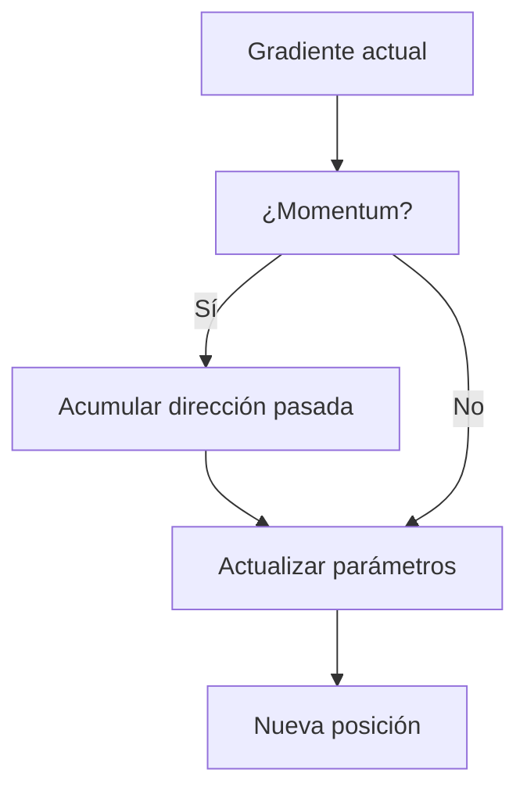

# 04 - Optimización

Entrenar un modelo de machine learning es, matemáticamente, un problema de optimización: encontrar los parámetros que minimizan una función de pérdida. Entender los algoritmos de optimización te permite entrenar modelos más rápido, con mejor convergencia y evitar mínimos locales.

---

## 1. Problemas de optimización

### Clasificación

| Tipo | Restricciones | Ejemplo en ML |
|------|---------------|---------------|
| **Irrestricto** | Ninguna | Gradient descent en redes neuronales |
| **Restringido** | Igualdades/desigualdades | SVM (margen máximo con restricciones) |
| **Convexo** | Función convexa, dominio convexo | Regresión logística, regresión lineal |
| **No convexo** | Múltiples mínimos locales | Redes neuronales profundas |


### Convexidad

Una función `f` es **convexa** si el segmento entre cualquier par de puntos está por encima de la función:

$$f(\lambda x + (1-\lambda)y) \leq \lambda f(x) + (1-\lambda)f(y)$$

para todo `λ ∈ [0, 1]`.

**Implicaciones:**
- Todo mínimo local es global.
- Gradient descent converge al óptimo global.
- La Hessiana es positivo semi-definida en todo punto.

> 💡 **En ML:** La regresión logística tiene una función de pérdida convexa. Las redes neuronales profundas son **no convexas** (por activaciones no lineales y composición de capas), lo que explica por qué pueden quedar atrapadas en mínimos locales.

---

## 2. Gradient Descent y variantes

### Gradient Descent (GD)

$$\theta_{t+1} = \theta_t - \eta \nabla_\theta L(\theta_t)$$

Donde `η` (learning rate) controla el tamaño del paso.

```python
def gradient_descent(f, grad_f, x0, lr=0.01, epochs=100):
    x = x0.copy()
    historia = [x.copy()]
    for _ in range(epochs):
        x -= lr * grad_f(x)
        historia.append(x.copy())
    return x, historia
```

### Stochastic Gradient Descent (SGD)

En lugar de usar todo el dataset, usa **un solo ejemplo** (o un mini-batch) para calcular el gradiente.

**Ventajas:**
- Mucho más rápido por iteración.
- El ruido ayuda a escapar de mínimos locales poco profundos.

**Desventajas:**
- Oscilaciones en la convergencia.
- Requiere learning rate más pequeño.

```python
def sgd(X, y, grad_fn, w0, lr=0.01, epochs=10):
    w = w0.copy()
    n = len(X)
    for epoch in range(epochs):
        # Barajar datos
        indices = np.random.permutation(n)
        for i in indices:
            xi, yi = X[i], y[i]
            w -= lr * grad_fn(w, xi, yi)
    return w
```

### Mini-batch Gradient Descent

Compromiso entre GD y SGD: usa un batch de tamaño `B` (típicamente 32, 64, 128, 256).

- Menos ruido que SGD puro.
- Más eficiente computacionalmente (aprovecha vectorización).
- Balance entre velocidad y estabilidad.

---

## 3. Momentum y aceleración



### Momentum

Acumula la dirección de los gradientes pasados para suavizar la trayectoria:

$$v_t = \beta v_{t-1} + \nabla_\theta L(\theta_t)$$
$$\theta_{t+1} = \theta_t - \eta v_t$$

Donde `β` (típicamente 0.9) es el coeficiente de momentum.

**Analogía física:** Imagina una bola rodando por un valle. El momentum hace que la bola acelere en direcciones consistentes y atraviese pequeños baches (mínimos locales).

```python
def sgd_momentum(grad_fn, x0, lr=0.01, beta=0.9, epochs=100):
    x = x0.copy()
    v = np.zeros_like(x)
    for _ in range(epochs):
        g = grad_fn(x)
        v = beta * v + g
        x -= lr * v
    return x
```

### Nesterov Accelerated Gradient (NAG)

Momentum "mira hacia adelante": calcula el gradiente en la posición aproximada futura.

$$v_t = \beta v_{t-1} + \nabla_\theta L(\theta_t - \eta \beta v_{t-1})$$
$$\theta_{t+1} = \theta_t - \eta v_t$$

> 💡 **Ventaja:** Corrige el momentum cuando está a punto de sobrepasar el mínimo. Converge más rápido que momentum estándar en funciones convexas.

---

## 4. Optimizadores adaptativos

### AdaGrad

Adapta el learning rate por parámetro: parámetros con gradientes grandes reciben learning rates más pequeños.

$$G_t = G_{t-1} + g_t^2$$
$$\theta_{t+1} = \theta_t - \frac{\eta}{\sqrt{G_t} + \epsilon} g_t$$

**Problema:** `G_t` crece monotónicamente → learning rate tiende a cero → deja de aprender.

### RMSprop

Soluciona el problema de AdaGrad usando media móvil exponencial:

$$E[g^2]_t = \beta E[g^2]_{t-1} + (1-\beta) g_t^2$$
$$\theta_{t+1} = \theta_t - \frac{\eta}{\sqrt{E[g^2]_t} + \epsilon} g_t$$

### Adam (Adaptive Moment Estimation)

Combina momentum + RMSprop. Es el optimizador más usado en deep learning.

$$m_t = \beta_1 m_{t-1} + (1-\beta_1) g_t$$
$$v_t = \beta_2 v_{t-1} + (1-\beta_2) g_t^2$$

Corrección de sesgo (bias correction):
$$\hat{m}_t = \frac{m_t}{1 - \beta_1^t}$$
$$\hat{v}_t = \frac{v_t}{1 - \beta_2^t}$$

Actualización:
$$\theta_{t+1} = \theta_t - \frac{\eta}{\sqrt{\hat{v}_t} + \epsilon} \hat{m}_t$$

**Hiperparámetros típicos:** `β₁=0.9`, `β₂=0.999`, `ε=1e-8`.

```python
class Adam:
    def __init__(self, lr=0.001, beta1=0.9, beta2=0.999, eps=1e-8):
        self.lr = lr
        self.beta1 = beta1
        self.beta2 = beta2
        self.eps = eps
        self.m = None
        self.v = None
        self.t = 0

    def step(self, params, grads):
        if self.m is None:
            self.m = np.zeros_like(params)
            self.v = np.zeros_like(params)

        self.t += 1
        self.m = self.beta1 * self.m + (1 - self.beta1) * grads
        self.v = self.beta2 * self.v + (1 - self.beta2) * (grads ** 2)

        m_hat = self.m / (1 - self.beta1 ** self.t)
        v_hat = self.v / (1 - self.beta2 ** self.t)

        params -= self.lr * m_hat / (np.sqrt(v_hat) + self.eps)
        return params
```

> 💡 **Caso real:** Adam es el optimizador por defecto en PyTorch (`torch.optim.Adam`). Funciona bien en la mayoría de los casos sin ajustar hiperparámetros.

---

## 5. Learning rate scheduling

El learning rate es el hiperparámetro más importante. Una programación inteligente mejora la convergencia.

| Estrategia | Fórmula | Cuándo usar |
|------------|---------|-------------|
| **Step decay** | `η = η₀ · γ^(epoch // step_size)` | Reducir cada N epochs |
| **Exponential decay** | `η = η₀ · e^(-kt)` | Decaimiento suave continuo |
| **Cosine annealing** | `η = η_min + 0.5(η_max - η_min)(1 + cos(πT_cur/T_max))` | SOTA en vision |
| **Warmup** | Linearmente de 0 a η₀ en W pasos | Transformers, LLMs |
| **ReduceLROnPlateau** | Reducir si val_loss no mejora | General |

```python
def cosine_annealing(epoch, lr_max, lr_min, T_max):
    """Cosine annealing scheduler."""
    return lr_min + 0.5 * (lr_max - lr_min) * (1 + np.cos(np.pi * epoch / T_max))

# Visualización
epochs = np.arange(0, 100)
lrs = [cosine_annealing(e, 0.1, 0.001, 100) for e in epochs]
plt.plot(epochs, lrs)
plt.xlabel('Epoch')
plt.ylabel('Learning Rate')
plt.title('Cosine Annealing')
```

---

## 6. Métodos de segundo orden

### Newton-Raphson

Usa la Hessiana para aproximar la función como una cuadrática local y dar un paso directo al mínimo:

$$\theta_{t+1} = \theta_t - H^{-1} \nabla_\theta L$$

**Ventaja:** Convergencia cuadrática (muy rápida cerca del óptimo).
**Desventaja:** Calcular e invertir la Hessiana cuesta `O(n³)` e `O(n²)` en memoria. Imposible para redes con millones de parámetros.

### Aproximaciones cuasi-Newton: L-BFGS

L-BFGS aproxima la Hessiana usando solo los gradientes de iteraciones recientes (no almacena la matriz completa). Es usado en problemas de tamaño medio (ej. optimización de hiperparámetros).

---

## 📦 Código de compresión: Comparativa de optimizadores

```python
"""
Comparativa visual de GD, Momentum, RMSprop y Adam
en la función de Rosenbrock (clásico benchmark de optimización).
"""
import numpy as np
import matplotlib.pyplot as plt

# Función de Rosenbrock: valle estrecho con mínimo en (1, 1)
def rosenbrock(x, y):
    return (1 - x)**2 + 100 * (y - x**2)**2

def grad_rosenbrock(x, y):
    dx = -2 * (1 - x) - 400 * x * (y - x**2)
    dy = 200 * (y - x**2)
    return np.array([dx, dy])

# Optimizadores
def optimize(optimizer_fn, lr, steps=1000):
    point = np.array([-1.0, 2.0])  # Punto inicial
    history = [point.copy()]
    state = optimizer_fn.init(point)

    for _ in range(steps):
        grad = grad_rosenbrock(point[0], point[1])
        point, state = optimizer_fn.step(point, grad, state, lr)
        history.append(point.copy())
    return np.array(history)

# --- Definir optimizadores simples ---
class GD:
    @staticmethod
    def init(p): return None
    @staticmethod
    def step(p, g, s, lr): return p - lr * g, None

class Momentum:
    @staticmethod
    def init(p): return np.zeros_like(p)
    @staticmethod
    def step(p, g, v, lr, beta=0.9):
        v = beta * v + g
        return p - lr * v, v

class AdamOpt:
    @staticmethod
    def init(p): return (np.zeros_like(p), np.zeros_like(p), 0)
    @staticmethod
    def step(p, g, state, lr, b1=0.9, b2=0.999, eps=1e-8):
        m, v, t = state
        t += 1
        m = b1 * m + (1 - b1) * g
        v = b2 * v + (1 - b2) * g**2
        m_hat = m / (1 - b1**t)
        v_hat = v / (1 - b2**t)
        p_new = p - lr * m_hat / (np.sqrt(v_hat) + eps)
        return p_new, (m, v, t)

# --- Ejecutar ---
hist_gd = optimize(GD, lr=0.001)
hist_mom = optimize(Momentum, lr=0.001)
hist_adam = optimize(AdamOpt, lr=0.1)

# Visualizar contornos + trayectorias
x = np.linspace(-2, 2, 100)
y = np.linspace(-1, 3, 100)
X, Y = np.meshgrid(x, y)
Z = rosenbrock(X, Y)

plt.contour(X, Y, Z, levels=np.logspace(-1, 3, 20), cmap='viridis')
plt.plot(hist_gd[:, 0], hist_gd[:, 1], 'b-', label='GD', alpha=0.7)
plt.plot(hist_mom[:, 0], hist_mom[:, 1], 'g-', label='Momentum', alpha=0.7)
plt.plot(hist_adam[:, 0], hist_adam[:, 1], 'r-', label='Adam', alpha=0.7)
plt.plot(1, 1, 'k*', markersize=15, label='Mínimo')
plt.legend()
plt.title('Optimización en Rosenbrock')
```

---

## 🎯 Proyecto documentado: Entrenamiento Distribuido con Parallel SGD

### Descripción
Diseña un sistema de entrenamiento distribuido donde múltiples workers entrenan un modelo en paralelo sobre shards de datos, y un servidor central agrega los gradientes. Implementa y compara tres estrategias de agregación: SGD síncrono (todos esperan), SGD asíncrono (sin esperar), y SGD con gradient compression (quantización de gradientes para reducir tráfico de red).

### Requisitos funcionales
1. **Data parallelism**: dividir el dataset en `N` shards, asignar uno a cada worker.
2. **Parameter Server**: servidor central que mantiene los pesos globales.
3. **Synchronous SGD**: todos los workers computan gradientes, el servidor hace promedio y actualiza.
4. **Asynchronous SGD**: cada worker envía gradientes cuando termina; el servidor actualiza inmediatamente (posible stale gradients).
5. **Gradient compression**: cuantizar gradientes a 8-bit antes de enviarlos por la red.
6. Medir throughput (ejemplos/segundo) y convergencia final para cada estrategia.

### Métricas de éxito
- Speedup lineal (o cercano) con 2-4 workers en Synchronous SGD.
- Asynchronous SGD converge más rápido en términos de wall-clock time.
- Gradient compression reduce tráfico de red en > 4x sin pérdida significativa de accuracy.

### Referencias
- Hogwild! (asynchronous SGD)
- Distributed deep learning (TensorFlow, PyTorch DDP)
- 1-bit SGD y QSGD (gradient compression)
