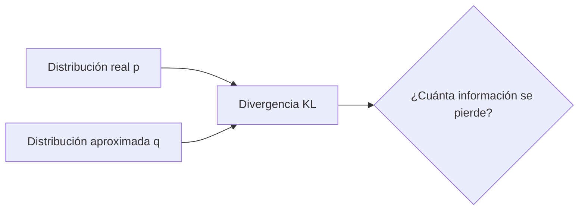

# 05 - Teoría de la Información

La teoría de la información, fundada por Claude Shannon en 1948, cuantifica la información. En ML, nos permite medir qué tan "sorprendente" es una predicción, qué tan comprimible es un modelo, y qué tanto aprende una red neuronal.

---

## 1. Información y Entropía

```mermaid
flowchart TD
    A[Evento con probabilidad p] --> B{¿Qué tan raro?}
    B -->|p ≈ 1<br/>Muy probable| C[Poca información]
    B -->|p ≈ 0<br/>Muy raro| D[Mucha información]
    C --> E[Entropía = Valor esperado de I(x)]
    D --> E
```

### Información de un evento

La información (en bits) de un evento con probabilidad `p` es:

$$I(x) = -\log_2(p(x))$$

- Eventos probables (`p ≈ 1`) aportan poca información.
- Eventos raros (`p ≈ 0`) aportan mucha información.

**Ejemplo:** Si siempre llueve en Londres (`p=0.9`), el mensaje "está lloviendo" aporta `−log₂(0.9) ≈ 0.15` bits. Si llueve en el Sahara (`p=0.01`), aporta `−log₂(0.01) ≈ 6.64` bits.

### Entropía

La entropía es el **valor esperado** de la información: la incertidumbre promedio de una distribución.

$$H(X) = -\sum_{i} p(x_i) \log_2(p(x_i))$$

**Propiedades:**
- `H(X) ≥ 0`.
- `H(X) = 0` si una salida tiene probabilidad 1 (sin incertidumbre).
- Máxima cuando todas las salidas son equiprobables.

```python
import numpy as np

def entropia(p):
    """Entropía de una distribución discreta."""
    p = p[p > 0]  # Evitar log(0)
    return -np.sum(p * np.log2(p))

# Distribución uniforme (máxima entropía)
p_uniform = np.array([0.25, 0.25, 0.25, 0.25])
print(f"Entropía uniforme: {entropia(p_uniform):.2f} bits")

# Distribución sesgada (menor entropía)
p_sesgada = np.array([0.9, 0.05, 0.03, 0.02])
print(f"Entropía sesgada: {entropia(p_sesgada):.2f} bits")
```

> 💡 **Caso real:** En clasificación, un modelo que predice `[0.9, 0.05, 0.05]` tiene baja entropía (está seguro). Un modelo que predice `[0.4, 0.3, 0.3]` tiene alta entropía (incierto).

---

## 2. Entropía cruzada (Cross-Entropy)

La entropía cruzada mide la "distancia" entre la distribución verdadera `p` y la predicha `q`:

$$H(p, q) = -\sum_{i} p(x_i) \log(q(x_i))$$

En clasificación, `p` es one-hot (1 para la clase correcta, 0 para el resto). La entropía cruzada se reduce a:

$$H(p, q) = -\log(q_{correcto})$$

```python
# Ejemplo: clasificación de 3 clases
# Verdadero: clase 0
p = np.array([1, 0, 0])

# Modelo A: confiado y correcto
q_a = np.array([0.9, 0.05, 0.05])
loss_a = -np.sum(p * np.log(q_a))

# Modelo B: confiado pero incorrecto
q_b = np.array([0.05, 0.9, 0.05])
loss_b = -np.sum(p * np.log(q_b))

# Modelo C: inseguro
q_c = np.array([0.4, 0.3, 0.3])
loss_c = -np.sum(p * np.log(q_c))

print(f"Loss A (correcto): {loss_a:.4f}")
print(f"Loss B (incorrecto): {loss_b:.4f}")
print(f"Loss C (inseguro): {loss_c:.4f}")
```

> 💡 **Por qué funciona:** Minimizar cross-entropy es equivalente a hacer Maximum Likelihood Estimation (MLE) bajo una distribución categórica.

---

## 3. Divergencia KL (Kullback-Leibler)



La divergencia KL mide cuánta información se pierde al aproximar `p` con `q`:

$$D_{KL}(p \| q) = \sum_{i} p(x_i) \log\left(\frac{p(x_i)}{q(x_i)}\right) = H(p, q) - H(p)$$

**Propiedades:**
- `D_KL(p || q) ≥ 0` (siempre no negativa).
- `D_KL(p || q) = 0` solo si `p = q`.
- **No es simétrica:** `D_KL(p || q) ≠ D_KL(q || p)`.

```python
def kl_divergence(p, q):
    """D_KL(p || q)."""
    p = p[p > 0]
    q = q[q > 0]
    return np.sum(p * np.log(p / q))

p = np.array([0.5, 0.3, 0.2])
q = np.array([0.4, 0.4, 0.2])
print(f"D_KL(p||q): {kl_divergence(p, q):.4f}")
```

### Aplicaciones en ML

| Uso | Descripción |
|-----|-------------|
| **Variational Autoencoders (VAE)** | `D_KL(q(z|x) || p(z))` regulariza el espacio latente |
| **Knowledge Distillation** | Alumno aprende a imitar las probabilidades del maestro |
| **Policy Gradient (RL)** | Limitar cambios bruscos en la política (TRPO, PPO) |
| **Tópicos (LDA)** | Aproximar distribuciones de documentos |

---

## 4. Entropía conjunta, condicional y mutual information

### Entropía conjunta

$$H(X, Y) = -\sum_{x,y} p(x, y) \log(p(x, y))$$

Mide la incertidumbre total del par `(X, Y)`.

### Entropía condicional

$$H(Y|X) = -\sum_{x,y} p(x, y) \log(p(y|x))$$

Mide la incertidumbre de `Y` una vez que conocemos `X`. Si `X` predice perfectamente `Y`, entonces `H(Y|X) = 0`.

### Información mutua

$$I(X; Y) = H(X) - H(X|Y) = H(Y) - H(Y|X)$$

Mide cuánta información comparten `X` e `Y`. Es cero si son independientes.

```python
# Ejemplo: información mutua entre dos variables
from sklearn.feature_selection import mutual_info_classif
from sklearn.datasets import load_iris

iris = load_iris()
X, y = iris.data, iris.target

# Información mutua entre cada feature y el target
mi = mutual_info_classif(X, y)
for name, info in zip(iris.feature_names, mi):
    print(f"{name}: {info:.3f} bits")
```

> 💡 **Caso real:** En feature selection, eliges las features con mayor información mutua con el target. Son las más informativas.

---

## 5. Principio de máxima entropía

Dado cierto conocimiento parcial (ej. media y varianza), la distribución que **maximiza la entropía** es la que asume menos información adicional.

| Restricción | Distribución de máxima entropía |
|-------------|--------------------------------|
| Solo soporte conocido | Uniforme |
| Media conocida | Exponencial |
| Media y varianza conocidas | Normal (Gaussiana) |

> 💡 **Por qué la normal es tan común:** Es la distribución "más honesta" cuando solo conoces media y varianza. No asume nada más.

---

## 6. Teoría de la información en modelos generativos

### Bits por dimensión (bits/dim)

En modelos generativos (VAE, diffusion models), medimos la calidad por cuántos bits necesitamos para comprimir una muestra.

$$\text{bits/dim} = -\frac{1}{D} \mathbb{E}_{x \sim p_{data}}[\log_2 p_{modelo}(x)]$$

Menos bits = mejor modelo (comprime más).

### Rate-Distortion Tradeoff

En compresión con pérdida, hay un tradeoff fundamental:
- **Rate**: cuántos bits usas.
- **Distortion**: cuánto pierdes en calidad.

No puedes tener rate bajo y distortion bajo simultáneamente. Los autoencoders aprenden este tradeoff automáticamente.

---

## 📦 Código de compresión: Implementación de VAE con pérdida KL

```python
"""
Pérdida de un VAE: Reconstruction Loss + KL Divergence.
Demuestra cómo la teoría de información guía el diseño de modelos generativos.
"""
import numpy as np

class VAELoss:
    """
    ELBO = E_q[log p(x|z)] - D_KL(q(z|x) || p(z))
         = Reconstruction - KL regularization
    """

    def __init__(self, reconstruction_loss='mse'):
        self.reconstruction_loss = reconstruction_loss

    def reconstruction(self, x_true, x_pred):
        """log p(x|z): qué tan bien reconstruye el decoder."""
        if self.reconstruction_loss == 'mse':
            return -np.mean((x_true - x_pred)**2)
        elif self.reconstruction_loss == 'bce':
            # Binary cross-entropy
            eps = 1e-8
            return np.mean(
                x_true * np.log(x_pred + eps) +
                (1 - x_true) * np.log(1 - x_pred + eps)
            )

    def kl_divergence(self, mu, logvar):
        """
        D_KL(N(mu, sigma^2) || N(0, 1))
        = -0.5 * sum(1 + log(sigma^2) - mu^2 - sigma^2)
        """
        return -0.5 * np.sum(1 + logvar - mu**2 - np.exp(logvar))

    def elbo(self, x_true, x_pred, mu, logvar):
        """Evidence Lower BOund (mayor es mejor)."""
        recon = self.reconstruction(x_true, x_pred)
        kl = self.kl_divergence(mu, logvar)
        return recon - kl

    def loss(self, x_true, x_pred, mu, logvar):
        """Valor a minimizar: negativo del ELBO."""
        return -self.elbo(x_true, x_pred, mu, logvar)

# --- Ejemplo ---
x_true = np.random.rand(100)
x_pred = x_true + np.random.normal(0, 0.1, 100)  # Reconstrucción ruidosa
mu = np.zeros(10)        # Media del espacio latente
logvar = np.zeros(10)    # log(varianza) = 0 → varianza = 1

vae_loss = VAELoss()
loss_value = vae_loss.loss(x_true, x_pred, mu, logvar)
print(f"VAE Loss: {loss_value:.4f}")

# Si logvar es muy negativo (varianza pequeña), KL es pequeño
# pero el encoder no introduce variabilidad → overfitting
# Si logvar es cercano a 0, KL es grande → regularización fuerte
```

---

## 🎯 Proyecto documentado: Compresión de Modelos con Quantización

### Descripción
Diseña un sistema que comprima los pesos de una red neuronal entrenada cuantizándolos a menor precisión (de float32 a int8) y mida la pérdida de información usando teoría de la información. El sistema debe usar clustering (k-means) para encontrar los centroides de quantización y codificar cada peso como el índice de su centroide más cercano.

### Requisitos funcionales
1. Entrenar una red neuronal simple (ej. MNIST classifier).
2. Extraer los pesos de todas las capas como vectores.
3. Aplicar k-means con `k=256` (8-bit) para encontrar centroides.
4. Reemplazar cada peso por el índice de su centroide (compresión ~4x).
5. Medir la divergencia KL entre las distribuciones de activaciones de la red original y la cuantizada.
6. Medir la degradación de accuracy post-cuantización.
7. Implementar fine-tuning con "straight-through estimator" para recuperar accuracy.

### Métricas de éxito
- Ratio de compresión ≥ 4x (pesos).
- Degradación de accuracy < 2% en MNIST.
- Tiempo de inferencia reducido en CPU (int8 es más rápido).

### Referencias
- Quantization Aware Training (QAT) de TensorFlow/PyTorch
- Deep Compression (Han et al., 2016)
- Straight-Through Estimator (Bengio et al., 2013)
