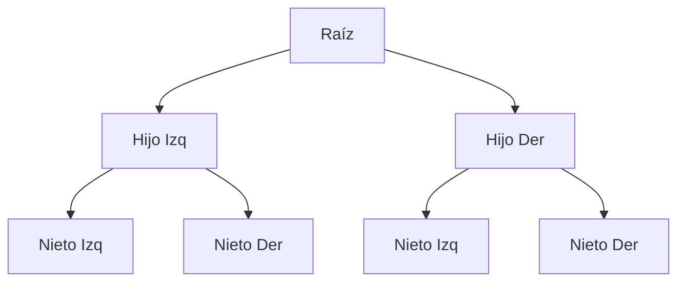
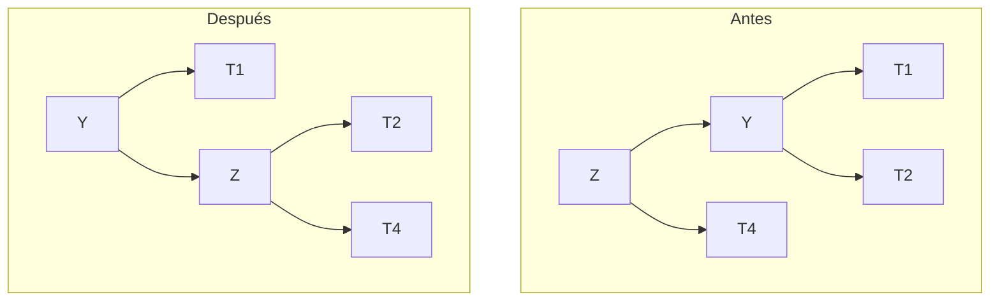

# 03 - Árboles y Heaps

Los árboles son estructuras jerárquicas que aparecen constantemente en ML: desde árboles de decisión hasta estructuras de búsqueda para vecinos cercanos.

---

## 1. Árboles binarios (Binary Trees)

Un árbol binario es una estructura donde cada nodo tiene como máximo dos hijos: izquierdo y derecho.


### Propiedades

- **Altura (h):** número máximo de aristas desde la raíz a una hoja.
- **Nodos en nivel i:** como máximo `2^i`.
- **Nodos totales:** como máximo `2^(h+1) - 1`.
- **Altura mínima:** `⌈log₂(n)⌉` (árbol balanceado).



```python
class TreeNode:
    def __init__(self, valor):
        self.valor = valor
        self.izq = None
        self.der = None

# Recorridos
def inorder(nodo):   # Izq → Raíz → Der
    if nodo:
        inorder(nodo.izq)
        print(nodo.valor)
        inorder(nodo.der)

def preorder(nodo):  # Raíz → Izq → Der
    if nodo:
        print(nodo.valor)
        preorder(nodo.izq)
        preorder(nodo.der)

def postorder(nodo): # Izq → Der → Raíz
    if nodo:
        postorder(nodo.izq)
        postorder(nodo.der)
        print(nodo.valor)
```

> 💡 **Caso real:** En compiladores, el Abstract Syntax Tree (AST) es un árbol. En ML, los árboles de decisión usan recorridos para hacer predicciones.

---

## 2. Binary Search Trees (BST)

Un BST es un árbol binario donde para cada nodo:
- Todos los valores en el subárbol izquierdo son menores.
- Todos los valores en el subárbol derecho son mayores.

**Búsqueda:** compara con la raíz, desciende por izquierda o derecha. `O(h)`.

```python
class BST:
    def __init__(self):
        self.raiz = None

    def insert(self, valor):
        self.raiz = self._insert(self.raiz, valor)

    def _insert(self, nodo, valor):
        if nodo is None:
            return TreeNode(valor)
        if valor < nodo.valor:
            nodo.izq = self._insert(nodo.izq, valor)
        else:
            nodo.der = self._insert(nodo.der, valor)
        return nodo

    def search(self, valor):
        return self._search(self.raiz, valor)

    def _search(self, nodo, valor):
        if nodo is None or nodo.valor == valor:
            return nodo
        if valor < nodo.valor:
            return self._search(nodo.izq, valor)
        return self._search(nodo.der, valor)
```

| Operación | Mejor caso | Peor caso | Promedio |
|-----------|------------|-----------|----------|
| Búsqueda | `O(1)` | `O(n)` | `O(log n)` |
| Inserción | `O(1)` | `O(n)` | `O(log n)` |
| Eliminación | `O(1)` | `O(n)` | `O(log n)` |

> ⚠️ **Peor caso:** Si insertas elementos ordenados, el BST degenera en una lista enlazada.

---

## 3. Árboles balanceados: AVL y Red-Black

### AVL Tree

Un AVL es un BST donde la diferencia de alturas entre subárboles de cualquier nodo es como máximo 1. Si se viola, se reequilibra con **rotaciones**.



```python
class AVLNode(TreeNode):
    def __init__(self, valor):
        super().__init__(valor)
        self.altura = 1

class AVLTree:
    def _altura(self, nodo):
        return nodo.altura if nodo else 0

    def _balance(self, nodo):
        return self._altura(nodo.izq) - self._altura(nodo.der)

    def _rotar_derecha(self, z):
        """Rotación simple a la derecha."""
        y = z.izq
        T3 = y.der
        y.der = z
        z.izq = T3
        z.altura = 1 + max(self._altura(z.izq), self._altura(z.der))
        y.altura = 1 + max(self._altura(y.izq), self._altura(y.der))
        return y

    def _rotar_izquierda(self, z):
        """Rotación simple a la izquierda."""
        y = z.der
        T2 = y.izq
        y.izq = z
        z.der = T2
        z.altura = 1 + max(self._altura(z.izq), self._altura(z.der))
        y.altura = 1 + max(self._altura(y.izq), self._altura(y.der))
        return y
```

**Garantía:** La altura de un AVL es siempre `O(log n)`, por lo que todas las operaciones son `O(log n)` en el peor caso.

### Red-Black Tree

Un Red-Black tree es un BST balanceado con reglas de coloración (rojo/negro) que garantizan altura `O(log n)`. Es menos estricto que AVL (menos rotaciones), por lo que las inserciones/eliminaciones son más rápidas.

> 💡 **Caso real:** `sortedcontainers` en Python usa árboles B (similar). Linux kernel usa Red-Black trees para scheduling.

---

## 4. Heaps (Montículos)

Un heap es un árbol binario completo donde cada padre es mayor (max-heap) o menor (min-heap) que sus hijos.

### Propiedades

- **Heapify:** `O(log n)`.
- **Insertar:** `O(log n)`.
- **Extraer máximo/mínimo:** `O(log n)`.
- **Obtener máximo/mínimo:** `O(1)`.

### Implementación con array

Un heap se puede almacenar eficientemente en un array:
- Padre de `i`: `(i - 1) // 2`.
- Hijo izquierdo de `i`: `2i + 1`.
- Hijo derecho de `i`: `2i + 2`.

```python
class MinHeap:
    def __init__(self):
        self.heap = []

    def parent(self, i):
        return (i - 1) // 2

    def insert(self, valor):
        self.heap.append(valor)
        self._sift_up(len(self.heap) - 1)

    def _sift_up(self, i):
        while i > 0 and self.heap[i] < self.heap[self.parent(i)]:
            self.heap[i], self.heap[self.parent(i)] = \
                self.heap[self.parent(i)], self.heap[i]
            i = self.parent(i)

    def extract_min(self):
        if not self.heap:
            return None
        min_val = self.heap[0]
        self.heap[0] = self.heap[-1]
        self.heap.pop()
        self._sift_down(0)
        return min_val

    def _sift_down(self, i):
        min_idx = i
        izq = 2 * i + 1
        der = 2 * i + 2

        if izq < len(self.heap) and self.heap[izq] < self.heap[min_idx]:
            min_idx = izq
        if der < len(self.heap) and self.heap[der] < self.heap[min_idx]:
            min_idx = der

        if i != min_idx:
            self.heap[i], self.heap[min_idx] = self.heap[min_idx], self.heap[i]
            self._sift_down(min_idx)
```

---

## 5. Aplicaciones en ML

### Beam Search con Heaps

En generación de texto, beam search mantiene las `k` secuencias más probables en cada paso. Un min-heap es perfecto para esto.

```python
import heapq

def beam_search(probabilidades, beam_width=3):
    """
    probabilidades: lista de (secuencia, log_prob)
    Retorna las beam_width secuencias más probables.
    """
    heap = []
    for seq, log_prob in probabilidades:
        heapq.heappush(heap, (log_prob, seq))
        if len(heap) > beam_width:
            heapq.heappop(heap)  # Elimina la menos probable
    return [seq for _, seq in sorted(heap, reverse=True)]
```

### kd-Trees para vecinos cercanos

Un kd-tree es un BST que divide el espacio k-dimensional alternando dimensiones. Permite búsqueda de vecinos cercanos en `O(log n)` promedio (vs `O(n)` naive).

```python
class KDNode:
    def __init__(self, punto, izq=None, der=None):
        self.punto = punto
        self.izq = izq
        self.der = der

def construir_kdtree(puntos, profundidad=0):
    if not puntos:
        return None
    k = len(puntos[0])
    axis = profundidad % k
    puntos.sort(key=lambda x: x[axis])
    mediana = len(puntos) // 2
    return KDNode(
        puntos[mediana],
        construir_kdtree(puntos[:mediana], profundidad + 1),
        construir_kdtree(puntos[mediana + 1:], profundidad + 1)
    )
```

> 💡 **Caso real:** scikit-learn usa kd-trees y ball-trees en `NearestNeighbors` cuando `n < 30k` y dimensión es moderada.

---

## 📦 Código de compresión: Heap para Top-K Elements

```python
"""
Top-K frequent elements usando un min-heap.
Útil en NLP para encontrar las palabras más frecuentes
o en sistemas de recomendación para top-K items.
"""
import heapq
from collections import Counter

def top_k_frecuentes(elementos, k):
    conteo = Counter(elementos)
    # Min-heap de tamaño k
    heap = []
    for elem, freq in conteo.items():
        heapq.heappush(heap, (freq, elem))
        if len(heap) > k:
            heapq.heappop(heap)
    # Ordenar de mayor a menor frecuencia
    return [elem for _, elem in sorted(heap, reverse=True)]

# Ejemplo
palabras = ["ml", "ai", "ml", "data", "ai", "ml", "python", "ai", "ml"]
print(top_k_frecuentes(palabras, k=2))  # ['ml', 'ai']
```

---

## 🎯 Proyecto documentado: Índice ANN con Ball Tree

### Descripción
Diseña un Ball Tree para búsqueda aproximada de vecinos más cercanos (ANN) en un espacio de embeddings de alta dimensión. El Ball Tree divide el espacio en hiperesferas (balls) anidadas, permitiendo descartar regiones enteras durante la búsqueda.

### Requisitos funcionales
1. `BallTree.construct(points)`: construye el árbol recursivamente dividiendo por la dimensión de mayor varianza.
2. `BallTree.query(point, k)`: encuentra los k vecinos más cercanos usando pruning (si la distancia mínima a una bola es mayor que la distancia al k-ésimo vecino actual, descartar toda la bola).
3. `BallTree.radius_query(point, r)`: encuentra todos los puntos dentro de radio `r`.
4. Medir speedup vs búsqueda lineal (`O(n·d)`).
5. Soportar distancias Euclidiana y coseno.

### Métricas de éxito
- Construcción en `O(n log n)`.
- Búsqueda de 1-NN en `O(log n)` para datos bien estructurados.
- Speedup > 10x vs búsqueda lineal en 100k puntos de 128D.
- Recall > 95% en búsqueda aproximada (epsilon-ANN).

### Referencias
- scikit-learn `BallTree` y `KDTree`
- FAISS (ANN optimizado para GPU)
- HNSW (Hierarchical Navigable Small World) - SOTA en ANN
