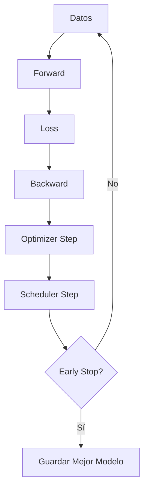
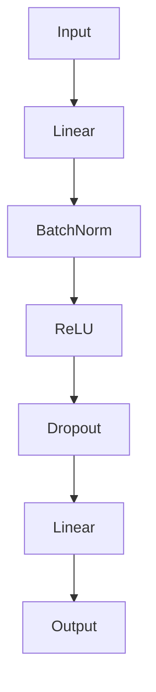

# 🏋️ Training Strategies

El diseño de una arquitectura es solo la mitad del trabajo en Deep Learning. La otra mitad —y a menudo la más determinante— es *cómo* entrenarla. Las estrategias de entrenamiento definen cómo navegamos el paisaje de la función de pérdida, cómo evitamos el sobreajuste y cómo aceleramos la convergencia. Una red perfecta entrenada mal puede ser superada por una arquitectura mediocre entrenada con criterio.

En ML productivo, dominar estas estrategias marca la diferencia entre un modelo de laboratorio y uno desplegable.

---

## 1. Optimizadores

Los optimizadores determinan cómo actualizamos los parámetros $\theta$ usando el gradiente $\nabla_{\theta} \mathcal{L}$.



### 1.1 SGD (Stochastic Gradient Descent)

$$
\theta_{t+1} = \theta_t - \eta \nabla_{\theta} \mathcal{L}(\theta_t)
$$

Simple pero efectivo. Funciona bien con learning rates cuidadosamente ajustados y momentum.

### 1.2 Momentum

Acumula una fracción $\gamma$ del update anterior para suavizar oscilaciones y acelerar en direcciones consistentes:

$$
\mathbf{v}_{t+1} = \gamma \mathbf{v}_t + \eta \nabla_{\theta} \mathcal{L}(\theta_t)
$$

$$
\theta_{t+1} = \theta_t - \mathbf{v}_{t+1}
$$

### 1.3 RMSprop

Adapta el learning rate por parámetro dividiendo por la media móvil de los gradientes cuadrados:

$$
\mathbf{r}_{t+1} = \rho \mathbf{r}_t + (1 - \rho) (\nabla_{\theta} \mathcal{L})^2
$$

$$
\theta_{t+1} = \theta_t - \frac{\eta}{\sqrt{\mathbf{r}_{t+1} + \epsilon}} \nabla_{\theta} \mathcal{L}
$$

### 1.4 Adam (Adaptive Moment Estimation)

Combina momentum con RMSprop, manteniendo estimaciones de primer y segundo momento:

$$
\mathbf{m}_{t+1} = \beta_1 \mathbf{m}_t + (1 - \beta_1) \nabla_{\theta} \mathcal{L}
$$

$$
\mathbf{v}_{t+1} = \beta_2 \mathbf{v}_t + (1 - \beta_2) (\nabla_{\theta} \mathcal{L})^2
$$

Corrección de sesgo:

$$
\hat{\mathbf{m}}_{t+1} = \frac{\mathbf{m}_{t+1}}{1 - \beta_1^{t+1}}, \quad \hat{\mathbf{v}}_{t+1} = \frac{\mathbf{v}_{t+1}}{1 - \beta_2^{t+1}}
$$

Update:

$$
\theta_{t+1} = \theta_t - \frac{\eta}{\sqrt{\hat{\mathbf{v}}_{t+1}} + \epsilon} \hat{\mathbf{m}}_{t+1}
$$

| Optimizador | Adaptativo | Memoria extra | Recomendación de uso |
|-------------|------------|---------------|----------------------|
| SGD | No | 0x | Benchmark final, datasets grandes |
| SGD + Momentum | No | 1x | Estándar cuando se tiene tiempo de ajustar LR |
| RMSprop | Sí | 1x | RNNs, problemas no estacionarios |
| Adam | Sí | 2x | **Valor por defecto** para la mayoría de experimentos |

Caso real: el entrenamiento de Stable Diffusion utilizó AdamW (variante de Adam con decoupled weight decay) debido a su robustez en espacios de alta dimensionalidad y su capacidad para manejar gradientes ruidosos en datos de texto e imagen.

⚠️ **Advertencia:** Adam no siempre generaliza mejor que SGD con momentum bien ajustado. En visión por computadora, muchos competidores de ImageNet obtienen mejores resultados finales con SGD + Momentum después de ajustar cuidadosamente el learning rate y el schedule.

💡 **Tip:** Si usas Adam, los valores por defecto en PyTorch son $\beta_1=0.9$, $\beta_2=0.999$, $\epsilon=10^{-8}$. No los cambies a menos que tengas una razón específica.

---

## 2. Learning Rate Scheduling

Un learning rate constante raramente es óptimo. Los schedulers ajustan $\eta$ durante el entrenamiento.

### 2.1 StepLR

Reduce $\eta$ por un factor $\gamma$ cada $N$ epochs.

### 2.2 ReduceLROnPlateau

Reduce $\eta$ cuando una métrica (ej. validation loss) deja de mejorar.

### 2.3 Cosine Annealing

Ajusta $\eta$ siguiendo una función coseno:

$$
\eta_t = \eta_{min} + \frac{1}{2}(\eta_{max} - \eta_{min})\left(1 + \cos\left(\frac{t}{T}\pi\right)\right)
$$

Caso real: los entrenamientos de large language models (LLaMA, GPT-3) utilizan schedules coseno con *warmup* (aumento lineal de LR durante los primeros pasos) para estabilizar las capas iniciales.

💡 **Tip:** Un warmup es crucial cuando usas batch sizes grandes. Comienza con LR pequeño y escala linealmente hasta el valor base para evitar picos de gradiente al inicio.

---

## 3. Early Stopping

Monitorea una métrica de validación y detiene el entrenamiento cuando esta deja de mejorar durante $patience$ epochs. Guarda el modelo con el mejor desempeño observado.

Esto es una forma de regularización implícita: evita que el modelo siga ajustándose al conjunto de entrenamiento una vez que la generalización ha alcanzado su punto máximo.

---

## 4. Regularización

### 4.1 L1 y L2 (Weight Decay)

Penaliza la magnitud de los pesos:

- L2: $\mathcal{L}_{reg} = \mathcal{L} + \lambda \sum_{i} w_i^2$
- L1: $\mathcal{L}_{reg} = \mathcal{L} + \lambda \sum_{i} |w_i|$

En PyTorch, usa `weight_decay` en el optimizador (implementa L2). L1 requiere modificar manualmente los gradientes.

### 4.2 Dropout

Durante el entrenamiento, cada neurona se desactiva con probabilidad $p$. En inferencia, las activaciones se escalan por $(1-p)$.

$$
y = f(\mathbf{W} \cdot \text{Mask} \odot \mathbf{x})
$$

Dropout obliga a la red a aprender representaciones redundantes, reduciendo la co-adaptación entre neuronas.



⚠️ **Advertencia:** No uses dropout en capas de salida. Además, recuerda llamar `model.train()` (dropout activo) durante entrenamiento y `model.eval()` (dropout desactivado) durante evaluación.

Caso real: en sistemas de recomendación de Netflix, el dropout se aplica sobre embeddings de usuarios e ítems para prevenir que el modelo memorice interacciones puntuales y mejore la recomendación a usuarios nuevos.

---

## 5. Data Augmentation

Aumenta artificialmente el dataset aplicando transformaciones que preservan la etiqueta:


- Imágenes: rotaciones, recortes, volteos, cambios de brillo/contraste.
- Audio: cambios de velocidad, adición de ruido, desplazamiento temporal.
- Texto: sinónimos, back-translation, eliminación de palabras.

En PyTorch, usa `torchvision.transforms` para imágenes:

```python
transform = transforms.Compose([
    transforms.RandomResizedCrop(224),
    transforms.RandomHorizontalFlip(),
    transforms.ColorJitter(brightness=0.2, contrast=0.2),
    transforms.ToTensor(),
    transforms.Normalize(mean=[0.485, 0.456, 0.406],
                         std=[0.229, 0.224, 0.225])
])
```

💡 **Tip:** La augmentación debe ser lo suficientemente agresiva para generar variedad, pero no tanto como para destruir la señal informativa. Si aumentas demasiado una imagen médica, puedes alterar patrones patológicos críticos.

---

## 6. Normalización

### 6.1 Batch Normalization

Normaliza por canal sobre el mini-batch:

$$
\hat{x} = \frac{x - \mu_{\mathcal{B}}}{\sqrt{\sigma^2_{\mathcal{B}} + \epsilon}}
$$

### 6.2 Layer Normalization

Normaliza sobre la dimensión de características (por muestra), independiente del tamaño del batch:

$$
\hat{x}_i = \frac{x_i - \mu}{\sqrt{\sigma^2 + \epsilon}}
$$

| Característica | Batch Norm | Layer Norm |
|----------------|------------|------------|
| Eje de normalización | Batch + Espacial | Características |
| Dependencia del batch size | Sí | No |
| Uso típico | CNNs | RNNs, Transformers |
| Estabilidad en batch size pequeño | Pobre | Excelente |

Caso real: los Transformers (BERT, GPT) utilizan Layer Norm en lugar de Batch Norm porque el entrenamiento se realiza con secuencias de longitud variable y batch sizes que varían según la memoria disponible.

---

## 7. Gradient Clipping

Limita la norma del gradiente para evitar exploding gradients, especialmente en RNNs:

```python
torch.nn.utils.clip_grad_norm_(model.parameters(), max_norm=1.0)
```

⚠️ **Advertencia:** El clipping es una cura sintomática, no una causal. Si necesitas clipping extremo (< 0.1) constantemente, revisa tu arquitectura, inicialización o learning rate.

---

## 8. Mixed Precision Training

Utiliza `torch.cuda.amp` para realizar operaciones en float16 cuando sea seguro y float32 para acumulaciones críticas. Reduce el uso de memoria y acelera el entrenamiento en GPUs modernas (Tensor Cores).

```python
from torch.cuda.amp import autocast, GradScaler

scaler = GradScaler()
for x, y in dataloader:
    optimizer.zero_grad()
    with autocast():
        outputs = model(x)
        loss = criterion(outputs, y)
    scaler.scale(loss).backward()
    scaler.step(optimizer)
    scaler.update()
```

Caso real: el entrenamiento de modelos de visión de última generación (SAM, DINOv2) utiliza mixed precision obligatoriamente para poder procesar batch sizes grandes con imágenes de alta resolución sin exceder la VRAM.

---

## 📦 Código de Compresión

```python
"""
Script completo que resume estrategias de entrenamiento:
AdamW, CosineAnnealingLR, EarlyStopping, Dropout,
BatchNorm, Gradient Clipping y Mixed Precision.
"""
import torch
import torch.nn as nn
import torch.optim as optim
from torch.utils.data import DataLoader, TensorDataset
from torch.cuda.amp import autocast, GradScaler

class RobustNet(nn.Module):
    def __init__(self, input_dim, hidden_dim, num_classes, dropout=0.3):
        super(RobustNet, self).__init__()
        self.net = nn.Sequential(
            nn.Linear(input_dim, hidden_dim),
            nn.BatchNorm1d(hidden_dim),
            nn.ReLU(inplace=True),
            nn.Dropout(dropout),
            nn.Linear(hidden_dim, hidden_dim),
            nn.BatchNorm1d(hidden_dim),
            nn.ReLU(inplace=True),
            nn.Dropout(dropout),
            nn.Linear(hidden_dim, num_classes)
        )

    def forward(self, x):
        return self.net(x)

class EarlyStopping:
    def __init__(self, patience=5, delta=0.0):
        self.patience = patience
        self.delta = delta
        self.best_loss = None
        self.counter = 0
        self.early_stop = False

    def __call__(self, val_loss):
        if self.best_loss is None or val_loss < self.best_loss - self.delta:
            self.best_loss = val_loss
            self.counter = 0
        else:
            self.counter += 1
            if self.counter >= self.patience:
                self.early_stop = True

# Datos sintéticos
X_train = torch.randn(1000, 784)
y_train = torch.randint(0, 10, (1000,))
X_val = torch.randn(200, 784)
y_val = torch.randint(0, 10, (200,))

train_loader = DataLoader(TensorDataset(X_train, y_train), batch_size=64, shuffle=True)
val_loader = DataLoader(TensorDataset(X_val, y_val), batch_size=64)

device = torch.device('cuda' if torch.cuda.is_available() else 'cpu')
model = RobustNet(784, 256, 10, dropout=0.3).to(device)
criterion = nn.CrossEntropyLoss()
optimizer = optim.AdamW(model.parameters(), lr=0.001, weight_decay=1e-4)
scheduler = optim.lr_scheduler.CosineAnnealingLR(optimizer, T_max=20)
early_stopping = EarlyStopping(patience=5)
scaler = GradScaler()

for epoch in range(20):
    model.train()
    train_loss = 0
    for x, y in train_loader:
        x, y = x.to(device), y.to(device)
        optimizer.zero_grad()
        with autocast():
            out = model(x)
            loss = criterion(out, y)
        scaler.scale(loss).backward()
        torch.nn.utils.clip_grad_norm_(model.parameters(), max_norm=1.0)
        scaler.step(optimizer)
        scaler.update()
        train_loss += loss.item()

    model.eval()
    val_loss = 0
    with torch.no_grad():
        for x, y in val_loader:
            x, y = x.to(device), y.to(device)
            out = model(x)
            val_loss += criterion(out, y).item()
    val_loss /= len(val_loader)

    scheduler.step()
    print(f"Epoch {epoch+1}, Train Loss: {train_loss/len(train_loader):.4f}, Val Loss: {val_loss:.4f}")

    early_stopping(val_loss)
    if early_stopping.early_stop:
        print("Early stopping triggered.")
        break
```

---

## 🎯 Proyecto: Pipeline de Entrenamiento Robusto para Clasificación de Imágenes

**Descripción:**
Diseñar un pipeline de entrenamiento modular y reproducible para clasificar imágenes, integrando múltiples estrategias avanzadas. El objetivo no es solo obtener buena accuracy, sino construir un sistema que sea estable, eficiente y fácil de extender.

**Requisitos funcionales:**
1. Implementar un sistema de configuración (YAML o dataclasses) que centralice hiperparámetros: learning rate, batch size, optimizador, scheduler, dropout, epochs.
2. Soportar al menos dos optimizadores (SGD+Momentum y AdamW) seleccionables por configuración.
3. Implementar dos schedulers (StepLR y CosineAnnealingWarmRestarts) con switch por configuración.
4. Integrar Early Stopping con guardado automático del mejor checkpoint basado en validation accuracy.
5. Incluir data augmentation configurables vía `albumentations` o `torchvision.transforms`.
6. Soportar mixed precision training opcional (activable por configuración).
7. Registrar métricas (loss, accuracy, learning rate actual) por epoch en un archivo CSV o usando TensorBoard.
8. Implementar una función de evaluación que calcule accuracy, precision, recall y F1-score macro.

**Componentes principales:**
- `config.py`: centralización de hiperparámetros con validación de tipos.
- `model.py`: arquitectura CNN con BatchNorm y Dropout configurables.
- `engine.py`: funciones `train_one_epoch` y `evaluate` con soporte AMP y gradient clipping.
- `callbacks.py`: implementación de EarlyStopping y ModelCheckpoint.
- `train.py`: orquestador principal que lee configuración, instancia componentes y ejecuta el loop.

**Métricas de éxito:**
- Reproducibilidad: mismo seed, mismos resultados (variación < 0.5% entre corridas).
- El pipeline debe converger en menos de 30 epochs para CIFAR-10 con accuracy > 80%.
- Uso de memoria GPU reducido al menos un 30% cuando AMP está activado vs entrenamiento full float32.
- Modularidad: cambiar de AdamW a SGD requiere modificar solo el archivo de configuración.

**Referencias:**
- Loshchilov, I., & Hutter, F. (2019). Decoupled Weight Decay Regularization. ICLR.
- He, T., et al. (2019). Bag of Tricks for Image Classification with Convolutional Neural Networks. CVPR.
- PyTorch Docs: `torch.cuda.amp`, `torch.optim.lr_scheduler`.
