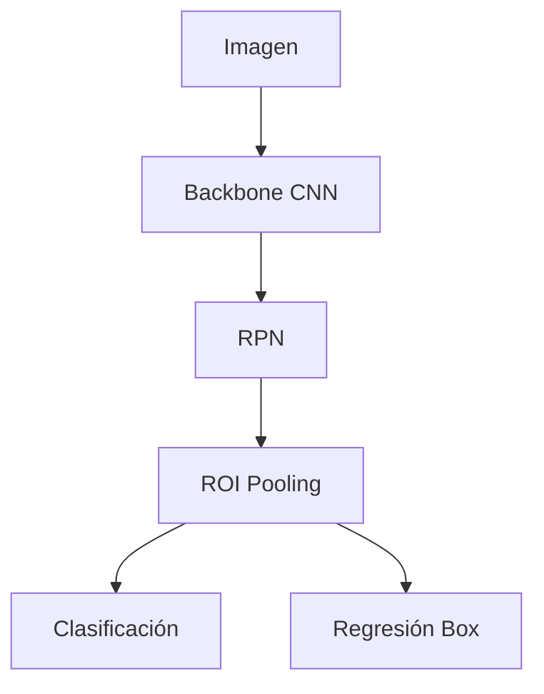
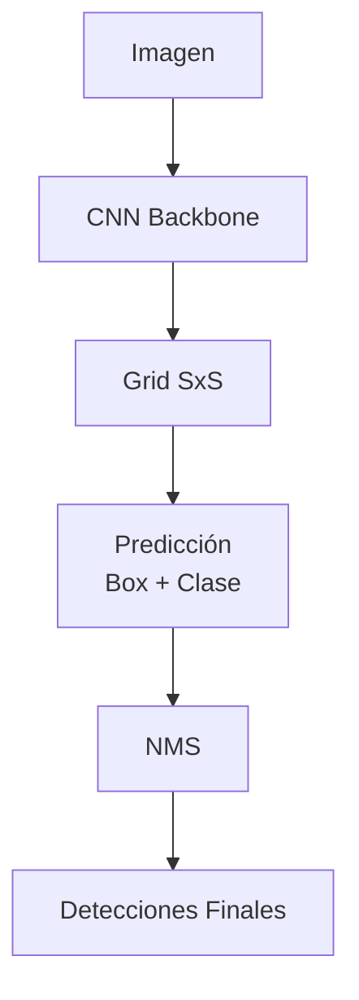

# 🎯 Object Detection

La detección de objetos es la tarea de visión por computadora que responde simultáneamente a dos preguntas: **¿qué hay en la imagen?** y **¿dónde está?**. A diferencia de la clasificación, que asigna una etiqueta global, la detección debe producir coordenadas espaciales (bounding boxes) y etiquetas de clase, convirtiéndola en el pilar de sistemas de conducción autónoma, vigilancia, análisis médico e inteligencia documental.

---

## 1. Clasificación vs Detección vs Segmentación

La visión por computadora puede organizarse en una jerarquía de complejidad creciente.

| Tarea | Salida | Complejidad | Caso real: aplicación típica |
|-------|--------|-------------|------------------------------|
| **Clasificación** | Etiqueta global | Baja | Diagnóstico de enfermedad en radiografía (presente/ausente). |
| **Detección** | Boxes + etiquetas | Media | Vehículos autónomos detectando peatones y señales. |
| **Segmentación** | Máscara por píxel | Alta | Cirugía asistida donde se delimita un tumor con precisión milimétrica. |

La detección hereda de la clasificación el problema de la invarianza, pero añade el desafío de la **localización traslacional**: el objeto puede aparecer en cualquier posición y escala.

---

## 2. El enfoque ingenuo: Sliding Window

La primera aproximación conceptual consiste en deslizar una ventana de tamaño fijo sobre toda la imagen y clasificar cada parche con una CNN.

**Problemas fundamentales:**
- **Complejidad computacional exponencial**: para una imagen de $1024 \times 1024$ y ventanas de múltiples escalas, el número de parches es prohibitivo.
- **Traslación y escala**: no sabemos a priori qué tamaño tiene el objeto.
- **Aspect ratio**: los objetos no son cuadrados; una ventana fija produce recortes inadecuados.

💡 **Tip**: el sliding window conceptual es útil para entender los métodos modernos. Tanto [[03 - Vision Transformers|ViT]] como los detectores de dos etapas pueden verse como variantes eficientes de esta idea.

---

## 3. R-CNN y la era de las regiones propuestas

### 3.1 R-CNN (2014)

Girshick et al. propusieron separar el problema en dos etapas:

1. **Propuesta de regiones**: Selective Search genera ~2000 regiones candidatas (ROIs) basándose en agrupación de píxeles por color, textura y tamaño.
2. **Clasificación**: cada región se redimensiona a $227 \times 227$ y se pasa por una CNN preentrenada en ImageNet, seguida de SVMs para clasificación y regresión para ajustar el box.

**Limitaciones críticas:**
- Lento: la CNN se ejecuta 2000 veces por imagen.
- No es entrenable end-to-end: SVMs y regresores se entrenan por separado.
- Gran consumo de disco para almacenar características.

### 3.2 Fast R-CNN (2015)

La innovación clave fue aplicar la CNN **una sola vez** sobre la imagen completa para obtener un mapa de características compartido. Luego, cada ROI se proyecta sobre este mapa y se extrae mediante **ROI Pooling**.

ROI Pooling divide la región proyectada en una cuadrícula fija (por ejemplo, $7 \times 7$) y aplica max-pooling en cada celda. Esto permite procesar múltiples ROIs de forma eficiente.

Sin embargo, Selective Search sigue siendo un cuello de botella externo y no diferenciable.

### 3.3 Faster R-CNN (2015) y la RPN

Ren et al. reemplazaron Selective Search por una **Region Proposal Network (RPN)** integrada en la propia CNN.

La RPN desliza una ventana pequeña ($3 \times 3$) sobre el mapa de características y, en cada posición, evalúa un conjunto de **anchor boxes** (por ejemplo, 9 anchors con 3 escalas y 3 ratios). Para cada anchor predice:
- **Objectness score**: probabilidad de que el anchor contenga un objeto vs fondo.
- **Coordenadas de ajuste**: desplazamientos $(dx, dy, dw, dh)$ para refinar el anchor.

La función de pérdida de Faster R-CNN es multitarea:

$$
\mathcal{L} = \mathcal{L}_{\text{cls}} + \mathcal{L}_{\text{box}} + \mathcal{L}_{\text{RPN_cls}} + \mathcal{L}_{\text{RPN_box}}
$$

Esto hizo que el detector fuera completamente diferenciable y entrenable end-to-end.



⚠️ **Advertencia**: los anchor boxes requieren ajuste según el dataset. Anchors demasiado pequeños para objetos grandes generan propuestas inútiles y viceversa.

---

## 4. YOLO: Detección en una sola pasada

Joseph Redmon propuso **You Only Look Once (YOLO)** en 2016, cambiando el paradigma: en lugar de proponer regiones y luego clasificar, la imagen se divide en una cuadrícula $S \times S$ y cada celda predice directamente bounding boxes y clases.

### 4.1 YOLOv1

Cada celda predice:
- $B$ bounding boxes con coordenadas $(x, y, w, h)$ y confianza $P(\text{objeto}) \times \text{IoU}$.
- $C$ probabilidades condicionales de clase $P(\text{clase}_i \mid \text{objeto})$.

La salida es un tensor de $S \times S \times (B \times 5 + C)$.

Pérdida de YOLOv1 (multitarea ponderada):

$$
\mathcal{L} = \lambda_{\text{coord}} \sum_{i=0}^{S^2} \sum_{j=0}^{B} \mathbb{1}_{ij}^{\text{obj}} \left[(x_i - \hat{x}_i)^2 + (y_i - \hat{y}_i)^2 + (\sqrt{w_i} - \sqrt{\hat{w}_i})^2 + (\sqrt{h_i} - \sqrt{\hat{h}_i})^2 \right]
$$

$$
+ \lambda_{\text{noobj}} \sum_{i=0}^{S^2} \sum_{j=0}^{B} \mathbb{1}_{ij}^{\text{noobj}} (C_i - \hat{C}_i)^2
+ \sum_{i=0}^{S^2} \mathbb{1}_{i}^{\text{obj}} \sum_{c \in \text{clases}} (p_i(c) - \hat{p}_i(c))^2
$$

La raíz cuadrada en $w$ y $h$ penaliza proporcionalmente errores en boxes pequeños.

⚠️ **Advertencia**: YOLOv1 sufre con objetos pequeños y agrupados porque cada celda solo puede predecir dos boxes y una clase.

### 4.2 Evolución: YOLOv2 a YOLOv8

| Versión | Año | Mejora clave |
|---------|-----|--------------|
| YOLOv2 | 2016 | Anchor boxes k-means, BatchNorm, passthrough para detalle fino. |
| YOLOv3 | 2018 | Detección en 3 escalas (FPN implícita), logits independientes por clase (multilabel). |
| YOLOv4 | 2020 | Bag of freebies (Mosaic, DropBlock, CIoU), CSPDarknet53. |
| YOLOv5 | 2020 | Implementación PyTorch por Ultralytics, AutoAnchor, export a ONNX. |
| YOLOv8 | 2023 | Anchor-free, decoupled head, integración con segmentación y pose estimation. |

Caso real: **Tesla Autopilot** utiliza arquitecturas de detección en tiempo real derivadas de YOLO para identificar vehículos, señales y peatones a más de 30 FPS.



💡 **Regla mnemotécnica**: **"YOLO mira una vez, R-CNN mira dos veces"**. Si necesitas velocidad, usa YOLO; si necesitas precisión en objetos pequeños, usa Faster R-CNN o variantes.

---

## 5. SSD y RetinaNet

### 5.1 SSD (Single Shot MultiBox Detector)

SSD combina la eficiencia de YOLO con la pirámide de características de Faster R-CNN. Utiliza múltiples capas convolucionales de distinta resolución para detectar objetos a diferentes escalas. Cada capa aplica convoluciones especializadas que predicen offsets y clases para un conjunto de default boxes.

La clave es que capas de baja resolución detectan objetos grandes, mientras que capas de alta resolución capturan objetos pequeños.

### 5.2 RetinaNet y Focal Loss

El problema del desbalance de clases en detección es extremo: la mayoría de los anchors en una imagen son fondo. La entropía cruzada estándar se ve dominada por ejemplos fáciles (fondo).

Lin et al. propusieron la **Focal Loss**:

$$
\text{FL}(p_t) = -\alpha_t (1 - p_t)^\gamma \log(p_t)
$$

donde $p_t$ es la probabilidad del modelo para la clase correcta, $\alpha_t$ equilibra clases y $\gamma$ modula la contribución de ejemplos fáciles.

Cuando $p_t \to 1$ (ejemplo fácil), $(1 - p_t)^\gamma \to 0$ y la pérdida se reduce drásticamente. Esto fuerza al modelo a concentrarse en ejemplos difíciles (objetos reales).

Caso real: **Medical detection systems** usan RetinaNet para detectar nódulos pulmonares en CT scans, donde los falsos positivos por fondo son abundantes.

---

## 6. Métricas de detección

### 6.1 Intersection over Union (IoU)

El IoU mide la superposición entre el box predicho y el ground truth:

$$
\text{IoU} = \frac{|B_{\text{pred}} \cap B_{\text{gt}}|}{|B_{\text{pred}} \cup B_{\text{gt}}|}
$$

Una detección se considera correcta (True Positive) si $\text{IoU} \geq \text{umbral}$, típicamente 0.50.


### 6.2 mAP (mean Average Precision)

El mAP promedia la precisión promedio (AP) sobre todas las clases:

1. Para cada clase, se ordenan las detecciones por confianza descendente.
2. Se calcula Precisión y Recall en cada umbral de confianza.
3. Se interpola la curva P-R y se calcula el área bajo la curva (AP).
4. Se promedia AP sobre todas las clases: $mAP = \frac{1}{N} \sum_{i=1}^{N} AP_i$.

Variantes:
- $mAP@0.5$: umbral de IoU fijo en 0.5.
- $mAP@0.5:0.95$: promedio de mAP en múltiples umbrales (más estricto).

⚠️ **Advertencia**: mAP no penaliza la localización más allá del umbral de IoU. Un modelo puede tener buen mAP pero boxes desalineados visualmente.

---

## 7. Non-Maximum Suppression (NMS)

Los detectores producen múltiples boxes sobrelapados para el mismo objeto. NMS resuelve esto:

1. Ordenar detecciones por score de confianza.
2. Seleccionar la detección de mayor score.
3. Eliminar todas las detecciones con $\text{IoU} > \text{umbral}$ (típicamente 0.5) respecto a la seleccionada.
4. Repetir hasta que no queden detecciones.

**Variantes modernas**:
- **Soft-NMS**: en lugar de eliminar, reduce el score de boxes sobrelapados de forma continua.
- **DIoU-NMS**: incorpora la distancia entre centros en la supresión.

Caso real: **Sistemas de conteo de personas** usan NMS con umbral bajo (~0.3) porque las personas en multitudes se sobrelapan significativamente.

---

## 📦 Código de compresión

```python
"""
Object Detection completo con PyTorch + torchvision.
Resume detección con Faster R-CNN y métricas IoU/mAP.
"""

import torch
import torchvision
from torchvision.models.detection import fasterrcnn_resnet50_fpn
from torchvision.transforms import functional as F
from PIL import Image
import matplotlib.pyplot as plt
import matplotlib.patches as patches

# 1. Modelo preentrenado
model = fasterrcnn_resnet50_fpn(pretrained=True)
model.eval()

# 2. COCO classes (simplificado)
COCO_INSTANCE_CATEGORY_NAMES = [
    '__background__', 'person', 'bicycle', 'car', 'motorcycle', 'airplane', 'bus',
    'train', 'truck', 'boat', 'traffic light', 'fire hydrant', 'stop sign',
    'parking meter', 'bench', 'bird', 'cat', 'dog', 'horse', 'sheep', 'cow',
    'elephant', 'bear', 'zebra', 'giraffe', 'backpack', 'umbrella', 'handbag',
    'tie', 'suitcase', 'frisbee', 'skis', 'snowboard', 'sports ball', 'kite',
    'baseball bat', 'baseball glove', 'skateboard', 'surfboard', 'tennis racket',
    'bottle', 'wine glass', 'cup', 'fork', 'knife', 'spoon', 'bowl', 'banana',
    'apple', 'sandwich', 'orange', 'broccoli', 'carrot', 'hot dog', 'pizza',
    'donut', 'cake', 'chair', 'couch', 'potted plant', 'bed', 'dining table',
    'toilet', 'tv', 'laptop', 'mouse', 'remote', 'keyboard', 'cell phone',
    'microwave', 'oven', 'toaster', 'sink', 'refrigerator', 'book', 'clock',
    'vase', 'scissors', 'teddy bear', 'hair drier', 'toothbrush'
]

def predict(image_path, threshold=0.5):
    image = Image.open(image_path).convert("RGB")
    tensor = F.to_tensor(image).unsqueeze(0)
    with torch.no_grad():
        outputs = model(tensor)
    return image, outputs[0]

def iou(box1, box2):
    x1, y1, x2, y2 = box1
    x3, y3, x4, y4 = box2
    xi1 = max(x1, x3)
    yi1 = max(y1, y3)
    xi2 = min(x2, x4)
    yi2 = min(y2, y4)
    inter = max(0, xi2 - xi1) * max(0, yi2 - yi1)
    area1 = (x2 - x1) * (y2 - y1)
    area2 = (x4 - x3) * (y4 - y3)
    union = area1 + area2 - inter
    return inter / union if union > 0 else 0.0

def visualize(image, output, threshold=0.5):
    fig, ax = plt.subplots(1)
    ax.imshow(image)
    for box, label, score in zip(output['boxes'], output['labels'], output['scores']):
        if score < threshold:
            continue
        x1, y1, x2, y2 = box.tolist()
        rect = patches.Rectangle((x1, y1), x2 - x1, y2 - y1, linewidth=2, edgecolor='r', facecolor='none')
        ax.add_patch(rect)
        ax.text(x1, y1, f"{COCO_INSTANCE_CATEGORY_NAMES[label]}: {score:.2f}", color='yellow', fontsize=10, bbox=dict(facecolor='red', alpha=0.5))
    plt.axis('off')
    plt.show()

if __name__ == "__main__":
    # Ejemplo de uso:
    # image, out = predict("image.jpg")
    # visualize(image, out)
    print("Modelo listo. Usa predict('imagen.jpg') y visualize().")
```

---

## 🎯 Proyecto documentado: Sistema de Detección de Productos en Estantes

### Descripción
Sistema que analiza imágenes de estantes de supermercado para detectar y contar productos, identificar espacios vacíos y verificar planogramas.

### Requisitos funcionales
1. El sistema debe procesar imágenes de estantes en tiempo casi real (< 2 segundos por imagen).
2. Debe detectar múltiples instancias de productos con clase y bounding box.
3. Debe manejar oclusiones parciales (productos detrás de otros).
4. Debe generar alertas cuando detecte espacios vacíos o productos fuera de lugar.
5. Debe exponer una API REST para integración con sistemas de inventario.

### Componentes principales
- **Backbone**: YOLOv8 entrenado en dataset de productos retail.
- **Preprocesamiento**: Normalización de iluminación y corrección de perspectiva.
- **Postprocesamiento**: NMS + filtrado por confianza + tracking temporal.
- **Backend**: FastAPI con cola de inferencia.
- **Frontend**: Dashboard con visualización de boxes y métricas.

### Métricas de éxito
- mAP@0.5 > 0.88 en dataset de validación.
- Recall de productos ocluidos parcialmente > 0.70.
- Latencia p95 < 1500 ms por imagen en GPU T4.
- Precisión de conteo ±5 % respecto a conteo manual.

### Referencias
- Girshick, R., et al. "Rich Feature Hierarchies for Accurate Object Detection." CVPR 2014.
- Ren, S., et al. "Faster R-CNN: Towards Real-Time Object Detection with Region Proposal Networks." NeurIPS 2015.
- Redmon, J., et al. "You Only Look Once: Unified, Real-Time Object Detection." CVPR 2016.
- Lin, T.-Y., et al. "Focal Loss for Dense Object Detection." ICCV 2017.
