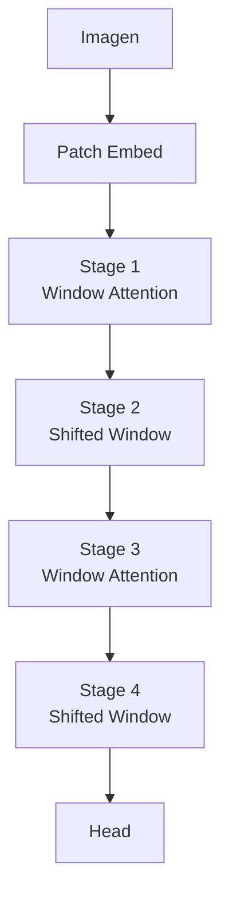

# 🤖 Vision Transformers

Los transformers revolucionaron el procesamiento del lenguaje natural al demostrar que la atención autosupervisada puede sustituir completamente a las arquitecturas recurrentes. En 2020, Dosovitskiy et al. demostraron que este mismo principio aplica a la visión: un transformer puro, sin convoluciones, puede superar a las CNNs de última generación en ImageNet. Este descubrimiento redefinió los límites de la visión por computadora y sentó las bases para modelos multimodales como CLIP y DALL-E.

---

## 1. De CNNs a Transformers: ¿por qué cambiar?

Las CNNs han dominado la visión durante una década gracias a sus **priors inductivos**: localidad espacial (convoluciones $3 \times 3$) e invarianza traslacional (weight sharing). Estos priors las hacen eficientes con pocos datos, pero también las limitan.

**Limitaciones de las CNNs:**
- El campo receptivo crece linealmente con la profundidad; capturar relaciones globales requiere muchas capas.
- El max pooling destruye información espacial fina.
- La jerarquía convolucional asume que la importancia de un píxel depende solo de sus vecinos locales.

Los transformers eliminan estos priors y aprenden relaciones globales directamente mediante **self-attention**. El costo: requieren **más datos** para compensar la ausencia de inductive bias espacial.

| Aspecto | CNN | Transformer |
|---------|-----|-------------|
| Prior inductivo | Localidad, traslación | Ninguno (aprende todo) |
| Campo receptivo | Local → global (progresivo) | Global desde la primera capa |
| Escalabilidad | Subcuadrática con trucos | Cuadrática con tokens ($O(N^2)$) |
| Datos necesarios | Moderados | Masivos (millones de imágenes) |
| Interpretabilidad | Mapas de activación limitados | Attention maps globales |

Caso real: **Google Vision API** migra gradualmente sus modelos de clasificación general a arquitecturas híbridas transformer-CNN para mejorar precisión en clases finas.


---

## 2. Patch Embedding: de imagen a secuencia

Un transformer opera sobre secuencias, no sobre grillas 2D. ViT resuelve esto dividiendo la imagen en parches no solapados.

Dada una imagen $x \in \mathbb{R}^{H \times W \times C}$ y un tamaño de parche $P$, obtenemos $N = \frac{HW}{P^2}$ parches de dimensión $P^2 \cdot C$. Cada parche se aplana y se proyecta linealmente a una dimensión $D$ mediante una matriz de pesos $E \in \mathbb{R}^{(P^2 \cdot C) \times D}$:

$$
z_0 = [x_{\text{class}}; x_p^1 E; x_p^2 E; \dots; x_p^N E] + E_{\text{pos}}
$$

Donde:
- $x_{\text{class}}$ es un token especial aprendible (análogo al token [CLS] de BERT).
- $E_{\text{pos}}$ es el embedding posicional que injecta información espacial.

💡 **Regla mnemotécnica**: **"Una imagen vale 16x16 palabras"** — el título del paper ViT encapsula la idea: trata cada parche como una "palabra" en una secuencia.

---

## 3. Positional Encoding en imágenes

A diferencia del texto, donde el orden es secuencial, las imágenes tienen una estructura 2D continua.

**Estrategias:**
- **1D learnable**: simplemente aprende un embedding por posición linealizada (funciona sorprendentemente bien).
- **2D learnable**: embeddings separados para coordenadas $x$ e $y$ que se suman.
- **Sinusoidal**: extensiones de la fórmula original de Vaswani et al. a 2D.

Dosovitskiy et al. encontraron que los embeddings 1D y 2D funcionan casi igual en ImageNet, sugiriendo que el transformer aprende relaciones espaciales implícitamente a partir de los patches.

---

## 4. Self-Attention en imágenes

### 4.1 Mecanismo de atención

Dada una secuencia de tokens $Z \in \mathbb{R}^{N \times D}$, se calculan tres proyecciones:

$$
Q = Z W_Q, \quad K = Z W_K, \quad V = Z W_V
$$

La atención escalada:

$$
\text{Attention}(Q, K, V) = \text{softmax}\left(\frac{QK^T}{\sqrt{D_k}}\right) V
$$

El factor $\sqrt{D_k}$ estabiliza gradientes evitando que los productos escalares crezcan demasiado.

**Interpretación visual**: cada parche (token) "mira" a todos los demás parches y calcula un peso de importancia. Un parche que contiene la cabeza de un perro puede prestar atención a un parche de patas para clasificar la imagen completa.

### 4.2 Multi-Head Attention (MHA)

En lugar de una sola atención, se ejecutan $h$ atenciones en paralelo con proyecciones diferentes:

$$
\text{MHA}(Z) = \text{Concat}(\text{head}_1, \dots, \text{head}_h) W_O
$$

cada cabeza puede especializarse en diferentes tipos de relaciones: texturas locales, formas globales, colores, etc.

⚠️ **Advertencia**: la complejidad de self-attention es $O(N^2 D)$. Para una imagen de $1024 \times 1024$ con parches $16 \times 16$, $N = 4096$. El costo computacional es masivo comparado con CNNs. Esto limita ViT a resoluciones moderadas sin optimizaciones.

---

## 5. Vision Transformer (ViT)

### 5.1 Arquitectura completa

1. Split image into patches + embed.
2. Add [CLS] token + positional embeddings.
3. Pasar por $L$ bloques transformer (MHA + MLP + LayerNorm + residuals).
4. Usar la representación del [CLS] token para clasificación mediante un MLP head.

### 5.2 Escalado y datos

ViT-Huge (632M parámetros) entrenado en JFT-300M (300 millones de imágenes) supera a ResNet-152 en ImageNet. Sin embargo, ViT-Base entrenado **solo en ImageNet** (1.3M imágenes) es inferior a ResNet-50.


**Conclusión crítica**: los transformers para visión requieren **pretraining masivo**. Sin suficientes datos, los priors inductivos de las CNNs son insustituibles.

---

## 6. DeiT: Knowledge Distillation para ViT

Touvron et al. (2021) propusieron **Data-efficient Image Transformers (DeiT)** para entrenar ViTs en ImageNet sin JFT-300M.

**Clave**: un token de distilación aprende a replicar las predicciones de un teacher CNN (RegNet). La pérdida combina:
- Cross-entropy con ground truth.
- Distilación softmax del teacher.

Esto permite que el transformer aprenda priors espaciales del teacher CNN, reduciendo la necesidad de datos masivos.

Caso real: **Hugging Face Transformers** distribuye checkpoints DeiT como modelo base recomendado para clasificación cuando no se dispone de datasets propios millonarios.

---

## 7. Swin Transformer: ventanas y desplazamiento

Liu et al. (2021) propusieron una solución elegante al costo cuadrático de la atención global.

### 7.1 Atención por ventanas

En lugar de calcular atención entre todos los $N$ tokens, Swin divide la imagen en ventanas no solapadas de $M \times M$ parches (típicamente $7 \times 7$) y aplica self-attention **solo dentro de cada ventana**.

Complejidad: $O(N M^2 D)$ en lugar de $O(N^2 D)$. Con $M$ fijo, esto es lineal en $N$.

### 7.2 Shifted window attention

El problema: las ventanas no solapadas no se comunican entre sí. Swin alterna entre:
- **Capa regular**: ventanas alineadas a la cuadrícula.
- **Capa desplazada**: ventanas desplazadas por $(\lfloor M/2 \rfloor, \lfloor M/2 \rfloor)$.

Esto introduce conexiones entre ventanas vecinas sin perder eficiencia. El desplazamiento se implementa mediante **masking eficiente** dentro del cálculo de atención.

### 7.3 Patch merging

Swin también introduce capas de **patch merging** (análogas a pooling) que reducen la resolución y duplican la dimensión de características, creando una pirámide jerárquica útil para detección y segmentación.

Caso real: **Microsoft Azure Computer Vision** utiliza Swin Transformer como backbone en sus APIs de detección y segmentación por su eficiencia y precisión balanceadas.



💡 **Tip**: si necesitas un transformer para visión con datasets medianos (~100k imágenes), empieza con **Swin-T** (tiny) en lugar de ViT-Base. Las ventanas locales actúan como regularización.

---

## 8. Comparativa CNN vs ViT

| Característica | ResNet-50 | ViT-Base | Swin-T |
|----------------|-----------|----------|--------|
| Parámetros | 25M | 86M | 28M |
| ImageNet top-1 | 76.1 % | 77.9 % (con pretraining masivo) | 81.3 % |
| Complejidad espacial | $O(HW)$ | $O(N^2)$ | $O(N)$ |
| Escalabilidad a alta resolución | Excelente | Pobre sin trucos | Buena |
| Transfer learning con pocos datos | Excelente | Regular | Buena |
| Interpretabilidad | Mapas de calor limitados | Attention maps ricas | Attention por ventana |

---

## 📦 Código de compresión

```python
"""
Vision Transformer (ViT) completo con PyTorch.
Resume patch embedding, positional encoding, transformer encoder y clasificación.
"""

import torch
import torch.nn as nn
import torch.nn.functional as F

class PatchEmbedding(nn.Module):
    def __init__(self, img_size=224, patch_size=16, in_ch=3, embed_dim=768):
        super().__init__()
        self.patch_size = patch_size
        self.n_patches = (img_size // patch_size) ** 2
        self.proj = nn.Conv2d(in_ch, embed_dim, kernel_size=patch_size, stride=patch_size)
        self.cls_token = nn.Parameter(torch.zeros(1, 1, embed_dim))
        self.pos_embed = nn.Parameter(torch.zeros(1, self.n_patches + 1, embed_dim))

    def forward(self, x):
        B = x.shape[0]
        x = self.proj(x).flatten(2).transpose(1, 2)  # (B, N, D)
        cls = self.cls_token.expand(B, -1, -1)
        x = torch.cat((cls, x), dim=1)
        x = x + self.pos_embed
        return x

class MultiHeadAttention(nn.Module):
    def __init__(self, embed_dim=768, num_heads=8, dropout=0.0):
        super().__init__()
        self.num_heads = num_heads
        self.head_dim = embed_dim // num_heads
        self.qkv = nn.Linear(embed_dim, embed_dim * 3)
        self.proj = nn.Linear(embed_dim, embed_dim)
        self.dropout = nn.Dropout(dropout)

    def forward(self, x):
        B, N, D = x.shape
        qkv = self.qkv(x).reshape(B, N, 3, self.num_heads, self.head_dim).permute(2, 0, 3, 1, 4)
        q, k, v = qkv[0], qkv[1], qkv[2]
        attn = (q @ k.transpose(-2, -1)) * (self.head_dim ** -0.5)
        attn = F.softmax(attn, dim=-1)
        x = (attn @ v).transpose(1, 2).reshape(B, N, D)
        x = self.proj(x)
        return x, attn

class TransformerBlock(nn.Module):
    def __init__(self, embed_dim=768, num_heads=8, mlp_ratio=4.0, dropout=0.0):
        super().__init__()
        self.norm1 = nn.LayerNorm(embed_dim)
        self.attn = MultiHeadAttention(embed_dim, num_heads, dropout)
        self.norm2 = nn.LayerNorm(embed_dim)
        self.mlp = nn.Sequential(
            nn.Linear(embed_dim, int(embed_dim * mlp_ratio)),
            nn.GELU(),
            nn.Dropout(dropout),
            nn.Linear(int(embed_dim * mlp_ratio), embed_dim),
            nn.Dropout(dropout),
        )

    def forward(self, x):
        attn_out, _ = self.attn(self.norm1(x))
        x = x + attn_out
        x = x + self.mlp(self.norm2(x))
        return x

class VisionTransformer(nn.Module):
    def __init__(self, img_size=224, patch_size=16, in_ch=3, num_classes=1000,
                 embed_dim=768, depth=12, num_heads=12, mlp_ratio=4.0, dropout=0.0):
        super().__init__()
        self.patch_embed = PatchEmbedding(img_size, patch_size, in_ch, embed_dim)
        self.blocks = nn.Sequential(*[
            TransformerBlock(embed_dim, num_heads, mlp_ratio, dropout)
            for _ in range(depth)
        ])
        self.norm = nn.LayerNorm(embed_dim)
        self.head = nn.Linear(embed_dim, num_classes)

    def forward(self, x):
        x = self.patch_embed(x)
        x = self.blocks(x)
        x = self.norm(x)
        cls = x[:, 0]
        return self.head(cls)

if __name__ == "__main__":
    model = VisionTransformer(img_size=224, patch_size=16, num_classes=10, embed_dim=768, depth=12, num_heads=12)
    x = torch.randn(2, 3, 224, 224)
    logits = model(x)
    print("Input:", x.shape, "Logits:", logits.shape)
```

---

## 🎯 Proyecto documentado: Clasificación de Enfermedades en Cultivos con Vision Transformer

### Descripción
Sistema que clasifica imágenes de hojas de cultivos para detectar enfermedades, usando un Vision Transformer fine-tuned en un dataset especializado de agricultura de precisión.

### Requisitos funcionales
1. Recibir imágenes de hojas tomadas con cámaras de smartphone o drones agrícolas.
2. Clasificar en 38 categorías de enfermedades + clase sana.
3. Proporcionar mapas de atención que muestren qué regiones de la hoja justifican el diagnóstico.
4. Funcionar offline en dispositivos de borde (edge) mediante distilación a un modelo ligero.
5. Registrar predicciones y confianza para auditoría agronómica.

### Componentes principales
- **Modelo base**: ViT-Base preentrenado en ImageNet-21k, fine-tuned en PlantVillage.
- **Distilación**: Teacher ViT-Base → Student DeiT-Tiny para despliegue móvil.
- **Explicabilidad**: Extracción de attention weights del [CLS] token sobre patches.
- **Backend**: ONNX Runtime para inferencia optimizada en CPU/edge.
- **Frontend**: App móvil React Native con cámara integrada.

### Métricas de éxito
- Accuracy top-1 > 97 % en PlantVillage.
- Latencia de inferencia < 300 ms en smartphone de gama media (con modelo student).
- Precisión de attention maps validada por agrónomos (correlación visual > 0.85).
- Tasa de falsos negativos en enfermedades graves < 2 %.

### Referencias
- Dosovitskiy, A., et al. "An Image is Worth 16x16 Words: Transformers for Image Recognition at Scale." ICLR 2021.
- Touvron, H., et al. "Training Data-Efficient Image Transformers & Distillation Through Attention." ICML 2021.
- Liu, Z., et al. "Swin Transformer: Hierarchical Vision Transformer using Shifted Windows." ICCV 2021.
- Vaswani, A., et al. "Attention Is All You Need." NeurIPS 2017.
