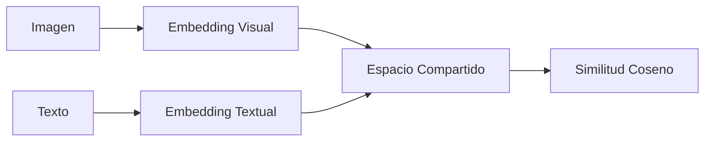

# 🌐 Bienvenida al Módulo: Multimodal AI

La inteligencia artificial multimodal representa uno de los frentes más ambiciosos del aprendizaje profundo moderno. Mientras que los modelos unimodales (solo texto, solo imagen) han alcanzado niveles sobresalientes de desempeño, la verdadera comprensión del mundo requiere integrar múltiples fuentes sensoriales. Este módulo explora cómo las arquitecturas de deep learning pueden alinear, fusionar y razonar sobre información visual y lingüística de forma conjunta.

## Índice del Curso

1. [[01 - CLIP y Representaciones Conjuntas]]
2. [[02 - Modelos de Image Captioning]]
3. [[03 - Multimodal Transformers]]
4. [[04 - Caso Practico - Buscador Visual Multimodal]]

## Glosario de Términos

| Término | Definición |
|---|---|
| **Multimodal** | Capacidad de un sistema para procesar y relacionar información proveniente de múltiples modalidades (e.g., imagen + texto). |
| **Contrastive Learning** | Paradigma de aprendizaje donde el modelo aprende representaciones empujando ejemplos similares juntos y ejemplos disímiles aparte en el espacio de embeddings. |
| **Image Captioning** | Tarea de generar una descripción textual natural a partir de una imagen de entrada. |
| **Cross-Attention** | Mecanismo de atención donde las queries provienen de una modalidad y las keys/values de otra, permitiendo el flujo de información cruzada. |
| **Vision-Language Model (VLM)** | Modelo entrenado para entender y generar contenido que involucra tanto datos visuales como lingüísticos. |
| **Embedding** | Representación vectorial densa de un dato (imagen, texto, audio) en un espacio de baja dimensionalidad. |
| **Retrieval** | Proceso de recuperar información relevante de un corpus o base de datos dada una consulta. |
| **Zero-Shot** | Capacidad de un modelo para realizar una tarea sin haber visto ejemplos etiquetados de esa tarea durante el entrenamiento. |
| **Few-Shot** | Capacidad de adaptarse a una nueva tarea con muy pocos ejemplos de demostración. |
| **Alignment** | Proceso de proyectar diferentes modalidades en un espacio semántico compartido donde sus representaciones son directamente comparables. |

## Objetivos de Aprendizaje

Al finalizar este módulo, serás capaz de:

1. Explicar matemáticamente por qué el aprendizaje contrastivo permite el alineamiento de modalidades heterogéneas.
2. Implementar desde cero un pipeline de extracción de embeddings conjuntos con arquitecturas tipo CLIP.
3. Evaluar modelos de image captioning utilizando métricas estándar del estado del arte.
4. Diferenciar arquitecturas cross-attention de self-attention y razonar sobre sus implicaciones computacionales.
5. Diseñar e implementar un sistema de búsqueda visual multimodal escalable usando índices de proximidad aproximada.
