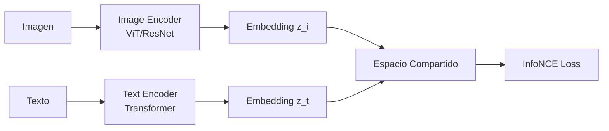
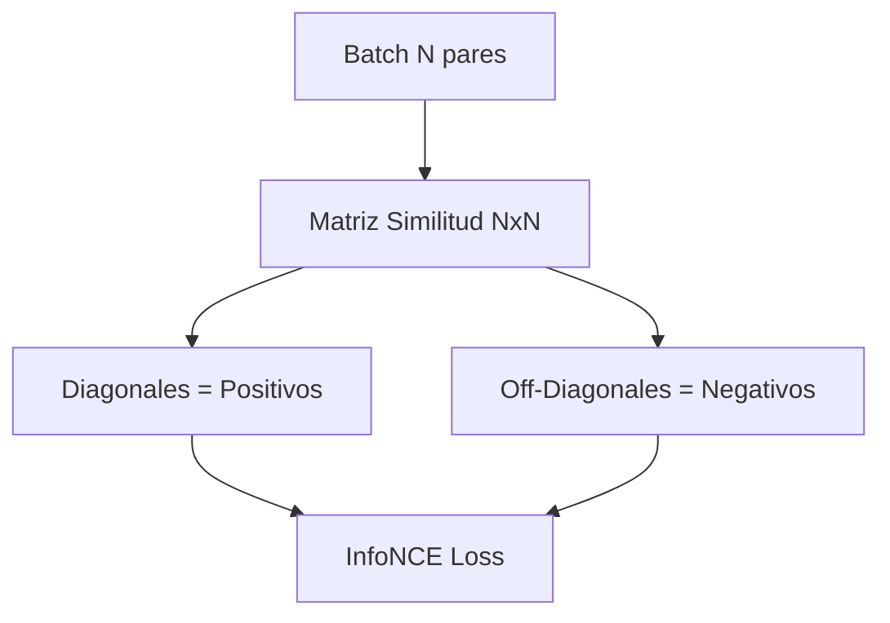

# 🔗 CLIP y Representaciones Conjuntas

La convergencia entre visión y lenguaje no es solo una cuestión de arquitectura: es un problema de representación. Durante décadas, los modelos de visión por computadora y de procesamiento de lenguaje natural evolucionaron en silos separados, utilizando objetivos de entrenamiento, espacios latentes y supuestos distribucionales distintos. CLIP (Contrastive Language-Image Pre-training) rompe esta barrera al demostrar que un único espacio semántico compartido puede servir como puente universal entre ambas modalidades.

## 1. El Problema del Alineamiento Multimodal

La pregunta fundamental no es cómo procesar imágenes o texto, sino por qué sus representaciones deberían ser comparables. Cuando un humano asocia la palabra "perro" con una imagen de un can, no está ejecutando dos modelos paralelos; está accediendo a una representación conceptual unificada. El alineamiento busca replicar esto: proyectar pares (imagen, texto) positivos cercanos y pares negativos lejanos en un espacio métrico.

La geometría de este espacio determina la capacidad de generalización del modelo. Si los vectores de texto e imagen residen en variedades separadas, cualquier tarea downstream requerirá un adaptador costoso. CLIP resuelve esto de forma end-to-end.

## 2. Aprendizaje Contrastivo: El Porqué Matemático

El aprendizaje contrastivo se fundamenta en el principio de **InfoMax**: maximizar la información mutua entre representaciones de diferentes vistas del mismo dato. En el contexto multimodal, las "vistas" son la imagen y su descripción textual.

En lugar de predecir tokens o etiquetas, el modelo aprende una función de similitud. La intuición clave es que, para un batch de $N$ pares (imagen, texto), existen $N$ pares positivos (diagonales) y $N^2 - N$ pares negativos (off-diagonal). Maximizar la similitud de los positivos respecto a los negativos obliga al espacio a organizarse semánticamente.

## 3. Arquitectura CLIP

CLIP consta de dos encoders independientes:

- **Image Encoder**: Típicamente una ResNet o Vision Transformer (ViT) que proyecta una imagen $x_i$ a un vector $z_i \in \mathbb{R}^d$.
- **Text Encoder**: Un Transformer causal (tipo GPT) o bidireccional que proyecta una secuencia de tokens de texto $x_t$ a un vector $z_t \in \mathbb{R}^d$.

Ambos vectores se normalizan (L2) y se proyectan a través de una capa lineal de proyección aprendida. No hay fusión temprana; la interacción ocurre exclusivamente en el espacio de embeddings.




### Tabla Comparativa: Enfoques de Alineamiento

| Enfoque | Interacción | Escalabilidad | Generalización Zero-Shot |
|---|---|---|---|
| CLIP | Espacio compartido (late fusion) | Alta | Excelente |
| LXMERT | Fusión temprana (cross-attention) | Media | Limitada |
| UNITER | Fusión temprana + pre-training masivo | Baja | Media |
| ALIGN (Google) | Similar a CLIP, dataset más grande | Alta | Excelente |

## 4. InfoNCE Loss y Similitud Coseno

La función de pérdida contrastiva utilizada por CLIP es una variante de la InfoNCE. Para un par $(i, j)$ en un batch de tamaño $N$, definimos la similitud coseno escalada:

$$s_{ij} = \frac{z_i \cdot z_j}{\|z_i\| \|z_j\|} \cdot \frac{1}{\tau}$$

donde $\tau$ es una temperatura aprendida que controla la suavidad de la distribución.

La pérdida para la dirección imagen-a-texto es:

$$\mathcal{L}_{i \to t} = -\frac{1}{N} \sum_{i=1}^{N} \log \frac{\exp(s_{ii})}{\sum_{j=1}^{N} \exp(s_{ij})}$$

Análogamente para texto-a-imagen $\mathcal{L}_{t \to i}$. La pérdida total es la media simétrica:

$$\mathcal{L}_{CLIP} = \frac{1}{2} \left( \mathcal{L}_{i \to t} + \mathcal{L}_{t \to i} \right)$$

El numerador promueve el par positivo; el denominador penaliza la confusión con todos los pares negativos del batch.



## 5. Zero-Shot Classification

Una vez entrenado, CLIP puede clasificar sin ejemplos etiquetados. El procedimiento es:

1. Construir un conjunto de prompts: "a photo of a {class}".
2. Codificar los prompts con el text encoder para obtener $Z_{text} \in \mathbb{R}^{C \times d}$.
3. Codificar la imagen de consulta para obtener $z_{img} \in \mathbb{R}^d$.
4. Calcular probabilidades via softmax sobre similitudes coseno:

$$p(y = c | x) = \frac{\exp(z_{img} \cdot z_{text}^{(c)} / \tau)}{\sum_{k=1}^{C} \exp(z_{img} \cdot z_{text}^{(k)} / \tau)}$$

Esto funciona porque el espacio compartido ha internalizado relaciones semánticas durante el pre-training masivo.

## 6. Zero-Shot Image Retrieval

Dado un texto de consulta $q$, se busca:

$$\arg\max_{i \in \mathcal{D}} \cos(z_{img}^{(i)}, z_{text}^{(q)})$$

Esto permite búsqueda semántica: consultas como "atardecer en la playa con siluetas de palmeras" recuperan imágenes relevantes sin necesidad de metadatos.

## 7. Embeddings Multimodales en un Espacio Compartido

La calidad del espacio compartido se mide por su capacidad de preservar la transitividad semántica. Si $z_{img}^{(perro)} \approx z_{text}^{(dog)}$ y $z_{text}^{(dog)} \approx z_{text}^{(puppy)}$, entonces se espera que $z_{img}^{(perro)} \approx z_{text}^{(puppy)}$. Esta propiedad emerge del entrenamiento contrastivo a gran escala.

Caso real: **OpenAI CLIP** se entrenó con 400 millones de pares (imagen, texto) extraídos de internet, demostrando que el escalamiento de datos contrastivos supera a los enfoques supervisados tradicionales en robustez a distribuciones shift.

Caso real: **Pinterest** utiliza variantes de CLIP para su sistema de búsqueda visual semántica, permitiendo a los usuarios explorar imágenes por conceptos abstractos.

⚠️ **Advertencias**

- **Batch size insuficiente**: La InfoNCE depende críticamente de un gran número de negativos por batch. Batch sizes menores a 256 suelen producir representaciones degeneradas.
- **Temperatura fija**: Si $\tau$ no es aprendida o se fija incorrectamente, la distribución de similitudes puede volverse demasiado "dura" o "blanda", impidiendo el aprendizaje.
- **Desbalance modal**: Si un encoder es mucho más potente que el otro, puede dominar el espacio, haciendo que el encoder débil se vuelva colapsado (dimensional collapse).

💡 **Tips y Reglas Mnemotécnicas**

- **"Contrastive = Contra el resto"**: Recuerda que cada ejemplo positivo lucha contra *todos* los demás del batch.
- **"CLIP corta distancias"**: Normalización L2 + coseno = solo importa la dirección, no la magnitud. Piensa en vectores sobre la superficie de una esfera.
- **"Prompt engineering importa"**: En zero-shot, "a photo of a" no es decorativo; calibra el espacio semántico hacia el dominio visual.

```python
import torch
import torch.nn as nn
import torch.nn.functional as F

class CLIPLoss(nn.Module):
    def __init__(self, temperature=0.07):
        super().__init__()
        self.temperature = nn.Parameter(torch.ones([]) * temperature)
    
    def forward(self, image_features, text_features):
        # Normalización L2
        image_features = F.normalize(image_features, dim=-1)
        text_features = F.normalize(text_features, dim=-1)
        
        # Matriz de similitud
        logits = torch.matmul(image_features, text_features.T) / self.temperature
        
        # Labels: diagonal es positiva
        labels = torch.arange(logits.shape[0], device=logits.device)
        
        loss_i2t = F.cross_entropy(logits, labels)
        loss_t2i = F.cross_entropy(logits.T, labels)
        return (loss_i2t + loss_t2i) / 2
```

📦 **Código de Compresión PyTorch**

```python
"""
Script compresivo: CLIP from scratch en PyTorch.
Resume: encoders dummy, proyección, InfoNCE, zero-shot inference.
"""
import torch
import torch.nn as nn
import torch.nn.functional as F
from torchvision.models import vit_b_16
from transformers import BertModel, BertTokenizer

class ImageEncoder(nn.Module):
    def __init__(self, embed_dim=512):
        super().__init__()
        self.backbone = vit_b_16(weights='IMAGENET1K_V1')
        self.backbone.heads = nn.Identity()
        self.proj = nn.Linear(768, embed_dim)
    
    def forward(self, x):
        h = self.backbone(x)
        return F.normalize(self.proj(h), dim=-1)

class TextEncoder(nn.Module):
    def __init__(self, embed_dim=512):
        super().__init__()
        self.backbone = BertModel.from_pretrained('bert-base-uncased')
        self.proj = nn.Linear(768, embed_dim)
    
    def forward(self, input_ids, attention_mask):
        out = self.backbone(input_ids=input_ids, attention_mask=attention_mask)
        # Usamos el token [CLS]
        h = out.last_hidden_state[:, 0, :]
        return F.normalize(self.proj(h), dim=-1)

class CLIP(nn.Module):
    def __init__(self, embed_dim=512):
        super().__init__()
        self.image_encoder = ImageEncoder(embed_dim)
        self.text_encoder = TextEncoder(embed_dim)
        self.temperature = nn.Parameter(torch.ones([]) * 0.07)
    
    def forward(self, images, input_ids, attention_mask):
        z_i = self.image_encoder(images)
        z_t = self.text_encoder(input_ids, attention_mask)
        logits = torch.matmul(z_i, z_t.T) / self.temperature
        labels = torch.arange(len(z_i), device=z_i.device)
        loss = (F.cross_entropy(logits, labels) + 
                F.cross_entropy(logits.T, labels)) / 2
        return loss, logits

# Zero-shot inference dummy
if __name__ == "__main__":
    model = CLIP(embed_dim=256)
    imgs = torch.randn(4, 3, 224, 224)
    toks = torch.randint(0, 1000, (4, 32))
    mask = torch.ones(4, 32)
    loss, logits = model(imgs, toks, mask)
    print("Loss:", loss.item())
```

🎯 **Proyecto: Motor de Búsqueda Semántica de Productos**

**Descripción**: Construir un sistema que indexe un catálogo de productos (imágenes + descripciones) y permita búsqueda por texto o imagen de referencia.

**Requisitos funcionales**:
1. Extracción de embeddings CLIP para todo el catálogo en batch.
2. Almacenamiento de embeddings en índice vectorial (FAISS).
3. Endpoint de búsqueda por texto que retorne top-k imágenes.
4. Endpoint de búsqueda por imagen (reverse image search).
5. Visualización de similitud coseno para cada resultado.

**Componentes principales**:
- Pipeline de preprocesamiento de imágenes.
- Modelo CLIP fine-tuned o preentrenado.
- Índice FAISS con IDs metadata.
- API REST (FastAPI) para consultas.

**Métricas de éxito**:
- Recall@10 > 0.85 en conjunto de validación.
- Latencia p95 < 200 ms para consultas.
- Precisión de zero-shot > 70 % en 10 categorías.

**Referencias**:
- Radford et al., "Learning Transferable Visual Models From Natural Language Supervision", ICML 2021.
- Oord et al., "Representation Learning with Contrastive Predictive Coding", arXiv 2018.
