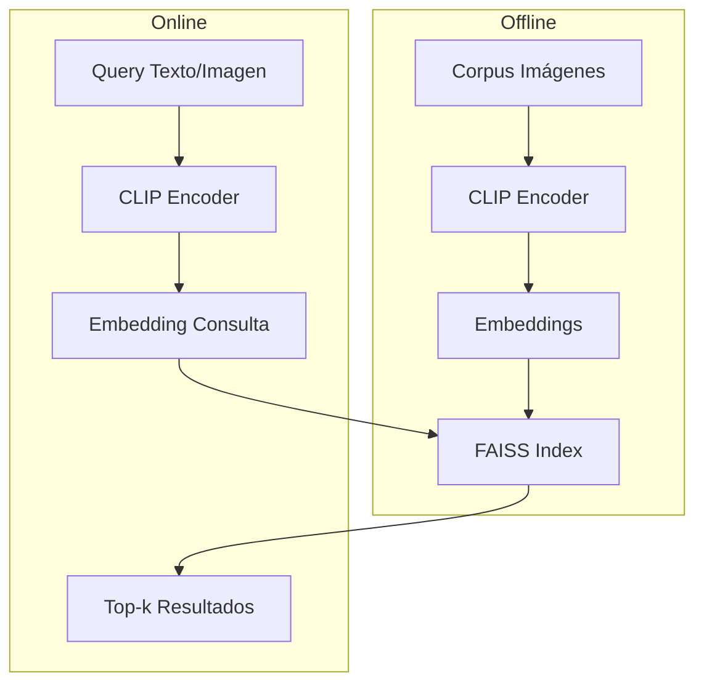
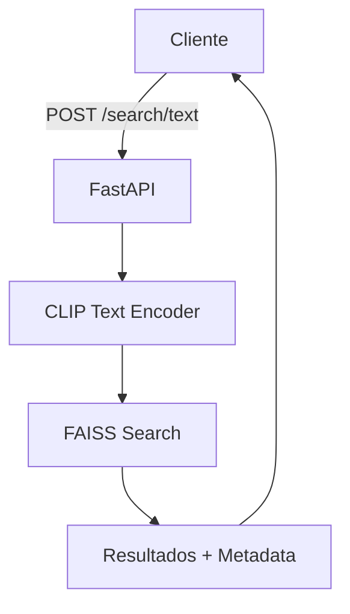

# 🔍 Caso Práctico: Buscador Visual Multimodal

Un buscador visual multimodal trasciende la búsqueda por metadatos o palabras clave. Permite a los usuarios expresar intenciones usando el lenguaje más natural posible: una descripción textual o una imagen de referencia. La relevancia para ML/AI radica en que este sistema integra casi todos los conceptos del módulo: embeddings conjuntos, retrieval aproximado, APIs de servicio y evaluación de ranking.

## 1. Definición del Sistema y Requisitos Funcionales

El sistema debe soportar dos modos de consulta:

- **Text-to-Image (T2I)**: Dado un texto, recuperar las imágenes más semánticamente similares.
- **Image-to-Image (I2I)**: Dada una imagen de consulta, recuperar imágenes visualmente similares.

Ambos modos son posibles gracias a un espacio de embeddings compartido (CLIP).


**Requisitos funcionales**:
1. Ingesta batch de imágenes con preprocesamiento (resize, normalización).
2. Extracción de embeddings de imagen y texto usando modelo CLIP.
3. Indexación de embeddings en FAISS con identificadores persistentes.
4. Endpoint REST `/search/text` que reciba query string y retorne top-k results.
5. Endpoint REST `/search/image` que reciba archivo de imagen y retorne top-k results.
6. Frontend conceptual que muestre resultados con score de similitud.
7. Soporte para reindexación incremental sin downtime.

## 2. Arquitectura de Retrieval

La arquitectura sigue el patrón clásico de información retrieval adaptado a vectores densos:



1. **Offline**: Indexación.
   - Procesamiento de corpus $\mathcal{D} = \{i_1, i_2, \dots, i_N\}$.
   - Extracción de features $z_i = f_{enc}(i_j)$.
   - Construcción de índice FAISS: estructura de datos especializada para búsqueda de vecinos más cercanos aproximada (ANN).
2. **Online**: Query y Ranking.
   - El usuario provee consulta $q$ (texto o imagen).
   - Se extrae $z_q$.
   - Se ejecuta búsqueda en FAISS: $\mathcal{N}_k(q) = \arg\min_{i \in \mathcal{D}} \|z_q - z_i\|^2$.
   - Se post-procesan resultados (filtrado por metadata, re-ranking por modelo pesado opcional).

## 3. Indexación con FAISS y Embeddings CLIP

FAISS (Facebook AI Similarity Search) es una biblioteca optimizada en C++ para ANN. Para millones de vectores, una búsqueda exacta (fuerza bruta) es $O(N \cdot d)$, lo cual es inaceptable. FAISS ofrece índices como IVF (Inverted File Index) y HNSW (Hierarchical Navigable Small World) que reducen la complejidad a sublineal.

Para un índice IVF con $nlist$ clusters:

1. Entrenar k-means sobre una muestra para obtener $nlist$ centroides.
2. Asignar cada vector al centroide más cercano.
3. En consulta, buscar en los $nprobe$ clusters más cercanos a $z_q$.

La métrica de distancia en CLIP normalizado es equivalente a similitud coseno:

$$\|z_q - z_i\|^2 = 2 - 2 \cdot z_q^T z_i$$

porque $\|z_q\| = \|z_i\| = 1$.

## 4. API con FastAPI

FastAPI permite construir APIs asíncronas con tipado Python. El servicio debe:



- Cargar el modelo CLIP y el índice FAISS en memoria al iniciar (lifespan).
- Recibir queries y transformarlas en embeddings.
- Manejar concurrencia con `async` para no bloquear el event loop durante la búsqueda (aunque FAISS es CPU-bound, se puede delegar a thread pool).

## 5. Frontend Conceptual

El frontend es una SPA (Single Page Application) conceptual con:

- Barra de búsqueda textual.
- Componente de "drag & drop" para imagen de consulta.
- Grid de resultados mostrando imagen, score de similitud, y metadatos.
- Toggle entre modo T2I e I2I.

## 6. Métricas de Éxito: Recall@k y mAP

En retrieval, la precisión clásica no es suficiente porque no hay una única respuesta correcta.

**Recall@k**: Fracción de items relevantes recuperados entre los top-k.

$$\text{Recall@}k = \frac{|\{\text{relevantes}\} \cap \{\text{top-}k\}|}{|\{\text{relevantes}\}|}$$

**mAP (mean Average Precision)**: Promedio de la precisión en cada posición donde aparece un item relevante, promediado sobre todas las consultas.

$$\text{AP} = \sum_{k} (\text{Recall@}k - \text{Recall@}(k-1)) \cdot \text{Precision@}k$$

$$\text{mAP} = \frac{1}{Q} \sum_{q=1}^{Q} \text{AP}_q$$

Estas métricas capturan tanto la cobertura (recall) como el ordenamiento (precision).

## 7. Escalabilidad y Consideraciones de Producción

- **Sharding**: Para corpus > 100M vectores, FAISS soporta sharding en múltiples GPUs/CPUs.
- **Reindexación incremental**: Usar `faiss.IndexIDMap` para añadir/eliminar vectores por ID sin reconstruir todo el índice.
- **Caching**: Embeddings de consultas frecuentes pueden cachearse en Redis.
- **CDN**: Las imágenes resultado se sirven desde CDN, no desde la API.

### Tabla Comparativa: FAISS vs Otros ANN

| Biblioteca | Fuerza | GPU | Facilidad | Ideal para |
|---|---|---|---|---|
| **FAISS** | IVF, HNSW, GPU optimizado | Sí | Media | Alta escala, investigación |
| **Annoy** | Árboles aleatorios | No | Alta | Corpus medianos, CPU |
| **Hnswlib** | HNSW puro | No | Alta | Latencia ultra-baja |
| **Milvus** | Gestión de metadatos, cloud | Sí | Media | Producción enterprise |
| **Pinecone** | SaaS, sin ops | Sí | Muy alta | MVP rápido |

Caso real: **Google Lens** indexa billones de imágenes web para permitir búsqueda visual en tiempo real, combinando embeddings locales con un backend de ANN masivamente distribuido.

Caso real: **Amazon Visual Search** permite a los clientes fotografiar productos y encontrar listados similares, utilizando modelos de embeddings fine-tuned sobre catálogos de retail.

⚠️ **Advertencias**

- **Index corruption**: FAISS en disco requiere cuidado con la serialización. Siempre guarda el mapping de IDs externamente.
- **Batch size en extracción**: GPUs pequeñas pueden OOM al procesar imágenes grandes. Usa batch size dinámico.
- **Concept drift**: Si el corpus cambia de distribución (e.g., nuevas categorías de productos), los embeddings de CLIP pueden degradarse. Monitorear mAP periódicamente.

💡 **Tips y Reglas Mnemotécnicas**

- **"FAISS = Fa(s)t AI Similarity Search"**: La clave es la velocidad; acepta un 1 % de recall drop por 1000x velocidad.
- **"Normaliza antes de indexar"**: Si usas CLIP, normaliza embeddings antes de FAISS para que L2 = coseno. Te ahorra errores de métrica.
- **"IVF para millones, HNSW para miles"**: IVF requiere entrenamiento pero escala mejor; HNSW es más simple y rápido en datasets pequeños.

```python
import faiss
import numpy as np

# Crear índice IVF con distancia L2
d = 512
nlist = 100
quantizer = faiss.IndexFlatL2(d)
index = faiss.IndexIVFFlat(quantizer, d, nlist)

# Datos dummy
xb = np.random.random((10000, d)).astype('float32')
index.train(xb)
index.add(xb)

# Búsqueda
xq = np.random.random((1, d)).astype('float32')
D, I = index.search(xq, k=10)
print("Vecinos:", I)
```

📦 **Código de Compresión PyTorch**

```python
"""
Script compresivo: Buscador Visual Multimodal completo.
Resume: CLIP embeddings + FAISS index + FastAPI endpoints dummy.
"""
import torch
import torch.nn.functional as F
import faiss
import numpy as np
from fastapi import FastAPI
from pydantic import BaseModel
from typing import List
import uvicorn

# Dummy CLIP-like encoder
class DummyCLIPEncoder:
    def __init__(self, dim=512):
        self.dim = dim
        self.img_proj = torch.nn.Linear(3*224*224, dim)
        self.txt_proj = torch.nn.Linear(768, dim)
    
    def encode_image(self, images):
        # images: (B, 3, 224, 224)
        flat = images.view(images.size(0), -1)
        z = self.img_proj(flat)
        return F.normalize(z, dim=-1)
    
    def encode_text(self, text_emb):
        z = self.txt_proj(text_emb)
        return F.normalize(z, dim=-1)

# Inicializar encoder e índice
encoder = DummyCLIPEncoder(dim=512)
d = 512
index = faiss.IndexFlatIP(d)  # Inner Product = cosine para vectores normalizados
ids_map = []

def build_index(image_tensors, image_ids):
    global ids_map
    with torch.no_grad():
        z = encoder.encode_image(image_tensors).numpy()
    index.add(z)
    ids_map.extend(image_ids)
    return len(ids_map)

# FastAPI app
app = FastAPI()

class TextQuery(BaseModel):
    query: str
    k: int = 5

@app.post("/search/text")
def search_text(q: TextQuery):
    # Dummy text embedding (en producción usar tokenizador real)
    txt_emb = torch.randn(1, 768)
    with torch.no_grad():
        z = encoder.encode_text(txt_emb).numpy()
    scores, indices = index.search(z, q.k)
    results = [{"id": ids_map[int(i)], "score": float(scores[0][j])} 
               for j, i in enumerate(indices[0]) if i >= 0]
    return {"results": results}

@app.post("/search/image")
def search_image(file_bytes: bytes, k: int = 5):
    # Dummy: asumimos que file_bytes se convierte a tensor (B, 3, 224, 224)
    img = torch.randn(1, 3, 224, 224)
    with torch.no_grad():
        z = encoder.encode_image(img).numpy()
    scores, indices = index.search(z, k)
    results = [{"id": ids_map[int(i)], "score": float(scores[0][j])} 
               for j, i in enumerate(indices[0]) if i >= 0]
    return {"results": results}

if __name__ == "__main__":
    # Indexado dummy
    dummy_imgs = torch.randn(100, 3, 224, 224)
    build_index(dummy_imgs, list(range(100)))
    uvicorn.run(app, host="0.0.0.0", port=8000)
```

🎯 **Proyecto: Buscador Visual de Inventario para Retail**

**Descripción**: Sistema de búsqueda visual para cadenas de retail que permite a los clientes y empleados encontrar productos mediante texto o foto, incluso si no conocen el nombre exacto.

**Requisitos funcionales**:
1. Carga batch de imágenes de productos desde almacenamiento S3/Azure Blob.
2. Pipeline de extracción de embeddings CLIP con GPU.
3. Índice FAISS con soporte para adiciones diarias (delta index).
4. API REST con autenticación JWT y rate limiting.
5. Endpoint de búsqueda híbrida: combina filtro por categoría con búsqueda vectorial.
6. Dashboard de métricas: consultas por minuto, latencia p95, recall@10.
7. Frontend móvil responsive para fotografía directa desde cámara.

**Componentes principales**:
- Servicio de embedding (PyTorch + Transformers).
- Índice FAISS + metadata en PostgreSQL.
- API Gateway (FastAPI/Nginx).
- Frontend React / Flutter conceptual.

**Métricas de éxito**:
- Recall@10 >= 0.90 en catálogo de 100k productos.
- Latencia p95 < 150 ms.
- Disponibilidad 99.9 %.
- Precisión de categoría en top-1 > 85 %.

**Referencias**:
- Johnson et al., "Billion-scale similarity search with GPUs", IEEE TPAMI 2019.
- Radford et al., "Learning Transferable Visual Models From Natural Language Supervision", ICML 2021.
