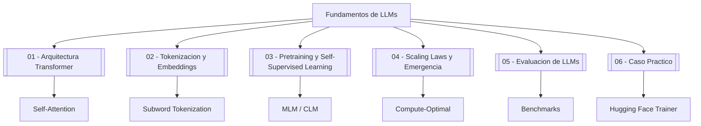

# 🤖 00 - Bienvenida

Bienvenido al curso **06 - Fundamentos de LLMs**, un módulo técnico diseñado para ML/AI Engineers que buscan dominar la arquitectura, entrenamiento y evaluación de los Large Language Models modernos. Los LLMs son la columna vertebral de la revolución actual en inteligencia artificial generativa, desde ChatGPT hasta sistemas de código y razonamiento multimodal.

Comprender sus fundamentos no es opcional: es un requisito para cualquier ingeniero que desee construir, afinar o desplegar estos modelos en producción con seguridad y eficiencia.

---

## 1. Índice del Curso

| # | Nota | Descripción |
|---|------|-------------|
| 00 | [[00 - Bienvenida]] | Esta nota: índice, glosario y objetivos. |
| 01 | [[01 - Arquitectura Transformer]] | Self-attention, multi-head attention, encoder-decoder, positional encoding. |
| 02 | [[02 - Tokenizacion y Embeddings]] | BPE, WordPiece, embeddings contextualizados, subword tokenization. |
| 03 | [[03 - Pretraining y Self-Supervised Learning]] | MLM, CLM, span corruption, datasets y computación. |
| 04 | [[04 - Scaling Laws y Emergencia]] | Leyes de escalamiento, compute-optimal training, habilidades emergentes. |
| 05 | [[05 - Evaluacion de LLMs]] | Perplexity, BLEU, ROUGE, benchmarks MMLU, HumanEval, seguridad. |
| 06 | [[06 - Caso Practico - Clasificador de Texto con Transformers]] | Clasificador de sentimientos con Hugging Face Transformers y Trainer. |

---

## 2. Glosario Fundamental

| Término | Definición |
|---------|------------|
| **Transformer** | Arquitectura de red neuronal basada enteramente en mecanismos de atención, introducida en "Attention Is All You Need" (2017). |
| **Attention** | Mecanismo que permite a un modelo enfocarse en partes relevantes de la entrada al generar cada parte de la salida. |
| **Self-attention** | Variante donde cada token de la secuencia atiende a todos los demás tokens de la misma secuencia para calcular su representación. |
| **Token** | Unidad mínima de texto procesada por un LLM (puede ser una palabra, subpalabra o carácter). |
| **Embedding** | Representación vectorial densa de un token en un espacio de alta dimensionalidad. |
| **Pretraining** | Fase de entrenamiento self-supervisado sobre grandes corpus de texto para aprender representaciones generales del lenguaje. |
| **Fine-tuning** | Ajuste de un modelo preentrenado en una tarea o dominio específico con datos etiquetados. |
| **Perplexity** | Métrica que mide qué tan bien un modelo de lenguaje predice una muestra de texto; menor es mejor. |
| **BLEU** | Métrica automática para evaluar la calidad de texto generado comparando con referencias humanas. |
| **ROUGE** | Conjunto de métricas para evaluar resúmenes y traducciones basadas en solapamiento de n-gramas. |
| **Scaling Law** | Relación matemática observada entre el tamaño del modelo, datos, computación y la pérdida final. |
| **Emergent Ability** | Capacidad que un modelo exhibe de manera abrupta solo al alcanzar cierta escala, sin ser explícitamente entrenada. |

---

## 3. Objetivos de Aprendizaje

Al finalizar este curso serás capaz de:

1. Explicar matemáticamente el mecanismo de self-attention y multi-head attention.
2. Comparar y seleccionar estrategias de tokenización según el modelo y el idioma.
3. Diferenciar objetivos de pretraining (MLM vs. CLM) y sus implicancias arquitectónicas.
4. Aplicar las leyes de escalamiento para estimar recursos de entrenamiento óptimos.
5. Evaluar rigurosamente un LLM usando métricas automáticas, benchmarks y criterios de seguridad.
6. Implementar un clasificador de texto fine-tuned con Hugging Face Transformers y desplegarlo.

---

## 4. Relevancia para ML/AI Engineering

Los LLMs no son cajas negras mágicas: son sistemas de optimización de altísima dimensionalidad entrenados con objetivos de probabilidad sobre secuencias. Un ML Engineer que comprende sus fundamentos puede:

- Diagnosticar fallas de razonamiento en modelos desplegados.
- Optimizar costos de inferencia mediante cuantización, pruning y selección de arquitectura.
- Diseñar pipelines de fine-tuning robustos con datos propios.
- Evaluar riesgos de sesgo y alucinaciones antes de poner un modelo en producción.

Caso real: OpenAI reportó en su paper de GPT-4 que el 90% de sus esfuerzos de ingeniería post-pretraining se centraron en alineación y evaluación de seguridad, no en arquitectura novedosa. Comprender la evaluación es tan crítico como comprender la arquitectura.

⚠️ **Advertencia**: Este curso asume conocimientos previos de deep learning (backpropagation, embeddings básicos, PyTorch) y álgebra lineal.

💡 **Tip**: Mantén un notebook paralelo ejecutando los snippets de código de cada nota para reforzar la intuición matemática.

---

## 5. Mapa Conceptual

---

## 6. Recursos Adicionales

- Paper original: *Attention Is All You Need* (Vaswani et al., 2017)
- Hugging Face NLP Course: https://huggingface.co/learn/nlp-course
- Papers with Code - Language Modelling: https://paperswithcode.com/task/language-modelling

¡Nos vemos en la [[01 - Arquitectura Transformer]]!
