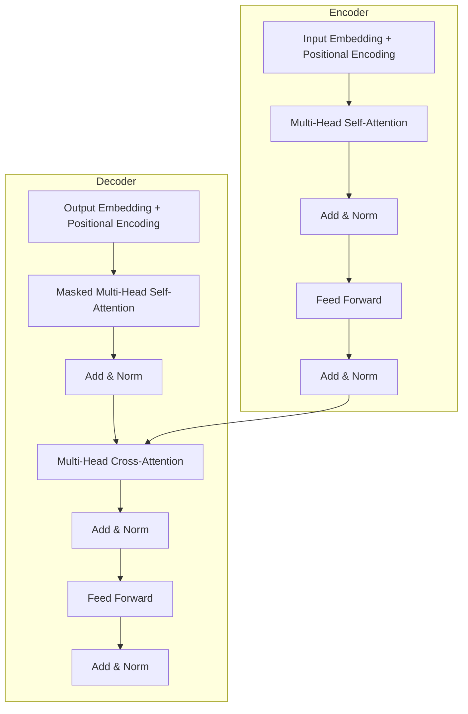
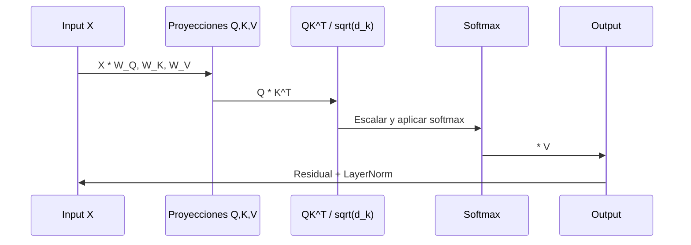

# ⚡ 01 - Arquitectura Transformer

La arquitectura Transformer, introducida por Vaswani et al. en "Attention Is All You Need" (2017), revolucionó el procesamiento de lenguaje natural al eliminar la dependencia de las redes recurrentes (RNNs) y reemplazarlas por mecanismos de atención masivamente paralelizables. Para un ML/AI Engineer, dominar esta arquitectura es esencial porque constituye la base de GPT, BERT, T5 y prácticamente todos los LLMs modernos.

---

## 1. Motivación: Problemas de las RNNs

Las arquitecturas secuenciales tradicionales (RNN, LSTM, GRU) presentan limitaciones críticas para el escalamiento moderno:

| Problema | Descripción | Impacto en ML Engineering |
|----------|-------------|---------------------------|
| **Secuencialidad** | El cálculo del paso $t$ depende del paso $t-1$ | Imposibilidad de paralelización en GPUs/TPUs |
| **Gradiente desvaneciente** | Gradients atenuados en secuencias largas | Pérdida de dependencias a largo plazo |
| **Cuellos de botella** | El estado oculto debe condensar toda la historia | Capacidad limitada de memoria contextual |

Caso real: Google Translate migró su sistema de traducción de RNNs a Transformers en 2017, logrando una mejora de BLEU del 11% y reduciendo el tiempo de entrenamiento de semanas a días en TPU pods.

💡 **Tip**: En producción, la imposibilidad de paralelizar RNNs se traduce en throughput de inferencia 10x-100x menor que Transformers para secuencias largas.

---

## 2. Self-Attention: La Operación Fundamental

El mecanismo de self-attention permite que cada token de una secuencia interactúe directamente con todos los demás tokens para calcular una representación contextualizada.

### 2.1. Proyecciones Q, K, V

Dada una secuencia de embeddings de entrada $X \in \mathbb{R}^{n \times d_{model}}$, se proyectan tres matrices:

$$Q = X W_Q, \quad K = X W_K, \quad V = X W_V$$

Donde $W_Q, W_K \in \mathbb{R}^{d_{model} \times d_k}$ y $W_V \in \mathbb{R}^{d_{model} \times d_v}$.

### 2.2. Fórmula de Atención Escalada

$$\text{Attention}(Q, K, V) = \text{softmax}\left(\frac{QK^T}{\sqrt{d_k}}\right)V$$

Donde:
- $QK^T \in \mathbb{R}^{n \times n}$ es la matriz de puntuaciones de compatibilidad.
- $\sqrt{d_k}$ es el factor de escalamiento que evita que los valores de softmax caigan en regiones de gradiente casi nulo cuando $d_k$ es grande.

⚠️ **Advertencia**: Olvidar el factor $\sqrt{d_k}$ es un error común en implementaciones desde cero. Sin él, el entrenamiento diverge para dimensionalidades altas ($d_k \geq 64$).


---

## 3. Multi-Head Attention

En lugar de calcular una única función de atención, los Transformers proyectan $h$ cabezales en paralelo, permitiendo que el modelo atienda a información de distintos subespacios.

$$\text{MultiHead}(Q, K, V) = \text{Concat}(\text{head}_1, ..., \text{head}_h)W_O$$

Donde cada cabezal se computa como:

$$\text{head}_i = \text{Attention}(QW_i^Q, KW_i^K, VW_i^V)$$

Tipicamente:
- $h = 8$ o $16$ cabezales
- $d_k = d_v = d_{model} / h$
- $W_O \in \mathbb{R}^{h d_v \times d_{model}}$

Caso real: BERT-base usa 12 cabezales de atención con $d_{model} = 768$, mientras que GPT-3 usa 96 cabezales con $d_{model} = 12288$. El aumento de cabezales mejora la capacidad de capturar patrones sintácticos y semánticos diversos.

💡 **Tip**: En modelos de código como CodeBERT, ciertos cabezales especializan en atender a relaciones de indentación y bloques, un patrón emergente descubierto mediante análisis de atención.

---

## 4. Positional Encoding

Dado que self-attention es permutación-invariante (no distingue orden intrínsecamente), los Transformers inyectan información posicional mediante codificaciones sinusoidales:

$$PE_{(pos, 2i)} = \sin\left(\frac{pos}{10000^{2i/d_{model}}}\right)$$

$$PE_{(pos, 2i+1)} = \cos\left(\frac{pos}{10000^{2i/d_{model}}}\right)$$

Estas funciones permiten que el modelo aprenda a atender posiciones relativas mediante identidades trigonométricas, y generalizan a secuencias más largas que las vistas durante el entrenamiento.

Modelos modernos como GPT y BERT utilizan **positional embeddings aprendidas** en lugar de las sinusoidales, aunque las codificaciones sinusoidales siguen siendo comunes en arquitecturas encoder-decoder como el Transformer original.

---

## 5. Arquitectura Encoder-Decoder

El Transformer original consta de dos stacks:



### 5.1. Encoder

- Stack de $N$ capas idénticas (típicamente $N=6$ o $12$).
- Cada capa tiene: multi-head self-attention + feed-forward network.
- Aplicable a modelos de comprensión como BERT.

### 5.2. Decoder

- Stack de $N$ capas idénticas.
- Incluye **masked self-attention** para prevenir que el token $i$ atienda a tokens $j > i$ (preservando causalidad).
- Incluye **cross-attention** sobre la salida del encoder.
- Aplicable a modelos generativos como GPT y T5.

---

## 6. Layer Normalization y Feed-Forward Networks

### 6.1. Layer Normalization

$$\text{LayerNorm}(x) = \gamma \odot \frac{x - \mu}{\sqrt{\sigma^2 + \epsilon}} + \beta$$

Normaliza a lo largo de la dimensión de características por cada muestra, estabilizando el entrenamiento de redes muy profundas. Los Transformers aplican "pre-norm" (LayerNorm antes de los subbloques) en arquitecturas modernas como GPT-3 y LLaMA, en contraste con el "post-norm" del paper original.

⚠️ **Advertencia**: El orden de LayerNorm (pre vs. post) afecta drásticamente la estabilidad del entrenamiento a gran escala. GPT-3 y posteriores usan pre-norm para evitar gradient explosions.

### 6.2. Feed-Forward Network

$$\text{FFN}(x) = \max(0, xW_1 + b_1)W_2 + b_2$$

Cada capa contiene una FFN position-wise (aplicada independientemente a cada token) que expande la dimensionalidad típicamente por un factor de 4 ($d_{ff} = 4 \times d_{model}$) y luego la proyecta de vuelta. Esta no-linealidad puntual introduce capacidad expresiva adicional más allá de la atención lineal.

---

## 7. Comparativa RNN vs Transformer

| Característica | RNN/LSTM | Transformer |
|----------------|----------|-------------|
| **Paralelización** | No (secuencial) | Sí (operaciones matriciales) |
| **Rango de dependencias** | Corto-medio (gradiente desvaneciente) | Largo (conexiones directas) |
| **Complejidad por capa** | $O(n \cdot d^2)$ | $O(n^2 \cdot d)$ |
| **Memoria** | $O(d)$ por paso | $O(n^2)$ por capa (matriz de atención) |
| **Posición** | Implícita en el estado oculto | Explícita (positional encoding) |
| **Representativo** | Seq2Seq con attention | BERT, GPT, T5 |

⚠️ **Advertencia**: La complejidad cuadrática $O(n^2)$ del Transformer es su principal cuello de botella para secuencias muy largas. Esto motivó arquitecturas como Longformer, BigBird y FlashAttention.

---

## 8. Implementación desde Cero (PyTorch)

```python
import torch
import torch.nn as nn
import math

class ScaledDotProductAttention(nn.Module):
    def __init__(self, d_k):
        super().__init__()
        self.d_k = d_k
    
    def forward(self, Q, K, V, mask=None):
        scores = torch.matmul(Q, K.transpose(-2, -1)) / math.sqrt(self.d_k)
        if mask is not None:
            scores = scores.masked_fill(mask == 0, -1e9)
        attn = torch.softmax(scores, dim=-1)
        output = torch.matmul(attn, V)
        return output, attn

class MultiHeadAttention(nn.Module):
    def __init__(self, d_model, h):
        super().__init__()
        assert d_model % h == 0
        self.d_k = d_model // h
        self.h = h
        self.W_Q = nn.Linear(d_model, d_model)
        self.W_K = nn.Linear(d_model, d_model)
        self.W_V = nn.Linear(d_model, d_model)
        self.W_O = nn.Linear(d_model, d_model)
        self.attention = ScaledDotProductAttention(self.d_k)
    
    def forward(self, Q, K, V, mask=None):
        batch_size = Q.size(0)
        # (batch, seq, d_model) -> (batch, h, seq, d_k)
        Q = self.W_Q(Q).view(batch_size, -1, self.h, self.d_k).transpose(1, 2)
        K = self.W_K(K).view(batch_size, -1, self.h, self.d_k).transpose(1, 2)
        V = self.W_V(V).view(batch_size, -1, self.h, self.d_k).transpose(1, 2)
        
        x, attn = self.attention(Q, K, V, mask)
        # (batch, h, seq, d_k) -> (batch, seq, d_model)
        x = x.transpose(1, 2).contiguous().view(batch_size, -1, self.h * self.d_k)
        return self.W_O(x)
```

💡 **Tip**: En producción, nunca implementes attention desde cero si no es con fines educativos. Usa `torch.nn.functional.scaled_dot_product_attention` (PyTorch 2.0+) o FlashAttention para aprovechar kernels optimizados en GPU.

---

## 9. Diagrama de Flujo de Datos en Self-Attention



---

## 10. 📦 Código de Compresión

```python
# Bloque Transformer completo (pre-norm) listo para copiar
class TransformerBlock(nn.Module):
    def __init__(self, d_model, h, d_ff, dropout=0.1):
        super().__init__()
        self.norm1 = nn.LayerNorm(d_model)
        self.attn = MultiHeadAttention(d_model, h)
        self.dropout1 = nn.Dropout(dropout)
        self.norm2 = nn.LayerNorm(d_model)
        self.ffn = nn.Sequential(
            nn.Linear(d_model, d_ff),
            nn.ReLU(),
            nn.Linear(d_ff, d_model)
        )
        self.dropout2 = nn.Dropout(dropout)
    
    def forward(self, x, mask=None):
        # Pre-norm
        normed = self.norm1(x)
        x = x + self.dropout1(self.attn(normed, normed, normed, mask))
        x = x + self.dropout2(self.ffn(self.norm2(x)))
        return x
```

---

## 11. 🎯 Proyecto: Analizador de Cabezales de Atención

**Objetivo**: Implementar una herramienta que, dado un texto y un modelo BERT fine-tuned, visualice qué tokens atienden entre sí en cada cabezal de atención.

**Requisitos**:
1. Cargar un modelo BERT desde Hugging Face.
2. Extraer los pesos de atención de una capa específica.
3. Generar un heatmap de la matriz $n \times n$ para cada cabezal.
4. Identificar el cabezal con mayor atención sobre tokens de entidades nombradas.

**Entregables**:
- Script Python con visualización matplotlib/seaborn.
- Reporte de hallazgos: ¿Qué patrones sintácticos captura cada cabezal?
- Pipeline que reciba texto crudo y genere visualizaciones automáticamente.

**Extensión**: Adaptar el análisis a un modelo multilingüe (mBERT) y comparar los patrones de atención en español vs. inglés.

---

## Enlaces Rápidos

- [[00 - Bienvenida]]
- [[02 - Tokenizacion y Embeddings]]
