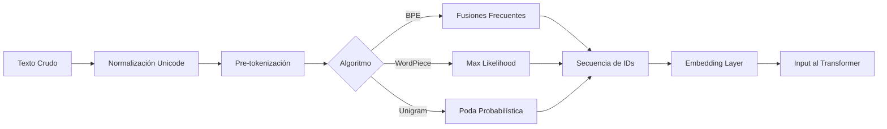

# 🔤 02 - Tokenizacion y Embeddings

Antes de que un Transformer procese texto, este debe convertirse en números. La tokenización y los embeddings son los puentes fundamentales entre el lenguaje humano y la computación matricial. Para un ML/AI Engineer, comprender las sutilezas de esta etapa es crítico: una mala tokenización introduce sesgos de vocabulario, aumenta la memoria y degrada el rendimiento en idiomas morfológicamente ricos como el español o el alemán.

---

## 1. Fundamentos de la Tokenización

La tokenización es el proceso de dividir texto en unidades discretas llamadas **tokens**. Los enfoques principales son:

| Enfoque | Ejemplo | Pros | Contras |
|---------|---------|------|---------|
| **Word-level** | "hola" -> `[hola]` | Intuitivo, semántico claro | OOV masivo, vocabularios enormes |
| **Character-level** | "hola" -> `[h, o, l, a]` | Sin OOV, vocabulario mínimo | Secuencias muy largas, sin semántica local |
| **Subword-level** | "tokenización" -> `[token, ##ización]` | Balance OOV/tamaño, semántica composicional | Complejidad algorítmica, dependencia del corpus |

Caso real: GPT-2 fue entrenado con BPE sobre 40GB de texto WebText, resultando en un vocabulario de 50,257 tokens. Este tamaño de vocabulario fue un compromiso deliberado entre cobertura de idioma y eficiencia de memoria en GPU.

⚠️ **Advertencia**: Los modelos multilingües como mBERT sufren de "tokenización injusta": una palabra en inglés promedia 1.3 tokens, mientras que en tailandés o japonés puede requerir 5-10 tokens, degradando la representación del idioma.

---

## 2. Algoritmos de Tokenización Subword

### 2.1. Byte Pair Encoding (BPE)

BPE comienza con un vocabulario de caracteres y fusiona iterativamente los pares más frecuentes.

**Algoritmo**:
1. Inicializar vocabulario con caracteres únicos del corpus.
2. Repetir $k$ veces:
   - Encontrar el par de tokens adyacentes $(a, b)$ con mayor frecuencia.
   - Añadir $ab$ al vocabulario.
   - Reemplazar todas las ocurrencias de $(a, b)$ con $ab$.

```python
import collections

def get_stats(vocab):
    pairs = collections.defaultdict(int)
    for word, freq in vocab.items():
        symbols = word.split()
        for i in range(len(symbols) - 1):
            pairs[(symbols[i], symbols[i+1])] += freq
    return pairs

def merge_vocab(pair, vocab):
    bigram = re.escape(' '.join(pair))
    pattern = re.compile(r'(?<!\S)' + bigram + r'(?!\S)')
    new_vocab = {}
    for word in vocab:
        new_word = pattern.sub(''.join(pair), word)
        new_vocab[new_word] = vocab[word]
    return new_vocab
```

💡 **Tip**: BPE es **greedy** y no garantiza la segmentación óptima global. Modelos como GPT-2 y RoBERTa utilizan variantes de BPE con pre-tokenización basada en expresiones regulares.

### 2.2. WordPiece

Desarrollado por Google para BERT. Similar a BPE pero selecciona el par que maximiza la verosimilitud del corpus de entrenamiento en lugar de la frecuencia bruta.

$$\text{score}(a, b) = \frac{\text{count}(a, b)}{\text{count}(a) \times \text{count}(b)}$$

WordPiece introduce el token especial `##` para indicar subpalabras no iniciales: `tokenization` -> `[token, ##ization]`.

### 2.3. SentencePiece y Unigram

**SentencePiece** (Kudo & Richardson, 2018) trata el texto como una secuencia de caracteres sin pre-tokenización previa (espacios incluidos como caracteres normales). Es ideal para idiomas sin separación de palabras (chino, japonés).

**Unigram Language Model** (usado en ALBERT, T5, XLNet) parte de un vocabulario grande y lo **poda** eliminando tokens que minimizan la pérdida de verosimilitud:

$$L = -\sum_{s \in \mathcal{D}} \log P(s)$$

Donde $P(s)$ se calcula como la suma sobre todas las posibles segmentaciones del sentence $s$.

| Algoritmo | Modelos representativos | Característica distintiva |
|-----------|------------------------|---------------------------|
| BPE | GPT-2, RoBERTa | Fusión por frecuencia |
| WordPiece | BERT, DistilBERT | Maximización de likelihood |
| SentencePiece | XLNet, ALBERT, T5 | Language-agnostic, sin pre-tokenización |
| Unigram | ALBERT, T5 | Poda desde vocabulario grande |

---

## 3. Embeddings de Palabras

### 3.1. Word2Vec y GloVe

Antes de los Transformers, los embeddings estáticos dominaban el NLP:

**Word2Vec Skip-gram** maximiza:

$$\frac{1}{T} \sum_{t=1}^{T} \sum_{-c \leq j \leq c, j \neq 0} \log P(w_{t+j} \mid w_t)$$

Donde:

$$P(w_O \mid w_I) = \frac{\exp(v_{w_O}'^T v_{w_I})}{\sum_{w=1}^{W} \exp(v_w'^T v_{w_I})}$$

**GloVe** (Global Vectors) combina conteo global con predicción local:

$$J = \sum_{i,j=1}^{V} f(X_{ij})(w_i^T \tilde{w}_j + b_i + \tilde{b}_j - \log X_{ij})^2$$

Caso real: Google News Word2Vec (300d, 3 millones de palabras) fue el estándar de facto durante 2013-2017 y aún se usa como baseline en tareas de bajo recurso.


### 3.2. Limitaciones de Embeddings Estáticos

- **Polisemia**: "banco" (financiero vs. sentarse) tiene un único vector.
- **OOV**: Palabras fuera del vocabulario no tienen representación.
- **Contexto**: No adaptan la representación según la oración.

Los **contextual embeddings** de BERT/GPT resuelven estas limitaciones generando vectores dinámicos por token según su contexto.

---

## 4. Embeddings en Transformers

### 4.1. Input Embeddings

Los Transformers combinan tres tipos de embeddings:

$$\text{Input} = \text{TokenEmbedding} + \text{PositionalEmbedding} + \text{SegmentEmbedding}$$

- **Token Embedding**: Mapeo del token ID a $d_{model}$.
- **Positional Embedding**: Información de posición (aprendida o sinusoidal).
- **Segment Embedding**: Distingue frases A y B (usado en BERT para NSP).

### 4.2. Positional Embeddings Modernos

Los modelos recientes (GPT, LLaMA) utilizan **positional embeddings aprendidos** o **RoPE (Rotary Position Embedding)**:

$$f(q, m) = q e^{i m \theta}$$

RoPE codifica la posición absoluta mediante rotaciones complejas en el espacio de embeddings, preservando propiedades de distancia relativa y siendo especialmente eficiente en atención.

⚠️ **Advertencia**: Los modelos con positional embeddings aprendidos tienen una **longitud máxima de contexto fija** durante el entrenamiento. Extenderla posteriormente (como en LLaMA con extrapolación) requiere técnicas especiales de fine-tuning.

---

## 5. Manejo de OOV y Vocabularios Modernos

### 5.1. Subword para OOV

La tokenización subword mitiga OOV descomponiendo palabras raras:

- "supercalifragilisticexpialidocious" -> `[super, ##cal, ##ifragil, ##istic, ##expial, ##idocious]`
- "COVID-19" -> `[CO, ##VID, ##-, ##19]`

### 5.2. Vocabularios de Modelos Modernos

| Modelo | Tokenizador | Tamaño Vocabulario | Notas |
|--------|-------------|--------------------|-------|
| BERT | WordPiece | 30,522 | Case/cased variants |
| GPT-2 | BPE | 50,257 | Regex pre-tokenization |
| T5 | SentencePiece | 32,000 | Language-agnostic |
| LLaMA 2 | BPE (SentencePiece) | 32,000 | Multilingüe mejorado |
| GPT-4 | BPE | ~100,000 | No público |

Caso real: Anthropic descubrió que el tokenizer de Claude tendía a fragmentar código Python de manera subóptima, aumentando la longitud de secuencia y costos de inferencia. Refinaron su tokenizer específicamente sobre corpus de código para reducir tokens por archivo en un 15%.

💡 **Tip**: Antes de fine-tunear un modelo en un dominio específico (legal, médico, código), analiza la tasa de tokens desconocidos o altamente fragmentados. Considera extender el vocabulario si es crítico.

---

## 6. Diagrama del Pipeline de Tokenización



---

## 7. Implementación Práctica con Hugging Face

```python
from transformers import AutoTokenizer, AutoModel

# Tokenización con BERT (WordPiece)
tokenizer = AutoTokenizer.from_pretrained("bert-base-uncased")
text = "Tokenization is fundamental for LLMs."
encoded = tokenizer(text, return_tensors="pt")
print(encoded["input_ids"])  # [101, 19204, 4476, 2003, 5317, 2005, 19965, 2860, 1012, 102]

# Decodificación
print(tokenizer.decode(encoded["input_ids"][0]))
# [CLS] tokenization is fundamental for ll ##ms. [SEP]

# GPT-2 (BPE) - notar diferencia en segmentación
gpt2_tokenizer = AutoTokenizer.from_pretrained("gpt2")
print(gpt2_tokenizer.tokenize(text))
# ['Token', 'ization', ' is', ' fundamental', ' for', ' LL', 'Ms', '.']
```

⚠️ **Advertencia**: Nunca mezcles tokenizadores entre modelos. Un tokenizer de BERT no es compatible con GPT-2 porque mapea strings a IDs de manera diferente. `AutoTokenizer.from_pretrained` siempre debe usar el checkpoint correcto.

---

## 8. 📦 Código de Compresión

```python
# Script completo: análisis comparativo de tokenizadores
from transformers import AutoTokenizer

def compare_tokenizers(text, models):
    results = {}
    for name, checkpoint in models.items():
        tok = AutoTokenizer.from_pretrained(checkpoint)
        tokens = tok.tokenize(text)
        results[name] = {
            "tokens": tokens,
            "count": len(tokens),
            "ids": tok.convert_tokens_to_ids(tokens)
        }
    return results

models = {
    "BERT": "bert-base-uncased",
    "GPT-2": "gpt2",
    "T5": "t5-small"
}

# Uso
# result = compare_tokenizers("Antidisestablishmentarianism", models)
# for k, v in result.items(): print(f"{k}: {v['count']} tokens")
```

---

## 9. 🎯 Proyecto: Tokenizador de Dominio Específico

**Objetivo**: Construir un tokenizador BPE personalizado para un corpus técnico (ej. documentación médica o legal en español) y comparar su eficiencia contra tokenizadores preentrenados.

**Requisitos**:
1. Recopilar un corpus de dominio de al menos 10MB.
2. Entrenar un tokenizador BPE desde cero usando `tokenizers` de Hugging Face.
3. Comparar métricas:
   - Tokens por documento (menor es mejor).
   - Tasa de token `<unk>` (debe ser 0%).
   - Frecuencia de tokens de dominio (ej. nombres de fármacos, términos legales).
4. Fine-tunear un modelo pequeño (DistilBERT) con el tokenizador custom y evaluar en una tarea downstream.

**Entregables**:
- Notebook con entrenamiento del tokenizador.
- Tabla comparativa de eficiencia vs. tokenizador base.
- Modelo fine-tuned con métricas de validación.

**Extensión**: Implementar un tokenizador multilingüe que maneje código-switching español-inglés de manera eficiente.

---

## Enlaces Rápidos

- [[01 - Arquitectura Transformer]]
- [[03 - Pretraining y Self-Supervised Learning]]
