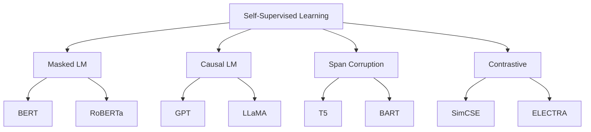

# 🏗️ 03 - Pretraining y Self-Supervised Learning

El pretraining es la fase más crítica y costosa en el ciclo de vida de un LLM. Durante esta etapa, un modelo aprende representaciones universales del lenguaje a partir de corpus masivos de texto sin etiquetar, mediante objetivos de self-supervisión. Para un ML/AI Engineer, comprender estos objetivos es esencial para decidir qué modelo base utilizar, cómo diseñar tareas de fine-tuning y cómo estimar recursos computacionales.

---

## 1. Fundamentos del Self-Supervised Learning

El self-supervised learning (SSL) en NLP consiste en construir tareas de predicción a partir de la estructura intrínseca del texto, eliminando la necesidad de anotaciones humanas. La idea central es que la estructura del lenguaje contiene suficiente señal para aprender representaciones semánticas y sintácticas profundas.

**Ventajas para ML Engineering**:
- Escalabilidad ilimitada: cualquier texto es datos de entrenamiento.
- Transferencia universal: conocimiento lingüístico general aplicable a downstream tasks.
- Eficiencia de etiquetado: reduce la necesidad de datasets anotados en fine-tuning.

Caso real: GPT-3 (175B parámetros) fue entrenado sobre ~300B tokens de texto web filtrado (Common Crawl, WebText, libros, Wikipedia). Este pretraining costó aproximadamente 3.14e23 FLOPs y requirió miles de GPUs V100 durante semanas. La inversión se justifica porque el mismo modelo base puede adaptarse a cientos de tareas con few-shot prompting.

---

## 2. Masked Language Modeling (MLM)

Introducido por BERT (Devlin et al., 2018), MLM consiste en enmascarar aleatoriamente tokens de la entrada y predecirlos a partir del contexto bidireccional.

### 2.1. Objetivo Matemático

Dada una secuencia $X = [x_1, ..., x_n]$ y un conjunto de posiciones enmascaradas $\mathcal{M}$:

$$\mathcal{L}_{\text{MLM}} = -\mathbb{E}_{x \sim \mathcal{D}} \sum_{i \in \mathcal{M}} \log P(x_i \mid X_{\setminus \mathcal{M}})$$

Donde $X_{\setminus \mathcal{M}}$ es la secuencia con tokens enmascarados y $P(x_i)$ se calcula mediante una proyección softmax sobre el vocabulario:

$$P(x_i = w) = \frac{\exp(h_i^T E_w)}{\sum_{w' \in \mathcal{V}} \exp(h_i^T E_{w'})}$$

Donde $h_i$ es el estado oculto final del token enmascarado y $E_w$ es el embedding de salida para la palabra $w$.

### 2.2. Estrategia de Enmascaramiento

BERT emplea la siguiente estrategia para el 15% de los tokens seleccionados:
- 80% se reemplazan por `[MASK]`.
- 10% se reemplazan por un token aleatorio.
- 10% permanecen sin cambios.

⚠️ **Advertencia**: Esta estrategia introduce un desajuste entre pretraining y fine-tuning, ya que durante fine-tuning no aparecen tokens `[MASK]`. RoBERTa eliminó el NSP y ajustó las tasas de enmascaramiento, mejorando consistentemente sobre BERT.

---

## 3. Causal Language Modeling (CLM)

Utilizado por GPT y modelos autoregresivos, CLM predice el siguiente token condicionado únicamente en los tokens anteriores (causalidad).

### 3.1. Objetivo Matemático

$$\mathcal{L}_{\text{CLM}} = -\sum_{t=1}^{T} \log P(x_t \mid x_1, ..., x_{t-1})$$

La restricción causal se implementa mediante una **máscara triangular inferior** en la matriz de atención:

$$M_{ij} = \begin{cases} 0 & \text{si } j > i \\ 1 & \text{si } j \leq i \end{cases}$$

La atención se computa como:

$$\text{Attention}(Q, K, V) = \text{softmax}\left(\frac{QK^T}{\sqrt{d_k}} + M\right)V$$

Donde $M$ contiene $-\infty$ en posiciones superiores para forzar probabilidad cero post-softmax.

💡 **Tip**: La naturaleza causal de GPT permite generación de texto token por token, pero impide el uso de información futura durante pretraining. Esto hace que CLM sea conceptualmente más débil que MLM para tareas de comprensión, pero más versátil para generación.

---

## 4. Next Sentence Prediction (NSP) y Span Corruption

### 4.1. NSP (BERT)

Objetivo binario auxiliar: ¿La oración B sigue a la oración A?

$$\mathcal{L}_{\text{NSP}} = -\left[ y \log \hat{y} + (1-y) \log(1-\hat{y}) \right]$$

RoBERTa demostró que NSP aporta poco o nada al rendimiento, eliminándolo por completo. ALBERT lo reemplazó por Sentence Order Prediction (SOP), que predice si dos segmentos consecutivos están invertidos, resultando en señal más robusta.

### 4.2. Span Corruption (T5)

T5 reformula todas las tareas de NLP como problemas text-to-text, incluyendo el pretraining. En span corruption:

- Se seleccionan spans aleatorios de tokens.
- Cada span se reemplaza por un único token sentinel (`<extra_id_0>`).
- El objetivo es regenerar los spans originales.

**Ejemplo**:
- Input: `Thank you <extra_id_0> me to your party <extra_id_1> week.`
- Target: `<extra_id_0> for inviting <extra_id_1> last <extra_id_2>`

---

## 5. Contrastive Learning y Objetivos Modernos

### 5.1. SimCSE

SimCSE utiliza dropout como augmentación para aprender embeddings de oraciones mediante contraste:

$$\ell_i = -\log \frac{e^{\text{sim}(h_i, h_i^+) / \tau}}{\sum_{j=0}^{N} e^{\text{sim}(h_i, h_j^+) / \tau}}$$

Donde $h_i$ y $h_i^+$ son dos forward passes de la misma oración con dropout diferente, y $\tau$ es la temperatura.

### 5.2. Mixture of Denoisers (UL2)

UL2 propone una mezcla de objetivos de denoising (MLM, prefix LM, span corruption) entrenados simultáneamente, permitiendo que un mismo modelo se comporte como encoder o decoder según el prompt.

---

## 6. Datasets de Pretraining

| Dataset | Tamaño | Descripción | Usado en |
|---------|--------|-------------|----------|
| **C4** | ~156B tokens | Common Crawl filtrado | T5, UL2, PaLM |
| **The Pile** | 825GB (~300B tokens) | Corpus diversificado (académico, web, código, libros) | GPT-J, GPT-Neo |
| **WebText** | 40GB | Reddit outbound links con >3 karma | GPT-2 |
| **BooksCorpus** | ~5GB | Libros de ficcién/no ficción | BERT, RoBERTa |
| **ROOTS** | 1.6TB | Multilingüe, 46 idiomas | BLOOM |

Caso real: La construcción de The Pile fue un esfuerzo comunitario deliberado para reducir el sesgo hacia texto web de baja calidad. Incluye PubMed, ArXiv, GitHub, y proyectos de derecho, mejorando drásticamente el rendimiento de los modelos en tareas científicas y de razonamiento.

⚠️ **Advertencia**: Los datasets de pretraining contienen sesgos sociales, desinformación y contenido tóxico. La calidad del filtrado determina el comportamiento ético del modelo final. GPT-3 requirió múltiples etapas de filtrado basado en clasificadores de calidad para eliminar contenido de bajo valor.

---

## 7. Requerimientos Computacionales

El costo de pretraining se mide en FLOPs (operaciones de punto flotante). La regla empírica para un modelo decoder-only es:

$$\text{FLOPs} \approx 6 \times N \times D$$

Donde $N$ es el número de parámetros y $D$ es el número total de tokens de entrenamiento.

| Modelo | Parámetros | Tokens | FLOPs | Hardware | Tiempo |
|--------|-----------|--------|-------|----------|--------|
| GPT-3 | 175B | 300B | 3.14e23 | 10K V100 | ~1 mes |
| LLaMA 2 | 70B | 2T | 8.4e23 | A100 (commodity) | ~6 meses |
| PaLM | 540B | 780B | 2.53e24 | 6144 TPUv4 | ~2 meses |

💡 **Tip**: Para proyectos de fine-tuning, el costo computacional es 100x-1000x menor. Un modelo de 7B parámetros puede fine-tunearse en una sola GPU A100 de 80GB con QLoRA en horas, no semanas.

---

## 8. Implementación de MLM y CLM en PyTorch

```python
import torch
import torch.nn as nn
from transformers import BertTokenizer, BertForMaskedLM

# MLM: Predicción de token enmascarado
tokenizer = BertTokenizer.from_pretrained('bert-base-uncased')
model = BertForMaskedLM.from_pretrained('bert-base-uncased')

text = "The capital of France is [MASK]."
inputs = tokenizer(text, return_tensors="pt")
outputs = model(**inputs)
predictions = outputs.logits

# Obtener el token más probable para [MASK]
mask_token_index = (inputs.input_ids == tokenizer.mask_token_id).nonzero(as_tuple=True)
predicted_token_id = predictions[mask_token_index].argmax(dim=-1)
print(tokenizer.decode(predicted_token_id))  # "paris"

# CLM: Generación autoregresiva simple
from transformers import GPT2LMHeadModel, GPT2Tokenizer
gpt2 = GPT2LMHeadModel.from_pretrained("gpt2")
gpt2_tokenizer = GPT2Tokenizer.from_pretrained("gpt2")

input_ids = gpt2_tokenizer.encode("In machine learning,", return_tensors="pt")
output = gpt2.generate(input_ids, max_length=20, do_sample=True, temperature=0.8)
print(gpt2_tokenizer.decode(output[0], skip_special_tokens=True))
```

---

## 9. Diagrama de Objetivos de Pretraining



---

## 10. 📦 Código de Compresión

```python
# Entrenamiento MLM desde coche (esqueleto completo)
from torch.utils.data import DataLoader
from transformers import BertConfig, BertForMaskedLM, DataCollatorForLanguageModeling

config = BertConfig(vocab_size=30522, hidden_size=768, num_hidden_layers=12)
model = BertForMaskedLM(config)

data_collator = DataCollatorForLanguageModeling(
    tokenizer=tokenizer, mlm=True, mlm_probability=0.15
)

# Suponiendo 'dataset' es un Dataset de Hugging Face
# dataloader = DataLoader(dataset, batch_size=16, collate_fn=data_collator)
# optim = torch.optim.AdamW(model.parameters(), lr=5e-5)
# for batch in dataloader:
#     outputs = model(**batch)
#     loss = outputs.loss
#     loss.backward(); optim.step(); optim.zero_grad()
```

---

## 11. 🎯 Proyecto: Pretraining de Domain-Adaptive MLM

**Objetivo**: Realizar continual pretraining de un modelo BERT base (110M parámetros) sobre un corpus técnico en español (ej. Wikipedia médica o legal) para mejorar rendimiento en extracción de entidades nombradas (NER).

**Requisitos**:
1. Recopilar y limpiar corpus de dominio (≥100MB).
2. Implementar pipeline de MLM usando Hugging Face `Trainer`.
3. Entrenar por 1-3 epochs con learning rate 2e-5.
4. Evaluar en NER downstream (CONLL-NER o dataset propio) comparando:
   - BERT base sin pretraining adicional.
   - BERT continual-pretrained en dominio.
   - Fine-tuning directo sin MLM intermedio.

**Métricas**:
- Perplexity en held-out set del dominio.
- F1-score en NER downstream.
- Comparativa de convergencia (epochs necesarios).

**Entregables**:
- Notebook de entrenamiento MLM.
- Gráfica de loss vs. epoch.
- Tabla comparativa de F1 antes/después de domain-adaptive pretraining.

---

## Enlaces Rápidos

- [[02 - Tokenizacion y Embeddings]]
- [[04 - Scaling Laws y Emergencia]]
