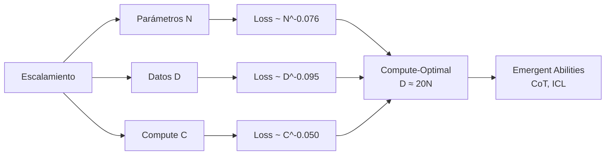

# 📈 04 - Scaling Laws y Emergencia

Una de las descubrimientos más impactantes en el campo de los LLMs es que el rendimiento de estos modelos sigue leyes de potencia predecibles con respecto a su escala. Comprender estas leyes permite a un ML/AI Engineer estimar recursos, decidir arquitecturas y anticipar capacidades que emergen solo a gran escala.

---

## 1. Fundamentos de las Scaling Laws

Las scaling laws describen matemáticamente cómo la pérdida de un modelo de lenguaje $L$ varía en función de tres factores principales:

- $N$: Número de parámetros del modelo (no incluyendo embeddings).
- $D$: Tamaño del dataset de entrenamiento (en tokens).
- $C$: Compute total de entrenamiento (en FLOPs).

### 1.1. Leyes de Kaplan et al. (OpenAI, 2020)

El paper seminal *Scaling Laws for Neural Language Models* demostró relaciones de potencia:

$$L(N) = \left(\frac{N_c}{N}\right)^{\alpha_N}$$

$$L(D) = \left(\frac{D_c}{D}\right)^{\alpha_D}$$

$$L(C) = \left(\frac{C_c}{C}\right)^{\alpha_C}$$

Donde:
- $\alpha_N \approx 0.076$
- $\alpha_D \approx 0.095$
- $\alpha_C \approx 0.050$

Esto implica que la pérdida disminuye de manera predecible al aumentar cualquiera de estos factores, siempre que los otros no sean cuellos de botella.

Caso real: Los experimentos de Kaplan utilizaron modelos de hasta 1.5B parámetros entrenados en hasta 23B tokens. Aunque la escala era modesta comparada con GPT-3, las predicciones extrapolaron con sorprendente precisión a modelos de 100x tamaño.

---

## 2. Relaciones Matemáticas Detalladas

### 2.1. Loss vs. Parámetros

Al mantener fijos datos y compute, la pérdida decrece con el número de parámetros:

$$L(N) \propto N^{-0.076}$$

Un aumento de 10x en parámetros reduce la loss aproximadamente un 15-20%.

### 2.2. Loss vs. Datos

Al mantener fijos parámetros y compute:

$$L(D) \propto D^{-0.095}$$

La dependencia con los datos es más fuerte que con los parámetros. Esto sugiere que duplicar el dataset tiene un impacto mayor que duplicar parámetros, ceteris paribus.

### 2.3. Loss vs. Compute

Al optimizar tanto modelo como datos para un compute dado:

$$L(C) \propto C^{-0.050}$$

La pérdida decrece lentamente con el compute total, lo que implica que mejorar requiere inversiones masivas en hardware.

### 2.4. Ley de Potencia Combinada (Chinchilla)

DeepMind propuso en el paper *Training Compute-Optimal Large Language Models* (2022) una ley unificada:

$$L(N, D) = E + \frac{A}{N^\alpha} + \frac{B}{D^\beta}$$

Donde:
- $E$ es la pérdida irreducible (entropía del lenguaje natural).
- $A, B, \alpha, \beta$ son constantes ajustadas empíricamente.
- Para Chinchilla: $\alpha \approx 0.34$, $\beta \approx 0.28$.

⚠️ **Advertencia**: Las constantes exactas varían según la arquitectura, tokenizer y calidad de datos. No utilices estas fórmulas para presupuestos de hardware sin márgenes de seguridad de al menos 2x.

---

## 3. Entrenamiento Compute-Optimal

### 3.1. La Tesis de Chinchilla

DeepMind descubrió que GPT-3 y modelos contemporáneos estaban **subentrenados**: utilizaban demasiados parámetros para la cantidad de tokens de entrenamiento. La regla compute-optimal según Chinchilla es:

$$D_{\text{optimal}} \approx 20 \times N$$

Esto significa que por cada parámetro del modelo, se deben usar aproximadamente 20 tokens de entrenamiento.

| Modelo | Parámetros | Tokens | Ratio D/N | ¿Compute-Optimal? |
|--------|-----------|--------|-----------|-------------------|
| GPT-3 | 175B | 300B | ~1.7 | No (subentrenado) |
| Gopher | 280B | 300B | ~1.1 | No (subentrenado) |
| Chinchilla | 70B | 1.4T | ~20 | Sí |
| LLaMA 2 | 70B | 2T | ~28 | Sí (sobreentrenado intencionalmente) |

💡 **Tip**: LLaMA 2 entrenó 70B parámetros con 2T tokens (ratio ~28), superando significativamente a modelos más grandes pero menos entrenados. La lección para ML Engineers: si tienes presupuesto limitado, prefieres un modelo más pequeño entrenado con más datos.

---

## 4. Emergent Abilities

Las **emergent abilities** son capacidades que un modelo no exhibe en escalas pequeñas pero que aparecen abruptamente al cruzar un umbral de escala. Este fenómeno fue documentado extensivamente por Wei et al. (2022) en Google Research.

### 4.1. Ejemplos de Habilidades Emergentes

| Habilidad | Descripción | Umbral típico |
|-----------|-------------|---------------|
| **Chain-of-Thought** | Razonamiento paso a paso en prompts | ~100B parámetros |
| **In-Context Learning** | Aprendizaje de tareas nuevas solo con ejemplos en el prompt | ~10B-100B |
| **Instrucción Following** | Seguimiento preciso de instrucciones complejas | ~100B |
| **Few-Shot Translation** | Traducción entre idiomas no vistas explícitamente | ~50B |

### 4.2. Críticas al Concepto de Emergencia

Schaeffer et al. (2023) argumentaron que la emergencia es en parte un **artefacto métrico**: al usar métricas no lineales (exact match, accuracy), pequeñas mejoras en probabilidad log-lineales se traducen en saltos aparentes. Con métricas suaves (token edit distance), las mejoras parecen más graduales.

⚠️ **Advertencia**: No asumas que un modelo de 1B parámetros "simplemente necesita escalar" para desarrollar chain-of-thought. La emergencia depende de la arquitectura, calidad de datos y tarea. Algunas habilidades pueden no emerger nunca en ciertas familias de modelos.

---

## 5. Over-Training y Under-Training

### 5.1. Under-Training

Ocurre cuando $D \ll 20N$. El modelo tiene capacidad paramétrica subutilizada. Síntomas:
- Alta capacidad de memorización pero baja generalización.
- Pérdida de validación mucho mayor que pérdida de entrenamiento.
- Rendimiento inferior a modelos más pequeños pero mejor entrenados.

### 5.2. Over-Training

Ocurre cuando $D \gg 20N$ o cuando se entrena más allá del punto de retornos decrecientes.

$$\frac{\partial L}{\partial C} \approx 0$$

Síntomas:
- Pérdida de entrenamiento continúa decreciendo pero validación se estanca.
- Mayor riesgo de memorización exacta del dataset (contaminación).
- Costo computacional desperdiciado.

Caso real: La serie LLaMA (Meta) adoptó una estrategia deliberada de "over-training" (ratios de 20-30x) para maximizar la calidad de modelos pequeños destinados a despliegue en hardware de consumo. Este trade-off de compute durante entrenamiento por eficiencia en inferencia es una decisión central de producto.

---

## 6. Implicaciones para ML Engineering

### 6.1. Estimación de Presupuestos

Para entrenar un modelo compute-optimal:

$$C \approx 6 \times N \times D = 6 \times N \times (20N) = 120N^2 \text{ FLOPs}$$

Ejemplo: Un modelo de 1B parámetros compute-optimal requiere:
- Tokens: 20B
- FLOPs: $1.2 \times 10^{20}$
- En A100 (312 TFLOP/s): ~400 GPU-horas (~$1000-$2000 en cloud)

### 6.2. Trade-offs de Inferencia

Un modelo más grande mejora quality pero aumenta costo de inferencia latencia y memoria. La regla empírica para throughput:

$$\text{Latency} \propto N \times \text{sequence_length}$$

💡 **Tip**: Para productos con millones de usuarios, un modelo de 7B bien entrenado (LLaMA-2-7B) frecuentemente supera en ROI a uno de 70B mal optimizado, debido a costos de inferencia 10x menores.

---

## 7. Diagrama de Scaling Laws



---

## 8. Implementación: Estimador de Recursos

```python
import math

def estimate_training_flops(params, tokens=None, chinchilla_ratio=20):
    """
    Estima FLOPs de entrenamiento.
    Si tokens es None, asume ratio de Chinchilla.
    """
    if tokens is None:
        tokens = params * chinchilla_ratio
    flops = 6 * params * tokens
    return flops, tokens

def estimate_loss(params, tokens, N_c=8.8e13, D_c=5.4e13, alpha=0.076, beta=0.095):
    """
    Estimación simplificada de loss basada en Kaplan/Chinchilla.
    """
    loss = (N_c / params) ** alpha + (D_c / tokens) ** beta
    return loss

# Ejemplo: Modelo de 1B parámetros, compute-optimal
params = 1e9
flops, tokens = estimate_training_flops(params)
print(f"Tokens: {tokens/1e9:.1f}B, FLOPs: {flops:.2e}")
print(f"Loss estimada: {estimate_loss(params, tokens):.4f}")
```

⚠️ **Advertencia**: Este estimador es una aproximación log-lineal. Para presupuestos reales, utiliza herramientas como `Transformer Math` de EleutherAI o los calculadores de MosaicML.

---

## 9. 📦 Código de Compresión

```python
# Calculador completo de scaling laws (Kaplan + Chinchilla)
class ScalingLawEstimator:
    def __init__(self, alpha=0.076, beta=0.095, gamma=0.050, E=1.69):
        self.alpha = alpha
        self.beta = beta
        self.gamma = gamma
        self.E = E  # irreducible loss
    
    def compute_optimal_tokens(self, params, ratio=20):
        return params * ratio
    
    def estimate_loss(self, params, tokens):
        return self.E + (params ** (-self.alpha)) + (tokens ** (-self.beta))
    
    def estimate_compute(self, params, tokens):
        return 6 * params * tokens
    
    def recommend_config(self, budget_flops):
        # Asumiendo D = 20N y C = 120 N^2
        N = math.sqrt(budget_flops / 120)
        D = 20 * N
        return N, D

# Uso
# est = ScalingLawEstimator()
# N, D = est.recommend_config(1e21)
# print(f"Params: {N/1e6:.0f}M, Tokens: {D/1e9:.0f}B")
```

---

## 10. 🎯 Proyecto: Auditoría de Compute-Optimality

**Objetivo**: Analizar un conjunto de modelos open-source (GPT-2, Pythia, LLaMA, Falcon) y determinar cuáles se acercan a la frontera compute-optimal según Chinchilla.

**Requisitos**:
1. Recopilar $N$ (parámetros) y $D$ (tokens reportados) para 5-10 modelos.
2. Graficar $L$ (perplexity reportada o estimada) vs. $C$ (compute).
3. Superponer la curva teórica $L(C) \propto C^{-0.050}$.
4. Identificar modelos subentrenados y sobreentrenados.
5. Proponer una configuración compute-optimal para un presupuesto de $10,000 en cloud computing (A100 horas).

**Entregables**:
- Notebook con gráficas log-log.
- Tabla de modelos auditados.
- Recomendación de arquitectura y dataset para el presupuesto dado.

---

## Enlaces Rápidos

- [[03 - Pretraining y Self-Supervised Learning]]
- [[05 - Evaluacion de LLMs]]
