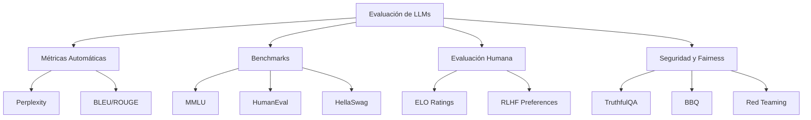

# 🧪 05 - Evaluacion de LLMs

Evaluar un LLM es significativamente más complejo que evaluar un clasificador tradicional. Los LLMs son sistemas generativos con comportamientos abiertos, lo que exige una combinación de métricas automáticas, benchmarks estandarizados, evaluación humana y auditorías de seguridad. Para un ML/AI Engineer, una evaluación rigurosa es la barrera entre un demo impresionante y un producto confiable.

---

## 1. Métricas Automáticas de Generación

### 1.1. Perplexity (PPL)

La perplexity mide qué tan bien un modelo de lenguaje predice una muestra de texto. Es la métrica fundamental de pretraining.

$$\text{PPL}(W) = \exp\left( -\frac{1}{N} \sum_{i=1}^{N} \log P(w_i \mid w_1 ... w_{i-1}) \right)$$

Interpretación: PPL representa el tamaño efectivo del vocabulario sobre el que el modelo está "perplejo". Una PPL de 100 implica que el modelo equivale a lanzar un dado de 100 caras para adivinar el siguiente token.

| Modelo | PPL en WikiText-103 |
|--------|---------------------|
| LSTM | ~40-50 |
| GPT-2 | ~18.3 |
| GPT-3 (175B) | ~10-12 |

⚠️ **Advertencia**: PPL correlaciona débilmente con utilidad en tareas downstream. Un modelo con PPL menor puede ser peor en razonamiento o instrucciones que uno con PPL mayor pero mejor alineado.

### 1.2. BLEU (Bilingual Evaluation Understudy)

Mide la calidad de texto generado comparando n-gramas con referencias humanas:

$$\text{BLEU} = \text{BP} \cdot \exp\left( \sum_{n=1}^{N} w_n \log p_n \right)$$

Donde $p_n$ es la precisión de n-gramas modificada y BP (brevity penalty) penaliza respuestas demasiado cortas.

💡 **Tip**: BLEU es eficaz para traducción pero pobre para diálogo abierto o resúmenes creativos. En chatbots, un modelo puede generar respuestas perfectamente válidas que obtienen BLEU cercano a cero porque no coinciden lexicalmente con la referencia.

### 1.3. ROUGE (Recall-Oriented Understudy for Gisting Evaluation)

ROUGE-N calcula el solapamiento de n-gramas entre generación y referencias, enfocado en recall:

$$\text{ROUGE-N} = \frac{\sum_{S \in \text{References}} \sum_{gram_n \in S} \text{Count}_{\text{match}}(gram_n)}{\sum_{S \in \text{References}} \sum_{gram_n \in S} \text{Count}(gram_n)}$$

ROUGE-L utiliza la subsecuencia común más larga (LCS) para capturar orden estructural sin exigir contigüidad exacta.

| Métrica | Foco | Mejor uso |
|---------|------|-----------|
| BLEU | Precisión n-gram | Traducción automática |
| ROUGE-N | Recall n-gram | Resumen extractivo |
| ROUGE-L | Subsecuencia común | Resumen abstractive |

### 1.4. METEOR

METEOR (Metric for Evaluation of Translation with Explicit ORdering) considera sinónimos, stemming y parafraseo:

$$\text{METEOR} = (1 - \text{Penalty}) \cdot \frac{10 \cdot P \cdot R}{R + 9P}$$

Es más robusta que BLEU para lenguas con morfología rica (español, alemán, ruso).

---

## 2. Benchmarks y Evaluación de Capacidades

### 2.1. GLUE y SuperGLUE

Colecciones de tareas de comprensión del lenguaje:
- **GLUE**: 9 tareas (sentiment, NLI, paraphrase, QA).
- **SuperGLUE**: Tareas más difíciles (QA multi-saltos, resolución de correferencia, inferencia lógica).

Puntuación: Media de accuracy/F1 sobre todas las tareas.

Caso real: SuperGLUE fue diseñado intencionalmente para ser difícil para humanos no expertos. Humanos alcanzan ~89 puntos; T5-11B alcanzó ~90, superando el benchmark y motivando la creación de evaluaciones aún más exigentes.

### 2.2. MMLU (Massive Multitask Language Understanding)

Benchmark de 57 disciplinas (matemáticas, historia, derecho, medicina, ingeniería). Las preguntas son de opción múltiple.

$$\text{Accuracy} = \frac{\text{respuestas correctas}}{\text{total}}$$

| Modelo | MMLU |
|--------|------|
| GPT-3 (175B) | 43.9% |
| Chinchilla (70B) | 67.5% |
| GPT-4 | 86.4% |
| Humano (promedio) | ~89% |

⚠️ **Advertencia**: MMLU contiene contaminación de datos: algunas preguntas aparecen en datasets de pretraining. Evalúa siempre en splits held-out o benchmarks recientes como MMLU-Pro.

### 2.3. HumanEval y Code Evaluation

HumanEval (OpenAI, 2021) contiene 164 problemas de programación en Python. La métrica es **pass@k**: la probabilidad de que al menos una de $k$ muestras pase todos los tests unitarios.

$$\text{pass@k} = \mathbb{E}_{\text{Problems}} \left[ 1 - \frac{\binom{n-c}{k}}{\binom{n}{k}} \right]$$

Donde $n$ es el número de muestras y $c$ es el número de muestras correctas.

Caso real: GitHub Copilot evalúa internamente con un superconjunto de HumanEval llamado GH-TestSet. Un aumento de pass@1 del 30% al 40% se tradujo en una reducción medible del tiempo de desarrollo en estudios de usuarios reales.

### 2.4. HellaSwag y Razonamiento

HellaSwag evalua common-sense reasoning: dado un contexto, seleccionar la continuación más plausible entre 4 opciones.

$$\text{Accuracy} = \frac{1}{N} \sum_{i=1}^{N} \mathbb{1}[\arg\max_j P(y_j \mid x_i) = y^*_i]$$

Los humanos alcanzan ~95%; los mejores LLMs superan los 90%, demostrando comprensión pragmática del mundo físico.

---

## 3. Evaluación Humana

Las métricas automáticas son insuficientes para capturar calidad subjetiva. La evaluación humana sigue siendo el gold standard.

### 3.1. Métodos

| Método | Descripción | Uso típico |
|--------|-------------|------------|
| **Likert Scale** | Puntuación 1-5 en fluidez, relevancia, factualidad | Chatbots, asistentes |
| **Pairwise Comparison** | ¿Cuál de dos respuestas es mejor? | Alineación RLHF |
| **ELO Rating** | Sistema de puntuación tipo ajedrez | Leaderboards (Chatbot Arena) |

### 3.2. RLHF y Evaluación de Preferencia

Reinforcement Learning from Human Feedback (RLHF) requiere evaluadores humanos que clasifiquen respuestas del modelo según criterios de utilidad y seguridad.

La función de recompensa se entrena como un modelo de preferencia Bradley-Terry:

$$P(y_w \succ y_l \mid x) = \sigma(r(x, y_w) - r(x, y_l))$$

Donde $r$ es el reward model y $\sigma$ es la función sigmoide.

💡 **Tip**: En producción, implementa sistemas de evaluación A/B con métricas de engagement (tiempo de sesión, tasa de completitud) como proxies de calidad subjetiva, complementando evaluaciones manuales periódicas.

---

## 4. Evaluación de Bias y Fairness

Los LLMs reproducen y amplifican sesgos presentes en datos de entrenamiento.

### 4.1. Métricas de Fairness

- **Stereoset**: Mide asociaciones estereotipadas entre atributos y grupos demográficos.
- **CrowS-Pairs**: Compara la probabilidad asignada a oraciones que refuerzan vs. contradicen estereotipos.
- **BBQ (Bias Benchmark for QA)**: Evalúa sesgos en respuestas de QA cuando el contexto es ambiguo.

### 4.2. Detección de Toxicidad

Se utilizan clasificadores automáticos (Perspective API, Detoxify) para medir la tasa de generación de contenido tóxico dado prompts adversariales.

$$\text{Toxicity Rate} = \frac{\text{generaciones clasificadas como tóxicas}}{\text{total generaciones}}$$

⚠️ **Advertencia**: Los filtros de toxicidad pueden introducir sesgos de sobre-moderación hacia dialectos minoritarios o discusiones legítimas sobre identidad. Evalúa siempre falsos positivos en subgrupos demográficos.

---

## 5. Evaluación de Seguridad y Riesgos

### 5.1. Red Teaming

Proceso sistemático de encontrar fallas en modelos mediante prompts diseñados para eludir salvaguardas.

Categorías de riesgo evaluadas:
- Generación de malware o instrucciones peligrosas.
- Desinformación y persuasión.
- Exfiltración de datos de entrenamiento (privacy).
- Jailbreaking mediante prompts adversariales.

### 5.2. Evaluación de Truthfulness

TruthfulQA mide si un modelo genera afirmaciones factualmente correctas en lugar de imitaciones plausibles pero falsas.

$$\text{Truthfulness} = \frac{\text{respuestas verificadas como verdaderas}}{\text{total}}$$

Caso real: Anthropic descubrió que Claude 2 generaba respuestas "halucinadas" en el 15% de consultas legales sobre jurisprudencia específica. Este hallazgo los llevó a implementar disclaimers sistemáticos y restricciones en dominios de alto riesgo.

---

## 6. Implementación de Evaluación Automática

```python
from evaluate import load
import torch
from transformers import AutoModelForCausalLM, AutoTokenizer

# Cargar métricas
bleu = load("bleu")
rouge = load("rouge")

predictions = ["El gato se sentó en la alfombra"]
references = [["El gato se sentó sobre la alfombra"]]

print(bleu.compute(predictions=predictions, references=references))
print(rouge.compute(predictions=predictions, references=references))

# Evaluación de perplexity
model = AutoModelForCausalLM.from_pretrained("gpt2")
tokenizer = AutoTokenizer.from_pretrained("gpt2")

encodings = tokenizer("El aprendizaje automático transforma industrias.", return_tensors="pt")
with torch.no_grad():
    outputs = model(**encodings, labels=encodings["input_ids"])
    ppl = torch.exp(outputs.loss)
print(f"Perplexity: {ppl.item():.2f}")
```

---

## 7. Diagrama del Ecosistema de Evaluación



---

## 8. 📦 Código de Compresión

```python
# Evaluador completo: PPL + BLEU + ROUGE en un batch
import evaluate
import numpy as np

def evaluate_model(model, tokenizer, texts, references):
    bleu = evaluate.load("bleu")
    rouge = evaluate.load("rouge")
    perplexities = []
    
    model.eval()
    for text in texts:
        enc = tokenizer(text, return_tensors="pt")
        with torch.no_grad():
            out = model(**enc, labels=enc["input_ids"])
        perplexities.append(torch.exp(out.loss).item())
    
    bleu_score = bleu.compute(predictions=texts, references=[[r] for r in references])
    rouge_score = rouge.compute(predictions=texts, references=references)
    
    return {
        "perplexity": np.mean(perplexities),
        "bleu": bleu_score["bleu"],
        "rougeL": rouge_score["rougeL"]
    }

# Uso
# results = evaluate_model(model, tokenizer, preds, refs)
# print(results)
```

---

## 9. 🎯 Proyecto: Benchmark Suite Custom

**Objetivo**: Diseñar y ejecutar una suite de evaluación para un LLM de 7B parámetros (ej. Mistral-7B) en español, cubriendo comprensión, generación y seguridad.

**Requisitos**:
1. **Comprensión**: Adaptar o traducir 100 preguntas de MMLU en STEM al español.
2. **Generación**: Evaluar resúmenes de noticias usando ROUGE-L contra referencias humanas.
3. **Razonamiento**: Construir 50 problemas de lógica/raciocinio en español y medir accuracy.
4. **Seguridad**: Probar 20 prompts adversariales (jailbreaks traducidos) y medir tasa de rechazo.
5. **Bias**: Implementar una versión reducida de BBQ para contextos hispanohablantes.

**Entregables**:
- Dataset de evaluación en formato JSON.
- Script de evaluación automatizada.
- Reporte ejecutivo con hallazgos de riesgo y recomendaciones de despliegue.

---

## Enlaces Rápidos

- [[04 - Scaling Laws y Emergencia]]
- [[06 - Caso Practico - Clasificador de Texto con Transformers]]
