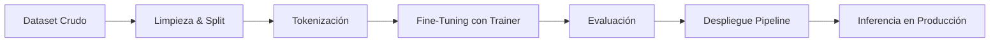
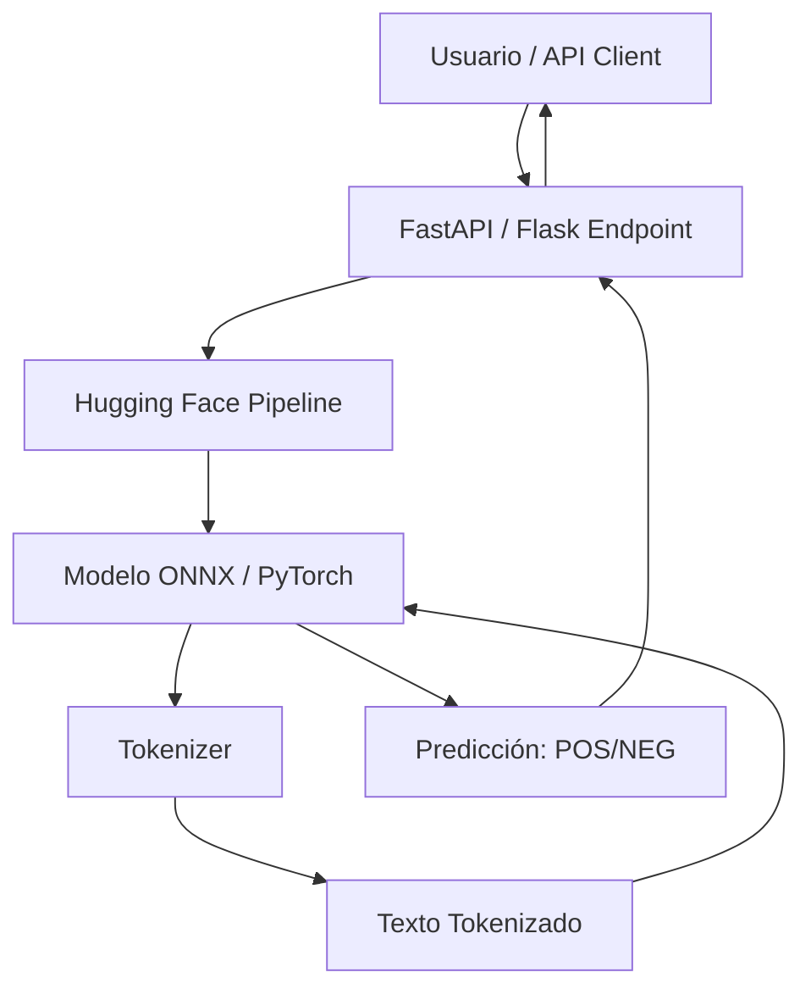

# 🛠️ 06 - Caso Practico - Clasificador de Texto con Transformers

Este caso práctico integra los conceptos del curso en un proyecto end-to-end: construiremos un clasificador de sentimientos/reviews utilizando Hugging Face Transformers. Para un ML/AI Engineer, esta es una de las tareas más comunes en producción: tomar un modelo base preentrenado, adaptarlo a datos propios mediante fine-tuning, evaluarlo rigurosamente y desplegarlo como servicio.

---

## 1. Objetivos del Proyecto

1. Construir un pipeline reproducible de fine-tuning para clasificación de texto.
2. Aplicar técnicas de tokenización, pretraining transferido y evaluación métrica.
3. Optimizar el entrenamiento con `Trainer` de Hugging Face.
4. Desplegar el modelo mediante pipelines de inferencia.

---

## 2. Requisitos Funcionales

| Requisito | Especificación |
|-----------|---------------|
| **Dataset** | Reviews de productos en español o inglés (IMDB, Amazon, o dataset propio). |
| **Modelo base** | `distilbert-base-uncased` o `bert-base-spanish-wwm-uncased`. |
| **Tareas** | Clasificación binaria (positivo/negativo) o multiclase (1-5 estrellas). |
| **Métricas** | Accuracy, Precision, Recall, F1-score. |
| **Despliegue** | Pipeline de inferencia local y exportación a ONNX opcional. |

Caso real: Mercado Libre implementa clasificadores de sentimiento similares sobre reviews de productos para detectar automáticamente sellers con patrones de fraude o calidad inconsistente, procesando millones de reviews diarias en 18 países.

---

## 3. Pipeline de Desarrollo



---

## 4. Preparación de Datos

### 4.1. Carga y Exploración

```python
from datasets import load_dataset

# Dataset de reviews en español (ejemplo con Amazon reviews multilingüe)
# Alternativa: load_dataset("imdb") para inglés
dataset = load_dataset("amazon_reviews_multi", "es")

# Explorar estructura
print(dataset["train"][0])
# {'review_id': '...', 'product_id': '...', 'review_body': '...', 'stars': 4}

# Convertir a clasificación binaria: stars >= 4 -> positivo
def map_binary(example):
    example["label"] = 1 if example["stars"] >= 4 else 0
    return example

dataset = dataset.map(map_binary)
```

⚠️ **Advertencia**: Asegúrate de estratificar el split train/val/test según la distribución de clases. Los datasets de reviews frecuentemente tienen sesgo hacia calificaciones positivas (distribución J-shaped).

### 4.2. Tokenización

```python
from transformers import AutoTokenizer

MODEL_NAME = "distilbert-base-uncased"
tokenizer = AutoTokenizer.from_pretrained(MODEL_NAME)

def preprocess_function(examples):
    return tokenizer(
        examples["review_body"],
        truncation=True,
        padding="max_length",
        max_length=256
    )

tokenized_dataset = dataset.map(preprocess_function, batched=True)
tokenized_dataset = tokenized_dataset.remove_columns(["review_id", "product_id", "review_body", "stars"])
tokenized_dataset.set_format("torch")
```

💡 **Tip**: `padding="max_length"` es seguro para fine-tuning pero ineficiente para inferencia en batch. En producción, usa dynamic padding agrupando secuencias de longitud similar.

---

## 5. Fine-Tuning con Trainer

### 5.1. Configuración del Modelo

```python
from transformers import AutoModelForSequenceClassification, TrainingArguments, Trainer
import numpy as np
from sklearn.metrics import accuracy_score, f1_score, precision_recall_fscore_support

model = AutoModelForSequenceClassification.from_pretrained(
    MODEL_NAME,
    num_labels=2,
    id2label={0: "NEGATIVE", 1: "POSITIVE"},
    label2id={"NEGATIVE": 0, "POSITIVE": 1}
)
```

### 5.2. Función de Métricas

```python
def compute_metrics(eval_pred):
    logits, labels = eval_pred
    predictions = np.argmax(logits, axis=-1)
    precision, recall, f1, _ = precision_recall_fscore_support(
        labels, predictions, average="binary"
    )
    acc = accuracy_score(labels, predictions)
    return {"accuracy": acc, "f1": f1, "precision": precision, "recall": recall}
```

### 5.3. TrainingArguments y Trainer

```python
training_args = TrainingArguments(
    output_dir="./results",
    evaluation_strategy="epoch",
    save_strategy="epoch",
    learning_rate=2e-5,
    per_device_train_batch_size=16,
    per_device_eval_batch_size=16,
    num_train_epochs=3,
    weight_decay=0.01,
    load_best_model_at_end=True,
    metric_for_best_model="f1",
    logging_dir="./logs",
    logging_steps=50,
    fp16=True,  # Mixed precision para acelerar en GPU
)

trainer = Trainer(
    model=model,
    args=training_args,
    train_dataset=tokenized_dataset["train"].shuffle(seed=42).select(range(10000)),
    eval_dataset=tokenized_dataset["validation"].shuffle(seed=42).select(range(2000)),
    compute_metrics=compute_metrics,
)

trainer.train()
```

⚠️ **Advertencia**: `fp16=True` requiere GPU NVIDIA con Tensor Cores (V100, T4, A100). En GPUs antiguas o CPUs, desactívalo. También monitorea el gradient scaling para evitar underflows numéricos.

---

## 6. Evaluación Detallada

### 6.1. Resultados por Clase

```python
from sklearn.metrics import classification_report, confusion_matrix
import seaborn as sns
import matplotlib.pyplot as plt

predictions = trainer.predict(tokenized_dataset["test"])
y_pred = np.argmax(predictions.predictions, axis=1)
y_true = predictions.label_ids

print(classification_report(y_true, y_pred, target_names=["NEGATIVE", "POSITIVE"]))

# Matriz de confusión
cm = confusion_matrix(y_true, y_pred)
sns.heatmap(cm, annot=True, fmt="d", xticklabels=["NEG", "POS"], yticklabels=["NEG", "POS"])
plt.title("Matriz de Confusión")
plt.show()
```

### 6.2. Análisis de Errores

```python
# Identificar falsos positivos y falsos negativos
errors = []
for i, (true, pred) in enumerate(zip(y_true, y_pred)):
    if true != pred:
        errors.append({
            "text": dataset["test"][i]["review_body"],
            "true": true,
            "pred": pred
        })

# Analizar patrones comunes en errores
for e in errors[:5]:
    print(f"TRUE: {e['true']} | PRED: {e['pred']}")
    print(f"TEXT: {e['text'][:200]}...\n")
```

💡 **Tip**: Los falsos negativos en reviews positivas frecuentemente contienen sarcasmo o negación doble ("no está nada mal"). Considera data augmentation específica o modelos más grandes para capturar estas sutilezas pragmáticas.

---

## 7. Despliegue con Pipeline de Hugging Face

### 7.1. Guardado y Carga

```python
# Guardar modelo y tokenizer
model_path = "./sentiment_classifier_distilbert"
trainer.save_model(model_path)
tokenizer.save_pretrained(model_path)

# Cargar para inferencia
from transformers import pipeline

classifier = pipeline(
    "sentiment-analysis",
    model=model_path,
    tokenizer=model_path,
    device=0  # GPU; usar -1 para CPU
)
```

### 7.2. Inferencia en Batch

```python
reviews = [
    "Este producto superó todas mis expectativas, excelente calidad.",
    "Llegó roto y el vendedor nunca respondió. Pésima experiencia.",
    "No está mal para el precio, pero esperaba más durabilidad."
]

results = classifier(reviews)
for review, res in zip(reviews, results):
    print(f"{res['label']} ({res['score']:.3f}): {review[:60]}...")
```

### 7.3. Exportación a ONNX (Opcional)

```python
# Requiere: pip install optimum[onnxruntime]
from optimum.onnxruntime import ORTModelForSequenceClassification

model_onnx = ORTModelForSequenceClassification.from_pretrained(
    model_path, export=True
)
model_onnx.save_pretrained("./sentiment_onnx")

# Inferencia optimizada
classifier_onnx = pipeline(
    "sentiment-analysis",
    model="./sentiment_onnx",
    tokenizer=model_path,
    accelerator="ort"
)
```

⚠️ **Advertencia**: La exportación ONNX puede producir diferencias numéricas menores (~1e-5) respecto a PyTorch. Valida siempre un subset de ejemplos críticos antes de reemplar el backend en producción.

---

## 8. Diagrama de Arquitectura de Despliegue



---

## 9. 📦 Código de Compresión

```python
# Script completo de fine-tuning y despliegue (copiar y adaptar)
from datasets import load_dataset
from transformers import (
    AutoTokenizer, AutoModelForSequenceClassification,
    TrainingArguments, Trainer, pipeline
)
from sklearn.metrics import accuracy_score, f1_score
import numpy as np

# 1. Config
MODEL = "distilbert-base-uncased"
MAX_LEN = 256
BS = 16
EPOCHS = 3
LR = 2e-5

# 2. Data
dataset = load_dataset("imdb")
tokenizer = AutoTokenizer.from_pretrained(MODEL)

def tok(x):
    return tokenizer(x["text"], truncation=True, padding="max_length", max_length=MAX_LEN)

ds = dataset.map(tok, batched=True)
ds = ds.remove_columns(["text"]).rename_column("label", "labels")
ds.set_format("torch")

# 3. Model & Metrics
model = AutoModelForSequenceClassification.from_pretrained(MODEL, num_labels=2)

def metrics(p):
    pred = np.argmax(p.predictions, axis=1)
    return {
        "acc": accuracy_score(p.label_ids, pred),
        "f1": f1_score(p.label_ids, pred)
    }

# 4. Train
args = TrainingArguments(
    "./out", evaluation_strategy="epoch", learning_rate=LR,
    per_device_train_batch_size=BS, num_train_epochs=EPOCHS,
    weight_decay=0.01, fp16=True
)
trainer = Trainer(model=model, args=args, train_dataset=ds["train"],
                  eval_dataset=ds["test"], compute_metrics=metrics)
trainer.train()

# 5. Deploy
classifier = pipeline("sentiment-analysis", model=trainer.model, tokenizer=tokenizer)
print(classifier("I love this product!"))
```

---

## 10. 🎯 Proyecto Final del Curso

**Objetivo**: Construir un sistema de clasificación de tickets de soporte técnico en español que asigne automáticamente categorías (Facturación, Técnico, Cuenta, Otro) y prioridad (Alta, Media, Baja).

**Requisitos funcionales**:
1. Dataset de ≥5,000 tickets anotados (usar dataset público como `banking77` traducido o sintetizado).
2. Modelo base: `bert-base-spanish-wwm-uncased` o `distilbert-base-multilingual-cased`.
3. Tarea multilabel: categoría (4 clases) + prioridad (3 clases), o dos cabezales de clasificación.
4. Métricas: Macro-F1 (crítico para clases desbalanceadas) + Confusion Matrix por cabezal.
5. Despliegue: Script que reciba un CSV de tickets y genere un CSV con predicciones.

**Requisitos técnicos**:
- Implementar early stopping basado en validation loss.
- Usar class weights o oversampling para clases minoritarias.
- Logging con Weights & Biases o TensorBoard.
- Documentación de decisiones de arquitectura y trade-offs.

**Entregables**:
- Repositorio Git con código modular (`data.py`, `model.py`, `train.py`, `predict.py`).
- README con instrucciones de instalación y uso.
- Reporte de evaluación con análisis de errores.
- Demo: Notebook interactivo con inferencia sobre ejemplos reales.

**Extensión (opcional)**:
- Implementar un segundo modelo basado en LLaMA-2-7B con QLoRA para comparar rendimiento zero-shot vs. fine-tuned BERT.
- Construir una API REST con FastAPI que exponga el modelo como servicio con rate limiting.

---

## Enlaces Rápidos

- [[05 - Evaluacion de LLMs]]
- [[00 - Bienvenida]]

¡Felicitaciones por completar el curso **Fundamentos de LLMs**! 🎉
