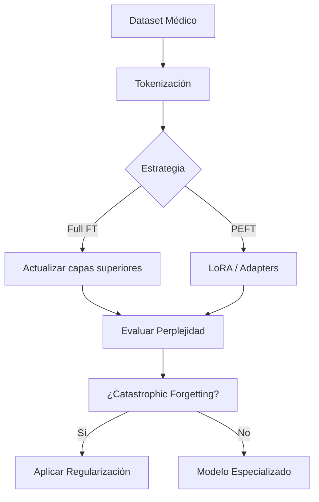

# 🏋️ Fine-Tuning Supervisado: Adiestramiento Profundo de LLMs

El fine-tuning supervisado (SFT) constituye el mecanismo estándar para especializar un LLM pre-entrenado en una tarea o dominio downstream. A diferencia del prompting, que opera sobre pesos fijos, el SFT actualiza los parámetros del modelo para minimizar una función de pérdida sobre datos etiquetados.

---

## 1. Full Fine-Tuning: Fundamentos Matemáticos

Dado un modelo pre-entrenado con parámetros $\theta_0$ y un dataset de tarea $\mathcal{D} = \{(x_i, y_i)\}_{i=1}^N$, el objetivo del full fine-tuning es encontrar:

$$\theta^* = \arg\min_\theta \frac{1}{N} \sum_{i=1}^N \mathcal{L}(f_\theta(x_i), y_i)$$

Para modelos autoregresivos, la pérdida típica es la cross-entropy token-level:

$$\mathcal{L}_{\text{CE}} = -\frac{1}{N} \sum_{i=1}^N \sum_{t=1}^{T_i} \log P_\theta(y_{i,t} | x_i, y_{i,<t})$$

donde $T_i$ es la longitud de la secuencia objetivo.

El gradiente se propaga a través de todas las capas $L$ del transformer, actualizando matrices de atención $W_Q, W_K, W_V, W_O$ y feed-forward $W_1, W_2$.

---

## 2. Catastrophic Forgetting

Cuando se fine-tunea agresivamente en un dominio estrecho, el modelo pierde capacidades generales adquiridas durante el pre-entrenamiento. Este fenómeno, conocido como **catastrophic forgetting**, ocurre porque los gradientes sobrescriben regiones críticas del espacio de pesos.

Matemáticamente, la pérdida de la tarea original puede medirse como:

$$\Delta \mathcal{L}_{\text{pre}} = \mathcal{L}_{\text{pre}}(\theta^*) - \mathcal{L}_{\text{pre}}(\theta_0) > 0$$

### Estrategias de Mitigación

**Regularización por proximidad (Weight Decay):**
$$\mathcal{L}_{\text{total}} = \mathcal{L}_{\text{task}} + \frac{\lambda}{2} ||\theta - \theta_0||^2_2$$

**Replay de datos:** Intercalar muestras del corpus original durante el fine-tuning:
$$\mathcal{L}_{\text{mixed}} = \alpha \mathcal{L}_{\text{task}} + (1-\alpha) \mathcal{L}_{\text{pre}}$$

---

## 3. Discriminative Fine-Tuning y Learning Rates

No todas las capas de un transformer deben aprender a la misma velocidad. Las capas inferiores capturan características léxicas y sintácticas generales, mientras que las superiores codifican semántica y tarea-específica.

La técnica de **Discriminative Learning Rates** asigna un LR decreciente desde las capas superiores hasta las inferiores:

$$\eta_l = \eta_{\text{base}} \cdot \delta^{L-l}$$

donde $l$ es el índice de la capa, $L$ la profundidad total, y $\delta \in (0,1]$ el factor de decaimiento (típicamente $0.95$ a $0.99$).

| Capas | LR Relativo | Función |
|-------|-------------|---------|
| Embeddings / Capas 1-4 | $0.1 \times \eta$ | Congelar o LR muy bajo |
| Capas intermedias | $0.5 \times \eta$ | Ajuste ligero |
| Capas finales + LM Head | $1.0 \times \eta$ | Ajuste completo |

---

## 4. Warmup y Scheduling

El entrenamiento de LLMs requiere estabilidad en las primeras iteraciones. El **linear warmup** incrementa el LR desde 0 hasta $\eta_{\text{max}}$ durante $w$ steps:

$$\eta_t = \eta_{\text{max}} \cdot \frac{t}{w}, \quad t \leq w$$

Posteriormente, un scheduler **cosine with restarts** o **polynomial decay** modula el LR:

$$\eta_t = \eta_{\text{min}} + \frac{1}{2}(\eta_{\text{max}} - \eta_{\text{min}})\left(1 + \cos\left(\frac{t-w}{T-w}\pi\right)\right)$$

---

## 5. Gradient Accumulation

Cuando la memoria GPU limita el batch size $b$, la **gradient accumulation** simula un batch efectivo $B$:

$$B = b \times a \times d$$

donde $a$ es el número de pasos de acumulación y $d$ el número de dispositivos. El gradiente efectivo se computa como:

$$g_{\text{eff}} = \frac{1}{a} \sum_{i=1}^{a} \nabla_\theta \mathcal{L}_i$$

⚠️ **Advertencia:** La acumulación de gradientes replica un batch grande pero no reduce la varianza del estimador de forma idéntica a un batch físico $B$, y puede introducir inestabilidad si $a$ es excesivo ($a > 64$).

---

## 6. Freezing Estratégico

En lugar de actualizar los $P$ parámetros del modelo, es posible congelar selectivamente. El criterio más común es **congelar embeddings y capas bajas**, entrenando solo el 20-30% superior del modelo y el language modeling head.

La matriz de congelación puede definirse como:

$$\Delta \theta_l = \begin{cases} 0 & \text{si } l \leq l_{\text{freeze}} \\ -\eta \nabla_{\theta_l} \mathcal{L} & \text{si } l > l_{\text{freeze}} \end{cases}$$

Caso real: **BioBERT**. Investigadores de Korea University aplicaron discriminative fine-tuning sobre BERT-large en corpus biomédicos, congelando las primeras 18 capas de 24 y usando un LR de $2\text{e-}5$ para las superiores, logrando SOTA en NER y QA biomédica sin reentrenar embeddings generales.

💡 **Tip:** Usa herramientas como `bitsandbytes` en 8-bit optimizers para reducir la huella de memoria en full fine-tuning hasta en un 75%.

---

## 📦 Código de Compresión: Fine-Tuning con Discriminative LR

```python
import torch
from transformers import AutoModelForCausalLM, AutoTokenizer, TrainingArguments, Trainer
from peft import LoraConfig, get_peft_model
import bitsandbytes as bnb

model_id = "meta-llama/Llama-2-7b-hf"
tokenizer = AutoTokenizer.from_pretrained(model_id)
model = AutoModelForCausalLM.from_pretrained(
    model_id,
    load_in_8bit=True,
    device_map="auto",
    torch_dtype=torch.float16
)

# Congelar capas inferiores (ej: primeras 50%)
for name, param in model.named_parameters():
    if "layers.0" in name or "layers.1" in name or "embed" in name:
        param.requires_grad = False

# Discriminative LR: capas superiores con LR mayor
no_decay = ["bias", "LayerNorm.weight"]
optimizer_grouped_parameters = [
    {
        "params": [p for n, p in model.named_parameters() 
                   if not any(nd in n for nd in no_decay) and p.requires_grad],
        "weight_decay": 0.01,
        "lr": 2e-5,
    },
    {
        "params": [p for n, p in model.named_parameters() 
                   if any(nd in n for nd in no_decay) and p.requires_grad],
        "weight_decay": 0.0,
        "lr": 2e-5,
    },
]

optimizer = bnb.optim.Adam8bit(optimizer_grouped_parameters)

training_args = TrainingArguments(
    output_dir="./sft_output",
    per_device_train_batch_size=1,
    gradient_accumulation_steps=8,
    num_train_epochs=3,
    warmup_steps=100,
    lr_scheduler_type="cosine",
    logging_steps=10,
    fp16=True,
)

trainer = Trainer(
    model=model,
    args=training_args,
    train_dataset=dataset,  # Dataset preprocesado
    optimizers=(optimizer, None)
)

trainer.train()
```

---

## 🎯 Proyecto: Componente 1 - Preparación del Modelo Base

Para el asistente médico/legal, el primer paso consiste en establecer la estrategia de fine-tuning:

1. **Selección del backbone:** Se utilizará un modelo de 7B-13B parámetros (ej. Llama-3-8B o Mistral-7B) por su balance capacidad/coste.
2. **Dataset de especialización:** 50k pares de (consulta, respuesta) etiquetados por profesionales, con formato de instrucción.
3. **Estrategia:** Full fine-tuning parcial (capas superiores + head) con discriminative LR y replay de 10% de datos generales para mitigar olvido.
4. **Métricas de seguimiento:** Perplejidad en holdout médico vs. holdout general. Si $\Delta \mathcal{L}_{\text{general}} > 15\%$, se activa regularización por proximidad.

[[02 - LoRA y PEFT]]



