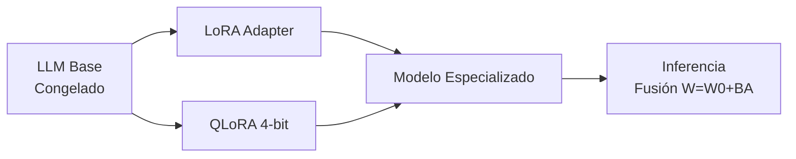

# 🧬 LoRA y PEFT: Adaptación Eficiente de Parámetros

Los métodos Parameter-Efficient Fine-Tuning (PEFT) permiten adaptar LLMs de miles de millones de parámetros entrenando menos del 1% de ellos. Esta aproximación es esencial cuando los recursos computacionales son limitados o cuando se requiere desplegar múltiples especializaciones de un mismo backbone.

---

## 1. LoRA (Low-Rank Adaptation)

LoRA propone reparametriziar una matriz de peso $W_0 \in \mathbb{R}^{d \times k}$ mediante una actualización de bajo rango:

$$W = W_0 + BA$$

Donde:
- $W_0$ son los pesos pre-entrenados y **congelados**.
- $B \in \mathbb{R}^{d \times r}$ y $A \in \mathbb{R}^{r \times k}$ son matrices entrenables.
- $r \ll \min(d,k)$ es el rango de la descomposición.

Durante el entrenamiento, solo se optimizan $A$ y $B$, reduciendo el número de parámetros entrenables de $d \cdot k$ a $r(d+k)$. Para $d=k=4096$ y $r=16$, la reducción es de $\approx 16.7$M a $\approx 131$k parámetros por capa.

La inferencia puede fusionar $W = W_0 + BA$ sin overhead latente.

| Hiperparámetro | Descripción | Valor Típico |
|----------------|-------------|--------------|
| r | Rango de descomposición | 8, 16, 32, 64 |
| lora_alpha | Escala de adaptación | 16, 32 (usualmente r o 2r) |
| lora_dropout | Regularización | 0.0 - 0.1 |
| target_modules | Módulos a adaptar | q_proj, v_proj, o_proj, gate_proj |

💡 **Tip:** Un buen punto de partida es `r=16` y `lora_alpha=32` (alpha = 2r). Si el modelo subajusta, incrementa r antes que alpha.

---

## 2. QLoRA: Cuantización para Consumer Hardware

QLoRA extiende LoRA cuantizando $W_0$ a 4-bit, permitiendo fine-tuning de modelos de 70B en GPUs de 48GB.

### Componentes Clave

**NormalFloat4 (NF4):** Tipo de dato 4-bit optimizado para pesos neuronales con distribución aproximadamente normal. Los cuantiles se ajustan para minimizar el error esperado:

$$Q(w) = \arg\min_{q \in \mathcal{Q}} |w - q|, \quad \mathcal{Q} = \{q_1, \dots, q_{16}\}$$

**Double Quantization:** Cuantiza las constantes de cuantización (scales) themselves de 32-bit a 8-bit, ahorrando $\approx 0.37$ bits por parámetro en promedio.

**Paged Optimizers:** Utiliza memoria de CPU paginada para gestionar picos de memoria del optimizador (ej. estados de Adam), evitando OOM en batches grandes.

⚠️ **Advertencia:** QLoRA introduce un error de cuantización que puede degradar ligeramente la calidad en tareas de razonamiento numérico exigente. Para modelos matemáticos, considera 8-bit o full precision en capas críticas.

---

## 3. Prefix Tuning

En lugar de modificar pesos, el prefix tuning añade vectores entrenables $P_\theta \in \mathbb{R}^{L \times l \times d}$ a las activaciones de cada capa $L$ del transformer, donde $l$ es la longitud del prefix.

Las representaciones de la clave y valor en atención se concatenan:

$$[\text{Prefix}_K; K], \quad [\text{Prefix}_V; V]$$

Todos los parámetros originales permanecen congelados. Esto reduce drásticamente los parámetros entrenables: para un prefix de longitud 50 en un modelo de 12 capas y dimensión 768, solo se entrenan $50 \times 12 \times 768 \times 2 \approx 921$k parámetros.

---

## 4. Prompt Tuning

Variante más ligera que el prefix tuning. Aprende embeddings de "soft tokens" $P \in \mathbb{R}^{l \times d}$ que se prefijan a la entrada. No interviene en capas intermedias.

La entrada efectiva al modelo es:

$$[P_1, P_2, \dots, P_l; e(x_1), e(x_2), \dots, e(x_n)]$$

donde $e(\cdot)$ es el embedding del token. Se ha demostrado que el prompt tuning escala con el tamaño del modelo: para T5-XXL (11B), un prompt de 100 tokens alcanza rendimiento comparable al full fine-tuning.

---

## 5. Adapters

Los adapters insertan capas bottleneck entrenables después de las subcapas de atención y feed-forward. La arquitectura típica es:

$$h \leftarrow h + f(hW_{\text{down}})W_{\text{up}}$$

con $W_{\text{down}} \in \mathbb{R}^{d \times m}$, $W_{\text{up}} \in \mathbb{R}^{m \times d}$ y $m \ll d$ (típicamente $m = d/4$ o $d/8$).

Los adapters permiten entrenar múltiples tareas y conmutar entre ellas cambiando solo las capas adapter, manteniendo un único backbone congelado.

---

## 6. Comparativa PEFT Methods

| Método | Parámetros Entrenables | Capas Afectadas | Overhead Inferencia | Escalabilidad |
|--------|------------------------|-----------------|---------------------|---------------|
| LoRA | $r(d+k)$ por matriz | Atención/FFN | Nulo (fusible) | Alta |
| QLoRA | Idem LoRA | Idem LoRA | Nulo | Muy alta |
| Prefix Tuning | $L \cdot l \cdot 2d$ | Todas (K,V) | Secuencia más larga | Media |
| Prompt Tuning | $l \cdot d$ | Input only | Secuencia más larga | Alta |
| Adapters | $2 \cdot L \cdot d \cdot m$ | Inter-capa | Latencia mínima | Alta |

Caso real: **Stanford Alpaca** fue fine-tuneado con LoRA sobre LLaMA-7B en hardware de bajo coste ($<600$), demostrando que la adaptación parameter-efficient rivaliza con el full fine-tuning en tareas de instrucción. Posteriormente, QLoRA permitió entrenar modelos de 65B en una única RTX 4090.

---

## 📦 Código de Compresión: QLoRA con Hugging Face

```python
import torch
from transformers import AutoModelForCausalLM, AutoTokenizer, BitsAndBytesConfig
from peft import LoraConfig, get_peft_model, prepare_model_for_kbit_training
from trl import SFTTrainer

model_id = "meta-llama/Llama-2-7b-hf"

bnb_config = BitsAndBytesConfig(
    load_in_4bit=True,
    bnb_4bit_use_double_quant=True,
    bnb_4bit_quant_type="nf4",
    bnb_4bit_compute_dtype=torch.bfloat16
)

model = AutoModelForCausalLM.from_pretrained(
    model_id,
    quantization_config=bnb_config,
    device_map="auto"
)
model = prepare_model_for_kbit_training(model)

lora_config = LoraConfig(
    r=16,
    lora_alpha=32,
    target_modules=["q_proj", "v_proj", "k_proj", "o_proj", "gate_proj", "up_proj", "down_proj"],
    lora_dropout=0.05,
    bias="none",
    task_type="CAUSAL_LM"
)

model = get_peft_model(model, lora_config)

tokenizer = AutoTokenizer.from_pretrained(model_id)
tokenizer.pad_token = tokenizer.eos_token

trainer = SFTTrainer(
    model=model,
    train_dataset=dataset,
    max_seq_length=512,
    args=TrainingArguments(
        output_dir="./qlora_output",
        num_train_epochs=3,
        per_device_train_batch_size=2,
        gradient_accumulation_steps=4,
        learning_rate=2e-4,
        fp16=True,
        logging_steps=10,
    ),
    tokenizer=tokenizer,
)

trainer.train()
model.save_pretrained("./lora_adapter")
```

---

## 🎯 Proyecto: Componente 2 - Adaptación Parameter-Efficient del Asistente

Para el asistente médico/legal, se implementará QLoRA sobre Mistral-7B:

1. **Configuración:** `r=32`, `alpha=64` para capturar complejidad terminológica.
2. **Target modules:** Todos los proyectores de atención y MLP para máxima expresividad.
3. **Dataset:** 30k ejemplos de instrucción médica en formato Alpaca.
4. **Training:** 3 épocas, LR $2\text{e-}4$, warmup 100 steps, cosine decay.
5. **Evaluación:** Comparación contra full fine-tuning (métricas ROUGE-L, BLEU en holdout). Se espera $<2\%$ de degradación con $>95\%$ de reducción de parámetros entrenables.

[[03 - Prompt Engineering Avanzado]]



