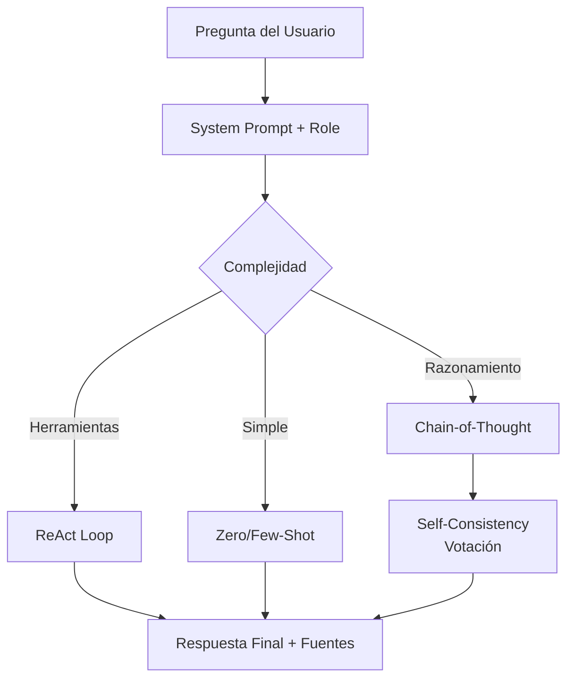

# 🧠 Prompt Engineering Avanzado: Orquestando el Conocimiento del Modelo

El prompt engineering es la disciplina de diseñar entradas que maximicen la probabilidad de obtener salidas correctas y útiles de un LLM. Cuando se domina, puede superar el rendimiento de modelos fine-tuneados en tareas específicas sin modificar un solo parámetro.

---

## 1. Zero-Shot Prompting

Consiste en instruir al modelo para realizar una tarea sin ejemplos previos. El modelo debe inferir el patrón únicamente desde la instrucción y su conocimiento pre-entrenado.

Para tareas de clasificación, un prompt zero-shot efectivo sigue la estructura:

$$\text{Prompt} = \text{Instrucción} + \text{Contexto} + \text{Formato de salida}$$

Ejemplo:
> Clasifica el siguiente texto en una de estas categorías: [Positivo, Negativo, Neutral].
> Texto: "El servicio fue excepcionalmente rápido."
> Clasificación:

---

## 2. Few-Shot Prompting

Proporciona $k$ ejemplos $(x_i, y_i)$ en el contexto para guiar al modelo. La probabilidad condicional se convierte en:

$$P(y|x) \approx P(y|x_1, y_1, \dots, x_k, y_k, x)$$

El número de shots $k$ está limitado por la ventana de contexto. La selección de ejemplos (prompt retrieval) es crítica: ejemplos semánticamente similares a la consulta mejoran significativamente el rendimiento.

💡 **Tip:** Para tareas razonamiento, $k=3$ a $k=8$ suele ser el punto óptimo. Más ejemplos no siempre mejoran y consumen contexto valioso.

---

## 3. Chain-of-Thought (CoT)

Propuesto por Wei et al. (2022), CoT induce al modelo a generar pasos de razonamiento intermedios antes de la respuesta final.

El prompt few-shot se enriquece con "think step by step":

$$\text{Prompt}_{\text{CoT}} = \{(x_i, r_i, y_i)\}_{i=1}^k + (x, \text{"Let's think step by step"})$$

Donde $r_i$ es el razonamiento. Esto descompone la tarea compleja en subproblemas, aumentando la probabilidad de respuestas correctas en aritmética, lógica y commonsense.

Caso real: **Google PaLM** mejoró su accuracy en GSM8K (matemáticas escolares) de $17.9\%$ a $58.1\%$ simplemente añadiendo ejemplos CoT en el prompt, sin reentrenar el modelo.

---

## 4. Tree-of-Thoughts (ToT)

ToT generaliza CoT a una estructura de árbol. En lugar de una única cadena lineal, el modelo explora múltiples caminos de razonamiento, evalúa cada uno y realiza backtracking.

El algoritmo ToT sigue tres fases:

1. **Generación de pensamientos:** Dado un estado $s$, el modelo genera $k$ candidatos $s_1, \dots, s_k$.
2. **Evaluación:** Un evaluador asigna una puntuación $v(s_i)$ a cada candidato (puede ser el propio LLM o una heurística).
3. **Búsqueda:** Se expanden los nodos más prometedores usando BFS o DFS.

$$\text{ToT}(s) = \arg\max_{s' \in \text{Children}(s)} v(s')$$

ToT es especialmente poderoso para juegos, planificación y problemas de búsqueda combinatoria.

---

## 5. Self-Consistency

Técnica de ensembling a nivel de prompt. En lugar de decodificar una única cadena CoT, se muestrean $N$ caminos de razonamiento independientes y se selecciona la respuesta final por mayoría:

$$\hat{y} = \arg\max_y \sum_{i=1}^N \mathbb{1}[y_i = y]$$

Esto reduce la varianza del muestreo y mejora la robustez en tareas de razonamiento. La complejidad es $\mathcal{O}(N)$ en inferencia.

| Técnica | Complejidad | Requiere FT | Mejor para |
|---------|-------------|-------------|------------|
| Zero-shot | $\mathcal{O}(1)$ | No | Tareas simples, clasificación |
| Few-shot | $\mathcal{O}(k)$ | No | Formato específico, estilo |
| CoT | $\mathcal{O}(1)$ | No | Razonamiento multistep |
| Self-Consistency | $\mathcal{O}(N)$ | No | Matemáticas, lógica |
| ToT | $\mathcal{O}(b^k)$ | No | Planificación, búsqueda |

---

## 6. ReAct (Reasoning + Acting)

ReAct intercala **razonamiento** (pensamientos internos) con **acciones** (interacción con herramientas externas: búsqueda, calculadora, APIs).

El ciclo de ReAct es:

$$\text{Thought}_t \to \text{Action}_t \to \text{Observation}_t \to \text{Thought}_{t+1}$$

Esto permite al modelo verificar hechos en tiempo real y corregir su razonamiento basándose en evidencia externa, mitigando alucinaciones de forma activa.

---

## 7. Prompt Templates, System Prompts y Role Prompting

### System Prompts
Definen el comportamiento global del asistente. Son instrucciones de alto nivel procesadas antes del mensaje del usuario.

> Eres un asistente médico especializado en cardiología. Responde de forma clara, evita diagnósticos definitivos y recomienda siempre consultar a un profesional.

### Role Prompting
Asigna un rol específico al modelo, aprovechando el knowledge retrieval asociado a ese personaje en los datos de pre-entrenamiento.

$$P(y|x, \text{role}) \neq P(y|x)$$

El rol condiciona el estilo, vocabulario y nivel de detalle.

---

## 📦 Código de Compresión: Pipeline Multi-Técnica

```python
from openai import OpenAI

client = OpenAI()

def cot_prompt(question, examples=None):
    base = "Responde paso a paso.\n\n"
    if examples:
        for ex in examples:
            base += f"P: {ex['q']}\nR: {ex['reasoning']}\nRespuesta: {ex['a']}\n\n"
    base += f"P: {question}\nR:"
    return base

def self_consistency(question, n=5, temperature=0.7):
    answers = []
    for _ in range(n):
        resp = client.chat.completions.create(
            model="gpt-4",
            messages=[{"role": "user", "content": cot_prompt(question)}],
            temperature=temperature
        )
        answers.append(resp.choices[0].message.content)
    # Extracción de respuesta final por votación (simplificado)
    return max(set(answers), key=answers.count)

# Ejemplo ReAct simplificado
react_prompt = """Responde alternando THOUGHT y ACTION.
Pregunta: ¿Cuál es la población de la capital de Francia?
THOUGHT: Necesito saber la capital de Francia.
ACTION: Search[capital de Francia]
OBSERVATION: París
THOUGHT: Ahora busco la población de París.
ACTION: Search[población de París]
OBSERVATION: 2.1 millones
RESPUESTA: 2.1 millones
"""
```

---

## 🎯 Proyecto: Componente 3 - Prompts Estructurados para el Asistente

El asistente médico/legal usará una arquitectura de prompts en capas:

1. **System prompt base:** Rol de asistente especializado con disclaimer legal/médico obligatorio.
2. **Few-shot ejemplos:** 4 ejemplos de consultas tipo y respuestas estructuradas (CoT para diagnósticos diferenciales).
3. **ReAct wrapper:** Si la consulta requiere jurisprudencia actual o medicamentos recientes, se activa búsqueda en base de conocimiento y se inyecta la observación.
4. **Self-consistency:** Para respuestas de alto riesgo (indicaciones terapéuticas), se generan 3 caminos CoT y se fusiona la respuesta por consenso.

[[04 - In-Context Learning y RAG]]



