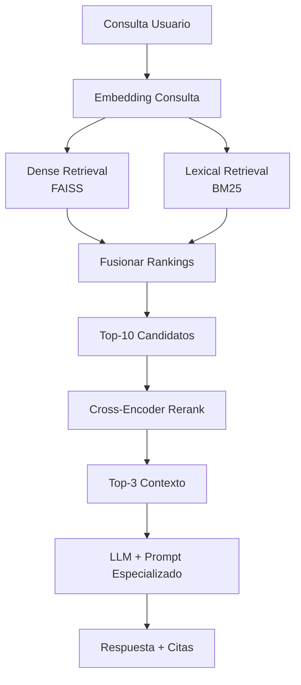

# 🔍 In-Context Learning y RAG: Memoria Externa para LLMs

Aunque los LLMs almacenan conocimiento en sus parámetros, este es estático y limitado. In-Context Learning (ICL) y Retrieval-Augmented Generation (RAG) extienden las capacidades del modelo proporcionando información relevante en el prompt o recuperándola dinámicamente.

---

## 1. In-Context Learning (ICL)

ICL es la capacidad de un modelo para aprender una tarea a partir de ejemplos proporcionados en el contexto, sin actualizar gradientes. Formalmente, dada una función objetivo $f$ desconocida, el modelo aproxima:

$$\hat{y} = \arg\max_y P(y | x_1, y_1, \dots, x_k, y_k, x)$$

donde $(x_i, y_i)$ son ejemplos demostrativos. La efectividad de ICL depende de:
- Calidad y diversidad de los ejemplos.
- Orden de los ejemplos (modelos pueden ser sensibles al orden).
- Similitud entre ejemplos y la consulta.

💡 **Tip:** Para ICL óptimo, ordena los ejemplos de menor a mayor complejidad (easy-to-hard prompting).

---

## 2. Arquitectura RAG

RAG descompone la generación en dos componentes:

1. **Retriever $\mathcal{R}$:** Dado $x$, recupera documentos relevantes $z$ de un corpus $\mathcal{C}$.
2. **Generator $\mathcal{G}$:** Condiciona la generación en $x$ y $z$.

$$p(y|x) \approx \sum_{z \in \text{top-}k(\mathcal{R}(x))} p(z|x) \cdot p(y|x, z)$$

En la práctica, se usa una aproximación por máximo:

$$y \approx \arg\max_y p(y|x, z^*), \quad z^* = \arg\max_{z \in \mathcal{R}(x)} \text{sim}(x,z)$$

---

## 3. Dense Retrieval (DPR)

Dense Passage Retrieval utiliza encoders duales para mapear consultas y documentos a un espacio vectorial denso:

$$\mathbf{q} = E_Q(x), \quad \mathbf{d} = E_D(z)$$

La relevancia se mide por similitud coseno:

$$\text{sim}(x,z) = \frac{\mathbf{q}^\top \mathbf{d}}{||\mathbf{q}|| \cdot ||\mathbf{d}||}$$

DPR supera a BM25 en preguntas semánticas donde la overlap léxica es baja.

| Método | Representación | Fortaleza | Debilidad |
|--------|---------------|-----------|-----------|
| BM25 | Sparse (TF-IDF) | Palabras clave exactas | Sinónimos, paráfrasis |
| DPR | Dense (embeddings) | Semántica, contexto | Coste computacional |
| Hybrid | BM25 + DPR | Mejor de ambos | Complejidad de fusión |

---

## 4. Reranking

Un retriever inicial (eficiente pero aproximado) devuelve $k$ candidatos. Un **reranker** (típicamente un cross-encoder) los reordena por relevancia precisa:

$$\text{score}_{\text{CE}}(x, z) = \text{MLP}([\text{CLS}(x \oplus z)])$$

Donde $\oplus$ denota concatenación. El reranking es más costoso ($\mathcal{O}(k \cdot (|x|+|z|))$) pero mejora significativamente la precisión@5.

---

## 5. Vector Stores y Chunking

Los documentos se fragmentan en **chunks** antes de la indexación. La estrategia de chunking afecta la recuperación:

- **Fixed-size:** Chunks de $n$ tokens con overlap $o$. Simple pero puede cortar semántica.
- **Semantic:** Segmentación por oraciones/párrafos usando modelos de segmentación.
- **Recursive:** División jerárquica (sección → párrafo → oración).

La fórmula de overlap:

$$\text{chunks} = \left\lceil \frac{T - o}{n - o} \right\rceil$$

donde $T$ es la longitud total. Un overlap del 10-20% mejora la continuidad contextual.

---

## 6. Hybrid Search

La búsqueda híbrida combina scores de BM25 y DPR:

$$\text{score}_{\text{hybrid}} = \alpha \cdot \text{score}_{\text{BM25}} + (1-\alpha) \cdot \text{score}_{\text{DPR}}$$

Con $\alpha \in [0,1]$ ajustable por dominio. Para corpora técnicos con terminología precisa, $\alpha \approx 0.7$ favorece la coincidencia léxica.

Caso real: **Microsoft Azure Cognitive Search** utiliza un esquema híbrido con reranking semántico para sus clientes enterprise, reportando mejoras de 15-30% en precisión de recuperación sobre BM25 puro en bases de conocimiento médicas.

---

## 📦 Código de Compresión: Pipeline RAG con FAISS

```python
from langchain.embeddings import HuggingFaceEmbeddings
from langchain.vectorstores import FAISS
from langchain.text_splitter import RecursiveCharacterTextSplitter
from langchain.llms import HuggingFacePipeline
from transformers import AutoModelForCausalLM, AutoTokenizer, pipeline

# 1. Chunking
splitter = RecursiveCharacterTextSplitter(
    chunk_size=512,
    chunk_overlap=50,
    separators=["\n\n", "\n", ".", " "]
)
chunks = splitter.split_documents(documents)

# 2. Embeddings + Vector Store
embeddings = HuggingFaceEmbeddings(model_name="sentence-transformers/all-mpnet-base-v2")
vectorstore = FAISS.from_documents(chunks, embeddings)

# 3. Retrieval + Reranking (simplificado)
retriever = vectorstore.as_retriever(search_kwargs={"k": 10})
docs = retriever.get_relevant_documents(query)

# Reranking heurístico: reordenar por overlap de keywords (placeholder para cross-encoder)
def rerank(query, docs):
    # En producción: usar cross-encoder como BAAI/bge-reranker-base
    return sorted(docs, key=lambda d: len(set(query.split()) & set(d.page_content.split())), reverse=True)

top_docs = rerank(query, docs)[:3]

# 4. Generation with context
context = "\n".join([d.page_content for d in top_docs])
prompt = f"""Usa el siguiente contexto para responder.
Contexto: {context}
Pregunta: {query}
Respuesta:"""

model = AutoModelForCausalLM.from_pretrained("mistralai/Mistral-7B-v0.1", device_map="auto")
tokenizer = AutoTokenizer.from_pretrained("mistralai/Mistral-7B-v0.1")
pipe = pipeline("text-generation", model=model, tokenizer=tokenizer, max_new_tokens=256)
output = pipe(prompt)
print(output[0]['generated_text'])
```

---

## 🎯 Proyecto: Componente 4 - Pipeline RAG del Asistente Especializado

El asistente médico/legal integrará:

1. **Ingesta de documentos:** Normativas, papers médicos, jurisprudencia → chunks semánticos de 400 tokens con 50 de overlap.
2. **Indexación dual:** FAISS con embeddings `BAAI/bge-large-en` para dense retrieval + índice invertido léxico para fallback.
3. **Reranking:** Cross-encoder `cross-encoder/ms-marco-MiniLM-L-6-v2` sobre los top-10 recuperados.
4. **Generación condicionada:** Prompt con contexto top-3 + system prompt de especialista + instrucción de citar fuentes.
5. **Evaluación:**
   - **Faithfulness:** $\frac{\text{claims sustentadas por contexto}}{\text{claims totales}}$
   - **Answer Relevance:** Cosine sim entre embedding de pregunta y respuesta.
   - **Context Precision:** $\frac{\text{chunks relevantes recuperados}}{k}$

[[05 - Caso Practico - Asistente Especializado con RAG]]



