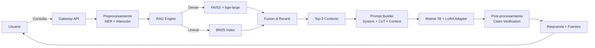

# 🏥 Caso Práctico: Asistente Especializado con RAG

Este módulo integra todos los conceptos previos en un sistema productivo: un asistente especializado (médico/legal) que combina fine-tuning parameter-efficient, prompts avanzados y RAG para responder con precisión, trazabilidad y seguridad.

---

## 1. Requisitos del Sistema

El asistente debe satisfacer:

| Requisito | Descripción | Métrica |
|-----------|-------------|---------|
| Especialización | Dominio médico y legal | ROUGE-L > 0.45 vs. respuestas expertas |
| Actualidad | Responder con información post-entrenamiento | Uso obligatorio de RAG |
| Trazabilidad | Citar fuentes de cada afirmación | 100% de claims deben tener citation |
| Seguridad | No emitir diagnósticos definitivos | Detección de disclaimers |
| Latencia | Respuesta < 5s en hardware estándar | Throughput > 10 req/min |

---

## 2. Arquitectura End-to-End



---

## 3. Pipeline de Documentos a Chunks

1. **Ingesta:** PDFs, HTML de normativas, artículos PubMed.
2. **Limpieza:** Eliminación de headers/footers, normalización de tablas.
3. **Chunking:** Recursive splitter con chunk_size=400, overlap=50.
4. **Embeddings:** `BAAI/bge-large-en-v1.5` fine-tuneado ligero en queries del dominio.
5. **Indexación:** FAISS IndexFlatIP (Inner Product) para búsqueda por similitud coseno.

La fórmula de recuperación híbrida:

$$\text{score}_i = \lambda \cdot \text{BM25}(q, d_i) + (1-\lambda) \cdot \text{cos}(E_q(q), E_d(d_i))$$

Con $\lambda = 0.3$ (favorece semántica) para consultas abiertas, y $\lambda = 0.7$ para búsqueda de artículos/códigos específicos.

---

## 4. Generación con Contexto y Prompts Estructurados

El prompt final se construye en tres bloques:

**Bloque 1 - System:**
> Eres un asistente especializado. Responde basándote ÚNICAMENTE en el contexto proporcionado. Si la información es insuficiente, indícalo explícitamente. No emitas diagnósticos definitivos.

**Bloque 2 - Contexto:**
> Contexto: [chunk1] Fuente: [ref1]. [chunk2] Fuente: [ref2]. [chunk3] Fuente: [ref3].

**Bloque 3 - CoT:**
> Razona paso a paso antes de dar tu respuesta final.

La salida esperada incluye secciones `<razonamiento>` y `<respuesta>`, parseadas para presentación al usuario.

---

## 5. Métricas de Evaluación

### Faithfulness
Mide qué fracción de claims en la respuesta está sustentada por el contexto recuperado:

$$\text{Faithfulness} = \frac{|\{c \in \text{claims} : \text{NLI}(c, \text{context}) = \text{entailment}\}|}{|\text{claims}|}$$

### Answer Relevance
Similitud semántica entre la pregunta original y la respuesta generada, excluyendo el contexto:

$$\text{Rel} = \cos(E_q(q), E_a(a))$$

### Context Precision
Fracción de chunks recuperados que son realmente relevantes para la respuesta, según juicio humano o un gold standard:

$$\text{Precision@}k = \frac{\text{chunks relevantes en top-}k}{k}$$

Caso real: **BloombergGPT y Bloomberg Terminal** combinan fine-tuning en datos financieros propietarios con RAG sobre noticias y filings de la SEC. Su sistema de citas permite a los analistas auditar cada cifra generada por el modelo, reduciendo la responsabilidad legal por alucinaciones en reportes de inversión.

---

## 📦 Código de Compresión: Servicio Completo

```python
from fastapi import FastAPI
from pydantic import BaseModel
from langchain.vectorstores import FAISS
from langchain.embeddings import HuggingFaceEmbeddings
from transformers import AutoModelForCausalLM, AutoTokenizer
from peft import PeftModel
import torch

app = FastAPI()

# Cargar índice y modelo
embeddings = HuggingFaceEmbeddings(model_name="BAAI/bge-large-en")
vectorstore = FAISS.load_local("faiss_index", embeddings)
base_model = AutoModelForCausalLM.from_pretrained("mistralai/Mistral-7B-v0.1", torch_dtype=torch.float16, device_map="auto")
model = PeftModel.from_pretrained(base_model, "./lora_medical_adapter")
tokenizer = AutoTokenizer.from_pretrained("mistralai/Mistral-7B-v0.1")

class Query(BaseModel):
    question: str

def build_prompt(question, contexts):
    system = "Eres un asistente médico-legal. Responde solo con el contexto proporcionado."
    ctx_text = "\n".join([f"[{i+1}] {c.page_content}" for i, c in enumerate(contexts)])
    return f"{system}\n\nContexto:\n{ctx_text}\n\nPregunta: {question}\nRazona paso a paso.\nRespuesta:"

@app.post("/ask")
async def ask(query: Query):
    docs = vectorstore.similarity_search(query.question, k=3)
    prompt = build_prompt(query.question, docs)
    inputs = tokenizer(prompt, return_tensors="pt").to(model.device)
    outputs = model.generate(**inputs, max_new_tokens=512, temperature=0.3, do_sample=True, top_p=0.9)
    answer = tokenizer.decode(outputs[0], skip_special_tokens=True).split("Respuesta:")[-1]
    sources = [d.metadata["source"] for d in docs]
    return {"answer": answer, "sources": sources}
```

---

## 🎯 Proyecto Final: Despliegue y Monitoreo

1. **API REST:** FastAPI con rate limiting y autenticación.
2. **Cache de consultas frecuentes:** Redis para reducir latencia en FAQs.
3. **Logging de trazabilidad:** Cada respuesta se almacena con hash de los chunks usados para auditoría.
4. **Feedback loop:** Los usuarios pueden marcar respuestas como incorrectas; estos casos se añaden al dataset de re-entrenamiento semanal del LoRA adapter.
5. **Métricas objetivo:** Faithfulness > 0.90, Context Precision@3 > 0.85, Latencia p99 < 4s.

[[00 - Bienvenida]]


