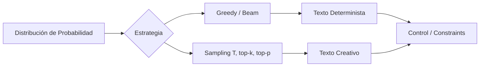

# 🎲 Generación de Texto y Decodificación: Índice y Fundamentos

La fase de decodificación transforma las distribuciones de probabilidad condicional $P(w_t | w_{<t})$ generadas por un LLM en secuencias de texto coherentes y útiles. Aunque el pre-entrenamiento define el conocimiento, la decodificación define la calidad, creatividad y fiabilidad de las respuestas.

---

## 1. Estructura del Curso

| Módulo | Título | Descripción |
|--------|--------|-------------|
| 00 | Bienvenida | Índice, glosario y objetivos |
| 01 | [[01 - Estrategias de Decodificacion\|Estrategias de Decodificación]] | Greedy, beam search, nucleus sampling, MCTS |
| 02 | [[02 - Control de Generacion\|Control de Generación]] | Constraints, guided generation, JSON mode |
| 03 | [[03 - Hallucinations y Mitigacion\|Hallucinations y Mitigación]] | Tipos, causas y técnicas de mitigación |
| 04 | [[04 - Modelos de Diffusion para Texto\|Modelos de Diffusión para Texto]] | Discrete diffusion y comparativa |
| 05 | [[05 - Caso Practico - Generador de Contenido Creativo\|Caso Práctico]] | Generador creativo con control de estilo |

---

## 2. Glosario Técnico

**Greedy Decoding:** Estrategia determinista que selecciona el token con mayor probabilidad en cada paso: $w_t = \arg\max_{w} P(w | w_{<t})$.

**Beam Search:** Algoritmo que mantiene $k$ hipótesis parciales activas, explorando múltiples caminos simultáneamente y seleccionando la secuencia de mayor probabilidad global.

**Nucleus Sampling (top-p):** Método estocástico que trunca el espacio de vocabulario a un conjunto mínimo $V^{(p)}$ tal que:

$$\sum_{w \in V^{(p)}} P(w | w_{<t}) \geq p$$

**Temperature ($T$):** Parámetro de escalado que controla la entropía de la distribución:

$$P_T(w) = \frac{\exp(z_w / T)}{\sum_{w'} \exp(z_{w'} / T)}$$

**Top-k Sampling:** Restricción del muestreo a los $k$ tokens de mayor probabilidad.

**Repetition Penalty:** Factor de penalización $\rho > 1$ aplicado a tokens repetidos para reducir loops:

$$\tilde{z}_w = z_w \cdot \rho^{-c(w)}$$

**Hallucination:** Generación de contenido no sustentado por el contexto de entrada o el conocimiento factual del modelo.

**Factuality:** Grado en que una generación corresponde con hechos verificables del mundo real.

---

## 3. Objetivos de Aprendizaje

1. Diferenciar entre estrategias deterministas (greedy, beam) y estocásticas (sampling) según requisitos de tarea.
2. Implementar control de generación mediante constraints y structured outputs.
3. Diagnosticar y mitigar alucinaciones mediante RAG, fact-checking y técnicas de self-reflection.
4. Comprender los fundamentos de los modelos de difusión aplicados a texto.
5. Construir un generador de contenido creativo con verificación de hechos integrada.

Caso real: **Google Search Generative Experience (SGE)** utiliza una combinación de beam search para factualidad en snippets y nucleus sampling con baja temperatura ($T=0.3$) para síntesis de resultados, equilibrando determinismo y fluidez.

⚠️ **Advertencia:** No existe una estrategia de decodificación universalmente óptima. La elección depende del trade-off entre coherencia, diversidad y factualidad requerido por la aplicación.

💡 **Tip:** Para tareas de código o matemáticas, prefiere beam search con $k=4$ y longitud penalizada. Para brainstorming o narrativa, usa top-p=$0.9$ y $T=0.8$.

---

## 🎯 Proyecto del Curso: Generador de Contenido Creativo

El proyecto final diseñará un sistema de generación de marketing y storytelling con las siguientes capacidades:

- **Motor de decodificación multimodal:** Selección dinámica de estrategia según tipo de contenido.
- **Control de estilo:** Inyección de códigos de control y grammar constraints para mantener voz de marca.
- **Verificación de hechos:** Pipeline de fact-checking post-generación con extracción de claims y cross-reference.
- **Métricas:** Perplejidad, diversidad (distinct-n), ROUGE, y evaluación humana Likert-5.

[[01 - Estrategias de Decodificacion]]
