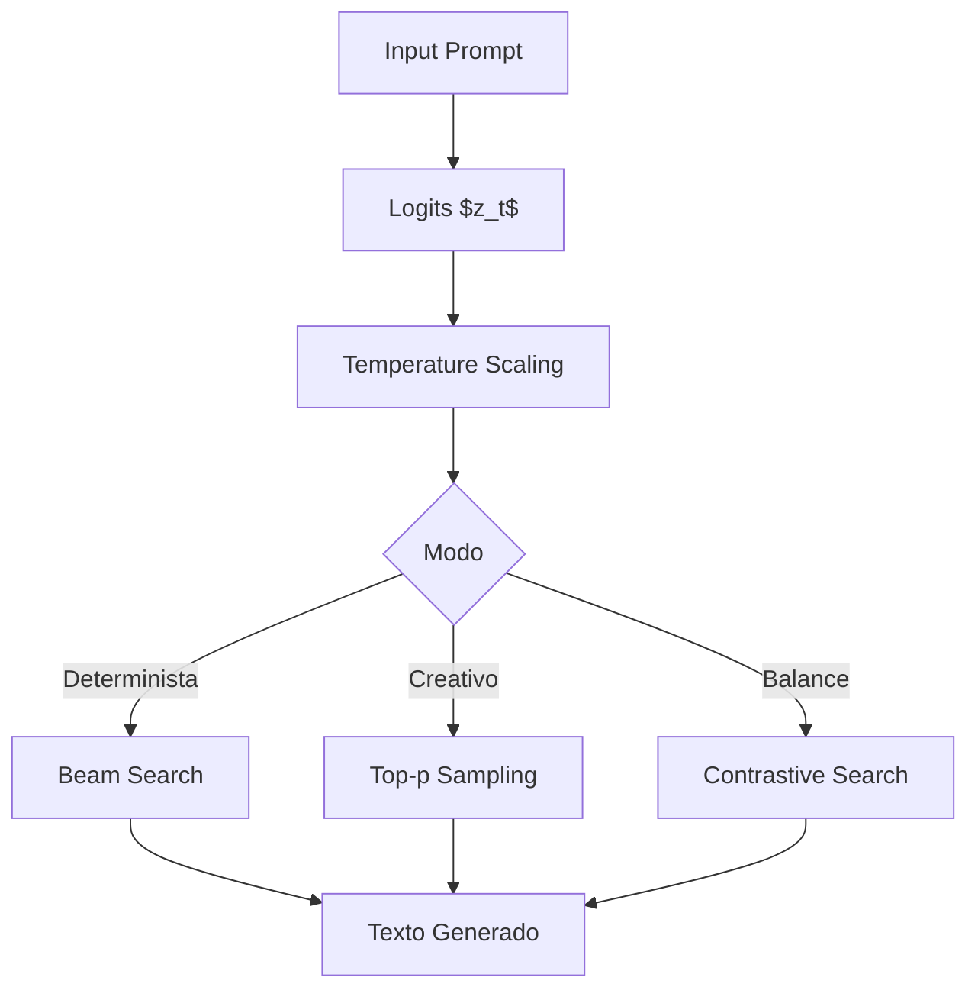

# 🧩 Estrategias de Decodificación: Del Greedy al MCTS

La decodificación es el proceso de muestreo secuencial a partir de la distribución condicional del lenguaje. La elección del algoritmo impacta directamente en la calidad, diversidad y exactitud del texto generado.

---

## 1. Greedy Decoding

La estrategia más simple y determinista. En cada paso de tiempo $t$, selecciona el token de máxima probabilidad:

$$w_t = \arg\max_{w \in \mathcal{V}} P(w | w_{<t}, x)$$

Aunque computacionalmente barata $\mathcal{O}(V)$ por paso, tiende a producir texto genérico, repetitivo y subóptimo globalmente. La maximización local no garantiza la secuencia de máxima probabilidad conjunta.

---

## 2. Beam Search

Beam search mantiene un conjunto de $k$ secuencias candidatas (el beam). En cada paso, expande cada candidato con los $k$ tokens más probables y conserva los $k$ mejores scores acumulados.

El score de una secuencia $y = (y_1, \dots, y_t)$ se define como:

$$\text{score}(y) = \frac{1}{t^\alpha} \sum_{i=1}^t \log P(y_i | y_{<i}, x)$$

donde $\alpha \in [0,1]$ es el factor de normalización por longitud. Sin normalización ($\alpha=0$), beam search favorece secuencias cortas.

| Parámetro | Efecto | Valor Típico |
|-----------|--------|--------------|
| beam width $k$ | Trade-off calidad/coste | 4-10 |
| length penalty $\alpha$ | Control de longitud | 0.6-1.0 |
| early stopping | Termina cuando todos los beams generan EOS | True |

⚠️ **Advertencia:** Beam search puede sufrir **degeneración por repeticiones** y falta de diversidad incluso con $k>1$, ya que los beams tienden a converger en los primeros tokens.

---

## 3. Sampling Estocástico

Para introducir diversidad, se aplica muestreo directo sobre la distribución softmax.

### Temperature Scaling

El parámetro $T$ reescala los logits $z_w$ antes de la normalización:

$$P(w) = \frac{\exp(z_w / T)}{\sum_{w'} \exp(z_{w'} / T)}$$

- $T \to 0$: comportamiento greedy.
- $T = 1$: distribución original.
- $T > 1$: mayor entropía, texto más aleatorio.

### Top-k Sampling

Restringe el espacio de muestreo a los $k$ tokens más probables:

$$\mathcal{V}_{\text{top-k}} = \{ w : \text{rank}(P(w)) \leq k \}$$

Problema: para distribuciones muy picudas, top-k puede incluir tokens de muy baja probabilidad. Para distribuciones planas, puede truncar excesivamente.

### Nucleus Sampling (Top-p)

Soluciona la rigidez de top-k seleccionando el conjunto mínimo de tokens $V^{(p)}$ cuya masa de probabilidad acumulada alcanza $p$:

$$V^{(p)} = \{ w_1, w_2, \dots, w_k \}, \quad \sum_{i=1}^k P(w_i) \geq p$$

Esto adapta dinámicamente el tamaño del conjunto de muestreo a la incertidumbre local.

| Método | Fórmula de Selección | Diversidad | Control |
|--------|----------------------|------------|---------|
| Greedy | $\arg\max P(w)$ | Nula | Alto |
| Beam | Top-$k$ secuencias | Baja | Alto |
| Temperature | Sampleo $P_T(w)$ | Media | Medio |
| Top-k | Sampleo sobre $V_{\text{top-k}}$ | Media | Medio |
| Top-p | Sampleo sobre $V^{(p)}$ | Alta | Medio |

---

## 4. Contrastive Search

Propuesto para mitigar la degeneración del modelo (repeticiones e incoherencias), contrastive search combina dos términos:

1. **Probabilidad del modelo:** prefere tokens de alta probabilidad.
2. **Penalización por degeneración:** desalienta tokens similares al contexto previo.

El score de contraste para un token candidato $w$ es:

$$\text{score}(w) = (1 - \alpha) \cdot \underbrace{\log P(w | w_{<t})}_{\text{likelihood}} - \alpha \cdot \underbrace{\max_{1 \leq j \leq t-1} \{\text{cos}(h_w, h_{w_j})\}}_{\text{degeneration penalty}}$$

donde $h_w$ es la representación oculta del token $w$ y $\alpha \in [0,1]$ controla el trade-off.

---

## 5. Monte Carlo Tree Search (MCTS) para Texto

MCTS formaliza la generación como un proceso de búsqueda en árbol donde cada nodo es un estado parcial $s_t = (w_1, \dots, w_t)$.

Las cuatro fases de MCTS aplicadas a lenguaje:

1. **Selección:** Desde la raíz, seleccionar nodos usando UCT (Upper Confidence Bound):
   $$U(s,a) = Q(s,a) + c \sqrt{\frac{\ln N(s)}{N(s,a)}}$$
2. **Expansión:** Expandir el nodo hoja añadiendo los tokens más probables.
3. **Simulación (Rollout):** Generar una secuencia completa con sampling rápido hasta EOS.
4. **Retropropagación:** Actualizar estadísticas $Q$ y $N$ hacia la raíz.

Caso real: **AlphaCode (DeepMind)** utiliza un esquema de generate-and-test donde MCTS guía la exploración del espacio de programas, y un modelo de valor filtra soluciones sintácticamente inválidas antes de la evaluación.

---

## 📦 Código de Compresión: Motor de Decodificación Multi-Estrategia

```python
from transformers import AutoModelForCausalLM, AutoTokenizer
import torch

model_id = "meta-llama/Llama-2-7b-hf"
model = AutoModelForCausalLM.from_pretrained(model_id, torch_dtype=torch.float16, device_map="auto")
tokenizer = AutoTokenizer.from_pretrained(model_id)

prompt = "La inteligencia artificial en medicina permite"
inputs = tokenizer(prompt, return_tensors="pt").to(model.device)

# 1. Greedy
greedy_output = model.generate(**inputs, max_new_tokens=50, do_sample=False)

# 2. Beam Search
beam_output = model.generate(
    **inputs,
    max_new_tokens=50,
    num_beams=5,
    early_stopping=True,
    no_repeat_ngram_size=2,
    num_return_sequences=3
)

# 3. Nucleus Sampling
nucleus_output = model.generate(
    **inputs,
    max_new_tokens=50,
    do_sample=True,
    temperature=0.8,
    top_p=0.92,
    top_k=50
)

# 4. Contrastive Search (soportado en transformers >= 4.26)
contrastive_output = model.generate(
    **inputs,
    max_new_tokens=50,
    penalty_alpha=0.6,
    top_k=4
)

print("GREEDY:", tokenizer.decode(greedy_output[0], skip_special_tokens=True))
print("BEAM:", tokenizer.decode(beam_output[0], skip_special_tokens=True))
print("NUCLEUS:", tokenizer.decode(nucleus_output[0], skip_special_tokens=True))
print("CONTRASTIVE:", tokenizer.decode(contrastive_output[0], skip_special_tokens=True))
```

---

## 🎯 Proyecto: Componente 1 - Motor de Decodificación del Generador Creativo

El generador de contenido implementará un router dinámico de estrategias:

1. **Marketing factual (slogans, descripciones):** Beam search con $k=5$, $\alpha=0.8$, repetition penalty $1.2$.
2. **Storytelling creativo:** Nucleus sampling $p=0.95$, $T=0.85$, top-k=80.
3. **Código o estructuras:** Greedy con grammar constraints (ver módulo 02).

La evaluación comparará perplexity por dominio y diversidad (distinct-2/3) para cada estrategia.

[[02 - Control de Generacion]]



