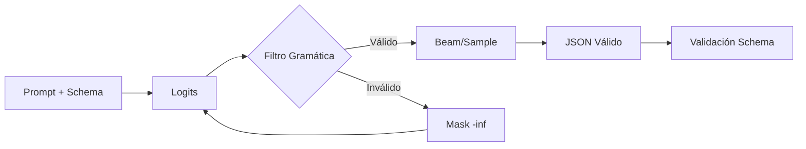

# 🎛️ Control de Generación: Constraints y Salidas Estructuradas

Más allá de la decodificación, el control de generación permite forzar al LLM a producir texto que satisfaga restricciones formales: sintaxis JSON, gramáticas context-free, o estilos específicos. Esto es crítico para integrar LLMs en pipelines de software.

---

## 1. Logit Bias

La API de modificación de logits permite aumentar o disminuir la probabilidad de tokens específicos. Dado un conjunto de tokens $\mathcal{T}_{\text{bias}}$ y un valor de sesgo $b$, los logits modificados son:

$$\tilde{z}_t(w) = z_t(w) + b \cdot \mathbb{1}[w \in \mathcal{T}_{\text{bias}}]$$

Aplicaciones comunes:
- Forzar formato (ej. aumentar probabilidad de `\n`, `{`, `}`).
- Suprimir tokens no deseados (ej. palabras toxicas).
- Inyección de tokens de control.

⚠️ **Advertencia:** Un bias excesivo ($|b| > 10$) puede forzar la aparición de tokens en contextos sintácticamente inválidos, degradando la calidad.

---

## 2. Grammar Constraints y Guided Generation

**Guided generation** restringe el espacio de tokens válidos en cada paso mediante una gramática formal $\mathcal{G}$ (ej. EBNF). En cada paso $t$, el decodificador computa:

$$\mathcal{V}_t = \{ w \in \mathcal{V} : \text{prefix} + w \text{ es prefijo válido de } \mathcal{G} \}$$

y fuerza $P(w) = 0$ para $w \notin \mathcal{V}_t$.

Implementaciones como **outlines**, **lm-format-enforcer** o **guidance** construyen autómatas finitos sobre la gramática para filtrado eficiente en $\mathcal{O}(1)$ por token.

| Librería | Gramática Soportada | Overhead | Framework |
|----------|---------------------|----------|-----------|
| outlines | Regex, JSON Schema, EBNF | Bajo | Transformers, vLLM |
| lm-format-enforcer | JSON Schema | Mínimo | HuggingFace |
| guidance | Programa de control | Medio | Local/API |
| jsonformer | JSON Schema | Bajo | HuggingFace |

---

## 3. JSON Mode y Structured Outputs

Muchas aplicaciones requieren salidas parseables. El JSON mode fuerza la generación de JSON válido:

1. Preprocesar el schema como gramática.
2. En cada paso, filtrar tokens que violen la sintaxis JSON o el schema.
3. Validar post-generación con `jsonschema`.

Ejemplo de schema:

```json
{
  "type": "object",
  "properties": {
    "nombre": {"type": "string"},
    "edad": {"type": "integer"},
    "sintomas": {"type": "array", "items": {"type": "string"}}
  },
  "required": ["nombre", "sintomas"]
}
```

💡 **Tip:** Siempre incluye un campo `"confidence": {"type": "number"}` en schemas de extracción para cuantificar la incertidumbre del modelo.

---

## 4. Control Codes y Style Transfer

Los **control codes** son tokens especiales prepended al prompt que condicionan el estilo, la longitud o el tono. En modelos como CTRL, el código determina el dominio:

$$P(y|c, x) \quad \text{donde } c \in \{\text{Review}, \text{News}, \text{Horror}\}$$

Para style transfer sin fine-tuning, se pueden usar prompts de role o instrucciones explícitas:

> Escribe el siguiente párrafo en estilo técnico formal, como si fuera un artículo de Nature.

---

## 5. Guided Generation con Beam Pruning

En beam search, la restricción gramatical se implementa podando beams inválidos. La función de score se modifica:

$$\text{score}'(y) = \begin{cases} \text{score}(y) & \text{si } y \in \mathcal{L}(\mathcal{G}) \\ -\infty & \text{en otro caso} \end{cases}$$

Esto garantiza que todos los beams activos sean prefijos válidos de la gramática.

Caso real: **Microsoft Guidance** permite generar estructuras complejas (listas, condicionales, select) garantizando que el output siempre sea parseable, eliminando la necesidad de reintentos por formato inválido en pipelines de extracción de datos.

---

## 📦 Código de Compresión: Generación Guiada con Outlines

```python
import outlines
from transformers import AutoModelForCausalLM, AutoTokenizer

model_name = "mistralai/Mistral-7B-v0.1"
model = AutoModelForCausalLM.from_pretrained(model_name, device_map="auto")
tokenizer = AutoTokenizer.from_pretrained(model_name)

# 1. Regex constraint
regex_str = r"[A-Z]{3}-\d{4}"
generator = outlines.generate.regex(model, regex_str)
output = generator("Código de producto: ", max_tokens=30)
print(output)  # Ej: ABC-1234

# 2. JSON Schema constraint
import outlines.fsm as fsm
from pydantic import BaseModel

class User(BaseModel):
    name: str
    age: int
    email: str

generator_json = outlines.generate.json(model, User)
output_json = generator_json("Genera un usuario de ejemplo: ")
print(output_json)  # User(name='...', age=..., email='...')

# 3. Logit bias manual (vía transformers)
import torch

input_ids = tokenizer("El resultado es", return_tensors="pt").to(model.device)
scores = model(**input_ids).logits[:, -1, :]

# Penalizar números pares (ejemplo ilustrativo)
even_tokens = [tokenizer.encode(str(i), add_special_tokens=False)[0] for i in [0,2,4,6,8]]
scores[0, even_tokens] -= 10.0

next_token = torch.argmax(scores, dim=-1)
print(tokenizer.decode(next_token))
```

---

## 🎯 Proyecto: Componente 2 - Control de Estilo y Formato

El generador de contenido creativo implementará control granular:

1. **Marketing copy:** JSON mode con schema de `headline`, `body`, `cta`, `target_audience`.
2. **Storytelling:** Control codes para género (scifi, fantasy, thriller) y longitud objetivo (short, novella).
3. **Verificación intermedia:** Cada sección generada se valida contra una grammar EBNF antes de continuar, evitando estructuras rotas.
4. **Logit bias dinámico:** Palabras de marca se potencian (+2.0) y términos prohibidos se suprimen (-inf) según guidelines del cliente.

[[03 - Hallucinations y Mitigacion]]



