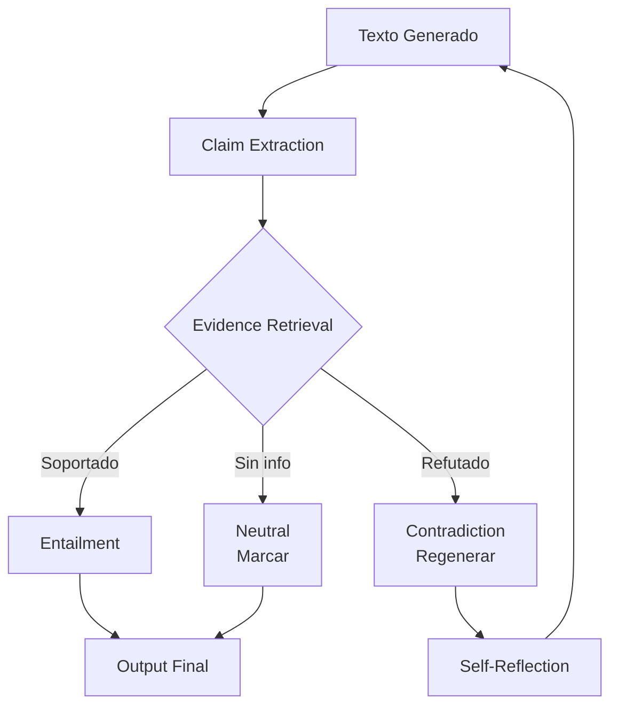

# 👁️ Hallucinations y Mitigación: Garantizando la Factualidad

Las alucinaciones en LLMs son generaciones plausibles pero factualmente incorrectas o no sustentadas. Representan el principal obstáculo para el despliegue seguro de LLMs en dominios críticos como medicina, derecho y finanzas.

---

## 1. Tipos de Alucinación

### Alucinación Factual
El modelo afirma hechos incorrectos sobre el mundo real:

> "El primer presidente de Estados Unidos fue Thomas Jefferson." (Falso)

### Alucinación Intrínseca
La generación contradice la información proporcionada en el contexto de entrada. Si el prompt dice "Juan tiene 30 años" y el modelo responde "Juan tiene 25 años", es una alucinación intrínseca.

### Alucinación Extrínseca
El modelo introduce información no presente en el contexto y no verificable. Es factualmente indeterminada sin fuentes externas.

| Tipo | Fuente de verdad | Detectabilidad | Severidad |
|------|------------------|----------------|-----------|
| Factual | Conocimiento externo | Requiere fact-checking | Alta |
| Intrínseca | Input del usuario | Automática (NLI) | Media |
| Extrínseca | Input + externo | Semi-automática | Media-Alta |

---

## 2. Causas Fundamentales

**Knowledge Gaps:** El modelo no ha visto ciertos hechos durante el pre-entrenamiento o estos ocurrieron después del corte de conocimiento.

**Exposure Bias:** Durante el entrenamiento, el modelo ve tokens ground-truth; en inferencia, ve sus propios tokens. Esta discrepancia se acumula:

$$P_{\text{train}}(y_t|y^*_{<t}) \neq P_{\text{infer}}(y_t|y_{<t})$$

**Misalignment:** El objetivo de pre-entrenamiento (modelar $P(x)$) no está alineado con el objetivo deseado (veracidad). Un modelo con baja perplejidad puede ser altamente alucinatorio.

**Sycophancy:** Tendencia del modelo a ajustar su respuesta a las creencias implícitas del usuario, generando confirmaciones falsas.

---

## 3. Mitigación con RAG

Retrieval-Augmented Generation mitiga alucinaciones factual y extrínseca proporcionando contexto verificado. La probabilidad condicionada es:

$$P(y|x) = \sum_{z \in \text{top-}k(\mathcal{R}(x))} P(z|x) \cdot P(y|x, z)$$

donde $\mathcal{R}(x)$ son documentos recuperados. Esto ancla la generación a fuentes externas.

---

## 4. Fact-Checking Post-Generación

Pipeline de verificación activa:

1. **Claim Extraction:** Extraer proposiciones factuales $c_1, \dots, c_m$ del texto generado.
2. **Evidence Retrieval:** Buscar evidencia $e_i$ en bases de conocimiento confiables.
3. **NLI Verification:** Clasificar la relación entre $c_i$ y $e_i$:
   - **Entailment:** $e \implies c$ (soportado)
   - **Contradiction:** $e \implies \neg c$ (refutado)
   - **Neutral:** sin relación (no verificable)

$$v(c) = \text{NLI}(c, \text{argmax}_{e} \text{sim}(c,e))$$

---

## 5. Self-Reflection y Constitutional AI

**Self-Reflection:** El modelo evalúa críticamente su propia respuesta en un segundo paso:

> Revisa tu respuesta anterior. ¿Hay afirmaciones que no puedas sustentar? Corrígelas.

**Constitutional AI (CAI):** Entrenamiento donde el modelo genera críticas de sus propias respuestas basándose en un conjunto de principios (constitución), y luego fine-tunea para preferir las versiones revisadas. La función de pérdida de RLHF se extiende a:

$$\mathcal{L}_{\text{CAI}} = \mathbb{E}_{(x,y) \sim \mathcal{D}} \left[ \log \frac{\pi_\theta(y|x)}{\pi_{\text{ref}}(y|x)} \cdot (R_{\text{helpful}}(y) + R_{\text{harmless}}(y)) \right]$$

Caso real: **Anthropic Claude** fue entrenado con Constitutional AI para reducir respuestas tóxicas y alucinatorias, utilizando un conjunto de principios éticos que el modelo aplica a sus propios outputs antes de presentarlos.

---

## 📦 Código de Compresión: Pipeline de Mitigación

```python
from transformers import pipeline
import spacy

# 1. Claim extraction (heurística simple con NER + verbos)
nlp = spacy.load("es_core_news_md")

def extract_claims(text):
    doc = nlp(text)
    claims = []
    for sent in doc.sents:
        if any(tok.pos_ == "VERB" for tok in sent):
            claims.append(sent.text)
    return claims

# 2. NLI para verificación
nli = pipeline("text-classification", model="facebook/bart-large-mnli")

def verify_claim(claim, evidence):
    result = nli(f"{evidence} [SEP] {claim}")
    return result[0]['label'], result[0]['score']

# 3. Self-reflection prompt
def self_reflect(original_answer):
    reflection_prompt = f"""Revisa la siguiente respuesta críticamente.
Identifica afirmaciones no sustentadas o potencialmente incorrectas.
Respuesta: {original_answer}
Crítica:"""
    # Llamada al modelo (simplificado)
    critique = llm.generate(reflection_prompt)
    return critique

# 4. RAG simplificado
def rag_generate(query, retriever, generator):
    docs = retriever.similarity_search(query, k=3)
    context = "\n".join([d.page_content for d in docs])
    prompt = f"Contexto: {context}\n\nPregunta: {query}\nRespuesta basada únicamente en el contexto:"
    return generator(prompt)
```

---

## 🎯 Proyecto: Componente 3 - Verificación de Hechos en el Generador Creativo

El generador creativo no está exento de alucinaciones factuales (nombres de productos, estadísticas de mercado). Se implementará:

1. **Extractor de claims:** Uso de spaCy + reglas para identificar proposiciones numéricas y nominales.
2. **Base de verificación:** Vector store de hechos aprobados por el equipo legal/marketing.
3. **Umbral de confianza:** Si NLI score < 0.75, el claim se marca como `[VERIFICAR]` y se alerta al editor.
4. **Constitutional layer:** System prompt con principios de veracidad: "No inventes estadísticas. Usa solo datos proporcionados o señala la falta de información."

[[04 - Modelos de Diffusion para Texto]]



