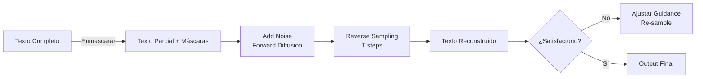

# 🌫️ Modelos de Diffusion para Texto: Más Allá de las Imágenes

Si bien Stable Diffusion e DALL-E popularizaron la difusión para imágenes, los modelos de difusión también se aplican a texto. Estos modelos desafían el paradigma autoregresivo, ofreciendo generación paralela, control global y capacidades de edición únicas.

---

## 1. Fundamentos de Diffusion Models

Un modelo de difusión aprende a revertir un proceso de ruido progresivo. Dado un dato $x_0$, el proceso forward añade ruido gaussiano en $T$ pasos:

$$q(x_t | x_{t-1}) = \mathcal{N}(x_t; \sqrt{1-\beta_t} x_{t-1}, \beta_t I)$$

El modelo aprende la reverse distribution parametrizada por $\theta$:

$$p_\theta(x_{t-1}|x_t) = \mathcal{N}(x_{t-1}; \mu_\theta(x_t, t), \Sigma_\theta(x_t, t))$$

La pérdida típica es el error de predicción de ruido:

$$\mathcal{L} = \mathbb{E}_{x_0, t, \epsilon} \left[ ||\epsilon - \epsilon_\theta(x_t, t)||^2 \right]$$

---

## 2. Discrete Diffusion para Texto

El texto es discreto (vocabulario finito $\mathcal{V}$), por lo que el ruido gaussiano no aplica directamente.

**Diffusion-LM** y **D3PM** definen procesos de transición categórica:

$$q(x_t | x_{t-1}) = \text{Cat}(x_t; p = Q_t x_{t-1})$$

donde $Q_t \in \mathbb{R}^{|\mathcal{V}| \times |\mathcal{V}|}$ es una matriz de transición. Típicamente, $Q_t$ define una transición uniforme o absorción hacia un token [MASK].

El modelo aprende a desenmascarar o reasignar tokens en cada paso de reverse:

$$p_\theta(x_{t-1}|x_t) = \text{Cat}(x_{t-1}; \text{softmax}(f_\theta(x_t, t)))$$

---

## 3. Continuous Diffusion en Espacio Latente

**SSD-LM (Structured State Space Diffusion)** proyecta texto a embeddings continuos $z \in \mathbb{R}^{d \times L}$ y aplica difusión gaussiana en ese espacio. La generación final se obtiene proyectando $z_0$ al vocabulario discreto:

$$x = \arg\max_{w} E(w)^\top z_0$$

Esto evita las complejidades de la difusión discreta y aprovecha la suavidad del espacio latente.

---

## 4. Text Destruction / Reconstruction

Una perspectiva unificadora: la difusión destruye información estructurada (palabras → ruido) y el modelo reconstruye la estructura. En contraste con autoregresivos, donde la destrucción es unidireccional (predicción del futuro), la difusión destruye globalmente.

La reconstrucción permite **edición**: dado un texto parcialmente enmascarado $x_{\text{known}}$, se fijan esas posiciones durante el reverse sampling y se difunden solo las regiones desconocidas.

---

## 5. Comparativa: Diffusion vs. Autoregressive

| Característica | Autoregresivo (GPT) | Diffusion (Text) |
|----------------|---------------------|------------------|
| Generación | Secuencial (izq→der) | Paralela (iterativa) |
| Control global | Limitado (prompt) | Alto (classifier-free guidance) |
| Edición | Difícil (infilling) | Natural (masking condicional) |
| Coherencia larga | Alta (cadena causal) | Variable (depende de pasos) |
| Entrenamiento | Teacher forcing | Difusión forward/reverse |
| Sampling | 1 paso por token | $T$ pasos (50-1000) |

Caso real: **Google's Diffusion-LM** demostró que la difusión en espacio latente produce texto con mejor control de longitud y estilo que GPT-2 en tareas de generación condicionada, aunque con mayor coste computacional por la iteratividad.

---

## 📦 Código de Compresión: Diffusion Simplificada con Transformers

```python
import torch
import torch.nn as nn
from transformers import AutoTokenizer

# Modelo simplificado de predicción de ruido para secuencias de texto
class TextDiffusion(nn.Module):
    def __init__(self, vocab_size, d_model=512, n_layers=6):
        super().__init__()
        self.embedding = nn.Embedding(vocab_size, d_model)
        self.time_embed = nn.Embedding(1000, d_model)
        self.transformer = nn.TransformerEncoder(
            nn.TransformerEncoderLayer(d_model, nhead=8), num_layers=n_layers
        )
        self.head = nn.Linear(d_model, vocab_size)
    
    def forward(self, x_t, t):
        # x_t: tokens ruidosos (con máscaras), t: timestep
        h = self.embedding(x_t) + self.time_embed(t).unsqueeze(1)
        h = self.transformer(h)
        return self.head(h)  # logits para reconstrucción

# Forward process (simplificado: masking aleatorio)
def add_noise(x, t, mask_token_id):
    mask = torch.rand(x.shape) < (t.float() / 1000.0)
    x_noisy = x.clone()
    x_noisy[mask] = mask_token_id
    return x_noisy

# Reverse sampling (simplificado)
@torch.no_grad()
def sample(model, tokenizer, steps=50):
    x = torch.full((1, 64), tokenizer.mask_token_id, dtype=torch.long)
    for t in reversed(range(steps)):
        t_tensor = torch.full((1,), t, dtype=torch.long)
        logits = model(x, t_tensor)
        probs = torch.softmax(logits, dim=-1)
        x = torch.multinomial(probs.view(-1, probs.size(-1)), num_samples=1).view(1, -1)
    return tokenizer.decode(x[0])

# Nota: Este es un esquema educativo. En producción usar Diffusers o implementaciones oficiales.
```

---

## 🎯 Proyecto: Componente 4 - Exploración de Diffusion para Edición Creativa

El generador de contenido explorará difusión para **reedición de borradores**:

1. **Infilling:** El usuario marca secciones de un borrador para reescritura; esas posiciones se difunden mientras el resto permanece fijo.
2. **Style transfer latente:** Interpolación en el espacio latente del diffusion model entre embeddings de estilo distintos (formal vs. coloquial).
3. **Iterative refinement:** El generador propone 3 variantes por diffusion sampling con distintas seeds; el usuario selecciona y el sistema refina.
4. **Trade-off:** Dado el coste de 50 pasos de sampling, se reservará para tareas de edición, mientras la generación from-scratch usará autoregresivo rápido.

[[05 - Caso Practico - Generador de Contenido Creativo]]



