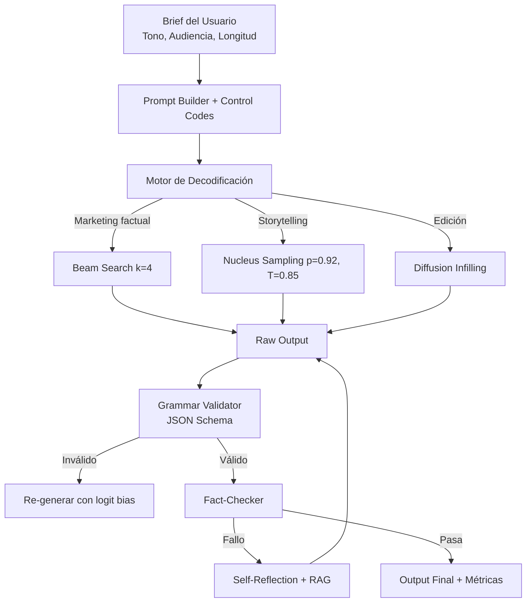

# ✍️ Caso Práctico: Generador de Contenido Creativo

Este módulo consolida el curso en un sistema de generación de marketing y storytelling, integrando decodificación controlada, verificación de hechos y, opcionalmente, edición por difusión.

---

## 1. Requisitos del Sistema

| Requisito | Descripción | Métrica Objetivo |
|-----------|-------------|------------------|
| Estilo | Consistencia con voz de marca | Classifier accuracy > 0.85 |
| Diversidad | Evitar clichés y repeticiones | Distinct-2 > 0.75 |
| Factualidad | Estadísticas y nombres correctos | Fact-check pass rate > 0.90 |
| Estructura | JSON válido para integración | Schema compliance 100% |
| Velocidad | Generación de copy corto < 2s | Latencia p95 < 2s |

---

## 2. Arquitectura del Generador



---

## 3. Control de Estilo y Decodificación Dinámica

El sistema selecciona hiperparámetros según el tipo de contenido:

**Copy publicitario (factual, breve):**
- Beam width $k=4$, length penalty $\alpha=0.8$
- Repetition penalty $\rho=1.15$
- Logit bias: potenciar tokens de llamada a la acción (comprar, descubre, únete)

**Narrativa larga (creativa, diversa):**
- Temperature $T=0.85$, top-p $=0.92$, top-k $=80$
- Control code: `[Genre: Fantasy; Length: Long]`
- Contrastive search para evitar loops

La fórmula de score combinado para diversidad:

$$\text{Diversity} = \frac{|\text{unique n-grams}|}{|\text{total n-grams}|}$$

Objetivo: Distinct-2 $> 0.75$ y Distinct-3 $> 0.65$.

---

## 4. Verificación de Hechos y Refinamiento

Para contenido que incluye datos (números de mercado, nombres de productos):

1. **Extracción:** Regex + NER para claims numéricos y entidades.
2. **Lookup:** Búsqueda en vector store de hechos aprobados por el cliente.
3. **Verificación:** NLI con umbral 0.75. Claims fallidos se sustituyen por placeholders `[VERIFICAR]`.
4. **Reescritura condicional:** Si el ratio de placeholders > 10%, se re-genera la sección con un prompt más restrictivo y contexto factual inyectado.

---

## 5. Métricas de Evaluación

### Perplejidad
$$\text{PPL} = \exp\left(-\frac{1}{N}\sum_{i=1}^N \log P(w_i|w_{<i})\right)$$

Mide fluidez; valores bajos indican mayor confianza del modelo en sus predicciones.

### Diversidad (Distinct-n)
$$\text{Distinct-}n = \frac{|\text{unique n-grams en outputs}|}{|\text{total n-grams generados}|}$$

### Evaluación Humana
Escala Likert-5 en tres dimensiones:
- Coherencia (1-5)
- Creatividad (1-5)
- Alineación con brief (1-5)

Caso real: **Jasper AI y Copy.ai** utilizan pipelines similares: decodificación controlada con fine-tuning ligero sobre GPT-4/Claude, seguido de verificación heurística de formato y keywords. Sus benchmarks internos muestran que la combinación de beam search con logit bias reduce en un 40% la necesidad de edición humana en copy corto respecto a sampling libre.

---

## 📦 Código de Compresión: Generador End-to-End

```python
import torch
from transformers import AutoModelForCausalLM, AutoTokenizer
from pydantic import BaseModel
import json

class AdCopy(BaseModel):
    headline: str
    body: str
    cta: str
    target_audience: str

model_id = "mistralai/Mistral-7B-Instruct-v0.2"
model = AutoModelForCausalLM.from_pretrained(model_id, torch_dtype=torch.float16, device_map="auto")
tokenizer = AutoTokenizer.from_pretrained(model_id)

def generate_copy(brief: str, genre: str = "professional"):
    control = f"[Genre: {genre}]\nBrief: {brief}\nGenera un JSON con headline, body, cta, target_audience.\n"
    inputs = tokenizer(control, return_tensors="pt").to(model.device)
    
    outputs = model.generate(
        **inputs,
        max_new_tokens=256,
        do_sample=True,
        temperature=0.7,
        top_p=0.9,
        repetition_penalty=1.2,
        pad_token_id=tokenizer.eos_token_id
    )
    
    raw = tokenizer.decode(outputs[0], skip_special_tokens=True)
    # Extracción heurística de JSON (en producción usar regex o grammar constraint)
    try:
        json_str = raw[raw.find("{"):raw.rfind("}")+1]
        return AdCopy(**json.loads(json_str))
    except Exception:
        return {"raw": raw, "error": "parse_failed"}

# Evaluación de diversidad
def distinct_n(texts, n=2):
    ngrams = set()
    total = 0
    for text in texts:
        tokens = text.split()
        for i in range(len(tokens)-n+1):
            ngrams.add(tuple(tokens[i:i+n]))
            total += 1
    return len(ngrams) / total if total > 0 else 0

copies = [generate_copy("Zapatillas deportivas para runners", genre="energetic").json() for _ in range(10)]
print("Distinct-2:", distinct_n(copies, 2))
```

---

## 🎯 Proyecto Final: Despliegue y Escalado

1. **Microservicio:** FastAPI con endpoints `/generate`, `/edit` (diffusion) y `/verify`.
2. **Cola de tareas:** Celery + Redis para generación asíncrona de narrativas largas.
3. **A/B testing:** Comparar beam vs. nucleus en engagement real (CTR en campañas de email).
4. **Fine-tuning continuo:** Semanalmente se fine-tunea un LoRA adapter con los copies aprobados por editores humanos, alineando el modelo con la voz de marca.
5. **Métricas objetivo:** PPL < 12 en holdout, Distinct-2 > 0.75, Likert promedio > 4.0, Fact-check pass rate > 0.92.

[[00 - Bienvenida]]


