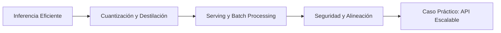

# 🏭 Sistemas de LLMs en Producción

Bienvenido al módulo **09 - Sistemas de LLMs en Producción**. En este curso trascendemos los notebooks de experimentación para adentrarnos en la ingeniería de sistemas que permiten desplegar, escalar y operar modelos de lenguaje de gran escala (LLMs) en entornos reales con latencia estricta, alta concurrencia y requisitos de seguridad. Dominar estos conceptos es indispensable para cualquier ingeniero de ML/IA que aspire a llevar modelos desde la investigación hasta productos con millones de usuarios.

La relevancia de este módulo radica en que el valor de un LLM no se mide únicamente por su capacidad de generar texto coherente, sino por su capacidad de hacerlo de forma eficiente, segura y económica. En producción, cada milisegundo de latencia y cada gigabyte de memoria GPU se traducen directamente en costos operativos y experiencia de usuario.

---

## 1. Presentación del Módulo

Este módulo cubre el ciclo de vida completo de un sistema de LLMs en producción, desde las optimizaciones de inferencia hasta los mecanismos de seguridad y alineación. A lo largo de seis unidades, exploraremos técnicas de vanguardia que son estándar de facto en la industria.

El enfoque es eminentemente práctico, combinando teoría profunda con casos de uso reales y código ejecutable en Python.

---

## 2. Índice de Contenidos

| # | Archivo | Descripción | Enlace |
|---|---------|-------------|--------|
| 1 | `01 - Inferencia Eficiente.md` | KV cache, batching continuo, speculative decoding, Flash Attention. | [[01 - Inferencia Eficiente]] |
| 2 | `02 - Quantization y Distilacion.md` | Cuantización INT8/INT4, GPTQ, AWQ, destilación de conocimiento. | [[02 - Quantization y Distilacion]] |
| 3 | `03 - Serving y Batch Processing.md` | Patrones de serving, vLLM, TGI, auto-scaling, streaming. | [[03 - Serving y Batch Processing]] |
| 4 | `04 - Seguridad y Alineacion.md` | Red teaming, guardrails, RLHF, DPO, interpretabilidad. | [[04 - Seguridad y Alineacion]] |
| 5 | `05 - Caso Practico - API de LLM Escalable.md` | Proyecto integral de API REST con métricas de producción. | [[05 - Caso Practico - API de LLM Escalable]] |

---

## 3. Glosario Extendido

A continuación, definimos los términos fundamentales que serán nuestra lingua franca durante el módulo.

### KV Cache

El **KV cache** es una estructura de datos que almacena los estados de clave (Key) y valor (Value) de los tokens ya procesados en la atención auto-regresiva. Sin él, en cada paso de generación se recalcularían estos estados para toda la secuencia, resultando en una complejidad cuadrática $O(n^2)$ en tiempo y memoria. El KV cache reduce esto a $O(n)$ por paso, aunque introduce un crecimiento lineal en el consumo de memoria GPU.

### Continuous Batching

También conocido como *iteration-level scheduling* (Orca, vLLM), es una técnica donde el *batch* de secuencias en inferencia se reconfigura dinámicamente en cada iteración del modelo. A diferencia del batching estático (donde todas las secuencias deben terminar para liberar recursos), el batching continuo permite que nuevas peticiones entren y las que han terminado salgan sin esperar, maximizando la utilización del acelerador.

### Speculative Decoding

Método de aceleración de decodificación que utiliza un modelo *draft* pequeño para generar $k$ tokens candidatos de forma rápida, mientras un modelo *target* grande verifica todos esos tokens en paralelo en una sola pasada forward. Si el token generado por el modelo grande coincide con el candidato, se acepta; de lo contrario, se rehace la generación desde el punto de divergencia. La ganancia teórica de velocidad sigue la fórmula:

$$
\text{Speedup} \approx \frac{1}{1 - \alpha}
$$

donde $\alpha$ es la tasa de aceptación de tokens del modelo draft.

### Quantization

Proceso de reducción de la precisión numérica de los pesos y/o activaciones de una red neuronal. La cuantización post-entrenamiento (PTQ) mapea tensores de alta precisión (FP16/FP32) a formatos de baja precisión (INT8, INT4, FP8) mediante factores de escala (*scale*) y puntos cero (*zero-point*).

### Distillation

**Knowledge Distillation** es la técnica de transferir conocimiento de un modelo grande y complejo (*teacher*) a uno más pequeño (*student*). El objetivo no es solo replicar las etiquetas duras, sino minimizar la divergencia entre las distribuciones de probabilidad de salida de ambos modelos, típicamente mediante la divergencia KL.

### vLLM

Framework de serving de código abierto que implementa **Paged Attention**, una téquina inspirada en la memoria virtual de los sistemas operativos para gestionar el KV cache de manera no contigua y eficiente, eliminando la fragmentación de memoria interna y permitiendo batching continuo a gran escala.

### TensorRT-LLM

SDK de NVIDIA que optimiza la inferencia de LLMs en GPUs mediante compilación de gráfos de computación, fusión de kernels, cuantización y soporte para múltiples GPUs. Está diseñado para extraer el máximo rendimiento de hardware NVIDIA en centros de datos.

### TGI (Text Generation Inference)

Framework desarrollado por Hugging Face para el despliegue de LLMs en producción. Soporta sharding de modelos, cuantización, streaming de tokens, y es la base de sus Inference Endpoints comerciales.

### Guardrails

Sistemas de protección que envuelven a un LLM para validar entradas (prompts) y salidas (respuestas) contra políticas de seguridad, privacidad y calidad. Herramientas como NVIDIA NeMo Guardrails o Llama Guard permiten mitigar riesgos de jailbreaking o generación de contenido tóxico.

### Red Teaming

Práctica de evaluación de seguridad de modelos de IA mediante la simulación sistemática de ataques adversariales. El objetivo es descubrir vulnerabilidades (prompt injection, data exfiltration) antes de que actores maliciosos lo hagan en producción.

---

## 4. Objetivos de Aprendizaje

Al finalizar este módulo, serás capaz de:

1. Diseñar arquitecturas de inferencia eficiente aplicando KV cache, Flash Attention y speculative decoding.
2. Cuantizar y destilar modelos para reducir costos operativos sin degradar significativamente la calidad.
3. Desplegar sistemas de serving escalables con batching dinámico, routing y auto-scaling.
4. Implementar mecanismos de seguridad y alineación mediante guardrails, RLHF y técnicas de red teaming.
5. Construir una API REST completa para servir LLMs con monitoreo de métricas de producción.

---

### Roadmap del Módulo

---

---

### 🎯 Proyecto del Módulo: API REST Escalable

El proyecto final de este curso consiste en diseñar e implementar una API REST para servir un LLM con requisitos de alta disponibilidad, baja latencia y monitoreo continuo. Se documenta exhaustivamente en la nota [[05 - Caso Practico - API de LLM Escalable]].

Los componentes clave del proyecto incluyen:

- Servidor **FastAPI** con endpoints de chat y streaming.
- Motor de inferencia **vLLM** o **TensorRT-LLM**.
- Rate limiting y autenticación con API keys.
- Métricas de producción: **TTFT** (Time To First Token), **TPS** (Tokens Per Second), throughput y latency percentiles.

💡 **Tip:** Antes de abordar el proyecto, asegúrate de dominar los conceptos de las notas 01 a 04, ya que el caso práctico los integra todos.

⚠️ **Advertencia:** Desplegar LLMs en producción sin métricas de observabilidad es operar a ciegas. Instrumenta tu sistema desde el día cero.
