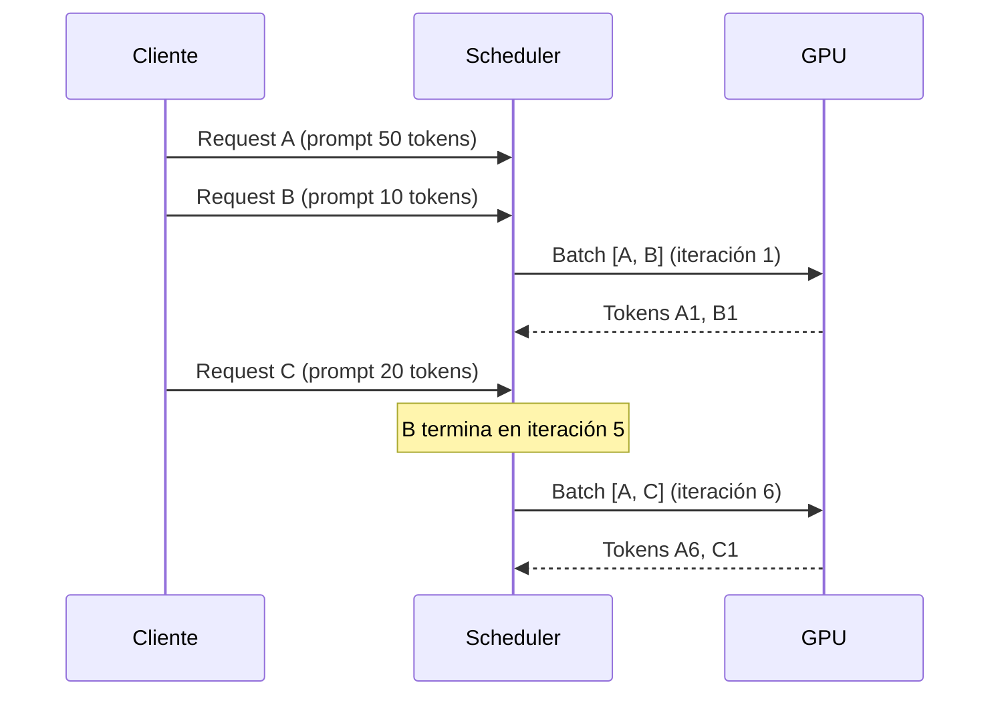
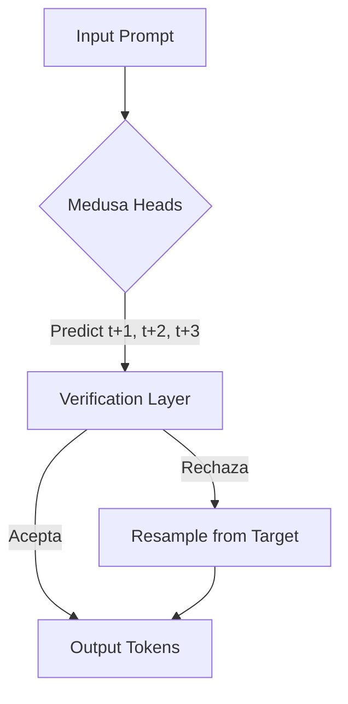

# ⚡ Inferencia Eficiente en Grandes Modelos de Lenguaje

La inferencia de Large Language Models (LLMs) representa el mayor costo operativo en sistemas de IA en producción. Mientras que el entrenamiento es un gasto de capital (CapEx) puntual, la inferencia es un gasto operativo (OpEx) recurrente que escala linealmente con la cantidad de usuarios. Por ello, optimizar la latencia, el throughput y la eficiencia de memoria no es un lujo, sino una necesidad competitiva. En esta nota, exploraremos las técnicas de vanguardia que permiten reducir los tiempos de respuesta de segundos a milisegundos y multiplicar el throughput por factores de 5x a 20x.

---

## 1. El Cuello de Botella del Ancho de Banda de Memoria

En la mayoría de las arquitecturas Transformer durante la fase de decodificación auto-regresiva, el rendimiento está limitado por el **ancho de banda de memoria** (memory-bound), no por la capacidad de cómputo aritmético (compute-bound). Esto ocurre porque, para generar cada nuevo token, el hardware debe cargar la totalidad de los pesos del modelo desde la memoria HBM (High Bandwidth Memory) hacia los registros y caches L1/L2 de los Streaming Multiprocessors (SMs).

El tiempo teórico mínimo para un forward pass de un token puede aproximarse como:

$$
t_{mem} = \frac{2 \cdot P \cdot b_{bytes}}{BW_{mem}}
$$

donde:
- $P$ es el número de parámetros del modelo.
- $b_{bytes}$ es el tamaño en bytes del tipo de dato (2 para FP16/BF16, 1 para INT8).
- $BW_{mem}$ es el ancho de banda de memoria efectivo de la GPU (por ejemplo, ~2 TB/s para una NVIDIA A100).

Para un modelo de 70 mil millones de parámetros en FP16, cargar los pesos requiere transferir 140 GB de datos. Si el ancho de banda efectivo es de 1.5 TB/s, solo la carga de pesos toma aproximadamente 93 ms por token. En la práctica, sumamos el tiempo de carga de activaciones y KV cache, así como la latencia de kernels.

Caso real: NVIDIA reporta que en la inferencia de GPT-3 (175B) en una sola GPU, menos del 3% del tiempo se dedica a operaciones FLOPs; el resto es espera por memoria.

⚠️ **Advertencia:** Si tu infraestructura está limitada por memoria, comprar GPUs con más FLOPs (p. ej., saltar de A100 a H100) no necesariamente mejora la latencia proporcionalmente si no se optimiza el ancho de banda y la localidad de datos.

💡 **Tip:** Antes de optimizar, perfila tu modelo con **Nsight Systems** o **PyTorch Profiler** para confirmar si el cuello de botella es memoria, cómputo o comunicación (en multi-GPU).

---

## 2. KV Cache: Fundamentos y Optimización

En la atención auto-regresiva, para predecir el token $t$, el modelo necesita calcular la similitud entre el *query* del token actual y los *keys* de todos los tokens anteriores $1 \dots t-1$, agregando los *values* correspondientes. Sin optimización, esto implicaría recalcular las proyecciones $W_K x_i$ y $W_V x_i$ para todos los tokens pasados en cada paso, una complejidad $O(t^2 \cdot d)$.

El **KV cache** resuelve esto almacenando los tensores resultantes de las proyecciones lineares de Key y Value para cada token una vez que han sido computados. Así, en el paso $t$, solo se calcula $Q_t$, y se reutilizan $K_{1:t-1}$ y $V_{1:t-1}$.

La memoria consumida por el KV cache para un batch de tamaño $b$, con $l$ capas, $h$ cabezas de atención, dimensión por cabeza $d_h$, y secuencia de longitud $s$, en precisión FP16, es:

$$
M_{KV} = 2 \times b \times l \times h \times d_h \times s \times 2 \, \text{bytes}
$$

El factor 2 inicial corresponde a las matrices K y V. Para LLaMA-2-70B, con $l=80$, $h=64$, $d_h=128$, una secuencia de 4096 tokens y batch size 1, el KV cache consume aproximadamente:

$$
M_{KV} = 2 \times 1 \times 80 \times 64 \times 128 \times 4096 \times 2 \approx 10.7 \, \text{GB}
$$

Esto supera con creces el tamaño de los pesos de una sola capa y se convierte en el principal consumidor de memoria en secuencias largas.

### Multi-Query Attention (MQA) y Grouped-Query Attention (GQA)

Para mitigar el crecimiento del KV cache, **Multi-Query Attention** (Shazeer, 2019) comparte una única cabeza de K y V entre todas las cabezas de Q. Esto reduce el tamaño del KV cache por un factor $h$.

**Grouped-Query Attention** (Ainslie et al., 2023) es un compromiso: divide las $h$ cabezas de Q en $g$ grupos, donde cada grupo comparte un par K-V. LLaMA 2 (70B) utiliza GQA con $g=8$, reduciendo el KV cache a 1/8 del tamaño original sin degradar significativamente la calidad.

| Mecanismo | Cabezas K/V | Factor de Reducción de KV Cache | Impacto en Perplejidad |
|-----------|-------------|----------------------------------|------------------------|
| MHA (Multi-Head) | $h$ | 1.0x | Baseline |
| GQA | $g < h$ | $h/g$ | Leve (~0.1-0.3%) |
| MQA | 1 | $h$ | Moderado (~1-2%) |

Caso real: **Mistral 7B** y **LLaMA 2 70B** adoptaron GQA específicamente para escalar a ventanas de contexto de 32k y 128k tokens respectivamente, donde un KV cache completo sería prohibitivo.

```python
import torch
import torch.nn as nn

class GQASelfAttention(nn.Module):
    def __init__(self, d_model=4096, n_heads=32, n_kv_heads=8):
        super().__init__()
        self.n_heads = n_heads
        self.n_kv_heads = n_kv_heads
        self.head_dim = d_model // n_heads
        
        # Proyecciones
        self.W_q = nn.Linear(d_model, d_model)
        self.W_k = nn.Linear(d_model, n_kv_heads * self.head_dim)
        self.W_v = nn.Linear(d_model, n_kv_heads * self.head_dim)
        self.W_o = nn.Linear(d_model, d_model)
    
    def forward(self, x, past_kv=None):
        b, s, _ = x.size()
        q = self.W_q(x).view(b, s, self.n_heads, self.head_dim).transpose(1, 2)
        k = self.W_k(x).view(b, s, self.n_kv_heads, self.head_dim).transpose(1, 2)
        v = self.W_v(x).view(b, s, self.n_kv_heads, self.head_dim).transpose(1, 2)
        
        # Repetir K y V para alinear con Q
        k = k.repeat_interleave(self.n_heads // self.n_kv_heads, dim=1)
        v = v.repeat_interleave(self.n_heads // self.n_kv_heads, dim=1)
        
        if past_kv is not None:
            past_k, past_v = past_kv
            k = torch.cat([past_k, k], dim=2)
            v = torch.cat([past_v, v], dim=2)
        
        # Atención escalada
        scores = torch.matmul(q, k.transpose(-2, -1)) / (self.head_dim ** 0.5)
        attn = torch.softmax(scores, dim=-1)
        out = torch.matmul(attn, v)
        out = out.transpose(1, 2).contiguous().view(b, s, -1)
        return self.W_o(out), (k, v)
```

⚠️ **Advertencia:** El KV cache no es gratuito. En secuencias muy largas (ej. >16k tokens), puede superar el tamaño de los propios pesos del modelo, forzando el uso de model parallelism o compresión adicional.

---

## 3. Continuous Batching: Orca y vLLM

El **batching estático** agrupa múltiples peticiones en un tensor denso. Si una petición genera 10 tokens y otra 1000, la primera esperará inútilmente a que la segunda termine, desperdiciando ciclos GPU. La solución es el **iteration-level scheduling**, popularizado por **Orca** (Yu et al., 2022) y perfeccionado por **vLLM** (Kwon et al., 2023).

En este esquema, el *scheduler* reevalúa el batch activo al final de cada iteración de generación:

1. **Selección:** Se eligen las secuencias que aún no han emitido un token de fin.
2. **Inserción:** Nuevas peticiones que llegan desde el gateway se añaden al batch si hay memoria disponible.
3. **Forward:** Se ejecuta un paso forward sobre el batch dinámico.
4. **Repetición:** Se vuelve al paso 1.

Esto maximiza la ocupación de los SMs y evita la fragmentación lógica del batch.



Caso real: **Anyscale** y **Fireworks AI** reportan mejoras de throughput de hasta 23x al migrar de batching estático a vLLM con continuous batching en cargas de trabajo reales con distribución de longitudes sesgada (muchos prompts cortos, algunos largos).

💡 **Tip:** El throughput máximo no se alcanza con batch sizes enormes, sino con un batch size *suficiente* para saturar la GPU (~80-90% de ocupación de SMs) manteniendo la latencia por debajo de los SLAs.

---

## 4. Paged Attention

Un problema del KV cache en batching continuo es la **fragmentación de memoria interna**. Cada secuencia reserva un bloque contiguo de memoria para su KV cache según su longitud máxima estimada. Si la secuencia crece menos de lo previsto, el espacio sobrante se desperdicia.

**Paged Attention** (vLLM) aborda esto inspirándose en los sistemas operativos modernos:

- El KV cache se divide en **bloques fijos** (ej. 16 tokens por bloque).
- Cada secuencia tiene una **tabla de páginas** que mapea bloques lógicos a bloques físicos en memoria GPU.
- Los bloques se asignan bajo demanda (*on-demand allocation*), eliminando la reserva previa.
- Los bloques pueden compartirse entre secuencias (útil para *parallel sampling* y *beam search*).

La memoria total utilizada se aproxima por:

$$
M_{total} = M_{weights} + M_{activations} + \sum_{i=1}^{b} \left\lceil \frac{s_i}{B_{size}} \right\rceil \cdot B_{size} \cdot d_{kv} \cdot 2
$$

donde $B_{size}$ es el tamaño de bloque (16 tokens) y $s_i$ es la longitud actual de la secuencia $i$.

Caso real: En evaluaciones con LLaMA-13B y secuencias de hasta 4096 tokens, vLLM logró una tasa de throughput de hasta 24x comparado con Hugging Face Transformers nativos, gracias a la combinación de Paged Attention y continuous batching.

⚠️ **Advertencia:** Paged Attention introduce una ligera sobrecarga de gestión de tablas de páginas en CPU, que puede convertirse en cuello de botella si el ratio de peticiones/segundo es extremadamente alto (>1000 req/s). En tales casos, considérese un scheduler en C++/CUDA como el de TensorRT-LLM.

---

## 5. Speculative Decoding: Medusa y Lookahead

El **Speculative Decoding** es una técnica asimétrica que explota la disparidad de velocidad entre un modelo pequeño (*draft*) y uno grande (*target*) para reducir la latencia percibida.

### Algoritmo Base

1. El modelo draft genera $\gamma$ tokens de forma secuencial y rápida.
2. El modelo target evalúa los $\gamma$ tokens candidatos en paralelo mediante un forward pass con atención causal.
3. Para cada posición $i$, el target acepta el token draft con probabilidad:

$$
\min\left(1, \frac{P_{target}(x_i | x_{<i})}{P_{draft}(x_i | x_{<i})}\right)
$$

4. Si un token es rechazado, se resamplea desde la distribución corregida $P_{target} - P_{draft}$ y se descartan los tokens subsiguientes.

El speedup teórico es:

$$
S = \frac{1}{1 - \alpha + \frac{\alpha}{c}}
$$

donde $\alpha$ es la tasa de aceptación promedio y $c = t_{draft} / t_{target}$ (tiempo relativo). Si el draft es mucho más rápido ($c \to 0$) y $\alpha \approx 0.8$, el speedup puede alcanzar 3x-5x.

### Medusa

**Medusa** (Cai et al., 2024) elimina la necesidad de un modelo draft separado. En su lugar, añade cabezas de predicción especulativas directamente al modelo target, entrenadas para predecir múltiples tokens futuros en paralelo. Esto reduce la sobrecarga de mantener dos modelos en memoria.

### Lookahead Decoding

**Lookahead** (Fu et al., 2023) utiliza *n-grams* recurrentes dentro del propio contexto generado como candidatos especulativos, sin modelos adicionales. Es especialmente efectivo en tareas con alta repetitividad (ej. generación de código, copia de contexto).

| Método | Requiere Modelo Draft | Memoria Adicional | Escalabilidad | Eficacia Típica |
|--------|----------------------|-------------------|---------------|-----------------|
| Speculative Decoding | Sí | Alta (2 modelos) | Media | Hasta 3x |
| Medusa | No (cabezas extra) | Media | Alta | Hasta 2.5x |
| Lookahead | No | Baja | Alta | Hasta 1.8x |

Caso real: **Google DeepMind** implementó speculative decoding en sus servicios internos de código, logrando reducir la latencia de generación de funciones en un 40% utilizando un modelo draft de 100M parámetros contra un target de 10B.



💡 **Tip:** En servidores con memoria GPU limitada, Medusa es preferible a speculative decoding con modelo draft, ya que evita cargar un segundo modelo completo.

---

## 6. Flash Attention

**Flash Attention** (Dao et al., 2022) es un algoritmo *exacto* para el cálculo de la atención que es consciente de la jerarquía de memoria (IO-aware). En lugar de materializar la matriz de atención completa $N \times N$ en HBM (lo que requiere $O(N^2)$ memoria), realiza el cálculo en bloques que caben en la memoria compartida (SRAM) de la GPU.

El algoritmo utiliza dos ideas clave:

1. **Tiling:** Divide las secuencias de Query, Key y Value en bloques pequeños.
2. **Softmax Online:** Recalcula las estadísticas de normalización (máximo y suma exponencial) incrementalmente para combinar los resultados parciales sin materializar la matriz completa.

La complejidad en HBM se reduce de $O(N^2)$ a $O(N)$ en términos de lecturas/escrituras, mientras que la complejidad computacional sigue siendo $O(N^2)$, pero con una constante mucho menor debido a la localidad de datos.

La memoria de salida es:

$$
M_{out} = O(N \cdot d)
$$

en lugar de $O(N^2 + N \cdot d)$.

### FlashAttention-2

La segunda versión mejora la paralelización sobre la dimensión de secuencia y reduce la cantidad de kernels CUDA no fusionados, logrando hasta 2x más velocidad que FlashAttention-1 en secuencias largas.

Caso real: **OpenAI** adoptó FlashAttention para el entrenamiento de GPT-4, permitiendo manejar contextos de 128k tokens en hardware estándar sin degradación por memoria. **Mistral AI** también lo utiliza en sus modelos de 7B y 8x7B para mantener latencias bajas en la ventana de 32k tokens.

⚠️ **Advertencia:** FlashAttention requiere hardware con memoria compartida suficiente (ej. NVIDIA Ampere, Ada Lovelace, Hopper). En GPUs antiguas (Turing, Volta) o en CPUs, el overhead de la implementación puede no compensar los beneficios.

---

## 📦 Código de Compresión: Benchmark KV Cache y Flash Attention

El siguiente script compara la memoria de KV cache entre Multi-Head Attention (MHA) y Grouped-Query Attention (GQA), y mide la latencia de un forward pass con y sin `torch.nn.functional.scaled_dot_product_attention` (que utiliza FlashAttention en backends compatibles).

```python
import torch
import torch.nn.functional as F
import time

# Configuración
batch_size = 4
seq_len = 4096
n_heads = 32
n_kv_heads = 8  # GQA
d_model = 4096
d_head = d_model // n_heads
num_layers = 32
dtype = torch.float16
device = "cuda" if torch.cuda.is_available() else "cpu"

def compute_kv_memory(n_layers, batch, seq, n_kv, d_h, bytes_per_param=2):
    """Calcula memoria en GB del KV cache."""
    return 2 * n_layers * batch * seq * n_kv * d_h * bytes_per_param / (1024**3)

mem_mha = compute_kv_memory(num_layers, batch_size, seq_len, n_heads, d_head)
mem_gqa = compute_kv_memory(num_layers, batch_size, seq_len, n_kv_heads, d_head)

print(f"KV Cache MHA: {mem_mha:.2f} GB")
print(f"KV Cache GQA: {mem_gqa:.2f} GB")
print(f"Ahorro GQA: {mem_mha - mem_gqa:.2f} GB ({(1 - mem_gqa/mem_mha)*100:.1f}%)")

# Benchmark de atención
q = torch.randn(batch_size, n_heads, seq_len, d_head, dtype=dtype, device=device)
k = torch.randn(batch_size, n_heads, seq_len, d_head, dtype=dtype, device=device)
v = torch.randn(batch_size, n_heads, seq_len, d_head, dtype=dtype, device=device)

# Warmup
for _ in range(10):
    _ = F.scaled_dot_product_attention(q, k, v)
torch.cuda.synchronize()

start = time.time()
for _ in range(100):
    out = F.scaled_dot_product_attention(q, k, v)
torch.cuda.synchronize()
elapsed = time.time() - start

print(f"\nLatencia promedio por forward (FlashAttention SDPA): {elapsed*10:.2f} ms")

# Simulación sin FlashAttention (materialización explícita)
start = time.time()
for _ in range(100):
    scores = torch.matmul(q, k.transpose(-2, -1)) / (d_head ** 0.5)
    attn = torch.softmax(scores, dim=-1, dtype=torch.float32).to(dtype)
    out = torch.matmul(attn, v)
torch.cuda.synchronize()
elapsed_naive = time.time() - start

print(f"Latencia promedio por forward (Naive): {elapsed_naive*10:.2f} ms")
print(f"Speedup FlashAttention: {elapsed_naive/elapsed:.2f}x")
```

---

## 🎯 Proyecto: Benchmark de Sistema de Inferencia

Diseña e implementa un script de benchmark que compare las siguientes configuraciones en un modelo de lenguaje de código abierto (ej. `meta-llama/Llama-2-7b-hf` o `mistralai/Mistral-7B-v0.1`):

1. **Baseline:** Hugging Face `transformers` con `use_cache=True` y batching estático.
2. **Optimizado A:** Activación de `flash_attention_2` mediante `AutoModelForCausalLM.from_pretrained(..., attn_implementation="flash_attention_2")`.
3. **Optimizado B:** Uso de **vLLM** con Paged Attention y continuous batching.
4. **Optimizado C:** Integración de **Medusa** o speculative decoding si el hardware lo permite.

### Métricas a Reportar

| Métrica | Descripción | Objetivo |
|---------|-------------|----------|
| TTFT | Time To First Token | < 200 ms |
| TPOT | Time Per Output Token | < 50 ms |
| Throughput | Tokens/s totales | Maximizar |
| Memoria GPU Pico | GB utilizados | < 40 GB |

El proyecto debe generar un reporte en Markdown con gráficas de latencia vs. throughput y un análisis de cuellos de botella identificados.

💡 **Tip:** Utiliza `torch.backends.cuda.sdp_kernel` para forzar o desactivar backends de atención y aislar el impacto de FlashAttention.

⚠️ **Advertencia:** Al correr benchmarks de larga duración en GPUs de consumo, monitorea la temperatura y el thermal throttling, ya que pueden alterar los resultados de latencia de forma no determinista.

---


---

**Enlaces internos:**
- [[00 - Bienvenida]]
- [[02 - Quantization y Distilacion]]
- [[03 - Serving y Batch Processing]]
- [[04 - Seguridad y Alineacion]]
- [[05 - Caso Practico - API de LLM Escalable]]
