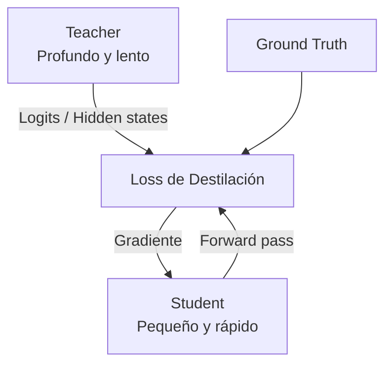

# 🗜️ Quantization y Distilación de Modelos de Lenguaje

En la práctica industrial, desplegar un LLM de 70 mil millones de parámetros en FP16 requiere al menos 140 GB de memoria GPU, lo que excede la capacidad de una única aceleradora comercial. La **cuantización** (quantization) y la **destilación** (distillation) son las dos estrategias fundamentales para comprimir modelos, reducir costos de infraestructura y habilitar la inferencia en edge devices. Este módulo analiza en profundidad los métodos matemáticos, sus trade-offs y su aplicación en sistemas de producción de alto rendimiento.

---

## 1. Fundamentos de la Cuantización Post-Entrenamiento

La cuantización es el proceso de mapear valores en punto flotante de alta precisión (FP32, FP16) a representaciones de baja precisión (INT8, INT4, FP8). El objetivo es minimizar la pérdida de información.

### Mapeo Lineal

Dado un tensor de pesos reales $r$ con rango $[r_{min}, r_{max}]$, la cuantización a $n$ bits se define mediante una escala $s$ y un punto cero $z$:

$$
q = \text{clamp}\left(\text{round}\left(\frac{r}{s}\right) + z, 0, 2^n - 1\right)
$$

La de-cuantización reconstruye el valor aproximado:

$$
\hat{r} = s \cdot (q - z)
$$

Para cuantización **simétrica**, $z = 0$ y $s = \frac{\max(|r|)}{2^{n-1} - 1}$. Para cuantización **asimétrica**, $z = \text{round}\left(-\frac{r_{min}}{s}\right)$ y $s = \frac{r_{max} - r_{min}}{2^n - 1}$.

El error de cuantización se cuantifica mediante el Error Cuadrático Medio (MSE):

$$
\mathcal{L}_{quant} = \mathbb{E}\left[(r - \hat{r})^2\right] \approx \frac{1}{N} \sum_{i=1}^{N} (r_i - s(q_i - z))^2
$$

### Granularidad de Cuantización

| Granularidad | Descripción | Memoria Extra | Calidad |
|--------------|-------------|---------------|---------|
| Per-tensor | Un solo $s, z$ para todo el tensor | Ninguna | Baja |
| Per-channel | Un $s, z$ por canal de salida | ~0.1% | Media-Alta |
| Per-token | Un $s, z$ por token en activaciones | Runtime | Alta |
| Per-group (128) | Un $s, z$ cada 128 pesos | ~0.4% | Muy Alta |

Caso real: **TensorRT** y **ONNX Runtime** utilizan cuantización per-tensor para INT8 en servidores NVIDIA, mientras que **GPTQ** emplea grupos de 128 elementos para INT4 en GPUs de consumo.

⚠️ **Advertencia:** La cuantización asimétrica de activaciones en capas con outliers extremos (comunes en LLMs grandes) puede colapsar la precisión. Soluciones como **SmoothQuant** migran la dificultad de las activaciones a los pesos mediante una transformación matemática previa.

---

## 2. INT8, INT4, GPTQ y AWQ

### INT8 y LLM.int8()

La cuantización INT8 reduce la memoria a la mitad. Sin embargo, en LLMs aparecen **outliers** en ciertas dimensiones de las activaciones (típicamente ~0.1% de los canales) que degradan severamente la calidad si se cuantizan. El método **LLM.int8()** (Dettmers et al., 2022) aborda esto mediante:

1. **Cuantización vector-wise:** pesos y activaciones se cuantizan con escalas independientes por vector interno.
2. **Mixed-precision decomposition:** los outliers se detectan en tiempo de ejecución y se computan en FP16, mientras que el 99.9% restante usa INT8.

La memoria resultante es aproximadamente:

$$
M_{int8} \approx 0.5 \cdot M_{fp16} + 0.001 \cdot 2 \cdot M_{fp16}
$$

### GPTQ (General-purpose Post-training Quantization)

**GPTQ** (Frantar et al., 2023) es un método de cuantización por capas que minimiza el error de reconstrucción cuadrático:

$$
\arg\min_{\hat{W}} \|W X - \hat{W} X\|_2^2
$$

Donde $W$ son los pesos de una capa y $X$ son las activaciones de entrada (calibración). GPTQ aproxima la solución óptima mediante actualizaciones secuenciales informadas por la inversa de la matriz de Hessiana $H = 2 X X^T$:

$$
\hat{w}_i = \text{quantize}\left(w_i - \frac{\sum_{j>i} H_{ij}^{-1} (w_j - \hat{w}_j)}{H_{ii}^{-1}}\right)
$$

Este procedimiento compensa el error cuantizado en una columna propagándolo a las columnas no cuantizadas restantes.

### AWQ (Activation-aware Weight Quantization)

**AWQ** (Lin et al., 2023) se basa en la observación de que no todos los pesos son igualmente importantes. Los pesos que correspondan a canales con activaciones de mayor magnitud tienen mayor impacto en la salida. AWQ protege estos pesos "saliéntes" escalandolos por un factor $s > 1$ antes de la cuantización, y dividiendo las activaciones correspondientes por $s$ para mantener la equivalencia matemática:

$$
w' = w \cdot s, \quad x' = x / s
$$

Luego se cuantiza $w'$ a INT4 y se de-cuantiza multiplicando por $1/s$. Esto permite cuantizar el 99.9% de pesos a 4 bits mientras se preservan los canales críticos.

| Método | Precisión Pesos | Precisión Activaciones | Reducción Memoria | Degradación Perplejidad |
|--------|-----------------|------------------------|-------------------|-------------------------|
| FP16 Baseline | FP16 | FP16 | 1.0x | 0.0% |
| LLM.int8() | INT8 | FP16 | ~1.8x | <0.1% |
| GPTQ | INT4 | FP16 | ~3.5x | 0.5-2% |
| AWQ | INT4 | FP16 | ~3.5x | 0.1-0.5% |
| SmoothQuant | INT8 | INT8 | ~2.0x | <0.5% |

Caso real: **TheBloke** ha convertido cientos de modelos open-source (LLaMA, Mistral, Falcon) a formatos GPTQ y AWQ utilizando AutoGPTQ, permitiendo ejecutar LLaMA-2-70B en GPUs de 24 GB como la RTX 4090 o la RTX A5000.

💡 **Tip:** Si tu objetivo es máxima reducción de memoria con mínima pérdida de calidad, AWQ supera consistentemente a GPTQ en benchmarks de chat y razonamiento a 4 bits.

⚠️ **Advertencia:** Los modelos cuantizados a INT4 pueden sufrir de degradación en tareas que requieren aritmética precisa o razonamiento de varios pasos (chain-of-thought). Evalúa siempre en un conjunto de validación específico de tu dominio antes de desplegar.

---

## 3. Quantization Aware Training (QAT)

Mientras que la cuantización post-entrenamiento (PTQ) es rápida y no requiere datos de entrenamiento, puede sufrir de acumulación de error en modelos profundos. **QAT** inserta nodos de *fake quantization* durante el entrenamiento (o fine-tuning):

$$
\hat{w} = s_w \cdot \left(\text{round}\left(\frac{w}{s_w} + z_w\right) - z_w\right)
$$

Durante el forward pass, los pesos y activaciones se cuantizan y de-cuantizan, simulando el error de precisión reducida. Durante el backward pass, el gradiente fluye a través del operador de redondeo mediante el **Straight-Through Estimator (STE)**:

$$
\frac{\partial \hat{w}}{\partial w} \approx 1
$$

Esto permite que el optimizador ajuste los pesos full-precision para compensar el error de cuantización. QAT es especialmente efectivo para precisiones extremas (< 8 bits) o para activaciones INT8 donde PTQ falla.

El costo computacional de QAT es similar al entrenamiento estándar, pero requiere un dataset de fine-tuning representativo.

Caso real: **Google** utilizó QAT para cuantizar modelos de traducción neuronal a INT8 en TPU, logrando una reducción de latencia del 50% con una pérdida de BLEU inferior al 0.2%.

---

## 4. Knowledge Distillation

La **destilación de conocimiento** transfiere el comportamiento de un modelo grande (*teacher*) a uno pequeño (*student*). A diferencia de la cuantización, que comprime la representación numérica, la destilación comprime la arquitectura misma.

### Destilación Clásica (Hinton et al., 2015)

La loss de destilación combina la entropía cruzada sobre etiquetas duras con la divergencia KL sobre las distribuciones suavizadas por temperatura $T$:

$$
\mathcal{L}_{KD} = \alpha \cdot \mathcal{L}_{CE}(y, \sigma(z_s)) + (1 - \alpha) \cdot T^2 \cdot \mathcal{L}_{KL}(\sigma(z_t / T), \sigma(z_s / T))
$$

donde $z_t$ y $z_s$ son los logits del teacher y student, y $\sigma$ es la función softmax. El factor $T^2$ compensa el gradiente reducido por la temperatura.

### MiniLLM

En modelos generativos auto-regresivos, usar la divergencia KL forward $\mathcal{L}_{KL}(p_t \| p_s)$ tiende a promediar modas (*mode averaging*), produciendo texto genérico. **MiniLLM** (Gu et al., 2023) propone usar la **reverse KL** $\mathcal{L}_{KL}(p_s \| p_t)$ y un estimador de gradiente sin muestras del teacher, mejorando la calidad generativa del student.

### DistilBERT

**DistilBERT** (Sanh et al., 2019) es la aplicación más conocida: un modelo con 40% de los parámetros de BERT-base, un 60% más rápido, y que retiene el 97% de la performance en GLUE. La loss de entrenamiento incluye:

$$
\mathcal{L} = 0.33 \cdot \mathcal{L}_{mlm} + 0.33 \cdot \mathcal{L}_{CE} + 0.33 \cdot \mathcal{L}_{cos}(h_t, h_s)
$$

Incluyendo la pérdida de modelado de lenguaje enmascarado, la entropía cruzada sobre etiquetas, y la similitud coseno entre los embeddings de [CLS].



| Método | Relación Parámetros | Velocidad Relativa | Degradación en Downstream |
|--------|---------------------|--------------------|---------------------------|
| DistilBERT | 0.4x | 1.6x | ~3% |
| TinyBERT | 0.075x | 9.4x | ~6% |
| MiniLLM (7B->1.3B) | 0.19x | ~4x | ~5% |

Caso real: **Hugging Face** utiliza modelos destilados internamente para sus APIs de clasificación de texto, donde la latencia debe ser < 20 ms por request.

💡 **Tip:** La destilación es más efectiva cuando el student tiene una arquitectura similar al teacher (mismos tipos de capa, mismos vocabularios). Cambiar de arquitectura (ej. Transformer -> RNN) generalmente requiere grandes volúmenes de datos de transferencia.

---

## 5. Trade-offs de Tamaño, Velocidad y Calidad

La elección entre cuantización y destilación (o su combinación) depende de las restricciones del sistema objetivo.

| Estrategia | Memoria Final | Latencia (rel) | Calidad | Esfuerzo de Implementación |
|------------|---------------|----------------|---------|----------------------------|
| FP16 Baseline | 100% | 1.0x | 100% | Ninguno |
| INT8 PTQ | ~50% | 0.6x | 99.5% | Bajo |
| INT4 GPTQ | ~25% | 0.5x | 97-99% | Medio |
| INT4 AWQ | ~25% | 0.5x | 99-99.5% | Medio |
| QAT INT8 | ~50% | 0.6x | 99.8% | Alto |
| Destilación | Variable | Variable | 95-98% | Muy Alto |
| Destilación + AWQ | ~10-20% | 0.3x | 93-96% | Extremo |

Caso real: **Mistral AI** desplegó **Mixtral 8x7B** utilizando una combinación de sparse routing (MoE) y cuantización AWQ, logrando performance de modelo 70B-dense en un footprint de memoria comparable a un modelo 12B-dense cuantizado.

⚠️ **Advertencia:** La combinación de múltiples técnicas de compresión no es aditiva. Destilar un modelo ya cuantizado puede amplificar errores de cuantización y provocar inestabilidad en el entrenamiento. Se recomienda destilar en FP16 y cuantizar el student como paso final.

---

## 📦 Código de Compresión: Pipeline GPTQ + Evaluación

El siguiente script utiliza `auto-gptq` y `transformers` para cuantizar un modelo causal a 4 bits y evaluar su perplexity en WikiText-2.

```python
import torch
from transformers import AutoModelForCausalLM, AutoTokenizer
from auto_gptq import AutoGPTQForCausalLM, BaseQuantizeConfig

model_id = "meta-llama/Llama-2-7b-hf"
calib_data = ["La inteligencia artificial transforma la industria."] * 128

# Configuración GPTQ
quantize_config = BaseQuantizeConfig(
    bits=4,
    group_size=128,
    desc_act=True,  # Activación descendente para mejor calidad
)

print("Cargando modelo en GPU...")
model = AutoGPTQForCausalLM.from_pretrained(
    model_id, quantize_config, torch_dtype=torch.float16, device_map="auto"
)

tokenizer = AutoTokenizer.from_pretrained(model_id)
calib_tokens = [tokenizer(text, return_tensors="pt").input_ids[0] for text in calib_data]

print("Iniciando cuantización GPTQ...")
model.quantize(calib_tokens, batch_size=1)

# Guardar
save_path = "./llama-2-7b-gptq"
model.save_quantized(save_path)
tokenizer.save_pretrained(save_path)

# Evaluación de Perplexity
from datasets import load_dataset
import torch.nn.functional as F

dataset = load_dataset("wikitext", "wikitext-2-raw-v1", split="test")
text = "\n\n".join(dataset["text"])
encodings = tokenizer(text, return_tensors="pt")

max_length = model.config.max_position_embeddings
stride = 512
seq_len = encodings.input_ids.size(1)

nlls = []
prev_end_loc = 0
for begin_loc in range(0, seq_len, stride):
    end_loc = min(begin_loc + max_length, seq_len)
    trg_len = end_loc - prev_end_loc
    input_ids = encodings.input_ids[:, begin_loc:end_loc].to(model.device)
    target_ids = input_ids.clone()
    target_ids[:, :-trg_len] = -100

    with torch.no_grad():
        outputs = model(input_ids)
        neg_log_likelihood = F.cross_entropy(
            outputs.logits[:, :-1, :].reshape(-1, outputs.logits.size(-1)),
            target_ids[:, 1:].reshape(-1),
            reduction="mean"
        )
    nlls.append(neg_log_likelihood)
    prev_end_loc = end_loc
    if end_loc == seq_len:
        break

ppl = torch.exp(torch.stack(nlls).mean())
print(f"Perplexity en WikiText-2 (GPTQ 4-bit): {ppl.item():.2f}")
```

---

## 🎯 Proyecto: Pipeline de Cuantización Automática con Comparativa de Trade-offs

Diseña un script de automatización (`compress_pipeline.py`) que ejecute el siguiente flujo:

1. **Carga** un modelo de lenguaje causal de ~7B parámetros desde Hugging Face.
2. **Aplica** tres estrategias de compresión:
   - Cuantización INT8 con `bitsandbytes` (`load_in_8bit=True`).
   - Cuantización INT4 con `auto-gptq` (grupo 128).
   - Cuantización INT4 con `auto-awq` (si está disponible en el entorno).
3. **Evalúa** cada modelo cuantizado en:
   - **Perplexity** en WikiText-2.
   - **Memoria GPU pico** (`torch.cuda.max_memory_allocated`).
   - **Latencia de generación** (promedio de 100 tokens con prompt de 50 tokens).
4. **Genera** un reporte Markdown (`benchmark_compression.md`) con una tabla comparativa y recomendación de estrategia según restricción de memoria objetivo (8 GB, 16 GB, 24 GB).

### Métricas Objetivo

| Estrategia | Memoria Objetivo | Perplexity Aceptable |
|------------|------------------|----------------------|
| INT8 | < 10 GB | < 1.05x baseline |
| GPTQ 4-bit | < 6 GB | < 1.10x baseline |
| AWQ 4-bit | < 6 GB | < 1.05x baseline |

💡 **Tip:** Utiliza `accelerate`'s `infer_auto_device_map` para distribuir capas entre CPU y GPU si tu VRAM es insuficiente, aunque esto impactará severamente la latencia.

⚠️ **Advertencia:** La cuantización de modelos con licencias restrictivas (ej. LLaMA 2) puede violar términos de uso si se redistribuyen los artefactos cuantizados públicamente. Verifica siempre la licencia antes de publicar checkpoints comprimidos.

---


---

**Enlaces internos:**
- [[00 - Bienvenida]]
- [[01 - Inferencia Eficiente]]
- [[03 - Serving y Batch Processing]]
- [[04 - Seguridad y Alineacion]]
- [[05 - Caso Practico - API de LLM Escalable]]
