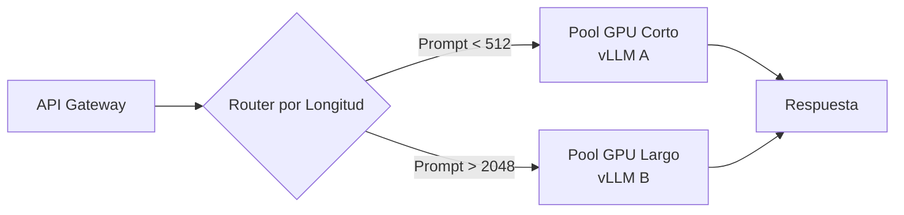

# 🚀 Serving y Batch Processing de LLMs

Un modelo optimizado en aislamiento no garantiza un sistema de producción exitoso. La capa de **serving** es la interfaz entre el modelo y el mundo exterior: debe gestionar miles de conexiones concurrentes, enrutar peticiones eficientemente, mantener latencias predecibles y escalar horizontalmente ante picos de demanda. En esta nota, analizamos los patrones de arquitectura, frameworks de serving y estrategias de caching que permiten operar LLMs como un servicio crítico.

---

## 1. Patrones de Model Serving

El diseño de un servicio de LLMs sigue patrones establecidos en ingeniería de software distribuido, pero adaptados a las particularidades de la inferencia GPU-intensiva.

### Síncrono vs Asíncrono

- **Síncrono:** El cliente espera bloqueado hasta recibir la respuesta completa. Apropiado para chat interactivo con latencia < 2 segundos.
- **Asíncrono:** El cliente recibe un `job_id` y consulta el estado posteriormente. Ideal para batch processing de documentos largos o fine-tuning bajo demanda.

### Microservicios vs Monolito

| Patrón | Ventajas | Desventajas | Cuándo Usar |
|--------|----------|-------------|-------------|
| Monolito | Menor overhead de red, fácil de debuggear | Escalado grueso (todo o nada) | Un único modelo dominante |
| Microservicios | Escalado independiente por modelo, aislamiento de fallos | Latencia de red entre servicios | Múltiples modelos especializados |

### Edge Serving vs Cloud Serving

El **edge serving** despliega modelos cuantizados (INT4/INT8) en dispositivos locales o CDN edges para reducir latencia de red y costos de egress. El **cloud serving** centraliza modelos grandes en clusters GPU con alta capacidad de cómputo.

$$
\text{Latencia Total} = \text{RTT}_{red} + \text{TTFT} + (N_{tokens} - 1) \times \text{TPOT}
$$

El edge serving reduce drásticamente $\text{RTT}_{red}$, pero está limitado por la memoria y potencia del dispositivo.

Caso real: **Cloudflare** despliega modelos de 7B parámetros cuantizados en su red global de edges, logrando TTFT inferiores a 50 ms para usuarios finales en cualquier continente.

---

## 2. Frameworks de Serving: TGI, vLLM y Triton

### Text Generation Inference (TGI)

Desarrollado por Hugging Face, TGI es un servidor de inferencia optimizado para LLMs. Soporta:

- **Safetensors:** Carga rápida de pesos sin deserialización insegura.
- **Tensor Parallelism:** Shard de modelos grandes entre múltiples GPUs.
- **Quantization:** Integración nativa con bitsandbytes (INT8) y GPTQ (INT4).
- **Streaming:** Emisión de tokens vía Server-Sent Events (SSE).

### vLLM

vLLM se diferencia por su implementación de **Paged Attention** y **continuous batching**, logrando un throughput significativamente mayor que TGI en cargas de trabajo heterogéneas.

### NVIDIA Triton Inference Server

Triton es una solución enterprise-grade que soporta múltiples backends (TensorRT, ONNX, PyTorch, vLLM). Ofrece:

- **Dynamic Batching:** Agrupa peticiones de forma transparente para el cliente.
- **Model Ensembling:** Pipelines de preprocesamiento -> inferencia -> postprocesamiento.
- **Multi-GPU y Multi-Node:** Integración con NVIDIA FastTransformer y TensorRT-LLM.

| Característica | TGI | vLLM | Triton + TensorRT-LLM |
|----------------|-----|------|-----------------------|
| Fácil de usar | ⭐⭐⭐ | ⭐⭐⭐ | ⭐⭐ |
| Throughput | ⭐⭐⭐ | ⭐⭐⭐⭐⭐ | ⭐⭐⭐⭐⭐ |
| Soporte Multi-GPU | Sí | Sí | Sí |
| Cuantización | GPTQ, BNB | AWQ, GPTQ, BNB | FP8, INT8, INT4 |
| Flexibilidad | Media | Alta | Muy Alta |
| Overhead de Setup | Bajo | Bajo | Alto |

Caso real: **AWS SageMaker** utiliza Triton como backend opcional en sus endpoints de inferencia, permitiendo a los clientes desplegar modelos custom con TensorRT-LLM para extracción máxima de rendimiento en instancias p4d/p5.

💡 **Tip:** Si tu equipo no tiene especialistas en CUDA/C++, comienza con vLLM para un modelo monolítico. Migra a Triton solo cuando necesites pipelines complejos (pre/post-procesamiento) o soporte multi-backend.

---

## 3. Dynamic Batching y Request Routing

### Dynamic Batching

A diferencia del batching estático donde el cliente debe agrupar requests, el **dynamic batching** lo realiza el servidor de inferencia. El scheduler espera un tiempo configurable (`max_batching_latency`) o hasta alcanzar un `max_batch_size` antes de ejecutar el forward pass.

El trade-off se modela como:

$$
\text{Latency} = t_{wait} + t_{forward}(B) + t_{overhead}
$$

Donde $t_{forward}(B)$ crece sub-linealmente con $B$ hasta saturar la GPU.

### Request Routing por Longitud

Una técnica avanzada es la separación de **pools de GPU** según la longitud esperada del prompt:

- **Pool Corto:** Prompts < 512 tokens. Alta concurrencia, batch sizes grandes.
- **Pool Largo:** Prompts > 2k tokens. Baja concurrencia, secuencias que monopolizan KV cache.

Un router basado en heurísticas (o un clasificador ligero) dirige la petición al pool adecuado, evitando que un prompt largo cause *head-of-line blocking* en un batch de cortos.



Caso real: **Google Bard** utiliza ruting interno para separar consultas de chat simples (baja latencia) de análisis de documentos largos (alta memoria), asignando recursos de TPU v4 y v5p respectivamente.

⚠️ **Advertencia:** El dynamic batching puede degradar la latencia de requests individuales si el `max_batching_latency` es demasiado alto. Para SLAs estrictos (ej. TTFT < 100 ms), utiliza batching continuo (iteration-level) en lugar de batching a nivel de request.

---

## 4. Load Balancing y Auto-scaling

### Métricas de Escalado

Las métricas tradicionales de CPU no aplican a workloads GPU. Los indicadores clave son:

| Métrica | Descripción | Umbral de Escalado |
|---------|-------------|--------------------|
| GPU Utilización | % de tiempo en kernels | > 85% (scale up) |
| GPU Memory Usage | VRAM asignada | > 90% (scale up) |
| Queue Depth | Peticiones pendientes | > 20 por replica (scale up) |
| TTFT p99 | Latencia al primer token | > 500 ms (scale up) |
| TPS (Throughput) | Tokens/s por GPU | Platea (scale out) |

### Auto-scaling en Kubernetes

El **Horizontal Pod Autoscaler (HPA)** puede escalar réplicas de pods de inferencia basándose en métricas custom exportadas por **Prometheus**:

```yaml
apiVersion: autoscaling/v2
kind: HorizontalPodAutoscaler
metadata:
  name: llm-serving-hpa
spec:
  scaleTargetRef:
    apiVersion: apps/v1
    kind: Deployment
    name: vllm-deployment
  minReplicas: 2
  maxReplicas: 20
  metrics:
    - type: Pods
      pods:
        metric:
          name: vllm_queue_depth
        target:
          type: AverageValue
          averageValue: "10"
```

Para GPUs, el auto-scaling debe ser más conservador que en CPU debido al tiempo de *cold start* (carga de pesos puede tomar 30-120 segundos). Se recomienda utilizar **KEDA** (Kubernetes Event-driven Autoscaling) con un buffer de réplicas precalentadas.

Caso real: **Replicate** mantiene un pool de *warm workers* con modelos precargados en VRAM. Cuando un usuario solicita un modelo, se activa un worker inactivo en < 2 segundos, en lugar de cargar desde cero.

---

## 5. Estrategias de Caching

El caching es la forma más económica de reducir latencia y costo en serving de LLMs.

### Prefix Caching (KV Cache Sharing)

Si múltiples peticiones comparten un prefijo común (ej. un system prompt largo o un documento de contexto), el KV cache computado para ese prefijo puede reutilizarse entre todas las secuencias. vLLM implementa esto mediante referencias a bloques físicos compartidos en su Paged Attention.

El ahorro de computación es proporcional a:

$$
\text{Ahorro} = (B - 1) \times t_{prefijo}
$$

donde $B$ es el número de secuencias que comparten el prefijo.

### Prompt Caching Externo

Para prompts exactos o similares (ej. FAQs, templates de código), una capa de cache en **Redis** o **Memcached** almacena la respuesta completa, evitando la inferencia por completo.

### Semantic Caching

Utiliza un modelo de embeddings para almacenar respuestas de prompts semánticamente similares. Si la similitud coseno entre el prompt nuevo y uno cacheado supera un umbral $\theta$, se devuelve la respuesta cacheada.

```python
import hashlib

# Ejemplo de prompt caching simple con hash exacto
def get_cache_key(prompt: str, model: str, temperature: float) -> str:
    raw = f"{model}:{temperature}:{prompt}"
    return hashlib.sha256(raw.encode()).hexdigest()
```

Caso real: **GitHub Copilot** cachea sugerencias de autocompletado a nivel de IDE para evitar llamadas redundantes a la API cuando el usuario escribe caracteres adicionales que no alteran la intención semántica.

💡 **Tip:** Implementa un TTL (time-to-live) diferenciado en tu cache: 1 hora para respuestas factuales volátiles, 24 horas para generación de código estandarizado.

---

## 6. Streaming Responses

El streaming transforma la experiencia del usuario al reducir la **latencia percibida**. En lugar de esperar a que se genere la respuesta completa, los tokens se envían al cliente conforme se producen.

### Server-Sent Events (SSE)

Es el protocolo estándar para streaming en servicios de LLMs (OpenAI, Anthropic). Cada token se encapsula en un evento JSON:

```
data: {"token": {"id": 42, "text": "Hola", "logprob": -0.12}}

data: [DONE]
```

### Chunked Transfer Encoding

En HTTP/1.1, el servidor envía fragmentos de la respuesta sin conocer el tamaño total de antemano. Esto es esencial para generación de texto donde la longitud es desconocida a priori.

La latencia percibida por el usuario se define como:

$$
\text{Latency Percibida} = \text{TTFT}
$$

Mientras que la latencia real total es:

$$
\text{Latency Total} = \text{TTFT} + (N - 1) \times \text{TPOT}
$$

Al reducir el TTFT a < 200 ms mediante streaming, el usuario percibe un sistema "instantáneo" aunque la respuesta completa tarde varios segundos.

Caso real: **ChatGPT** utiliza streaming con reconnection automática. Si se pierde un paquete TCP, el cliente reconecta y solicita la continuación desde el último token recibido, garantizando una experiencia fluida incluso en redes inestables.

---

## 📦 Código de Compresión: FastAPI + vLLM + Redis Cache

El siguiente script proporciona una arquitectura mínima pero completa de serving con streaming, rate limiting por token bucket y caching de respuestas exactas.

```python
from fastapi import FastAPI, HTTPException, Header
from fastapi.responses import StreamingResponse
from vllm import LLM, SamplingParams
import redis
import json
import hashlib
import time
from typing import Optional

app = FastAPI(title="LLM Serving API")

# Inicializar modelo y Redis
llm = LLM(model="meta-llama/Llama-2-7b-hf", tensor_parallel_size=1)
redis_client = redis.Redis(host='localhost', port=6379, db=0, decode_responses=True)

# Rate limiting simple: token bucket por API key
buckets = {}

def check_rate_limit(api_key: str, max_tokens: int = 100, refill_rate: float = 10.0):
    now = time.time()
    bucket = buckets.get(api_key, {"tokens": max_tokens, "last_update": now})
    elapsed = now - bucket["last_update"]
    bucket["tokens"] = min(max_tokens, bucket["tokens"] + elapsed * refill_rate)
    bucket["last_update"] = now
    if bucket["tokens"] < 1:
        raise HTTPException(status_code=429, detail="Rate limit exceeded")
    bucket["tokens"] -= 1
    buckets[api_key] = bucket

def get_cache_key(prompt: str, model: str, temp: float) -> str:
    return hashlib.sha256(f"{model}:{temp}:{prompt}".encode()).hexdigest()

@app.post("/chat")
def chat_completion(prompt: str, temperature: float = 0.7, api_key: Optional[str] = Header(None)):
    check_rate_limit(api_key or "default")
    
    cache_key = get_cache_key(prompt, "llama-2-7b", temperature)
    cached = redis_client.get(cache_key)
    if cached:
        return {"response": json.loads(cached), "cached": True}
    
    sampling_params = SamplingParams(temperature=temperature, max_tokens=256)
    outputs = llm.generate([prompt], sampling_params)
    text = outputs[0].outputs[0].text
    
    redis_client.setex(cache_key, 3600, json.dumps(text))
    return {"response": text, "cached": False}

async def token_generator(prompt: str, temperature: float):
    sampling_params = SamplingParams(temperature=temperature, max_tokens=256)
    # vLLM no expone generador token-a-token nativamente en su API Python síncrona,
    # pero su servidor OpenAI-compatible sí lo hace vía SSE.
    # Aquí simulamos el stream iterando sobre la salida completa como demostración.
    outputs = llm.generate([prompt], sampling_params)
    text = outputs[0].outputs[0].text
    for word in text.split():
        yield f"data: {json.dumps({'token': word})}\n\n"
        time.sleep(0.05)
    yield "data: [DONE]\n\n"

@app.post("/chat/stream")
def chat_stream(prompt: str, temperature: float = 0.7, api_key: Optional[str] = Header(None)):
    check_rate_limit(api_key or "default")
    return StreamingResponse(token_generator(prompt, temperature), media_type="text/event-stream")
```

---

## 🎯 Proyecto: Microservicio de Enrutamiento Inteligente

Diseña un sistema de serving compuesto por dos pools de GPU y un router inteligente:

1. **Pool Corto:** vLLM con modelos de 7B, máximo 1024 tokens de contexto. Optimizado para throughput de requests cortas.
2. **Pool Largo:** vLLM con modelo de 70B (o 7B con contexto extendido), máximo 16k tokens. Optimizado para memoria.
3. **Router:** Un servicio en FastAPI que analiza la longitud del prompt (o la predice con un modelo ligero) y redirige al pool adecuado.

### Métricas de Éxito

| Métrica | Pool Corto | Pool Largo |
|---------|------------|------------|
| TTFT p99 | < 100 ms | < 500 ms |
| Throughput | > 500 req/s | > 50 req/s |
| GPU Utilización | > 80% | > 70% |

El sistema debe incluir:

- Health checks por pool.
- Fallback automático al pool largo si el corto está saturado.
- Métricas exportadas a Prometheus.

⚠️ **Advertencia:** El enrutamiento basado únicamente en longitud del prompt puede fallar si el prompt corto requiere razonamiento profundo (muchos pasos de CoT). Considera añadir una estimación de complejidad (ej. entropía del prompt) como feature de routing.

💡 **Tip:** Usa **Envoy Proxy** o **NGINX** como load balancer L7 frente a tus pools de vLLM. Soportan health checks, retries con backoff exponencial y circuit breaking nativo.

---


---

**Enlaces internos:**
- [[00 - Bienvenida]]
- [[01 - Inferencia Eficiente]]
- [[02 - Quantization y Distilacion]]
- [[04 - Seguridad y Alineacion]]
- [[05 - Caso Practico - API de LLM Escalable]]
