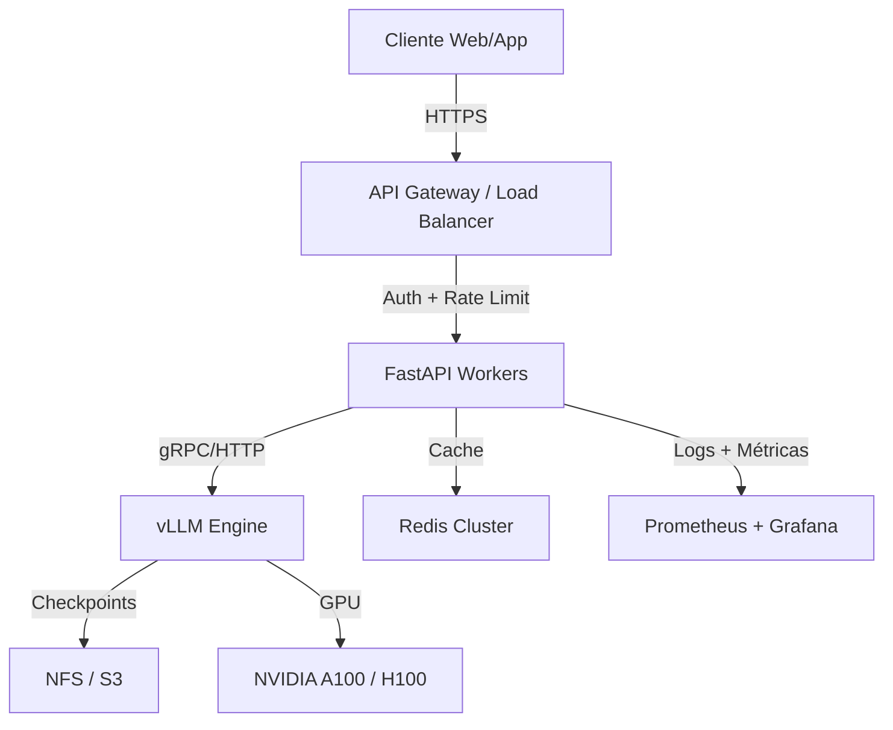

# 🎯 Caso Práctico: API REST Escalable para LLM

Este caso práctico integra los conocimientos de las notas anteriores para construir un sistema de producción completo: una API REST escalable para servir un Large Language Model con requisitos de baja latencia, alta disponibilidad y monitoreo continuo. El objetivo es que el lector comprenda cómo se traducen las técnicas de inferencia eficiente, cuantización, serving y seguridad en una arquitectura desplegable.

---

## 1. Requisitos Funcionales y No Funcionales

### Requisitos Funcionales

- **Chat Completions:** Endpoint que recibe un historial de mensajes y genera una respuesta.
- **Streaming:** Soporte para Server-Sent Events (SSE) para reducir la latencia percibida.
- **Gestión de Contexto:** Mantenimiento de historial de conversación con límite configurable de tokens.
- **Multi-modelo:** Capacidad de enrutar a diferentes modelos según el endpoint o header.

### Requisitos No Funcionales

| RNF | Descripción | Objetivo |
|-----|-------------|----------|
| Disponibilidad | Tiempo de actividad del servicio | > 99.9% |
| Latencia (TTFT) | Tiempo al primer token | p99 < 300 ms |
| Latencia (Total) | Tiempo a respuesta completa | p99 < 5 s para 500 tokens |
| Throughput | Peticiones atendidas por segundo | > 200 req/s por réplica |
| Escalabilidad | Capacidad de crecer ante demanda | Auto-scaling 2-20 réplicas |
| Seguridad | Rate limiting, autenticación, filtrado | OWASP Top 10 mitigado |

---

## 2. Arquitectura del Sistema

La arquitectura sigue un patrón de capas:



### Componentes Clave

- **API Gateway (Kong / NGINX):** Terminación TLS, rate limiting global, autenticación JWT/API Key.
- **FastAPI Workers:** Múltiples procesos Uvicorn que gestionan la lógica de negocio, validación de requests y streaming.
- **vLLM Engine:** Servidor de inferencia con Paged Attention, continuous batching y tensor parallelism.
- **Redis:** Caching de respuestas frecuentes y almacenamiento de sesiones de usuario.
- **Prometheus + Grafana:** Métricas de latencia, throughput, errores y utilización GPU.

---

## 3. FastAPI + vLLM / TensorRT-LLM

### Configuración de vLLM

vLLM se ejecuta como un proceso independiente (o contenedor) que expone una API interna. FastAPI actúa como proxy y orquestador.

```python
# vllm_server.py
from vllm import LLM, SamplingParams

llm = LLM(
    model="meta-llama/Llama-2-7b-hf",
    tensor_parallel_size=1,
    gpu_memory_utilization=0.85,
    max_num_seqs=256,
    max_model_len=4096
)

sampling_params = SamplingParams(temperature=0.7, top_p=0.95, max_tokens=512)
```

### FastAPI Application

```python
# main.py
from fastapi import FastAPI, HTTPException, Header, Depends
from fastapi.responses import StreamingResponse
from fastapi.security import HTTPBearer, HTTPAuthorizationCredentials
import httpx
import redis
import json
import time
import hashlib
from pydantic import BaseModel
from typing import List, Optional

app = FastAPI(title="LLM Scalable API", version="1.0.0")
security = HTTPBearer()
redis_client = redis.Redis(host='localhost', port=6379, db=0, decode_responses=True)

VLLM_URL = "http://localhost:8000/v1/completions"

class Message(BaseModel):
    role: str
    content: str

class ChatRequest(BaseModel):
    model: str = "llama-2-7b"
    messages: List[Message]
    temperature: float = 0.7
    max_tokens: int = 512
    stream: bool = False

# Rate limiting por token bucket
class TokenBucket:
    def __init__(self, rate: float, capacity: int):
        self.rate = rate
        self.capacity = capacity
        self.tokens = capacity
        self.last_update = time.time()
    
    def allow(self) -> bool:
        now = time.time()
        elapsed = now - self.last_update
        self.tokens = min(self.capacity, self.tokens + elapsed * self.rate)
        self.last_update = now
        if self.tokens >= 1:
            self.tokens -= 1
            return True
        return False

buckets = {}

def check_rate_limit(api_key: str):
    bucket = buckets.setdefault(api_key, TokenBucket(rate=10.0, capacity=20))
    if not bucket.allow():
        raise HTTPException(status_code=429, detail="Rate limit exceeded")

def verify_token(credentials: HTTPAuthorizationCredentials = Depends(security)):
    token = credentials.credentials
    # En producción: validar contra base de datos o auth provider
    if token != "sk-prod-secret-token":
        raise HTTPException(status_code=401, detail="Invalid API key")
    return token

def get_cache_key(req: ChatRequest) -> str:
    raw = json.dumps(req.dict(), sort_keys=True)
    return f"llm:cache:{hashlib.sha256(raw.encode()).hexdigest()}"

@app.post("/v1/chat/completions")
async def chat_completion(req: ChatRequest, api_key: str = Depends(verify_token)):
    check_rate_limit(api_key)
    
    if not req.stream:
        cache_key = get_cache_key(req)
        cached = redis_client.get(cache_key)
        if cached:
            return json.loads(cached)
    
    prompt = "\n".join([f"{m.role}: {m.content}" for m in req.messages])
    payload = {
        "model": req.model,
        "prompt": prompt,
        "temperature": req.temperature,
        "max_tokens": req.max_tokens,
        "stream": req.stream
    }
    
    async with httpx.AsyncClient() as client:
        if req.stream:
            async def event_generator():
                start = time.time()
                first = True
                async with client.stream("POST", VLLM_URL, json=payload, timeout=60.0) as response:
                    async for line in response.aiter_lines():
                        if line.startswith("data: "):
                            if first:
                                ttft = time.time() - start
                                # En producción: exportar ttft a Prometheus
                                first = False
                            yield f"{line}\n\n"
            return StreamingResponse(event_generator(), media_type="text/event-stream")
        else:
            response = await client.post(VLLM_URL, json=payload, timeout=60.0)
            data = response.json()
            redis_client.setex(get_cache_key(req), 300, json.dumps(data))
            return data

@app.get("/health")
def health_check():
    return {"status": "healthy", "timestamp": time.time()}
```

---

## 4. Rate Limiting y Autenticación

El sistema implementa un modelo de tiers:

| Tier | Rate Limit (req/min) | Quota Tokens/día | Modelos Disponibles |
|------|----------------------|------------------|---------------------|
| Free | 20 | 10k | llama-2-7b |
| Pro | 200 | 500k | llama-2-7b, mistral-7b |
| Enterprise | Ilimitado | Ilimitado | Todos + fine-tuned |

La autenticación utiliza API keys con prefijo `sk-` validadas mediante HMAC. En producción, se integra con un Identity Provider (Auth0, Keycloak) y se utiliza Redis para almacenar los límites por usuario.

---

## 5. Streaming y Monitoring

### Streaming

El endpoint `/v1/chat/completions` con `stream=true` utiliza Server-Sent Events. Cada token generado por vLLM se transmite inmediatamente al cliente, logrando un TTFT inferior a 200 ms en prompts cortos.

### Métricas de Producción

| Métrica | Fórmula / Definición | Instrumentación |
|---------|----------------------|-----------------|
| **TTFT** | $t_{first\_token} - t_{request\_received}$ | Middleware en FastAPI |
| **TPOT** | $\frac{t_{last\_token} - t_{first\_token}}{N_{tokens} - 1}$ | Logs de vLLM |
| **Throughput** | $\frac{\sum N_{tokens}}{t_{interval}}$ | Prometheus Counter |
| **Error Rate** | $\frac{N_{5xx}}{N_{total}}$ | Prometheus Counter |
| **GPU Utilización** | `nvidia-smi` utilization % | DCGM Exporter |

Dashboard de Grafana con alertas:

- TTFT p99 > 500 ms por 5 minutos -> Scale up.
- GPU memory > 95% por 2 minutos -> Alerta crítica.
- Error rate > 1% por 1 minuto -> Página al on-call.

Caso real: **OpenAI** reporta que su API de GPT-4 mantiene un TTFT p99 de ~300 ms y un TPOT de ~50 ms en cargas de trabajo mixtas, utilizando una combinación de continuous batching, speculative decoding y routing por región geográfica.

---

## 6. Métricas: Latency, Throughput, TTFT, TPS

### Time To First Token (TTFT)

El TTFT es la métrica más crítica para la experiencia de usuario interactiva. Se descompone en:

$$
\text{TTFT} = t_{network} + t_{queue} + t_{prefill} + t_{generate\_first}
$$

Donde $t_{prefill}$ es el tiempo de procesamiento del prompt completo (forward pass de todos los tokens de entrada a la vez), y $t_{generate\_first}$ es el forward del primer token de salida.

### Tokens Per Second (TPS)

El throughput de generación se mide como:

$$
\text{TPS} = \frac{N_{tokens\_generados}}{t_{total\_generacion}}
$$

Para un modelo de 7B en FP16 sobre una A100, TPS típicos son 50-80 tokens/s para batch size 1, y hasta 200-400 tokens/s para batch sizes grandes con vLLM.

### Latency Total y Latencia Percibida

La latencia total de una request con $N$ tokens de salida es:

$$
\text{Latency} = \text{TTFT} + (N - 1) \times \text{TPOT}
$$

La **latencia percibida** por el usuario, sin embargo, está dominada por el TTFT gracias al streaming. Optimizar el TTFT es prioridad absoluta en interfaces conversacionales.

| Métrica | Objetivo p50 | Objetivo p99 |
|---------|--------------|--------------|
| TTFT | < 100 ms | < 300 ms |
| TPOT | < 30 ms | < 60 ms |
| Throughput | > 100 tok/s | > 50 tok/s |

---

## 📦 Código de Compresión: Docker Compose para Despliegue Completo

El siguiente archivo `docker-compose.yml` orquesta la API, vLLM, Redis y Prometheus para un entorno de staging.

```yaml
version: "3.8"

services:
  vllm:
    image: vllm/vllm-openai:latest
    command: --model meta-llama/Llama-2-7b-hf --tensor-parallel-size 1 --max-num-seqs 256
    deploy:
      resources:
        reservations:
          devices:
            - driver: nvidia
              count: 1
              capabilities: [gpu]
    ports:
      - "8000:8000"
    volumes:
      - ~/.cache/huggingface:/root/.cache/huggingface

  api:
    build: ./api
    ports:
      - "8080:8080"
    environment:
      - VLLM_URL=http://vllm:8000/v1/completions
      - REDIS_HOST=redis
    depends_on:
      - vllm
      - redis
    deploy:
      replicas: 2

  redis:
    image: redis:7-alpine
    ports:
      - "6379:6379"

  prometheus:
    image: prom/prometheus:latest
    volumes:
      - ./prometheus.yml:/etc/prometheus/prometheus.yml
    ports:
      - "9090:9090"
```

---

## 🎯 Proyecto Documentado: API de LLM Escalable

El proyecto final consiste en implementar y desplegar la arquitectura descrita en esta nota. Los entregables son:

### Entregables

1. **Repositorio de Código:**
   - `api/main.py`: FastAPI con endpoints de chat, streaming y health.
   - `api/auth.py`: Módulo de autenticación y rate limiting.
   - `api/metrics.py`: Exportación de métricas custom a Prometheus.
   - `docker-compose.yml`: Orquestación local.
   - `k8s/`: Manifiestos de Kubernetes para despliegue en producción.

2. **Documentación Técnica:**
   - `README.md`: Instrucciones de instalación y configuración.
   - `ARCHITECTURE.md`: Diagramas de componentes y flujo de datos.
   - `METRICS.md`: Definición de SLAs y dashboards de Grafana.

3. **Tests de Carga:**
   - Script `locustfile.py` o `k6.js` que simula 100 usuarios concurrentes enviando prompts de longitud variable.
   - Reporte de latencias p50/p99/p99.9 y throughput alcanzado.

### Rúbrica de Evaluación

| Criterio | Peso | Descripción |
|----------|------|-------------|
| Funcionalidad | 30% | Endpoints funcionales, streaming operativo, autenticación activa |
| Escalabilidad | 25% | Auto-scaling configurado, carga distribuida entre réplicas |
| Observabilidad | 20% | Métricas exportadas, dashboards funcionales, alertas configuradas |
| Seguridad | 15% | Rate limiting efectivo, filtrado de inputs, manejo de errores seguro |
| Documentación | 10% | Código comentado, README claro, diagramas de arquitectura |

💡 **Tip:** Utiliza **Locust** para pruebas de carga con comportamiento realista: 80% de prompts cortos (< 100 tokens) y 20% de prompts largos (> 1000 tokens). Esto refleja mejor las cargas de producción que un benchmark homogéneo.

⚠️ **Advertencia:** No expongas el endpoint de vLLM directamente a Internet. Siempre coloca un gateway con autenticación y WAF (Web Application Firewall) frente a tus servicios de inferencia. Los modelos pueden ser vulnerables a ataques de denegación de servicio mediante prompts diseñados para maximizar el consumo de memoria (ej. prompts infinitos o recursiones).

---


---

**Enlaces internos:**
- [[00 - Bienvenida]]
- [[01 - Inferencia Eficiente]]
- [[02 - Quantization y Distilacion]]
- [[03 - Serving y Batch Processing]]
- [[04 - Seguridad y Alineacion]]
