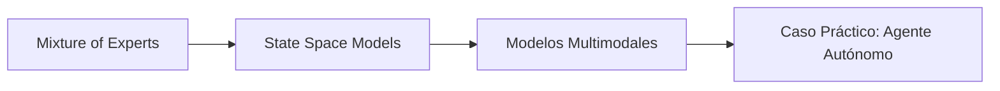

# 🧠 Bienvenida: Arquitecturas Avanzadas y MoE

Bienvenido al módulo **10 - Arquitecturas Avanzadas y MoE**. Si los Transformers densos han sido el motor de la revolución del NLP desde 2017, el horizonte actual de la investigación apunta hacia arquitecturas más eficientes, escalables y versátiles. Este módulo explora tres fronteras críticas: las redes **Mixture of Experts (MoE)**, que escalan la capacidad del modelo sin incrementar proporcionalmente el costo computacional; los **State Space Models (SSM)**, que prometen romper la barrera cuadrática de la atención; y los **modelos multimodales**, que unifican la comprensión de texto, imagen, audio y video bajo una sola arquitectura generativa.

Comprender estas arquitecturas es esencial para el ingeniero de ML/IA de próxima generación, ya que definen el roadmap tecnológico de los próximos cinco años en inteligencia artificial general (AGI).

---

## 1. Presentación del Módulo

A lo largo de cinco unidades, desglosaremos las matemáticas, los algoritmos y las implementaciones prácticas de estas arquitecturas emergentes. El enfoque es dual: profundizar en los fundamentos teóricos mientras construimos prototipos funcionales en PyTorch.

---

## 2. Índice de Contenidos

| # | Archivo | Descripción | Enlace |
|---|---------|-------------|--------|
| 1 | `01 - Mixture of Experts.md` | Redes sparse, gating, Switch Transformer, Mixtral, routing. | [[01 - Mixture of Experts]] |
| 2 | `02 - State Space Models (Mamba).md` | SSM, HiPPO, S4, Mamba, comparativa con Transformers. | [[02 - State Space Models (Mamba)]] |
| 3 | `03 - Modelos Multimodales de LLMs.md` | GPT-4V, Gemini, LLaVA, tokenización unificada, any-to-any. | [[03 - Modelos Multimodales de LLMs]] |
| 4 | `04 - Caso Practico - Agente Autonomo con LLM.md` | Agente con tool use, ReAct, memoria vectorial, ejecución de código. | [[04 - Caso Practico - Agente Autonomo con LLM]] |

---

## 3. Glosario Extendido

### MoE (Mixture of Experts)

Arquitectura de red neuronal donde cada capa feed-forward se reemplaza por un conjunto de "expertos" (tipicamente redes MLP pequeñas) y una red de *enrutamiento* (gating) que determina qué expertos procesarán cada token. Solo un subconjunto de expertos se activa por token, logrando un crecimiento sub-lineal del costo computacional respecto al número total de parámetros.

### Switch Transformer

Variante de MoE introducida por Google (Fedus et al., 2022) que utiliza **enrutamiento Top-1**: cada token es asignado a un único experto. Simplifica el routing y reduce la comunicación entre dispositivos en entrenamiento distribuido, aunque introduce el desafío del balanceo de carga.

### Sparse Attention

Mecanismos de atención que reducen la complejidad cuadrática $O(N^2)$ a sub-cuadrática (ej. $O(N \sqrt{N})$, $O(N \log N)$) mediante patrones de atención restringidos: local, global, dilatada, o factorizada. Ejemplos: Longformer, BigBird, Sparse Transformer.

### State Space Model (SSM)

Familia de modelos de secuencia inspirados en teoría de control. Modelan la relación entrada-salida mediante un estado latente que evoluciona según ecuaciones diferenciales (continuo) o en diferencias (discreto). Ofrecen complejidad lineal $O(L)$ en la longitud de secuencia.

### S4 (Structured State Space for Sequence Modeling)

Método específico de SSM desarrollado por Gu et al. (2021) que impone una estructura particular a la matriz de transición de estado (HiPPO initialization + diagonalization), permitiendo el cálculo eficiente mediante convoluciones en el dominio de Fourier y logrando competir con Transformers en tareas de audio y long-range dependencies.

### Mamba

Arquitectura propuesta por Gu & Dao (2023) que extiende S4 con **selectividad**: los parámetros de transición de estado dependen de la entrada actual. Esto permite al modelo ignorar información irrelevante y recordar datos de contexto de forma similar a los mecanismos de atención, pero con complejidad lineal y memoria constante por paso.

### Selective State Space

Característica distintiva de Mamba donde las matrices $B$, $C$ y el paso de discretización $\Delta$ son funciones de la entrada $x_t$. Matemáticamente:

$$
h_t = \bar{A} h_{t-1} + \bar{B} x_t, \quad y_t = C h_t
$$

con $\bar{A}, \bar{B}$ derivados de $\Delta(x_t)$, $B(x_t)$ y $C(x_t)$.

### Multi-modal LLM

Modelo de lenguaje extendido para procesar y generar múltiples modalidades (texto, imagen, audio, video). Utiliza codificadores específicos de modalidad (ej. ViT para imágenes) proyectados al espacio de embeddings del transformer lingüístico.

### Mixtral

Modelo MoE de código abierto desarrollado por Mistral AI. Consta de 8 expertos de 7B parámetros cada uno, activando 2 expertos por token. Ofrece calidad comparable a modelos densos de 70B parámetros con un costo de inferencia de ~13B parámetros activos.

### Gemini

Familia de modelos multimodales de Google DeepMind. Diseñados desde cero para ser nativamente multimodales (no solo adaptados a texto), soportando entrada y salida de texto, imagen, audio, video y código, con contextos de hasta 1 millón de tokens en la versión Ultra.

---

## 4. Objetivos de Aprendizaje

Al completar este módulo, serás capaz de:

1. Explicar las diferencias fundamentales entre arquitecturas densas, sparse (MoE) y state space, y seleccionar la adecuada según restricciones de cómputo y memoria.
2. Implementar una capa Mixture of Experts en PyTorch, incluyendo mecanismos de load balancing.
3. Describir las ecuaciones matemáticas de los State Space Models y contrastar su complejidad con la auto-atención cuadrática.
4. Diseñar pipelines de inferencia para modelos multimodales utilizando proyecciones de embeddings unificados.
5. Construir un agente autónomo con memoria, planificación y capacidad de uso de herramientas externas.

---

### Roadmap del Módulo

---

---

### 🎯 Proyecto del Módulo: Agente Autónomo con LLM

El proyecto final de este curso consiste en construir un agente cognitivo que utilice un LLM como motor de razonamiento, capaz de planificar tareas, utilizar herramientas externas (tool use), mantener memoria a corto y largo plazo, y ejecutar código de forma segura en un sandbox.

Se documenta exhaustivamente en la nota [[04 - Caso Practico - Agente Autonomo con LLM]].

Los componentes clave incluyen:

- **Motor de ReAct** para razonamiento paso a paso.
- **Vector Store** (FAISS / Chroma) para memoria semántica.
- **Sandbox de Código** (E2B, Docker) para ejecución de Python.
- **Métricas de Evaluación:** Task Completion Rate y Steps to Goal.

💡 **Tip:** Antes de construir el agente, asegúrate de entender bien las arquitecturas de MoE y SSM, ya que el motor de lenguaje subyacente puede beneficiarse de estas tecnologías para mayor eficiencia.

⚠️ **Advertencia:** Los agentes autónomos con capacidad de ejecución de código representan un riesgo de seguridad significativo. Nunca ejecutes código generado por un LLM en tu máquina host sin sandboxing adecuado.
