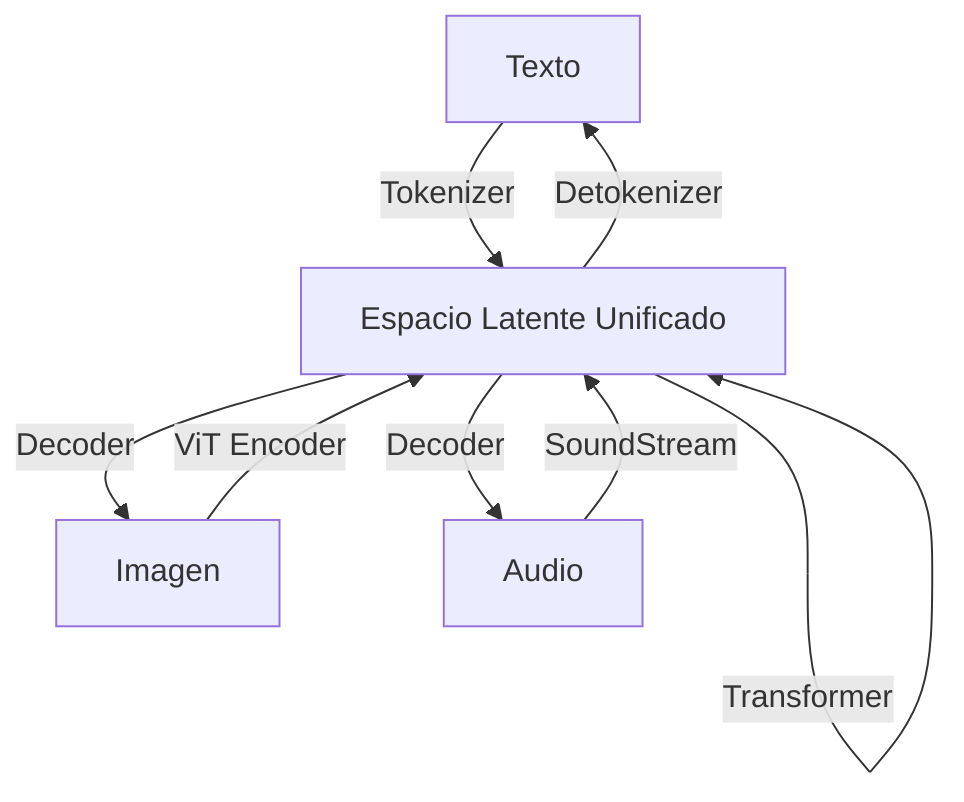

# 🌐 Modelos Multimodales de LLMs

La inteligencia artificial general requiere sistemas que perciban el mundo más allá del texto. Los seres humanos integramos simultáneamente información visual, auditiva, táctil y lingüística para razonar, planificar y comunicarnos. Los **modelos multimodales de LLMs** representan el paso evolutivo desde sistemas puramente textuales hacia arquitecturas unificadas que procesan y generan múltiples modalidades. En esta nota, examinamos las arquitecturas, técnicas de entrenamiento y paradigmas de tokenización que permiten a un solo modelo entender una imagen, analizar un video, transcribir audio y responder en lenguaje natural.

---

## 1. GPT-4V, Gemini y LLaVA

### GPT-4V (GPT-4 with Vision)

OpenAI extendió GPT-4 para aceptar entradas de imagen junto con texto. GPT-4V demuestra capacidades de razonamiento visual de alto nivel: interpretación de diagramas, lectura de texto en imágenes (OCR), análisis de interfaces gráficas y resolución de problemas matemáticos presentados en formato visual. Aunque los detalles arquitectónicos no son públicos, se especula que utiliza un encoder visual (posiblemente basado en CLIP o un ViT interno) cuyos embeddings se proyectan al espacio del transformer de lenguaje.

### Gemini

Google DeepMind diseñó **Gemini** como un modelo **nativamente multimodal** desde la pre-entrenamiento. A diferencia de los enfoques *bolt-on* (donde se conecta un encoder visual a un LLM pre-entrenado), Gemini se entrena desde cero sobre datos interleaved de texto, imagen, audio y video. Sus versiones (Nano, Pro, Ultra) escalan desde edge devices hasta clusters de TPU.

### LLaVA (Large Language and Vision Assistant)

**LLaVA** (Liu et al., 2023) es el estándar de facto en el ecosistema open-source. Conecta el encoder visual CLIP ViT-L/14 con LLaMA mediante una capa de proyección entrenada con datos de instrucción visuales generados sintéticamente por GPT-4. Es notable por su simplicidad arquitectónica y su sorprendente capacidad de razonamiento visual a pesar de su tamaño modesto (7B-13B parámetros).

| Característica | GPT-4V | Gemini Ultra | LLaVA-1.5 |
|----------------|--------|--------------|-----------|
| Modalidades | Texto, Imagen | Texto, Imagen, Audio, Video | Texto, Imagen |
| Parámetros | No divulgado | ~1.6T (est.) | 7B / 13B |
| Encoder Visual | Propietario | Propietario (nativo) | CLIP ViT-L/14 |
| Datos de entrenamiento | No divulgados | Multimodales interleaved | LLaVA-Instruct (158k) |
| Código abierto | No | No | Sí |

Caso real: **Microsoft** integró GPT-4V en su producto **Be My Eyes** para asistencia visual a personas con discapacidad visual, describiendo objetos, leyendo etiquetas y navegando entornos físicos en tiempo real.

---

## 2. Visual Instruction Tuning

El **instruction tuning** revolucionó los LLMs textuales. La extensión visual sigue la misma filosofía: finetunear un modelo pre-entrenado para seguir instrucciones expresadas en lenguaje natural sobre contenido visual.

El dataset **LLaVA-Instruct** se generó de forma innovadora: se tomaron 158k pares de (imagen, descripción textual, preguntas/respuetas básicas) del dataset COCO. Estos datos se introdujeron en GPT-4 (texto únicamente, sin ver la imagen) con prompts como:

```
Dada la descripción de una imagen y una conversación básica, genera 3 tipos de instrucciones:
1. Conversación (pregunta-respuesta).
2. Descripción detallada.
3. Razonamiento complejo.
```

El resultado fue un dataset de instrucciones multimodales de alta calidad a un costo fraccionario del etiquetado humano manual.

La arquitectura de entrenamiento de LLaVA es:

```
Imagen -> CLIP ViT -> Proyector MLP -> Embeddings visuales
Prompt de texto -> Tokenizador -> Embeddings de texto
[Embeddings visuales; Embeddings de texto] -> LLaMA -> Respuesta
```

La loss de entrenamiento es la cross-entropy estándar sobre los tokens de respuesta, manteniendo congelados el encoder visual y el LLM base, y entrenando únicamente la capa de proyección (en la primera fase) o realizando fine-tuning completo (en la segunda fase).

$$
\mathcal{L}_{VIT} = -\sum_{t=1}^{T} \log P(y_t \mid y_{<t}, x_{texto}, x_{imagen}; \theta)
$$

Caso real: **Stanford** publicó LLaVA con un presupuesto de entrenamiento de aproximadamente 300 USD en GPUs A100, demostrando que la investigación de vanguardia en multimodalidad ya no requiere infraestructura de hiperescala.

💡 **Tip:** Para dominar visual instruction tuning en tu propio dominio (ej. imágenes médicas, diagramas técnicos), genera datos sintéticos con GPT-4V o Claude-3 y aplica fine-tuning LoRA sobre la proyección y las capas de atención del LLM.

---

## 3. Interleaved Data

Los humanos no consumen información en bloques aislados de texto o imagen; navegamos páginas web donde el texto rodea imágenes, vemos videos con subtítulos, y leemos artículos con gráficos intercalados. Los modelos entrenados únicamente con pares (imagen, caption) pierden esta estructura rica.

El entrenamiento con **interleaved data** ( datos entrelazados) utiliza documentos largos (páginas web, libros digitales) donde las imágenes aparecen en su contexto natural:

```
El renacimiento italiano fue un período de gran florecimiento cultural...
[Imagen: La última cena de Leonardo]
...como se observa en la obra maestra de Da Vinci, la perspectiva lineal...
[Imagen: Boceto anatómico]
...revolucionó la representación del cuerpo humano.
```

Gemini se entrenó con masivos corpus de datos interleaved de la web (filtrados y deduplicados), lo que le permite razonar sobre relaciones espaciales, temporales y causales entre texto e imágenes dispersas en un contexto largo.

La fórmula de la loss para datos interleaved generaliza la cross-entropy multimodal:

$$
\mathcal{L} = \sum_{m \in \text{modalidades}} \lambda_m \cdot \mathcal{L}_m
$$

donde $\lambda_m$ son pesos que balancean la contribución de cada modalidad. Típicamente, $\lambda_{texto} = 1.0$, $\lambda_{imagen} = 0.5$ si la tarea es generación de texto condicionada a imagen.

⚠️ **Advertencia:** Los datos interleaved de la web contienen ruido significativo: imágenes irrelevantes (anuncios, banners), texto de baja calidad, y sesgos culturales. Un pipeline de filtrado riguroso (basado en clasificadores de calidad y deduplicación perceptual) es indispensable antes del entrenamiento.

---

## 4. Any-to-Any Models

Los modelos **any-to-any** aspiran a romper la asimetría entre encoder y decoder. En lugar de un modelo que *lee* imagen y *escribe* texto, estos sistemas pueden aceptar cualquier combinación de modalidades de entrada y producir cualquier combinación de salida.

Ejemplos notables:

- **NExT-GPT:** Conecta un LLM base con encoders/decoders especializados para imagen (Stable Diffusion), audio (AudioLDM) y video (VideoFusion). El LLM genera tokens semánticos especiales que activan los decoders periféricos.
- **Unified-IO 2:** Arquitectura unificada que maneja más de 80 datasets de visión, lenguaje y audio bajo un solo framework de entrenamiento.
- **Gemini Ultra:** Capaz de razonar sobre un video completo (hasta 1 hora) y responder preguntas sobre eventos temporales, acciones y relaciones causales.

La clave arquitectónica es una **representación intermedia unificada**: todas las modalidades se proyectan a un espacio latente compartido donde el transformer realiza el razonamiento, y desde el cual se decodifican de vuelta a la modalidad deseada.



Caso real: **Google** demostró que Gemini Ultra puede analizar una película de 45 minutos, identificar escenas clave, transcribir diálogos, y generar un resumen estructurado con timestamps, una tarea imposible para sistemas puramente textuales o de par imagen-texto.

---

## 5. Tokenización Unificada

Para que un transformer procese múltiples modalidades de forma homogénea, cada modalidad debe convertirse en una secuencia de **tokens discretos** en un vocabulario compartido.

### Imágenes: VQ-VAE y VQ-GAN

Un **Vector Quantized Variational AutoEncoder** (VQ-VAE) comprime una imagen $x \in \mathbb{R}^{H \times W \times 3}$ en una cuadrícula de tokens discretos $z \in \{0, 1, ..., K-1\}^{h \times w}$:

1. Un encoder CNN produce embeddings continuos $e \in \mathbb{R}^{h \times w \times d}$.
2. Cada embedding se reemplaza por el vector más cercano de un **codebook** $E \in \mathbb{R}^{K \times d}$:

$$
z_{ij} = \arg\min_{k} \|e_{ij} - E_k\|_2
$$

3. Un decoder CNN reconstruye la imagen desde los vectores cuantizados.

**VQ-GAN** (Esser et al., 2021) mejora esto con un discriminador adversarial, logrando reconstrucciones de alta calidad en resoluciones de 256x256 o 512x512 con solo 256-1024 tokens.

### Audio: SoundStream y EnCodec

Los codecs neuronales como **SoundStream** (Zeghidour et al., 2021) comprimen audio en tokens discretos utilizando codificación residual cuantizada (RVQ). Un segundo de audio a 24kHz se reduce a ~500-2000 tokens, manejables por un transformer.

### Video

El video se tokeniza típicamente como una secuencia de tokens de frame (usando VQ-VAE espacio-temporal) o como una combinación de tokens de imagen + tokens de movimiento (flow tokens).

| Modalidad | Tokenizador | Tokens por unidad | Vocabulario |
|-----------|-------------|-------------------|-------------|
| Texto | BPE / SentencePiece | 1 por subpalabra | 32k-100k |
| Imagen 256x256 | VQ-GAN | 256 (16x16) | 16k-32k |
| Audio 1s @ 24kHz | SoundStream | ~750 | 2048 |
| Video 1s @ 10fps | VQ-VAE 3D | ~2560 | 4096 |

La tokenización unificada permite que el transformer aplique exactamente el mismo mecanismo de auto-atención a texto, imagen y audio sin modificaciones arquitectónicas.

$$
\mathcal{L}_{total} = \underbrace{\mathcal{L}_{CE}^{texto}}_{\text{modelado de lenguaje}} + \lambda_{vq} \underbrace{\|e - \text{sg}[E_z]\|_2^2}_{\text{commitment VQ}} + \lambda_{rec} \underbrace{\|x - \hat{x}\|_2^2}_{\text{reconstrucción}}
$$

donde $\text{sg}[\cdot]$ es la operación stop-gradient.

Caso real: **OpenAI** utilizó VQ-VAE para entrenar **DALL-E 1**, donde las imágenes se representaban como secuencias de 1024 tokens que el transformer generaba auto-regresivamente, condicionado a un prompt textual.

---

## 📦 Código de Compresión: Inferencia Multimodal con LLaVA

El siguiente script utiliza Hugging Face Transformers para ejecutar inferencia visual con LLaVA-1.5, demostrando la proyección de embeddings visuales y la generación de respuestas condicionadas a imagen.

```python
from transformers import AutoProcessor, LlavaForConditionalGeneration
from PIL import Image
import torch

model_id = "liuhaotian/llava-v1.5-7b"
model = LlavaForConditionalGeneration.from_pretrained(
    model_id,
    torch_dtype=torch.float16,
    device_map="auto"
)
processor = AutoProcessor.from_pretrained(model_id)

# Cargar imagen
image = Image.open("example_image.jpg")
prompt = "USER: <image>\nDescribe lo que ves en esta imagen.\nASSISTANT:"

inputs = processor(text=prompt, images=image, return_tensors="pt").to(model.device)

# Generar
output = model.generate(**inputs, max_new_tokens=200, do_sample=True, temperature=0.7)
response = processor.batch_decode(output, skip_special_tokens=True)[0]
print(response)

# Inspección de proyección visual
print(f"Dimensión de embeddings visuales proyectados: {model.get_vision_tower().config.hidden_size}")
```

---

## 🎯 Proyecto: Sistema de QA Visual para Documentos Técnicos

Construye un sistema que permita a los usuarios cargar un diagrama técnico (ej. un esquema eléctrico, un diagrama de arquitectura de software, o una captura de pantalla de dashboard) y realizar preguntas en lenguaje natural sobre su contenido.

### Componentes

1. **Frontend:** Streamlit o Gradio para carga de imagen y chat.
2. **Backend:** API FastAPI que orquesta:
   - Procesamiento de imagen (redimensionamiento, normalización).
   - Inferencia con LLaVA-1.5 (7B o 13B) o un modelo similar open-source.
   - Post-procesamiento de la respuesta (validación de formato).
3. **Evaluación:** Dataset de 50 imágenes técnicas con 3 preguntas cada una. Métricas:
   - **Accuracy de respuesta:** Evaluación humana o con GPT-4 como juez (LLM-as-a-Judge).
   - **Latencia:** TTFT y tiempo total de respuesta.
   - **Tasa de alucinación:** % de respuestas que inventan elementos no presentes en la imagen.

### Métricas Objetivo

| Métrica | Objetivo |
|---------|----------|
| Respuestas correctas (juez humano) | > 75% |
| Alucinaciones | < 10% |
| Latencia total (imagen 512x512) | < 5 s |

💡 **Tip:** Si la precisión es insuficiente, genera un dataset de ~1k pares (imagen, pregunta, respuesta) en tu dominio específico y aplica fine-tuning LoRA sobre la capa de proyección y las capas de atención del LLM en LLaVA.

⚠️ **Advertencia:** Los modelos multimodales son propensos a alucinaciones visuales: pueden afirmar con confianza la existencia de objetos que no están en la imagen. Siempre implementa un mecanismo de verificación cruzada o disclaimer para el usuario final en aplicaciones de alta criticidad (medicina, seguridad).

---


---

**Enlaces internos:**
- [[00 - Bienvenida]]
- [[01 - Mixture of Experts]]
- [[02 - State Space Models (Mamba)]]
- [[04 - Caso Practico - Agente Autonomo con LLM]]
