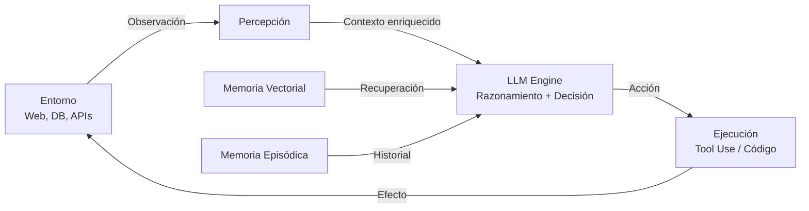

# 🤖 Caso Práctico: Agente Autónomo con LLM

El próximo gran salto en la aplicación de los Large Language Models no es la generación pasiva de texto, sino la **agencia**: sistemas que perciben su entorno, razonan sobre objetivos, planean secuencias de acciones, utilizan herramientas externas y aprenden de la retroalimentación. Un **agente autónomo** con LLM trasciende el paradigma de "pregunta-respuesta" para convertirse en un ejecutor de tareas complejas. En este caso práctico, diseñamos e implementamos un agente cognitivo completo, integrando los conceptos de arquitecturas avanzadas, memoria y seguridad estudiados en este módulo.

---

## 1. Arquitectura del Agente

Un agente autónomo basado en LLM puede modelarse como un ciclo de percepción-cognición-acción:



### Componentes Fundamentales

- **Motor de Lenguaje:** El LLM que actúa como "corteza prefrontal" del agente. Puede ser un modelo denso (LLaMA, Mistral), un MoE (Mixtral) o incluso un modelo híbrido.
- **Capa de Percepción:** Procesa entradas del entorno (resultados de búsqueda, lecturas de sensores, salidas de código) y las estructura en el formato esperado por el LLM.
- **Módulo de Planificación:** Descompone objetivos de alto nivel en sub-tareas secuenciales.
- **Tool Use:** Capacidad de invocar funciones externas (APIs, calculadoras, bases de datos).
- **Memoria:** Almacenamiento de información a corto plazo (contexto de conversación) y largo plazo (conocimiento acumulado, embeddings semánticos).
- **Sandbox de Ejecución:** Entorno seguro para ejecutar código generado por el modelo.

---

## 2. Tool Use

El **tool use** (uso de herramientas) transforma al LLM de un generador de texto a un orquestador de capacidades. En lugar de que el modelo intente calcular $\sqrt{123456789}$ o buscar el clima de París desde sus parámetros (donde probablemente fallará o alucinará), aprende a emitir llamadas a funciones especializadas.

### Definición de Herramientas

Las herramientas se definen mediante esquemas JSON que especifican nombre, descripción y parámetros:

```json
{
  "name": "weather_lookup",
  "description": "Obtiene el clima actual para una ciudad.",
  "parameters": {
    "type": "object",
    "properties": {
      "city": {"type": "string", "description": "Nombre de la ciudad"},
      "units": {"type": "string", "enum": ["metric", "imperial"]}
    },
    "required": ["city"]
  }
}
```

Durante la inferencia, el LLM genera un token especial (ej. `<function_call>`) seguido de los argumentos JSON. El runtime del agente parsea esta salida, ejecuta la función y reinyecta el resultado en el contexto como una observación.

$$
\text{Acción}_t = \pi_{LLM}(\text{Observación}_{1:t-1}, \text{Objetivo}; \theta)
$$

Caso real: **OpenAI** introdujo Function Calling en GPT-4 y GPT-3.5-turbo, permitiendo a desarrolladores conectar sus modelos con miles de APIs externas. **Anthropic** extendió esto con Computer Use, donde Claude puede controlar un navegador y una interfaz gráfica.

💡 **Tip:** Diseña las descripciones de tus herramientas como si fueran prompts: sean claras, específicas y contengan ejemplos de uso. La calidad del tool use depende directamente de la calidad de estas descripciones.

---

## 3. Planificación con ReAct

**ReAct** (Reasoning + Acting, Yao et al., 2023) es un paradigma de prompting que estructura el razonamiento del agente en pasos intercalados de pensamiento (Thought), acción (Action) y observación (Observation).

### Estructura del Prompt

```
Responde a la siguiente pregunta lo mejor que puedas. Tienes acceso a las siguientes herramientas:
- search(query): Busca en Wikipedia.
- calculator(expression): Evalúa una expresión matemática.

Usa el siguiente formato:
Pregunta: la pregunta que debes responder
Pensamiento: siempre debes pensar qué hacer
Acción: la acción a realizar, debe ser una de [search, calculator]
Entrada de Acción: la entrada para la acción
Observación: el resultado de la acción
... (este Pensamiento/Acción/Entrada de Acción/Observación puede repetirse N veces)
Pensamiento: Ahora sé la respuesta final
Respuesta Final: la respuesta final a la pregunta original

Pregunta: ¿Cuál es el país de origen del ganador del Premio Nobel de Física 2023, y cuál es su edad actual al cuadrado?
Pensamiento: Necesito encontrar quién ganó el Nobel de Física 2023.
Acción: search
Entrada de Acción: Premio Nobel de Física 2023 ganador
Observación: Anne L'Huillier, Ferenc Krausz y Pierre Agostini ganaron el Premio Nobel de Física 2023.
Pensamiento: Necesito saber el país de origen de uno de ellos. Buscaré a Pierre Agostini.
Acción: search
Entrada de Acción: Pierre Agostini país de origen
Observación: Pierre Agostini es francés, nacido en 1941.
Pensamiento: Ahora necesito calcular su edad al cuadrado. Asumiendo el año 2024, tiene 83 años.
Acción: calculator
Entrada de Acción: 83**2
Observación: 6889
Pensamiento: Ahora sé la respuesta final.
Respuesta Final: El país de origen es Francia, y la edad al cuadrado es 6889.
```

ReAct mejora significativamente la tasa de éxito en tareas que requieren múltiples pasos de razonamiento, reduciendo las alucinaciones al anclar cada afirmación en una observación concreta del entorno.

Caso real: **LangChain** y **LlamaIndex** implementan patrones ReAct como agentes pre-construidos, permitiendo a desarrolladores crear pipelines de razonamiento multi-paso con pocas líneas de código.

⚠️ **Advertencia:** ReAct es sensible a errores acumulativos. Si una observación temprana es incorrecta (ej. resultado de búsqueda obsoleto), el agente puede derivar una conclusión errónea con alta confianza. Implementa verificación cruzada para observaciones críticas.

---

## 4. Memoria: Vector Store + Resumen

Un agente sin memoria es un sistema sin estado, condenado a repetir errores y olvidar contextos pasados. Diseccionamos tres tipos de memoria:

### Memoria a Corto Plazo (Buffer de Conversación)

Es simplemente el historial de mensajes dentro de la ventana de contexto del LLM. Para modelos con 4k-128k tokens de contexto, esto puede abarcar decenas de interacciones recientes.

### Memoria a Largo Plazo (Vector Store)

Para acceder a información más allá de la ventana de contexto, el agente utiliza una **base de datos vectorial** (FAISS, Chroma, Pinecone, Weaviate). El flujo es:

1. **Indexación:** Documentos, observaciones pasadas o conocimiento de dominio se fragmentan (*chunking*) y se embedden con un modelo de sentence embeddings (ej. `sentence-transformers/all-MiniLM-L6-v2`).
2. **Recuperación:** Dado un prompt de consulta $q$, se calcula su embedding $e_q$ y se recuperan los $k$ vecinos más cercanos:

$$
\text{Recuperados} = \arg\max_{d \in \mathcal{D}}^{(k)} \cos(e_q, e_d)
$$

3. **Inyección:** Los chunks recuperados se añaden al prompt como contexto enriquecido.

### Memoria de Resumen

Cuando el buffer de conversación excede la capacidad del modelo, un sub-módulo de resumen (otro LLM o el mismo con un prompt específico) comprime el historial antiguo en un párrafo conciso:

```
Resume el siguiente historial de conversación en 3 oraciones, preservando los hechos clave:
[Historial largo]
```

Este resumen se almacena en la vector store o se inyecta directamente al inicio del contexto.

| Tipo de Memoria | Capacidad | Latencia de Acceso | Uso Típico |
|-----------------|-----------|--------------------|------------|
| Buffer de Contexto | 4k-128k tokens | Inmediata | Turnos recientes |
| Vector Store | Millones de docs | ~50-200 ms | Conocimiento factual |
| Memoria de Resumen | Comprimida | Inmediata | Historial lejano |

Caso real: **MemGPT** (Packer et al., 2023) implementa un sistema de memoria jerárquica inspirado en los sistemas operativos, con memoria "RAM" (contexto), "SSD" (vector store) y "archivos" (resúmenes), logrando mantener conversaciones coherentes de cientos de miles de tokens.

---

## 5. Ejecución de Código

Un agente verdaderamente autónomo debe poder ejecutar código para realizar cálculos complejos, transformar datos o interactuar con sistemas externos. Sin embargo, ejecutar código generado por un LLM en el host principal es un riesgo de seguridad extremo.

### Sandboxing

La solución es el **sandboxing**: ejecutar el código en un entorno aislado con restricciones estrictas:

- **Docker:** Contenedor con acceso a red limitado, filesystem temporal y límites de CPU/memoria.
- **E2B (Electric Brain):** Plataforma cloud diseñada específicamente para ejecutar código generado por IA, con timeouts automáticos y sanitización de imports.
- **GVisor:** Runtime de contenedores con kernel propio que añade una capa adicional de aislamiento entre el contenedor y el host.

### Política de Seguridad Mínima

```python
# Ejemplo de sandbox con subprocess y restricciones
import subprocess
import tempfile
import os

def execute_code(code: str, timeout: int = 5) -> dict:
    with tempfile.NamedTemporaryFile(mode='w', suffix='.py', delete=False) as f:
        f.write(code)
        f.flush()
        try:
            result = subprocess.run(
                ['python', f.name],
                capture_output=True,
                text=True,
                timeout=timeout,
                env={**os.environ, 'PATH': '/usr/bin'}
            )
            return {"stdout": result.stdout, "stderr": result.stderr, "code": result.returncode}
        except subprocess.TimeoutExpired:
            return {"error": "Execution timeout"}
        finally:
            os.unlink(f.name)
```

⚠️ **Advertencia:** Incluso dentro de Docker, un LLM podría generar código que consume recursos de forma excesiva (bombas fork, memory exhaustion) o intenta escalada de privilegios. Utiliza siempre **seccomp** profiles, **AppArmor** o soluciones gestionadas como E2B para producción.

---

## 6. Métricas: Task Completion Rate y Steps to Goal

Evaluar un agente autónomo es más complejo que evaluar un clasificador, ya que el espacio de acciones es vasto y las trayectorias óptimas pueden variar.

### Task Completion Rate (TCR)

La métrica más directa: ¿logró el agente alcanzar el objetivo final?

$$
\text{TCR} = \frac{\text{Número de tareas completadas correctamente}}{\text{Número total de tareas}} \times 100
$$

Una tarea se considera completada si la respuesta final cumple un criterio de verificación automatizado (ej. output exacto, presencia de keywords, evaluación por un LLM juez).

### Steps to Goal (STG)

Mide la eficiencia del agente. Dada una tarea que requiere un mínimo teórico de $N_{opt}$ pasos, el STG compara la longitud de la trayectoria real $N_{real}$:

$$
\text{Eficiencia} = \frac{N_{opt}}{N_{real}}
$$

Un agente que resuelve una tarea en 5 pasos cuando el óptimo es 3 tiene una eficiencia de 0.6. Un agente ReAct bien diseñado debe mantener eficiencia > 0.7 en tareas de razonamiento multi-paso.

### Otras Métricas

| Métrica | Descripción | Cómo Medir |
|---------|-------------|------------|
| Tool Accuracy | % de llamadas a herramientas con sintaxis correcta | Parser JSON sobre salidas |
| Halucination Rate | % de afirmaciones no sustentadas por observaciones | LLM-as-a-Judge |
| Recovery Rate | % de errores que el agente corrige autónomamente | Análisis de trayectorias |

Caso real: **SWE-bench** (Jimenez et al., 2023) es un benchmark donde agentes basados en LLMs deben resolver issues reales de GitHub en proyectos Python. El mejor sistema alcanza un TCR de ~15%, demostrando que la agencia real en software engineering sigue siendo un desafío abierto.

---

## 📦 Código de Compresión: Agente ReAct Standalone

El siguiente script implementa un agente ReAct completo sin dependencias de frameworks externos, con soporte para tool use, memoria buffer y ejecución de código sandboxed.

```python
import json
import re
import subprocess
import tempfile
import os
from typing import List, Dict, Callable

class SimpleAgent:
    def __init__(self, llm_call: Callable[[str], str], tools: Dict[str, Callable]):
        self.llm_call = llm_call
        self.tools = tools
        self.memory: List[str] = []
    
    def run(self, task: str, max_steps: int = 10) -> str:
        prompt = self._build_prompt(task)
        for step in range(max_steps):
            response = self.llm_call(prompt)
            self.memory.append(response)
            
            # Parsear acción
            action_match = re.search(r'Acción:\s*(\w+)', response)
            if not action_match:
                # Respuesta final
                final_match = re.search(r'Respuesta Final:\s*(.+)', response, re.DOTALL)
                return final_match.group(1).strip() if final_match else response
            
            action_name = action_match.group(1)
            input_match = re.search(r'Entrada de Acción:\s*(.+)', response, re.DOTALL)
            action_input = input_match.group(1).strip() if input_match else ""
            
            if action_name in self.tools:
                try:
                    observation = self.tools[action_name](action_input)
                except Exception as e:
                    observation = f"Error: {str(e)}"
            else:
                observation = f"Error: Herramienta '{action_name}' no encontrada."
            
            prompt += f"\n{response}\nObservación: {observation}"
        return "El agente no pudo completar la tarea en el número máximo de pasos."
    
    def _build_prompt(self, task: str) -> str:
        tool_desc = "\n".join([f"- {name}: {func.__doc__}" for name, func in self.tools.items()])
        base = f"""Eres un agente autónomo. Tienes acceso a estas herramientas:
{tool_desc}

Usa el formato:
Pensamiento: ...
Acción: nombre_herramienta
Entrada de Acción: ...
Observación: ...
...
Respuesta Final: ...

Tarea: {task}
"""
        return base

# Herramientas de ejemplo
def search_tool(query: str) -> str:
    """Busca información en una base de conocimiento simulada."""
    kb = {
        "capital de francia": "París",
        "población de parís": "2.1 millones"
    }
    return kb.get(query.lower(), "No se encontró información.")

def calculator_tool(expr: str) -> str:
    """Evalúa una expresión matemática de forma segura."""
    try:
        # Sandbox básico: solo permitir operaciones aritméticas
        allowed = {"__builtins__": None}
        allowed.update({k: v for k, v in __import__('math').__dict__.items()})
        return str(eval(expr, allowed, {}))
    except Exception as e:
        return f"Error de cálculo: {e}"

# Mock del LLM (en producción: llamada a OpenAI, local, etc.)
def mock_llm(prompt: str) -> str:
    # Este mock simula razonamiento para la tarea de ejemplo
    if "capital de Francia" in prompt and "Observación" not in prompt:
        return "Pensamiento: Necesito buscar la capital de Francia.\nAcción: search_tool\nEntrada de Acción: capital de Francia"
    if "población" in prompt.lower():
        return "Pensamiento: Necesito calcular el doble de la población.\nAcción: calculator_tool\nEntrada de Acción: 2.1 * 2"
    if "Observación" in prompt:
        return "Pensamiento: Ahora tengo toda la información.\nRespuesta Final: La capital de Francia es París, y el doble de su población es 4.2 millones."
    return "Pensamiento: No estoy seguro.\nRespuesta Final: No puedo responder."

# Ejecución
agent = SimpleAgent(llm_call=mock_llm, tools={"search_tool": search_tool, "calculator_tool": calculator_tool})
result = agent.run("¿Cuál es la capital de Francia y cuál es el doble de su población?")
print(result)
```

---

## 🎯 Proyecto Documentado: Agente Autónomo de Análisis de Datos

El proyecto final consiste en construir un agente que, dada una pregunta en lenguaje natural sobre un dataset CSV, sea capaz de:

1. **Cargar y explorar** el dataset (dimensiones, columnas, tipos de datos).
2. **Generar código Python** (pandas, matplotlib, seaborn) para responder la pregunta.
3. **Ejecutar el código** en un sandbox Docker.
4. **Interpretar los resultados** y generar una respuesta en lenguaje natural con visualizaciones.

### Arquitectura del Proyecto

```
agente_analisis/
├── main.py              # Orquestador del agente
├── llm_engine.py        # Wrapper para LLM local o API
├── tools.py             # Definición de herramientas (load_csv, execute_python, plot)
├── memory.py            # Vector store para documentación de APIs y ejemplos pasados
├── sandbox/
│   ├── Dockerfile       # Entorno Python aislado
│   └── executor.py      # Script que recibe código y devuelve resultados
└── data/
    └── sample.csv
```

### Métricas de Evaluación

| Métrica | Definición | Objetivo |
|---------|------------|----------|
| Task Completion Rate | % de preguntas respondidas correctamente | > 80% |
| Steps to Goal | Pasos promedio por tarea | < 5 |
| Code Execution Success | % de scripts que ejecutan sin error | > 90% |
| User Satisfaction | Evaluación subjetiva 1-5 | > 4.0 |

### Entregables

1. **Código fuente** funcional con instrucciones de instalación.
2. **Dataset de evaluación:** 20 preguntas de análisis sobre al menos 3 datasets diferentes (ventas, clima, deportes).
3. **Reporte de resultados:** Tabla de métricas, ejemplos de ejecuciones exitosas y fallidas, análisis de errores.

💡 **Tip:** Para mejorar la robustez, implementa un mecanismo de **retry con reflexión**: si la ejecución del código falla, el agente recibe el error traceback y debe corregir el código en un nuevo intento. Esto incrementa el TCR en un 20-30% en la mayoría de benchmarks de código.

⚠️ **Advertencia:** Nunca permitas que el agente ejecute código que contenga operaciones de red (`requests`, `urllib`) o acceso al filesystem fuera del directorio de trabajo (`/tmp/data`). Sanitiza los imports permitidos en el sandbox mediante una whitelist explícita.

---


---

**Enlaces internos:**
- [[00 - Bienvenida]]
- [[01 - Mixture of Experts]]
- [[02 - State Space Models (Mamba)]]
- [[03 - Modelos Multimodales de LLMs]]
