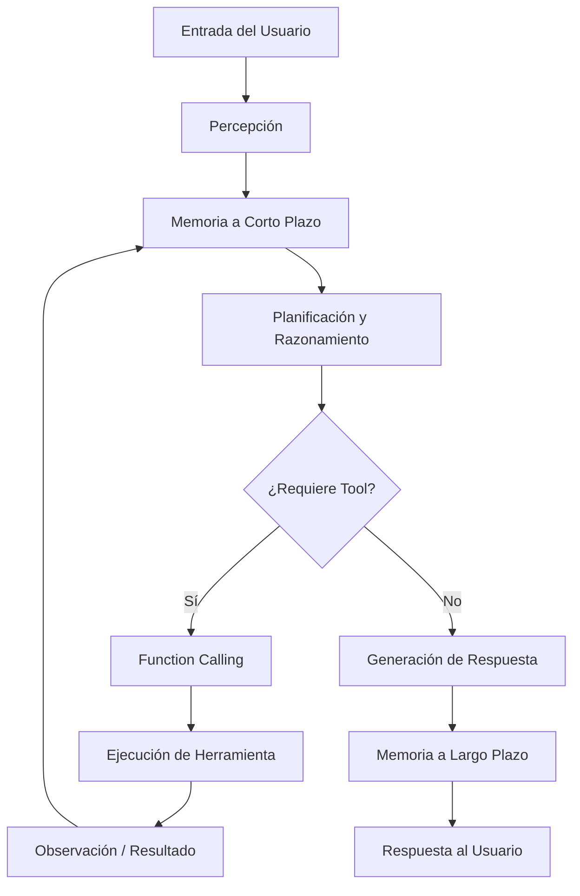

# 🤖 00 - Bienvenida

Bienvenido al módulo **11 - Fundamentos de Agentes AI**, parte del programa de especialización en **ML and IA Engineering**. Este curso sienta las bases teóricas y prácticas para diseñar, construir y desplegar agentes inteligentes que van más allá de la generación de texto, integrando razonamiento, memoria, planificación y uso de herramientas en el mundo real.

Para un ML/AI Engineer, comprender los fundamentos de los agentes es esencial porque representan el siguiente escalón evolutivo de los sistemas basados en modelos de lenguaje: de simples predictores de texto a entidades autónomas capaces de interactuar con APIs, bases de datos y entornos dinámicos.

---

## 1. Estructura del Curso

Este módulo está organizado en cinco unidades de contenido progresivo:

| # | Nota | Descripción | Enlace |
|---|------|-------------|--------|
| 00 | Bienvenida | Índice, glosario y objetivos | [[00 - Bienvenida]] |
| 01 | Agentes vs Modelos de Lenguaje | Diferencias fundamentales, arquitectura y taxonomía | [[01 - Agentes vs Modelos de Lenguaje]] |
| 02 | Tool Use y Function Calling | Integración con herramientas externas y ejecución de funciones | [[02 - Tool Use y Function Calling]] |
| 03 | Memoria en Agentes | Tipos de memoria, retrieval y gestión de contexto | [[03 - Memoria en Agentes]] |
| 04 | Planning y Razonamiento | Estrategias de razonamiento, ReAct, CoT, ToT y planificación | [[04 - Planning y Razonamiento]] |
| 05 | Caso Práctico | Agente de Reservas Inteligente: integración completa | [[05 - Caso Practico - Agente de Reservas Inteligente]] |

---

## 2. Glosario de Términos Fundamentales

A continuación se define la nomenclatura esencial que se utilizará a lo largo de todo el curso.

### 2.1. Agente

Un **agente** es una entidad computacional que percibe su entorno mediante sensores (inputs), procesa información mediante un modelo de razonamiento, mantiene un estado interno (memoria) y ejecuta acciones mediante actuadores (outputs) para alcanzar uno o más objetivos. A diferencia de un modelo de lenguaje puro, un agente opera en un ciclo cerrado de percepción-acción.

### 2.2. LLM (Large Language Model)

Modelo de lenguaje de gran escala entrenado para predecir la siguiente secuencia de tokens. Sirve como el "cerebro" o motor de razonamiento de muchos agentes modernos, pero por sí solo carece de estado persistente, acceso a herramientas y autonomía de planificación.

### 2.3. Tool Use

Capacidad de un agente para invocar herramientas externas (APIs, funciones, bases de datos) para extender sus capacidades más allá del conocimiento paramétrico del modelo base.

### 2.4. Function Calling

Mecanismo específico implementado por proveedores como OpenAI y Anthropic que permite al modelo generar un objeto JSON estructurado para invocar una función con argumentos tipados, en lugar de generar texto libre.

### 2.5. ReAct (Reasoning + Acting)

Paradigma de razonamiento que entrelaza pasos de razonamiento lingüístico (thought) con acciones concretas (action), permitiendo al agente razonar sobre el estado actual y decidir la siguiente herramienta a utilizar.

### 2.6. CoT (Chain-of-Thought)

Técnica de prompting que induce al modelo a generar una secuencia de pasos de razonamiento intermedios antes de llegar a una respuesta final, mejorando significativamente el rendimiento en tareas de aritmética, lógica y sentido común.

### 2.7. Memoria a Corto Plazo

Estado temporal que mantiene el contexto inmediato de una sesión o conversación. Suele estar limitado por la ventana de contexto del modelo y se pierde al reiniciar la interacción.

### 2.8. Memoria a Largo Plazo

Almacenamiento persistente de conocimiento, experiencias pasadas y preferencias del usuario. Se implementa típicamente mediante bases de datos vectoriales, grafos de conocimiento o almacenes clave-valor.

### 2.9. Planning

Proceso cognitivo mediante el cual un agente descompone un objetivo de alto nivel en una secuencia o jerarquía de sub-objetivos y acciones ejecutables.

### 2.10. Observability

Capacidad de monitorear, trazar y auditar el comportamiento interno de un agente: qué razonamientos realizó, qué herramientas invocó, qué errores encontró y cómo evolucionó su estado.

### 2.11. Agent Loop

Ciclo de ejecución fundamental de un agente autónomo: **Percepción → Razonamiento/Planificación → Acción → Observación**. Este bucle se repite hasta que se satisface una condición de terminación.

---

## 3. Diagrama del Ciclo de Vida de un Agente

El siguiente diagrama ilustra el flujo general que seguiremos a lo largo del curso.

---

## 4. Objetivos de Aprendizaje

Al finalizar este módulo, serás capaz de:

1. Distinguir con precisión entre un LLM, un chatbot, un copilot y un agente autónomo.
2. Diseñar e implementar arquitecturas de agentes con percepción, memoria, planificación y acción.
3. Integrar herramientas externas mediante function calling con manejo robusto de errores.
4. Modelar sistemas de memoria jerárquica utilizando bases de datos vectoriales y estrategias de retrieval.
5. Aplicar técnicas avanzadas de razonamiento como ReAct, CoT y ToT para mejorar la calidad de las decisiones del agente.
6. Desarrollar un caso práctico end-to-end desplegable en un entorno de producción simulado.

---

## 5. Relevancia para ML/AI Engineering

El rol del ML Engineer está evolucionando rápidamente. Mientras que antes se centraba en entrenar modelos tabulares o redes neuronales, hoy gran parte del valor se genera en la **orquestación de sistemas inteligentes**. Los agentes AI son el punto de encuentro entre:

- **Ingeniería de software robusta**: manejo de errores, retries, observability.
- **Diseño de sistemas distribuidos**: colas de tareas, tool registries, memoria compartida.
- **Investigación en IA**: razonamiento multi-paso, planificación jerárquica, aprendizaje por refuerzo.

Caso real: En 2023, el equipo de AI de **Stripe** documentó cómo utilizaron agentes con tool use para automatizar tareas de soporte técnico que requerían consultar bases de datos internas, ejecutar refundos y enviar comunicaciones personalizadas, reduciendo el tiempo de resolución en un 40%.

---

⚠️ **Advertencia**: Este curso asume conocimientos previos de Python, consumo de APIs REST y conceptos básicos de modelos de lenguaje (transformers, prompting). Si alguno de estos temas es nuevo para ti, se recomienda repasar los módulos anteriores del programa.

💡 **Tip**: Mantén un notebook de experimentación paralelo mientras avanzas por las notas. La teoría de agentes se consolida únicamente cuando se implementa y se observa el comportamiento en tiempo real.

---

## 6. Recursos Adicionales

- Russell & Norvig, *Artificial Intelligence: A Modern Approach* (Capítulos sobre agentes inteligentes).
- OpenAI Function Calling Documentation.
- LangChain / LlamaIndex Framework Documentation.
- Wikimedia Commons: [Artificial Intelligence Illustration](https://upload.wikimedia.org/wikipedia/commons/8/8e/Artificial_Intelligence_%26_AI_%26_Machine_Learning_-_30212411048.jpg)

---

📦 **Código de compresión**: A lo largo de cada nota, busca los bloques de código marcados con `📦`. Al final del curso, se proporcionará un script para comprimir todo el código funcional en un único paquete ejecutable.

🎯 **Proyecto del módulo**: El proyecto final consiste en construir un **Agente de Reservas Inteligente** que integre todas las capas vistas: percepción de intenciones, planificación de itinerarios, uso de APIs simuladas de vuelos/hoteles/restaurantes, memoria de preferencias del usuario y manejo de errores. Ver detalles completos en [[05 - Caso Practico - Agente de Reservas Inteligente]].
