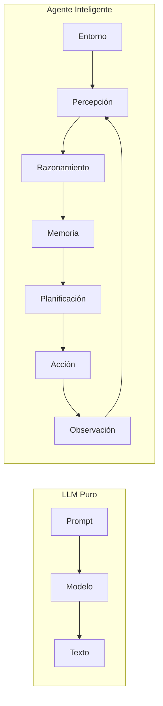
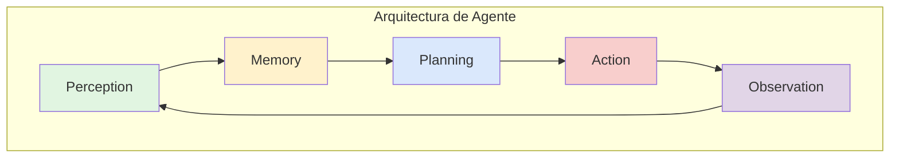
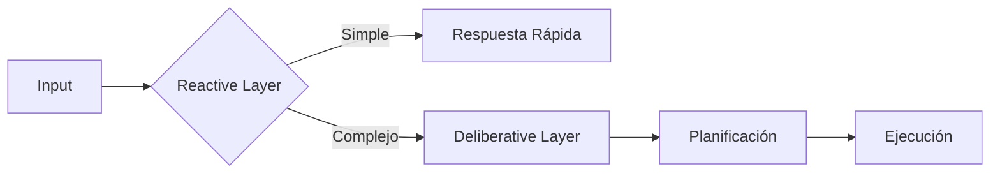
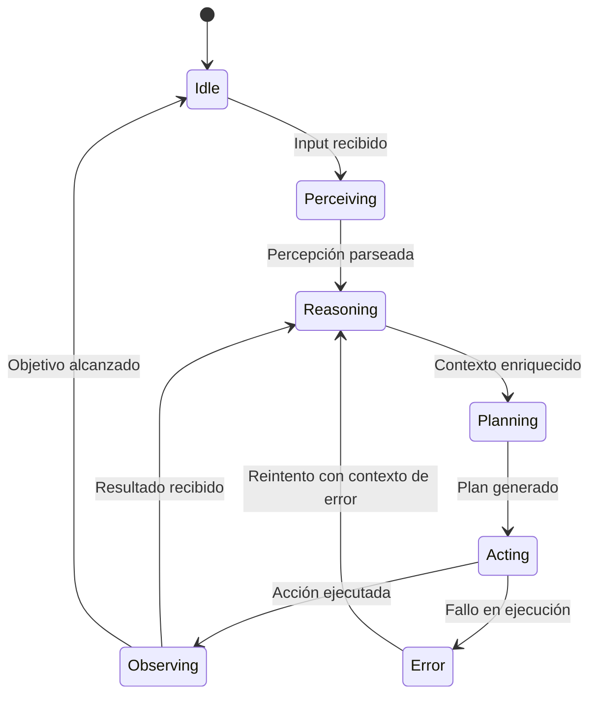

# 🧠 01 - Agentes vs Modelos de Lenguaje

La distinción entre un modelo de lenguaje (LLM) y un agente inteligente es el fundamento sobre el cual se construye toda la ingeniería de sistemas agentic. Mientras que un LLM es un predictor de secuencias estático, un agente es un sistema dinámico que opera en bucle cerrado con su entorno. Para un ML/AI Engineer, entender esta diferencia implica diseñar arquitecturas donde el modelo es solo una pieza de un sistema más grande.

---

## 1. Diferencia Fundamental: LLM Puro vs Agente

Un **LLM puro** recibe un prompt y genera una respuesta. Su interacción con el mundo se limita al texto. Un **agente**, por el contrario, percibe señales del entorno, razona sobre ellas, consulta su memoria, planifica una estrategia, ejecuta acciones (incluyendo llamadas a herramientas), observa los resultados y decide si continuar o detenerse.



---

## 2. El Ciclo OODA

El ciclo **OODA** (Observe, Orient, Decide, Act) fue desarrollado por el coronel John Boyd para la toma de decisiones en combate, pero se ha convertido en un marco conceptual extremadamente útil para la arquitectura de agentes.

| Fase | Descripción en el contexto de Agentes AI |
|------|------------------------------------------|
| **Observe** (Percibir) | El agente recibe inputs del entorno: texto del usuario, resultados de APIs, señales de error, timestamp. |
| **Orient** (Contextualizar) | El agente enriquece la percepción con memoria histórica, conocimiento del dominio y estado interno. |
| **Decide** (Razonar/Planificar) | El agente selecciona una secuencia de acciones óptima dado el objetivo y las restricciones actuales. |
| **Act** (Ejecutar) | El agente ejecuta la acción seleccionada, ya sea responder al usuario o invocar una herramienta externa. |

La latencia de un agente moderno está dominada por la fase **Decide**, ya que implica una o múltiples inferencias del LLM.

⚠️ **Advertencia**: Un agente mal diseñado puede quedar atrapado en "loops de razonamiento" infinitos si la fase Decide no incluye una condición de terminación clara o un límite de iteraciones.

---

## 3. Arquitectura de un Agente Moderno

La arquitectura funcional de un agente basado en LLM puede descomponerse en cuatro módulos principales:

### 3.1. Perception (Percepción)

Capa encargada de parsear y normalizar las entradas. Incluye reconocimiento de intenciones (intent classification), extracción de entidades y validación de esquemas.

### 3.2. Memory (Memoria)

Sistema de almacenamiento y recuperación de información. Se detalla extensamente en [[03 - Memoria en Agentes]].

### 3.3. Planning (Planificación)

Motor de razonamiento que decide qué hacer. Puede ser reactivo (siguiente acción inmediata) o deliberativo (plan de múltiples pasos). Ver [[04 - Planning y Razonamiento]].

### 3.4. Action (Acción)

Capa de ejecución. Incluye la generación de respuestas naturales y, crucialmente, el **tool use** o function calling. Ver [[02 - Tool Use y Function Calling]].



---

## 4. Taxonomía de Agentes

### 4.1. Agentes Reactivos

Responden directamente a estímulos sin mantener un modelo interno complejo del mundo. Son rápidos pero poco flexibles ante escenarios no vistos.

```python
class ReactiveAgent:
    def act(self, percept: str) -> str:
        if "hola" in percept.lower():
            return "¡Hola! ¿En qué puedo ayudarte?"
        elif "precio" in percept.lower():
            return "Déjame consultar los precios actuales."
        else:
            return "No entendí tu solicitud."
```

### 4.2. Agentes Deliberativos

Mantienen una representación simbólica del mundo y utilizan algoritmos de búsqueda o planificación para seleccionar secuencias de acciones que maximicen una función de utilidad. Son más lentos pero robustos.

### 4.3. Agentes Híbridos

Combinan capas reactivas (para respuestas de baja latencia) con capas deliberativas (para planificación de alto nivel). Este es el enfoque predominante en la industria actual.



---

## 5. Limitaciones de los LLMs como Agentes

Utilizar un LLM como agente sin arquitectura adicional presenta fallas sistémicas:

| Limitación | Impacto | Mitigación |
|------------|---------|------------|
| **Hallucination** | Genera hechos falsos o herramientas inexistentes. | Tool schemas estrictos, validación de salida. |
| **Sin acceso a tools** | Conocimiento limitado al corte de entrenamiento. | Function calling y APIs externas. |
| **Sin memoria persistente** | No recuerda interacciones previas entre sesiones. | Bases de datos vectoriales y clave-valor. |
| **Razonamiento lineal** | Dificultad para explorar múltiples caminos. | ReAct, ToT, backtracking. |
| **No deterministico** | Misma entrada puede generar distintas salidas. | Temperatura controlada, parsing estructurado. |

Caso real: En 2024, un estudio de **Galileo AI** mostró que el 18% de las invocaciones de herramientas por LLMs sin validación de esquema resultaban en argumentos malformados, lo que causaba fallas en cascada en pipelines de agentes.

---

## 6. Comparativa: Agente vs Chatbot vs Copilot

| Dimensión | Chatbot | Copilot | Agente Autónomo |
|-----------|---------|---------|-----------------|
| **Interacción** | Reactiva por turnos | Asistencia inline | Autónoma, proactiva |
| **Estado** | Sesión limitada | Contexto de archivo/editor | Memoria persistente global |
| **Herramientas** | Respuestas predefinidas | Comandos del IDE | APIs arbitrarias |
| **Planificación** | Flujos de decisión (rules) | Sugerencias contextuales | Planificación multi-paso |
| **Ejemplo** | FAQ de soporte | GitHub Copilot | Agente de reservas |

💡 **Tip**: Cuando diseñes un sistema, pregúntate: "¿El usuario necesita una respuesta inmediata (chatbot), asistencia en su flujo de trabajo (copilot), o que el sistema actúe por él ante objetivos de alto nivel (agente)?"

---

## 7. Fórmula del Agente como Sistema de Estados

Desde una perspectiva formal, un agente puede modelarse como una función de transición de estados:

$$
S_{t+1} = f(S_t, P_t, M_t)
$$

Donde:
- $S_t$: Estado interno del agente en el tiempo $t$.
- $P_t$: Percepción del entorno en el tiempo $t$.
- $M_t$: Memoria recuperada relevante en el tiempo $t$.
- $f$: Función de transición implementada típicamente por un LLM con prompting estructurado.

La acción seleccionada $A_t$ se deriva como:

$$
A_t = \pi(S_t, G)
$$

Donde $\pi$ es la política de planificación y $G$ el objetivo global.

---

## 8. Diagrama de Transición de Estados



Caso real: La arquitectura de **AutoGPT** popularizó el concepto de agente híbrido deliberativo-reactivo, donde un loop interno maneja la ejecución de tareas mientras un planificador de alto nivel descompone objetivos. Sin embargo, su falta de restricciones de seguridad demostró la importancia de boundaries en agentes autónomos.

---

📦 **Código de compresión**: El siguiente snippet es la base mínima de un agente con ciclo OODA que utilizaremos en el resto del módulo.

```python
from typing import Any, Dict

class BaseAgent:
    def __init__(self, llm_client, tools: Dict[str, Any], memory=None):
        self.llm = llm_client
        self.tools = tools
        self.memory = memory or []
        self.state = "idle"

    def perceive(self, user_input: str) -> Dict:
        return {"raw": user_input, "timestamp": "now"}

    def orient(self, perception: Dict) -> Dict:
        context = {"perception": perception, "history": self.memory[-5:]}
        return context

    def decide(self, context: Dict) -> str:
        # Implementación simplificada
        return "action:respond"

    def act(self, decision: str) -> str:
        if decision.startswith("action:"):
            return self.llm.generate(decision)
        return "noop"

    def run(self, user_input: str) -> str:
        p = self.perceive(user_input)
        o = self.orient(p)
        d = self.decide(o)
        result = self.act(d)
        self.memory.append({"input": user_input, "output": result})
        return result
```

🎯 **Proyecto documentado**: Al finalizar esta nota, deberías ser capaz de clasificar qué tipo de agente requiere tu caso de uso. En el proyecto final ([[05 - Caso Practico - Agente de Reservas Inteligente]]), aplicaremos una arquitectura híbrida deliberativa-reactiva para manejar tanto consultas simples como reservas multi-paso.
