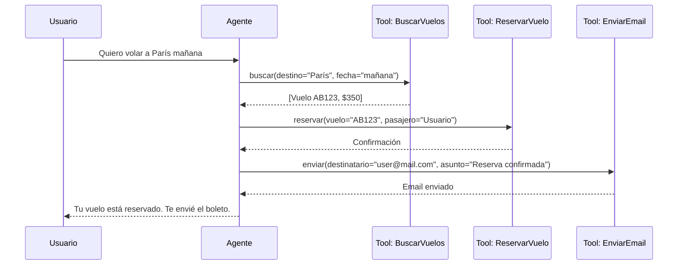
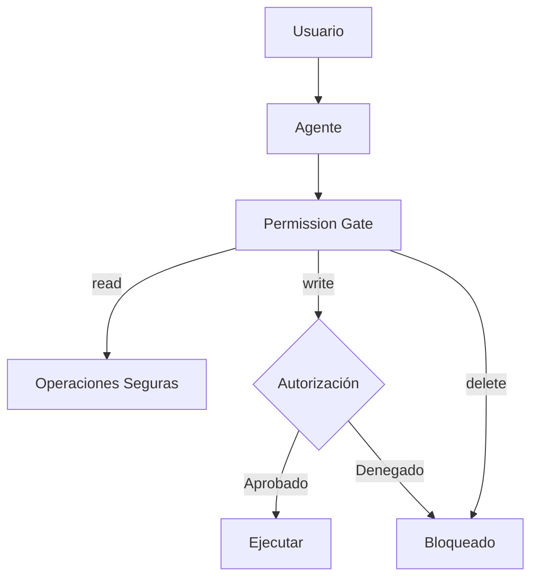

# 🔧 02 - Tool Use y Function Calling

Un modelo de lenguaje, por más grande que sea, está inherentemente limitado por su conocimiento paramétrico y su incapacidad para interactuar con sistemas externos. El **tool use** y el **function calling** son los mecanismos que transforman un LLM en un agente capaz de operar en el mundo real. Para un ML/AI Engineer, dominar esta capa implica diseñar interfaces robustas entre modelos generativos y sistemas de software tradicionales.

---

## 1. Motivación: LLM Solo Texto vs Mundo Real

Un LLM base puede describir el clima, pero no puede consultarlo. Puede explicar cómo hacer una reserva, pero no puede ejecutarla. Esta brecha entre **conocimiento** y **capacidad de actuación** (conocida como el problema de *grounding*) se resuelve mediante herramientas externas.

| Escenario | Sin Tool Use | Con Tool Use |
|-----------|--------------|--------------|
| Consultar saldo bancario | "No tengo acceso a tus datos." | Invoca API bancaria y reporta el saldo real. |
| Calcular expresiones matemáticas complejas | Hallucination aritmética. | Delega a Python `eval` o `sympy`. |
| Buscar información actualizada | Conocimiento obsoleto al corte de entrenamiento. | Invoca buscador web o base de datos vectorial. |

Caso real: En 2023, **OpenAI** introdujo function calling en GPT-4, permitiendo que el modelo emitiera estructuras JSON para invocar funciones definidas por el desarrollador. Esto revolucionó la construcción de agentes, ya que eliminó la necesidad de parsear texto libre para detectar intenciones.

---

## 2. Function Calling en OpenAI y Anthropic

### 2.1. OpenAI Chat Completions API

La API de OpenAI permite pasar una lista de herramientas definidas mediante JSON Schema. El modelo puede decidir llamar a una o varias de ellas.

```python
import openai

def get_weather(location: str, unit: str = "celsius") -> str:
    # Simulación de API externa
    return f"El clima en {location} es 22 {unit}."

tools = [
    {
        "type": "function",
        "function": {
            "name": "get_weather",
            "description": "Obtiene el clima actual de una ubicación.",
            "parameters": {
                "type": "object",
                "properties": {
                    "location": {
                        "type": "string",
                        "description": "Ciudad o coordenadas."
                    },
                    "unit": {
                        "type": "string",
                        "enum": ["celsius", "fahrenheit"]
                    }
                },
                "required": ["location"]
            }
        }
    }
]

client = openai.OpenAI()

messages = [
    {"role": "user", "content": "¿Cuál es el clima en Madrid?"}
]

response = client.chat.completions.create(
    model="gpt-4o",
    messages=messages,
    tools=tools,
    tool_choice="auto"
)

# El modelo decide si llama a una herramienta o responde directamente
print(response.choices[0].message)
```

### 2.2. Anthropic Tool Use

Anthropic (Claude) utiliza un mecanismo similar, aunque con algunas diferencias en el formato de bloques de contenido.

```python
import anthropic

client = anthropic.Anthropic()

response = client.messages.create(
    model="claude-3-opus-20240229",
    max_tokens=1024,
    tools=[
        {
            "name": "get_weather",
            "description": "Obtiene el clima actual.",
            "input_schema": {
                "type": "object",
                "properties": {
                    "location": {"type": "string"}
                },
                "required": ["location"]
            }
        }
    ],
    messages=[{"role": "user", "content": "¿Qué tiempo hace en Barcelona?"}]
)
```

💡 **Tip**: Diseña las descripciones de tus herramientas como si fueran prompts: cuanto más específicas sean, mejor será la selección del modelo.

---

## 3. JSON Schema para Herramientas

El **JSON Schema** es el contrato entre el modelo y el código. Un buen schema reduce errores de parsing y mejora la precisión de los argumentos.

```json
{
  "type": "object",
  "properties": {
    "query": {
      "type": "string",
      "description": "Término de búsqueda exacto."
    },
    "max_results": {
      "type": "integer",
      "minimum": 1,
      "maximum": 50,
      "default": 10
    }
  },
  "required": ["query"]
}
```

⚠️ **Advertencia**: Nunca expongas directamente al LLM herramientas que realicen operaciones destructivas (borrado de datos, transferencias de fondos) sin una capa de autorización humana o validación programática adicional.

---

## 4. Tool Registry y Patrón de Registro

Un sistema de agentes escalable no define herramientas de forma ad-hoc, sino que utiliza un **registry** centralizado.

```python
from typing import Callable, Dict, Any
from functools import wraps

class ToolRegistry:
    def __init__(self):
        self._tools: Dict[str, Dict[str, Any]] = {}
        self._handlers: Dict[str, Callable] = {}

    def register(self, name: str, schema: Dict, handler: Callable):
        self._tools[name] = schema
        self._handlers[name] = handler

    def get_schemas(self) -> list:
        return [
            {"type": "function", "function": {"name": n, **s}}
            for n, s in self._tools.items()
        ]

    def execute(self, name: str, arguments: Dict) -> Any:
        if name not in self._handlers:
            raise ValueError(f"Tool {name} no registrada.")
        return self._handlers[name](**arguments)

registry = ToolRegistry()

# Decorator @tool para facilitar el registro
class tool:
    def __init__(self, name: str, description: str, **params):
        self.name = name
        self.schema = {
            "description": description,
            "parameters": {
                "type": "object",
                "properties": params,
                "required": list(params.keys())
            }
        }

    def __call__(self, func: Callable):
        registry.register(self.name, self.schema, func)
        return func

@tool(name="sumar", description="Suma dos números.", a={"type": "number"}, b={"type": "number"})
def sumar(a: float, b: float) -> float:
    return a + b

print(registry.get_schemas())
```

---

## 5. OpenAI Functions vs LangChain Tools

| Característica | OpenAI Functions | LangChain Tools |
|----------------|------------------|-----------------|
| **Nivel de abstracción** | Nativo de la API | Framework de alto nivel |
| **Portabilidad** | Dependiente del proveedor | Compatible con múltiples LLMs |
| **Chaining** | Manual | `LLMChain`, `AgentExecutor` |
| **Observability** | Básica | Integrado con LangSmith |
| **Curva de aprendizaje** | Baja (API directa) | Media (conceptos de framework) |

Caso real: El equipo de **Klarna** utilizó LangChain para orquestar múltientes herramientas de búsqueda de productos, comparación de precios y generación de recomendaciones en su asistente de compras, logrando reducir el tiempo de desarrollo en un 30% gracias a la modularidad del framework.

---

## 6. Parsing de Argumentos y Manejo de Errores

El modelo puede generar argumentos malformados. Un agente robusto debe validar antes de ejecutar.

```python
import jsonschema
from jsonschema import validate

def safe_execute(registry: ToolRegistry, tool_call: Dict) -> Dict:
    name = tool_call["name"]
    args = tool_call.get("arguments", {})
    schema = registry._tools.get(name, {}).get("parameters", {})

    try:
        validate(instance=args, schema=schema)
        result = registry.execute(name, args)
        return {"status": "ok", "result": result}
    except jsonschema.ValidationError as e:
        return {"status": "error", "message": f"Args inválidos: {e.message}"}
    except Exception as e:
        return {"status": "error", "message": str(e)}
```

💡 **Tip**: Implementa un mecanismo de *retry* con feedback de error. Si una herramienta falla por argumentos inválidos, envía el error de vuelta al LLM en el contexto para que corrija la invocación.

---

## 7. Chaining de Herramientas

Muchas tareas requieren que el resultado de una herramienta alimente la siguiente. Esto se conoce como **tool chaining**.



---

## 8. Seguridad: Permission Boundaries



| Nivel de Riesgo | Ejemplo | Estrategia |
|-----------------|---------|------------|
| Bajo | Consultar clima, buscar Wikipedia | Ejecución automática |
| Medio | Enviar email, crear recordatorio | Confirmación implícita o logging |
| Alto | Transferir fondos, borrar cuenta | Confirmación explícita del usuario |

Caso real: Un experimento en **Universidad de Illinois** demostró que agentes autónomos con acceso a herramientas de escritura de archivos podían ser inducidos a ejecutar código malicioso si no existían boundaries de permisos. La solución propuesta fue un sandbox de ejecución con lista blanca de comandos.

⚠️ **Advertencia**: El *prompt injection* puede inducir a un agente a invocar herramientas con argumentos inesperados. Utiliza siempre validación de esquema y sandboxing para herramientas de alto impacto.

---

📦 **Código de compresión**: El siguiente bloque consolida el registro de herramientas, la validación de esquemas y la ejecución segura en una única clase reutilizable.

```python
from typing import Any, Callable, Dict, List
import jsonschema

class SecureToolAgent:
    def __init__(self):
        self.registry = {}
        self.handlers = {}

    def register(self, name: str, schema: Dict, handler: Callable, risk: str = "low"):
        self.registry[name] = {"schema": schema, "risk": risk}
        self.handlers[name] = handler

    def call(self, name: str, args: Dict) -> Dict:
        if name not in self.registry:
            return {"error": "Tool not found"}
        meta = self.registry[name]
        try:
            validate(instance=args, schema=meta["schema"])
            result = self.handlers[name](**args)
            return {"status": "success", "data": result}
        except Exception as e:
            return {"status": "error", "message": str(e)}
```

🎯 **Proyecto documentado**: En [[05 - Caso Practico - Agente de Reservas Inteligente]], implementaremos un `BookingToolRegistry` con herramientas para consultar disponibilidad, comparar precios y confirmar reservas, aplicando permission boundaries según la operación.
