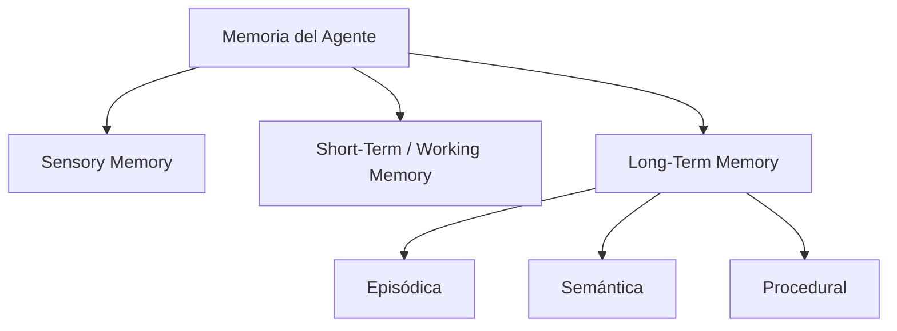
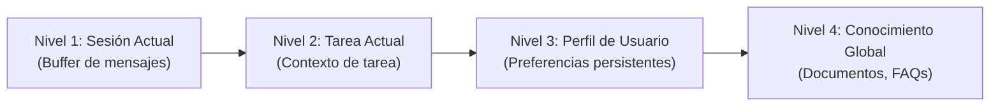
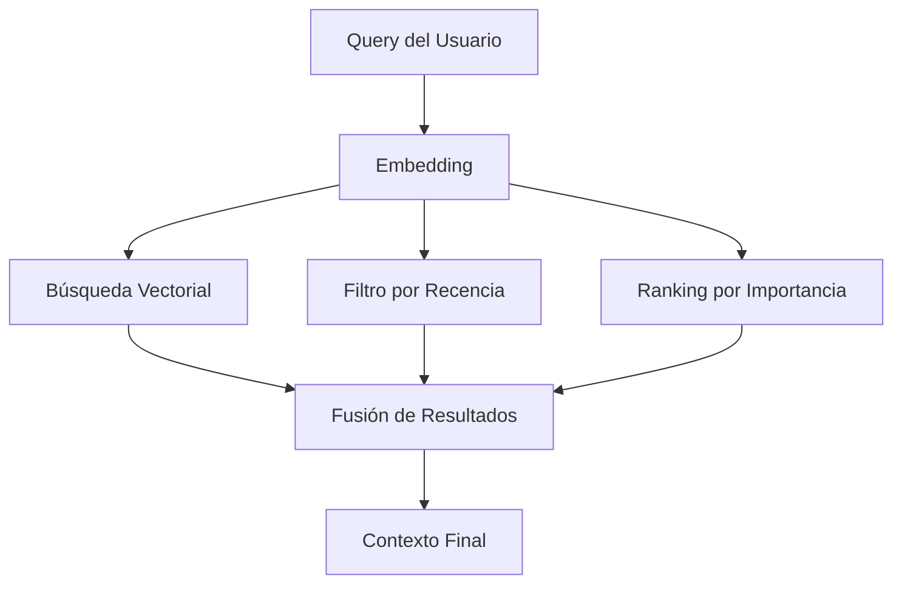
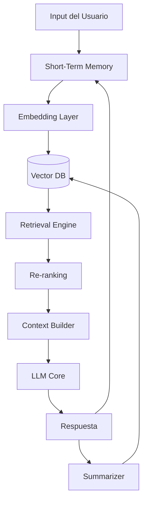

# 🧠 03 - Memoria en Agentes

Un agente sin memoria es como un estudiante que olvida todo al cerrar el libro. La **memoria** es el componente que permite a un agente mantener coherencia a lo largo del tiempo, aprender de interacciones previas y personalizar sus respuestas. Para un ML/AI Engineer, diseñar sistemas de memoria eficientes implica resolver problemas clásicos de recuperación de información, trade-offs de latencia y modelado de la atención humana.

---

## 1. Taxonomía de la Memoria en Agentes

La arquitectura de memoria de un agente puede inspirarse en la cognición humana. Dividimos la memoria en tres categorías principales:

| Tipo | Descripción | Implementación Típica | Duración |
|------|-------------|----------------------|----------|
| **Sensory** | Buffer de entrada inmediata (texto, imagen, audio). | Preprocesamiento de inputs, embeddings iniciales. | Milisegundos |
| **Short-Term / Working** | Contexto activo de la conversación actual. | Ventana de contexto del LLM, buffer de mensajes. | Minutos/horas |
| **Long-Term** | Conocimiento persistente entre sesiones. | Vector stores, bases de datos, grafos. | Días/años |

Dentro de la memoria a largo plazo, distinguimos:

- **Episódica**: Recuerdos de eventos específicos ("El usuario canceló un vuelo a París el mes pasado").
- **Semántica**: Hechos generales sobre el mundo o el usuario ("El usuario prefiere hoteles boutique").
- **Procedural**: Cómo realizar tareas ("Para reservar un vuelo internacional, primero verificar pasaporte").



---

## 2. Vector Stores para Memoria Semántica

La memoria semántica se implementa mediante **embeddings** y **bases de datos vectoriales**. Cada interacción o hecho se convierte en un vector de alta dimensión y se almacena para recuperación por similitud.

```python
from sentence_transformers import SentenceTransformer
import numpy as np

model = SentenceTransformer('all-MiniLM-L6-v2')

class SemanticMemory:
    def __init__(self):
        self.texts = []
        self.embeddings = []

    def add(self, text: str):
        vec = model.encode(text)
        self.texts.append(text)
        self.embeddings.append(vec)

    def search(self, query: str, top_k: int = 3) -> list:
        if not self.embeddings:
            return []
        q_vec = model.encode(query)
        scores = [
            np.dot(q_vec, vec) / (np.linalg.norm(q_vec) * np.linalg.norm(vec))
            for vec in self.embeddings
        ]
        top_indices = np.argsort(scores)[::-1][:top_k]
        return [(self.texts[i], scores[i]) for i in top_indices]

memory = SemanticMemory()
memory.add("El usuario prefiere asientos de ventanilla.")
memory.add("El usuario es alérgico a los frutos secos.")

print(memory.search("¿Qué preferencias tiene el usuario para volar?"))
```

Caso real: **MemGPT** (2023) introdujo un sistema de memoria jerárquica inspirado en la gestión de memoria de sistemas operativos, donde un "context window" limitado funciona como RAM y un vector store externo como disco, con mecanismos de paginación para traer información relevante al contexto.

---

## 3. Memoria Conversacional: Buffer, Window y Summary

Cuando la memoria a corto plazo crece, supera la ventana de contexto del modelo. Existen tres estrategias fundamentales para gestionarla:

### 3.1. ConversationBufferMemory

Almacena todo el historial. Simple, pero rápidamente excede los límites.

### 3.2. ConversationBufferWindowMemory

Mantiene solo los últimos $k$ pares de mensajes.

```python
class WindowMemory:
    def __init__(self, k: int = 5):
        self.k = k
        self.buffer = []

    def add(self, user_msg: str, agent_msg: str):
        self.buffer.append(("user", user_msg))
        self.buffer.append(("agent", agent_msg))
        if len(self.buffer) > self.k * 2:
            self.buffer = self.buffer[-self.k * 2:]

    def get_context(self) -> str:
        return "\n".join([f"{r}: {m}" for r, m in self.buffer])
```

### 3.3. ConversationSummaryMemory

Utiliza un LLM para resumir progresivamente el historial, comprimiendo la información.

💡 **Tip**: En la práctica, la mejor estrategia es un **híbrido**: mantener los últimos $k$ mensajes completos y un resumen acumulado de todo lo anterior.

---

## 4. Memoria Jerárquica

En agentes complejos, la memoria se organiza en niveles:



Cada nivel tiene diferente frecuencia de acceso y duración. El agente debe decidir qué nivel consultar según la consulta.

---

## 5. Context Window Budget

La ventana de contexto de un LLM es un recurso escaso. Un agente eficiente debe asignar un "presupuesto" a cada componente:

| Componente | % del Contexto | Ejemplo (128k tokens) |
|------------|----------------|----------------------|
| System Prompt | 5% | 6,400 tokens |
| Historial de conversación | 30% | 38,400 tokens |
| Memoria recuperada (RAG) | 40% | 51,200 tokens |
| Espacio para respuesta/generación | 25% | 32,000 tokens |

⚠️ **Advertencia**: No llenar la ventana de contexto al 100% deja margen para la respuesta del modelo. Si el input ocupa 120k tokens en un modelo de 128k, solo quedan 8k para la salida, lo que puede truncar respuestas largas.

---

## 6. Forgetting Curves y Relevance Scoring

La memoria humana decae con el tiempo. Podemos modelar esto en agentes para "olvidar" información irrelevante o antigua, evitando saturar la base de datos.

### 6.1. Decaimiento Temporal

Una función simple de decaimiento exponencial:

$$
R(t) = R_0 \cdot e^{-\lambda (t - t_0)}
$$

Donde:
- $R(t)$: Relevancia en el tiempo actual $t$.
- $R_0$: Relevancia inicial.
- $\lambda$: Tasa de olvido (parámetro ajustable).
- $t_0$: Timestamp de creación del recuerdo.

### 6.2. Relevance Scoring Combinado

Para decidir qué recuerdos traer al contexto, combinamos múltiples señales:

$$
Score = \alpha \cdot Sim(q, m) + \beta \cdot Recency(m) + \gamma \cdot Importance(m)
$$

Donde:
- $Sim(q, m)$: Similitud coseno entre la query y el recuerdo.
- $Recency(m)$: Peso temporal normalizado (1.0 para reciente, 0.0 para antiguo).
- $Importance(m)$: Puntaje de importancia asignado por el modelo (ej: "este evento es crítico").
- $\alpha, \beta, \gamma$: Hiperparámetros que suman 1.

```python
def combined_score(sim: float, recency: float, importance: float,
                   alpha: float = 0.5, beta: float = 0.3, gamma: float = 0.2) -> float:
    return alpha * sim + beta * recency + gamma * importance
```

Caso real: La implementación de memoria en **ChatGPT** utiliza una combinación de recencia y relevancia para mantener el contexto de conversaciones largas, aunque los detalles exactos son propietarios. Estudios de terceros sugieren que emplean una versión de resumen progresivo con priorización por importancia semántica.

---

## 7. Estrategias de Retrieval

### 7.1. Recency (Recencia)

Prioriza los mensajes o recuerdos más recientes. Útil para mantener la coherencia de la conversación actual.

### 7.2. Relevance (Relevancia)

Recupera los recuerdos más similares semánticamente a la consulta actual. Implementado con búsqueda vectorial.

### 7.3. Importance (Importancia)

Clasifica los recuerdos por su significado. Por ejemplo, "el usuario cambió su contraseña" es más importante que "el usuario saludó".



💡 **Tip**: Utiliza **Maximum Marginal Relevance (MMR)** para balancear relevancia y diversidad en los recuerdos recuperados, evitando redundancia.

---

## 8. Diagrama de Arquitectura de Memoria Completa



⚠️ **Advertencia**: La latencia de recuperación de memoria a largo plazo puede degradar la experiencia del usuario. Considera caching agresivo para consultas de memoria frecuentes (como el perfil del usuario).

---

📦 **Código de compresión**: Implementación consolidada de un sistema de memoria jerárquico con scoring combinado.

```python
import numpy as np
from typing import List, Tuple
from datetime import datetime, timedelta

class HierarchicalMemory:
    def __init__(self, embed_fn, alpha=0.5, beta=0.3, gamma=0.2):
        self.embed_fn = embed_fn
        self.memories = []  # list of dicts: text, vec, ts, importance
        self.alpha, self.beta, self.gamma = alpha, beta, gamma

    def add(self, text: str, importance: float = 1.0):
        vec = self.embed_fn(text)
        self.memories.append({
            "text": text, "vec": vec,
            "ts": datetime.now(), "importance": importance
        })

    def retrieve(self, query: str, top_k: int = 3) -> List[Tuple[str, float]]:
        q_vec = self.embed_fn(query)
        now = datetime.now()
        scored = []
        for m in self.memories:
            sim = np.dot(q_vec, m["vec"]) / (np.linalg.norm(q_vec) * np.linalg.norm(m["vec"]))
            hours_ago = (now - m["ts"]).total_seconds() / 3600.0 + 1e-6
            recency = np.exp(-0.1 * hours_ago)
            score = self.alpha * sim + self.beta * recency + self.gamma * m["importance"]
            scored.append((m["text"], score))
        scored.sort(key=lambda x: x[1], reverse=True)
        return scored[:top_k]
```

🎯 **Proyecto documentado**: En [[05 - Caso Practico - Agente de Reservas Inteligente]], la memoria del agente almacenará preferencias de viaje (ventanilla, hoteles boutique), historial de reservas episódico y políticas de cancelación procedurales, utilizando retrieval combinado para personalizar cada interacción.
