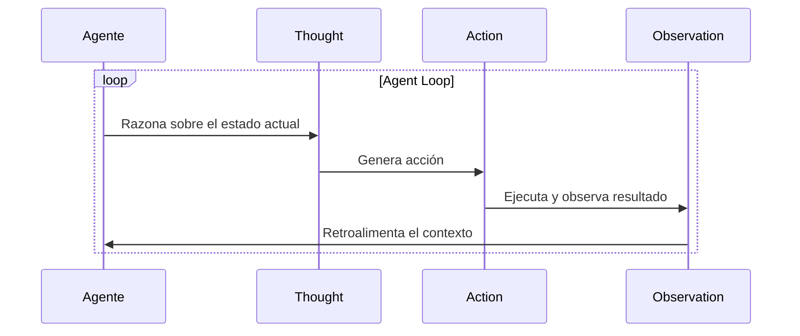
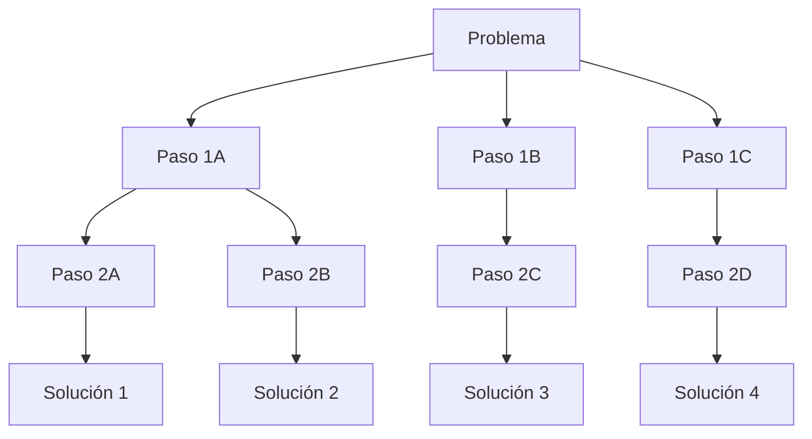
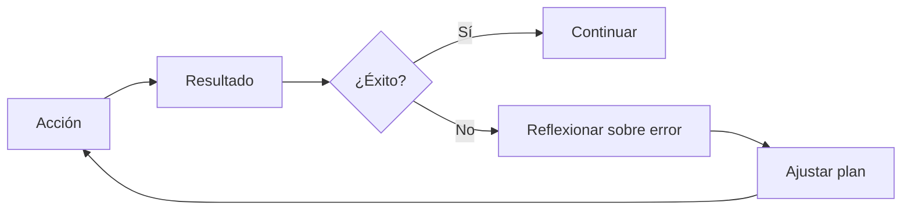
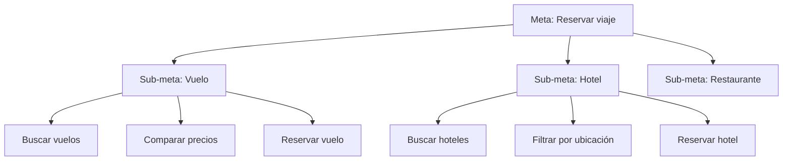

# 🎯 04 - Planning y Razonamiento

Un agente que solo reacciona es un chatbot sofisticado. La verdadera autonomía emerge cuando el agente puede **planificar**, **razonar** y **reflexionar** sobre sus propias acciones. Esta nota explora las estrategias de razonamiento que permiten a los agentes descomponer problemas complejos, explorar múltiples caminos y aprender de sus errores. Para un ML/AI Engineer, estas técnicas son el puente entre la inferencia de un LLM y la resolución de tareas del mundo real.

---

## 1. ReAct: Reasoning + Acting

**ReAct** es un paradigma que entrelaza pasos de razonamiento lingüístico (*thought*) con acciones concretas (*action*). En lugar de generar una respuesta de una sola vez, el agente produce una secuencia de pasos intercalados.



La estructura típica de un paso ReAct es:

```text
Thought: Necesito encontrar el precio del vuelo a París.
Action: search_flights(destination="París", date="2025-06-01")
Observation: Vuelo AF123 disponible por $450.
Thought: Ahora necesito verificar si el usuario prefiere ventanilla.
Action: query_memory("preferencia asiento usuario")
Observation: El usuario prefiere ventanilla.
...
```

Caso real: El paper original de ReAct (Yao et al., 2022) demostró que en tareas de question answering sobre HotpotQA, ReAct superó tanto a CoT puro (que solo razona) como a actuación directa (que solo actúa), logrando un F1 score de 29.4% vs 23.3% y 25.2% respectivamente.

---

## 2. CoT: Chain-of-Thought

**Chain-of-Thought** (Wei et al., 2022) induce al modelo a generar una secuencia de pasos de razonamiento antes de la respuesta final.

```text
Pregunta: Un tren sale a las 9:00 AM y viaja a 60 km/h. ¿A qué hora llega a 180 km de distancia?

Razonamiento:
1. La distancia es 180 km.
2. La velocidad es 60 km/h.
3. El tiempo = distancia / velocidad = 180 / 60 = 3 horas.
4. Hora de llegada = 9:00 AM + 3 horas = 12:00 PM.

Respuesta: 12:00 PM.
```

💡 **Tip**: Para problemas matemáticos o lógicos, prepéndele al prompt la instrucción "Piensa paso a paso" o "Let's think step by step". Este simple cambio puede mejorar la precisión en un 40% en benchmarks aritméticos.

---

## 3. ToT: Tree-of-Thoughts

Mientras que CoT es una cadena lineal, **Tree-of-Thoughts** (Yao et al., 2023) explora múltiples caminos de razonamiento como un árbol de búsqueda.



### 3.1. Búsqueda en ToT

En cada nodo, el modelo genera $k$ candidatos de pensamiento. Luego, un evaluador (que puede ser el mismo LLM o una heurística externa) puntúa cada candidato y se expanden solo los más prometedores.

### 3.2. Fórmula de Heurística en ToT

El puntaje de un nodo $v$ se puede definir como una combinación de la calidad del razonamiento y la utilidad esperada:

$$
H(v) = \alpha \cdot Q(v) + (1 - \alpha) \cdot \hat{U}(v)
$$

Donde:
- $Q(v)$: Calidad del pensamiento en el nodo, evaluada por el LLM (escala 1-10).
- $\hat{U}(v)$: Utilidad esperada estimada desde ese nodo hacia una solución final.
- $\alpha$: Peso de balanceo (típicamente 0.5).

```python
import random
from typing import List

class TreeOfThoughts:
    def __init__(self, llm, branching_factor: int = 3):
        self.llm = llm
        self.k = branching_factor

    def generate_thoughts(self, state: str, n: int) -> List[str]:
        prompt = f"Dado el estado: {state}\nGenera {n} posibles siguientes pasos de razonamiento."
        return self.llm.generate_list(prompt, n)

    def evaluate(self, thought: str) -> float:
        prompt = f"Evalúa la calidad del siguiente razonamiento del 1 al 10:\n{thought}\nPuntuación:"
        score_text = self.llm.generate(prompt)
        try:
            return float(score_text.strip()) / 10.0
        except ValueError:
            return 0.5

    def search(self, initial_state: str, max_depth: int = 3) -> str:
        best_path = []
        current = initial_state
        for _ in range(max_depth):
            candidates = self.generate_thoughts(current, self.k)
            scored = [(t, self.evaluate(t)) for t in candidates]
            scored.sort(key=lambda x: x[1], reverse=True)
            best = scored[0][0]
            best_path.append(best)
            current = best
        return " -> ".join(best_path)
```

⚠️ **Advertencia**: ToT es computacionalmente costoso ($O(k^d)$ donde $d$ es la profundidad). Úsalo solo para problemas donde la calidad de la solución justifique el costo adicional de inferencias.

---

## 4. Reflexión y Auto-Corrección

La **reflexión** permite a un agente evaluar sus propias acciones pasadas y ajustar su estrategia. Este mecanismo simula la metacognición humana.



Caso real: El framework **Reflexion** (Shinn et al., 2023) demostró que agentes equipados con memoria de reflexión (almacenando críticas de sus errores) mejoraban su tasa de éxito en tareas de programación de 67% a 88% tras tres iteraciones de auto-corrección.

---

## 5. Planificación Jerárquica (HRL)

El **Hierarchical Reinforcement Learning (HRL)** descompone un objetivo de alto nivel en sub-objetivos manejables. Es análogo a dividir "organizar una fiesta" en "elegir fecha", "enviar invitaciones", "ordenar comida", etc.



La política de alto nivel $\pi_{high}$ selecciona sub-objetivos, mientras que la política de bajo nivel $\pi_{low}$ ejecuta las acciones primitivas:

$$
g_t \sim \pi_{high}(s_t) \quad \rightarrow \quad a_t \sim \pi_{low}(s_t, g_t)
$$

💡 **Tip**: En agentes basados en LLM, puedes implementar HRL utilizando un LLM "planificador" que genera sub-tareas y LLMs "ejecutores" especializados que resuelven cada sub-tarea.

---

## 6. Backtracking y Recuperación de Errores

Cuando un plan falla (una herramienta devuelve error, una suposición es incorrecta), el agente debe retroceder y explorar alternativas.

```python
class BacktrackingAgent:
    def __init__(self):
        self.plan_stack = []
        self.failed_paths = set()

    def execute_plan(self, plan: List[str]) -> bool:
        for step in plan:
            result = self.execute_step(step)
            if not result["success"]:
                self.failed_paths.add(tuple(self.plan_stack))
                return False
            self.plan_stack.append(step)
        return True

    def search_plan(self, goal: str, max_retries: int = 3):
        for _ in range(max_retries):
            plan = self.generate_plan(goal, avoid=self.failed_paths)
            if self.execute_plan(plan):
                return "Éxito"
        return "Fallo: se agotaron los reintentos"
```

---

## 7. Plan-and-Execute vs ReAct

| Característica | Plan-and-Execute | ReAct |
|----------------|------------------|-------|
| **Estrategia** | Planifica toda la secuencia primero, luego ejecuta. | Intercala razonamiento y acción paso a paso. |
| **Adaptabilidad** | Baja: difícil de corregir a mitad de camino. | Alta: corrige en cada iteración. |
| **Costo de LLM** | Menor (una planificación + ejecución directa). | Mayor (múltiples llamadas al LLM). |
| **Robustez** | Depende de la calidad del plan inicial. | Robusta ante cambios y errores inesperados. |
| **Uso recomendado** | Tareas bien definidas con baja incertidumbre. | Tareas exploratorias con entorno dinámico. |

Caso real: El framework **Plan-and-Solve** (Wang et al., 2023) mostró mejoras sobre CoT en problemas matemáticos complejos al explicitar la extracción de variables y la planificación del cálculo antes de ejecutar operaciones.

---

## 8. Comparativa de Estrategias de Razonamiento

| Estrategia | Complejidad | Costo Computacional | Robustez | Caso de Uso Ideal |
|------------|-------------|---------------------|----------|-------------------|
| **CoT** | Baja | Bajo (1 llamada) | Media | Matemáticas, lógica simbólica |
| **ReAct** | Media | Medio (N llamadas) | Alta | QA con herramientas, navegación web |
| **ToT** | Alta | Alto (exponencial) | Muy alta | Creatividad, optimización combinatoria |
| **Reflexión** | Media | Medio-Alto | Alta | Programación, tareas iterativas |
| **HRL** | Alta | Variable | Alta | Tareas multi-paso con sub-objetivos claros |

⚠️ **Advertencia**: No existe una estrategia universalmente superior. La elección depende del trade-off entre latencia, costo de tokens y necesidad de robustez. En producción, muchos sistemas híbridos utilizan CoT para tareas simples y escalan a ReAct o ToT según la complejidad detectada.

---

📦 **Código de compresión**: Agente genérico con soporte para ReAct, reflexión simple y backtracking.

```python
from typing import List, Dict, Any

class ReasoningAgent:
    def __init__(self, llm, tools: Dict[str, Any]):
        self.llm = llm
        self.tools = tools
        self.reflections = []

    def react_step(self, context: str) -> Dict:
        prompt = f"{context}\nPiensa paso a paso y elige una acción."
        response = self.llm.generate(prompt)
        # Parsing simplificado
        if "Action:" in response:
            action = response.split("Action:")[1].split("\n")[0].strip()
            return {"type": "action", "content": action}
        return {"type": "thought", "content": response}

    def reflect(self, action: str, result: str):
        prompt = f"La acción '{action}' resultó en: {result}. ¿Qué se puede mejorar?"
        critique = self.llm.generate(prompt)
        self.reflections.append(critique)

    def run(self, task: str, max_steps: int = 10) -> str:
        history = f"Tarea: {task}\n"
        for i in range(max_steps):
            step = self.react_step(history)
            if step["type"] == "action":
                tool_name = step["content"].split("(")[0]
                result = self.tools.get(tool_name, lambda: "noop")()
                history += f"Observation: {result}\n"
                if "error" in str(result).lower():
                    self.reflect(step["content"], result)
                    history += f"Reflection: {self.reflections[-1]}\n"
            else:
                history += f"Thought: {step['content']}\n"
            if "final answer" in step["content"].lower():
                break
        return history
```

🎯 **Proyecto documentado**: En [[05 - Caso Practico - Agente de Reservas Inteligente]], el agente utilizará **ReAct** para la reserva interactiva, **HRL** para descomponer un itinerario complejo, y **reflexión** para manejar errores de disponibilidad (por ejemplo, si un vuelo está agotado, reflexionar y probar otra aerolínea).
