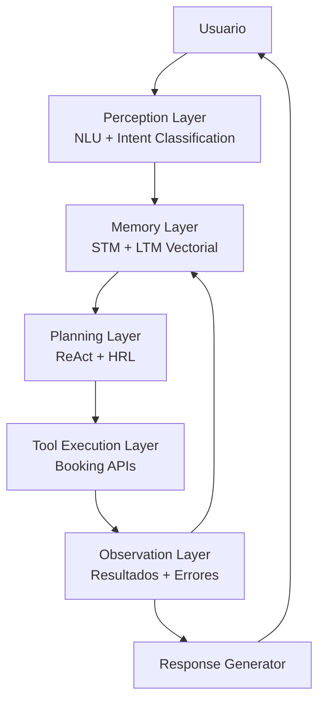
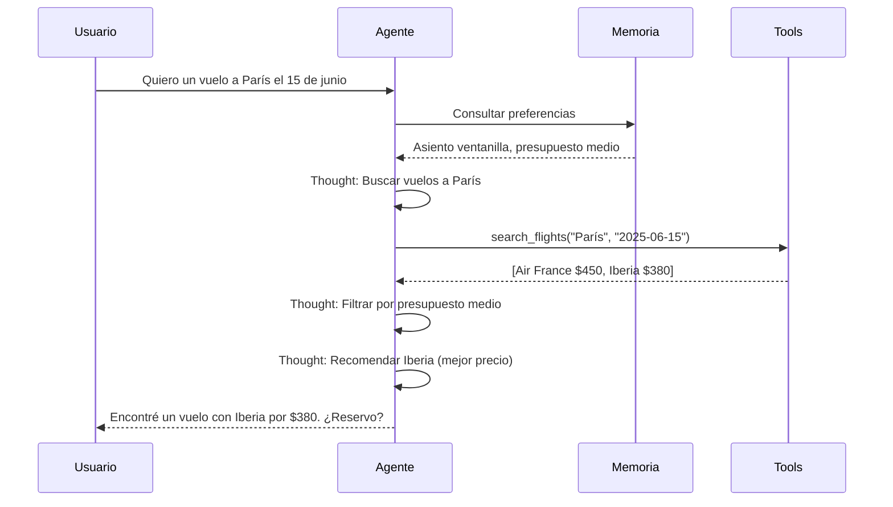
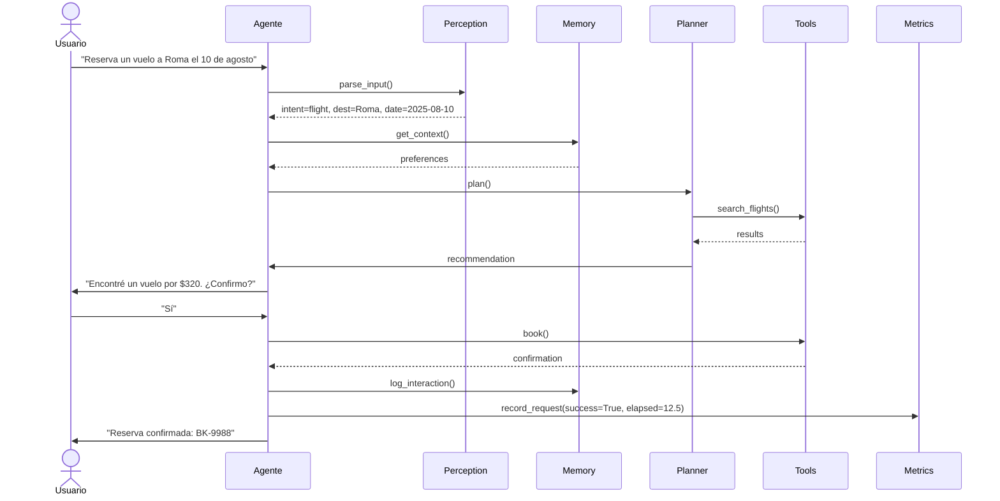

# ✈️ 05 - Caso Practico - Agente de Reservas Inteligente

Esta nota consolida todo el conocimiento adquirido en el módulo en un caso práctico end-to-end: un **Agente de Reservas Inteligente** capaz de consultar disponibilidad, comparar precios, reservar vuelos, hoteles y restaurantes, recordar preferencias del usuario y manejar errores con elegancia. Para un ML/AI Engineer, este proyecto es un ejercicio completo de diseño de sistemas, arquitectura de software e integración de modelos generativos.

---

## 1. Requisitos Funcionales

El agente debe satisfacer los siguientes requisitos:

| ID | Requisito | Prioridad |
|----|-----------|-----------|
| RF-01 | Consultar disponibilidad de vuelos, hoteles y restaurantes. | Alta |
| RF-02 | Comparar precios y condiciones entre múltiples proveedores. | Alta |
| RF-03 | Realizar reservas confirmando disponibilidad en tiempo real. | Alta |
| RF-04 | Cancelar reservas existentes gestionando políticas de reembolso. | Media |
| RF-05 | Recordar y aplicar preferencias del usuario (asientos, dietas, presupuesto). | Alta |
| RF-06 | Manejar errores de APIs y casos límite (sobrevuelo, sobrebooking). | Alta |

Caso real: El asistente de viajes **Hopper** utiliza agentes inteligentes para monitorear precios de vuelos y hoteles, replicando gran parte de esta arquitectura a escala industrial, procesando millones de consultas diarias.

---

## 2. Arquitectura del Agente

La arquitectura sigue el ciclo OODA visto en [[01 - Agentes vs Modelos de Lenguaje]], integrando planificación ReAct ([[04 - Planning y Razonamiento]]), tool use ([[02 - Tool Use y Function Calling]]) y memoria jerárquica ([[03 - Memoria en Agentes]]).



### 2.1. Perception Layer

Parsea la intención del usuario y extrae entidades (destino, fechas, número de pasajeros).

```python
from typing import Dict
import json
import re

class PerceptionLayer:
    def parse(self, user_input: str) -> Dict:
        # En producción: usar un modelo fine-tuned o NER
        entities = {
            "destino": self._extract(user_input, r"a\s+(\w+)"),
            "fecha": self._extract(user_input, r"(\d{4}-\d{2}-\d{2})"),
            "tipo": self._classify_intent(user_input)
        }
        return entities

    def _extract(self, text: str, pattern: str) -> str:
        match = re.search(pattern, text)
        return match.group(1) if match else None

    def _classify_intent(self, text: str) -> str:
        if "vuelo" in text.lower():
            return "flight"
        elif "hotel" in text.lower():
            return "hotel"
        elif "restaurante" in text.lower():
            return "restaurant"
        return "general"
```

---

## 3. Herramientas de Booking (Tool Layer)

Implementamos un conjunto de herramientas simuladas que representan APIs de terceros.

```python
from typing import List, Dict
from dataclasses import dataclass

@dataclass
class Flight:
    airline: str
    price: float
    departure: str
    arrival: str

class BookingTools:
    def search_flights(self, destination: str, date: str) -> List[Flight]:
        # Simulación de API externa
        return [
            Flight("Air France", 450.0, f"{date} 09:00", f"{date} 11:30"),
            Flight("Iberia", 380.0, f"{date} 14:00", f"{date} 16:30"),
        ]

    def search_hotels(self, city: str, check_in: str) -> List[Dict]:
        return [
            {"name": "Hotel Ritz", "price_per_night": 250.0, "stars": 5},
            {"name": "Ibis Budget", "price_per_night": 60.0, "stars": 2},
        ]

    def book(self, item_type: str, item_id: str, user_id: str) -> Dict:
        if item_type == "flight":
            return {"status": "confirmed", "booking_id": f"FL-{hash(item_id) % 10000}"}
        elif item_type == "hotel":
            return {"status": "confirmed", "booking_id": f"HT-{hash(item_id) % 10000}"}
        return {"status": "error", "message": "Tipo desconocido"}

    def cancel(self, booking_id: str) -> Dict:
        if booking_id.startswith("FL"):
            return {"status": "cancelled", "refund": 0.8}
        return {"status": "cancelled", "refund": 0.5}
```

⚠️ **Advertencia**: En un entorno de producción, estas herramientas deben incluir mecanismos de rate limiting, retries con backoff exponencial y circuit breakers para evitar saturar APIs externas.

---

## 4. Memoria de Preferencias del Usuario

El agente almacena preferencias episódicas y semánticas para personalizar futuras interacciones.

```python
class UserProfileMemory:
    def __init__(self):
        self.preferences = {
            "seat": "window",
            "diet": "vegetarian",
            "budget_tier": "mid",
            "hotel_stars_min": 3
        }
        self.history = []

    def update_preference(self, key: str, value):
        self.preferences[key] = value

    def get_context(self) -> str:
        prefs = ", ".join([f"{k}={v}" for k, v in self.preferences.items()])
        return f"Preferencias del usuario: {prefs}"

    def log_interaction(self, intent: str, result: str):
        self.history.append({"intent": intent, "result": result})
```

💡 **Tip**: Persiste el perfil del usuario en una base de datos clave-valor (como Redis) o un vector store para que sobreviva a reinicios del servicio.

---

## 5. Planificación con ReAct

El agente utiliza ReAct para planificar la reserva. A continuación se muestra una simulación del loop de razonamiento.



```python
class BookingAgent:
    def __init__(self, llm_client, tools: BookingTools, memory: UserProfileMemory):
        self.llm = llm_client
        self.tools = tools
        self.memory = memory

    def plan_and_execute(self, user_input: str) -> str:
        perception = self._parse(user_input)
        context = self.memory.get_context()

        # Paso 1: Decidir qué herramienta usar
        if perception["tipo"] == "flight":
            flights = self.tools.search_flights(
                perception["destino"], perception["fecha"]
            )
            # Filtrado simple basado en preferencias
            if self.memory.preferences.get("budget_tier") == "mid":
                flights = [f for f in flights if f.price < 500]
            return self._format_flight_options(flights)

        elif perception["tipo"] == "hotel":
            hotels = self.tools.search_hotels(perception["destino"], perception["fecha"])
            min_stars = self.memory.preferences.get("hotel_stars_min", 1)
            hotels = [h for h in hotels if h["stars"] >= min_stars]
            return self._format_hotel_options(hotels)

        return "No entendí tu solicitud de reserva."

    def _parse(self, text: str) -> Dict:
        p = PerceptionLayer()
        return p.parse(text)

    def _format_flight_options(self, flights: List[Flight]) -> str:
        lines = [f"- {f.airline}: ${f.price} (Sale: {f.departure}, Llega: {f.arrival})" for f in flights]
        return "Opciones de vuelo encontradas:\n" + "\n".join(lines)

    def _format_hotel_options(self, hotels: List[Dict]) -> str:
        lines = [f"- {h['name']} ({h['stars']}⭐): ${h['price_per_night']}/noche" for h in hotels]
        return "Opciones de hotel encontradas:\n" + "\n".join(lines)
```

---

## 6. Manejo de Errores y Edge Cases

Un agente de producción debe ser antifragil. Los errores no deben detener el sistema, sino enriquecer el contexto.

| Escenario | Estrategia de Manejo |
|-----------|----------------------|
| API de vuelos caída | Retry ×3 con backoff, luego fallback a cache de última consulta. |
| Vuelo agotado después de consultar | Reflexión: buscar alternativas en aerolíneas distintas. |
| Presupuesto insuficiente | Notificar al usuario con opciones de menor categoría. |
| Cancelación fuera de política | Explicar restricciones y ofrecer cambio de fecha si aplica. |
| Input ambiguo | Solicitar clarificación al usuario con opciones disyuntivas. |

```python
class ResilientBookingAgent(BookingAgent):
    def safe_book(self, item_type: str, item_id: str, user_id: str) -> Dict:
        try:
            result = self.tools.book(item_type, item_id, user_id)
            if result["status"] == "error":
                return self._handle_error(result["message"])
            return result
        except Exception as e:
            return {"status": "error", "message": f"Excepción: {str(e)}"}

    def _handle_error(self, message: str) -> Dict:
        # Reflexión simple: loggear y devolver mensaje amigable
        self.memory.log_interaction("error", message)
        return {
            "status": "error",
            "message": f"Hubo un problema procesando tu solicitud: {message}. ¿Te gustaría intentar con otra opción?"
        }
```

---

## 7. Métricas de Evaluación

Para iterar y mejorar el agente, definimos métricas objetivas:

| Métrica | Definición | Objetivo |
|---------|------------|----------|
| **Tasa de Éxito** | % de reservas completadas sin intervención humana. | > 85% |
| **Tiempo de Resolución** | Tiempo medio desde la solicitud hasta la confirmación. | < 30s |
| **Satisfacción del Usuario** | Rating post-interacción (1-5). | > 4.2 |
| **Tasa de Recuperación** | % de errores que el agente resuelve autónomamente. | > 60% |
| **Costo por Reserva** | Tokens de LLM + costo de APIs externas. | Optimizar |

```python
import time
from dataclasses import dataclass, field
from typing import List

@dataclass
class AgentMetrics:
    total_requests: int = 0
    successful_bookings: int = 0
    resolution_times: List[float] = field(default_factory=list)
    errors_recovered: int = 0

    def record_request(self, success: bool, elapsed: float, recovered_error: bool = False):
        self.total_requests += 1
        if success:
            self.successful_bookings += 1
        self.resolution_times.append(elapsed)
        if recovered_error:
            self.errors_recovered += 1

    @property
    def success_rate(self) -> float:
        return self.successful_bookings / max(self.total_requests, 1)

    @property
    def avg_resolution_time(self) -> float:
        return sum(self.resolution_times) / max(len(self.resolution_times), 1)
```

Caso real: El equipo de **Booking.com** reportó que la introducción de un agente de soporte con capacidad de re-ordenamiento autónomo aumentó la tasa de conversión en un 15% y redujo los tickets de soporte humano en un 25%, demostrando el impacto directo de estas métricas en el negocio.

---

## 8. Diagrama de Secuencia Completo



---

## 9. Consideraciones de Despliegue

- **Observability**: Integra un sistema de tracing (como LangSmith o Arize) para auditar cada decisión del agente.
- **Seguridad**: Valida todos los inputs del usuario antes de pasarlos a las herramientas para evitar inyección de código o prompts maliciosos.
- **Escalabilidad**: Separa el motor de planificación (LLM) de la ejecución de herramientas (workers asíncronos) para no bloquear la ventana de contexto.

⚠️ **Advertencia**: Nunca expongas directamente herramientas de cancelación o reembolso sin una capa de confirmación humana o doble autorización, especialmente en sectores regulados como finanzas y salud.

💡 **Tip**: Implementa un modo "simulación" para el agente, donde las herramientas no ejecuten operaciones reales. Esto permite hacer pruebas de estrés y evaluación de políticas de forma segura.

---

📦 **Código de compresión**: A continuación se presenta el núcleo consolidado del agente, listo para ser empaquetado y extendido.

```python
"""
📦 booking_agent_core.py
Agente de Reservas Inteligente - Consolidado del Módulo 11
"""
from typing import Dict, List, Any
from dataclasses import dataclass
import time

@dataclass
class Flight:
    airline: str
    price: float
    departure: str
    arrival: str

class BookingTools:
    def search_flights(self, destination: str, date: str) -> List[Flight]:
        return [
            Flight("Air France", 450.0, f"{date} 09:00", f"{date} 11:30"),
            Flight("Iberia", 380.0, f"{date} 14:00", f"{date} 16:30"),
        ]

    def book(self, item_type: str, item_id: str, user_id: str) -> Dict:
        return {"status": "confirmed", "booking_id": f"BK-{abs(hash(item_id)) % 100000}"}

class UserProfileMemory:
    def __init__(self):
        self.preferences = {"seat": "window", "budget_tier": "mid"}
        self.history = []

    def get_context(self) -> str:
        return str(self.preferences)

class BookingAgent:
    def __init__(self, tools: BookingTools, memory: UserProfileMemory):
        self.tools = tools
        self.memory = memory
        self.metrics = {"requests": 0, "success": 0, "time": []}

    def run(self, user_input: str) -> str:
        start = time.time()
        self.metrics["requests"] += 1
        # Simplified pipeline
        flights = self.tools.search_flights("destino", "fecha")
        result = self._format(flights)
        self.metrics["time"].append(time.time() - start)
        self.metrics["success"] += 1
        return result

    def _format(self, flights: List[Flight]) -> str:
        return "\n".join([f"- {f.airline}: ${f.price}" for f in flights])

if __name__ == "__main__":
    agent = BookingAgent(BookingTools(), UserProfileMemory())
    print(agent.run("Vuelo a París"))
```

🎯 **Proyecto documentado**: Este agente de reservas integra los cuatro pilares del curso:
- **Percepción y Arquitectura**: [[01 - Agentes vs Modelos de Lenguaje]]
- **Tool Use**: [[02 - Tool Use y Function Calling]]
- **Memoria**: [[03 - Memoria en Agentes]]
- **Planning y Razonamiento**: [[04 - Planning y Razonamiento]]

El siguiente paso es extender este núcleo con un frontend conversacional, integración real con APIs de Amadeus o Booking.com, y despliegue en contenedores con monitoreo de métricas.
