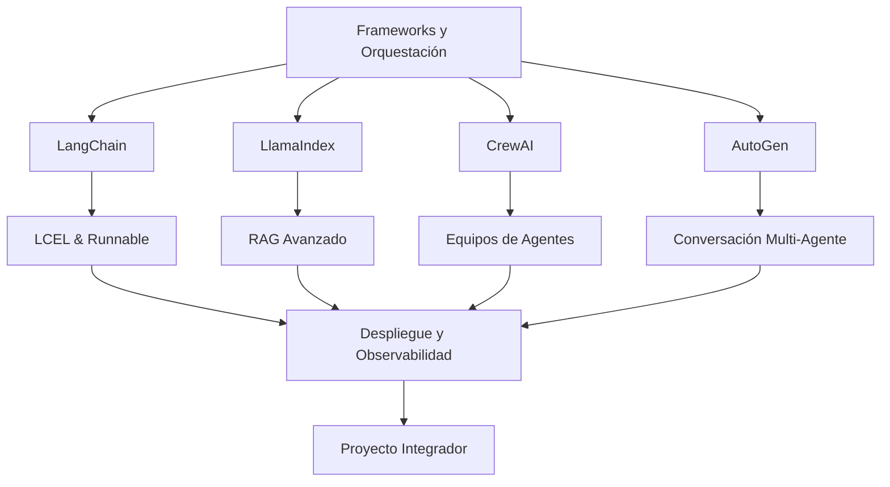

# 🎼 Bienvenida al Curso: Frameworks y Orquestación de Agentes AI

Este módulo profundiza en los frameworks y herramientas de orquestación más relevantes para la construcción de sistemas agenticos en producción. Dominar estas tecnologías es esencial para cualquier ingeniero de ML/AI que busque escalar soluciones basadas en agentes de manera robusta, observable y mantenible.

---

## 1. Objetivos de Aprendizaje

Al finalizar este curso, serás capaz de:

1. Diseñar pipelines complejos con [[01 - LangChain en Profundidad|LangChain]] usando LCEL y la interfaz `Runnable`.
2. Construir sistemas de RAG avanzado con [[02 - LlamaIndex y RAG Avanzado|LlamaIndex]], incluyendo recuperación jerárquica y reranking.
3. Orquestar equipos de agentes especializados con [[03 - CrewAI y AutoGen|CrewAI y AutoGen]].
4. Desplegar agentes productivos con observabilidad y trazabilidad ([[04 - Despliegue y Observabilidad de Agentes|Despliegue y Observabilidad]]).
5. Implementar un [[05 - Caso Practico - Sistema de Soporte con Agentes|sistema de soporte multi-agente]] de extremo a extremo.

---

## 2. Índice del Curso

| # | Nota | Descripción |
|---|------|-------------|
| 00 | **[[00 - Bienvenida]]** | Índice, glosario y objetivos |
| 01 | **[[01 - LangChain en Profundidad]]** | Arquitectura, LCEL, memoria, agents, output parsers |
| 02 | **[[02 - LlamaIndex y RAG Avanzado]]** | Índices, query engines, agentic RAG, reranking |
| 03 | **[[03 - CrewAI y AutoGen]]** | Roles, tasks, conversable agents, group chat |
| 04 | **[[04 - Despliegue y Observabilidad de Agentes]]** | FastAPI, SSE, tracing, evaluación |
| 05 | **[[05 - Caso Practico - Sistema de Soporte con Agentes]]** | Proyecto integrador multi-agente |

---

## 3. Glosario

| Término | Definición |
|---------|------------|
| **LangChain** | Framework para desarrollar aplicaciones con LLMs mediante cadenas (`chains`) y agentes. |
| **LlamaIndex** | Framework especializado en RAG (Retrieval Augmented Generation) e indexación de datos. |
| **CrewAI** | Framework para orquestar equipos de agentes autónomos con roles y tareas. |
| **AutoGen** | Framework de Microsoft para conversaciones multi-agente con ejecución de código. |
| **LCEL** | *LangChain Expression Language*: sint declarativa para componer pipelines. |
| **Retriever** | Componente que recupera documentos relevantes de un índice dado una consulta. |
| **Vector Store** | Base de datos optimizada para almacenar y buscar embeddings vectoriales. |
| **Agent Executor** | Motor que gestiona el bucle de pensamiento-acción-observación de un agente. |
| **Observability** | Capacidad de monitorear, trazar y diagnosticar el comportamiento de sistemas en producción. |
| **Tracing** | Registro detallado del flujo de ejecución de un agente, incluyendo llamadas a LLMs y herramientas. |
| **LangSmith** | Plataforma de observabilidad oficial de LangChain para tracing y evaluación. |

---

## 4. ¿Por qué este curso importa?

Los LLMs son poderosos, pero aislados no resuelven problemas empresariales complejos. Los **frameworks de orquestación** abstraen la complejidad de:

- Componer múltiples llamadas a modelos.
- Gestionar estados y memoria conversacional.
- Recuperar información de bases de conocimiento.
- Coordinar agentes especializados.
- Monitorear costos, latencia y calidad en producción.

⚠️ **Advertencia**: Un agente sin observabilidad es un sistema que falla en silencio.

💡 **Tip**: No caigas en la trampa de usar un framework por moda. Evalúa las restricciones de latencia, costo y complejidad de tu problema antes de elegir.

---

## 5. Mapa Conceptual del Módulo



---

## 6. Requisitos Previos

- Python 3.10+
- Conocimientos de LLMs, embeddings y prompting.
- Familiaridad con APIs de OpenAI o modelos open-source.
- Haber completado el módulo 11: *Fundamentos de Agentes AI*.

---

## 7. Estructura Recomendada de Estudio

1. **Semana 1**: LangChain en profundidad + LlamaIndex.
2. **Semana 2**: CrewAI + AutoGen.
3. **Semana 3**: Despliegue, observabilidad y proyecto integrador.

Caso real: Muchas startups de AI (como Perplexity AI) combinan LangChain/LlamaIndex para orquestar la recuperación y generación de respuestas en tiempo real.

---

## 8. Recursos Adicionales

- [LangChain Documentation](https://python.langchain.com/docs/)
- [LlamaIndex Documentation](https://docs.llamaindex.ai/)
- [CrewAI GitHub](https://github.com/joaomdmoura/crewAI)
- [AutoGen Documentation](https://microsoft.github.io/autogen/)


---

## 📦 Código de Compresión

```python
# Resumen ejecutivo del módulo en un snippet
MODULE = {
    "frameworks": ["LangChain", "LlamaIndex", "CrewAI", "AutoGen"],
    "skills": ["LCEL", "RAG", "Multi-Agent", "Observability"],
    "deliverable": "Sistema de Soporte Multi-Agente",
    "prerequisite": "M03 - 11 - Fundamentos de Agentes AI"
}
print(f"Módulo cargado: {MODULE['deliverable']}")
```

---

## 🎯 Proyecto Documentado

**Nombre**: Sistema de Soporte al Cliente con Agentes Especializados

**Descripción**: Construirás un sistema completo con:
- Un agente router para clasificación de tickets.
- Agentes especializados (técnico, facturación, ventas).
- RAG sobre base de conocimiento con LlamaIndex.
- Escalado a humano y métricas de rendimiento.
- Despliegue con FastAPI y observabilidad con LangSmith.

**Entregables**:
- Repositorio con código Python estructurado.
- Notebook de evaluación de trajectories.
- Dashboard de métricas (resolución en primer contacto, tiempo medio de respuesta).

---

*¡Manos a la obra! Navega a la nota [[01 - LangChain en Profundidad]] para comenzar.*
