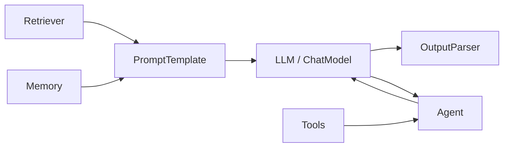
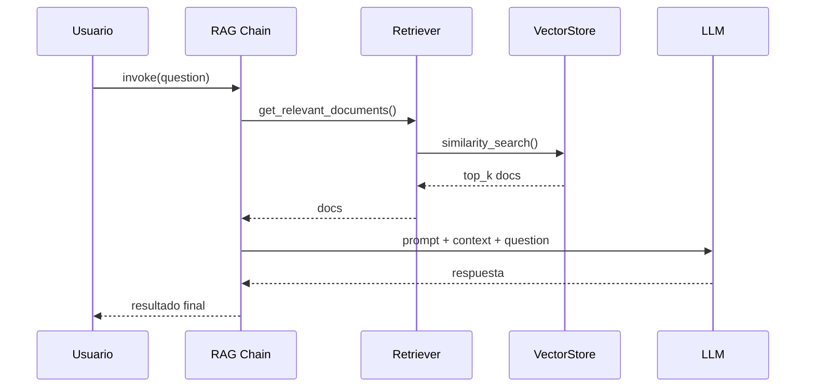

# 🔗 LangChain en Profundidad

LangChain es el framework más maduro y ampliamente adoptado para construir aplicaciones con LLMs. Su arquitectura modular permite componer pipelines complejos de forma declarativa, facilitando la transición de prototipos a producción en sistemas de ML/AI.

---

## 1. Arquitectura Fundamental de LangChain

LangChain se organiza en torno a componentes atómicos que se componen mediante cadenas (`chains`). Los pilares son:

1. **Prompts**: Plantillas parametrizables que estructuran la entrada al modelo.
2. **Models**: Interfaces unificadas para LLMs y chat models (OpenAI, Anthropic, local, etc.).
3. **Parsers**: Transforman la salida cruda del modelo en estructuras tipadas (JSON, Pydantic).
4. **Retrievers**: Recuperan contexto externo de bases vectoriales o documentales.
5. **Memory**: Persisten estado conversacional entre interacciones.
6. **Agents**: Componentes autónomos que deciden qué herramientas ejecutar.



---

## 2. LangChain Expression Language (LCEL)

LCEL permite declarar pipelines como composición funcional de `Runnables`. La sintaxis usa el operador `|` (pipe), inspirado en shell y frameworks de procesamiento funcional.

### 2.1. ¿Por qué LCEL?

- **Streaming nativo**: Los componentes soportan `stream()` y `astream()`.
- **Paralelismo**: Se pueden ejecutar ramas en paralelo con `RunnableParallel`.
- **Reintentos y fallback**: Decoradores como `with_retry()` o `with_fallbacks()`.
- **Tracabilidad**: Cada paso del pipeline es observable.

### 2.2. Sintaxis Básica

```python
from langchain_core.prompts import ChatPromptTemplate
from langchain_openai import ChatOpenAI
from langchain_core.output_parsers import StrOutputParser

prompt = ChatPromptTemplate.from_template("Explica el concepto de {topic} en 3 líneas.")
model = ChatOpenAI(model="gpt-4o", temperature=0.3)
parser = StrOutputParser()

chain = prompt | model | parser
result = chain.invoke({"topic": "orquestación de agentes"})
print(result)
```

💡 **Tip**: Todo objeto que implemente `invoke()`, `batch()` o `stream()` es un `Runnable`. Aprovecha esto para encapsular lógica propia.

---

## 3. Runnable Interface

La interfaz `Runnable` es el contrato base de LCEL. Sus métodos principales son:

| Método | Descripción | Cuándo usarlo |
|--------|-------------|---------------|
| `invoke(input)` | Ejecuta el pipeline con una sola entrada. | Peticiones síncronas unitarias. |
| `batch(inputs)` | Ejecuta múltiples entradas, optimizando llamadas. | Procesamiento por lotes. |
| `stream(input)` | Emite tokens a medida que se generan. | UX en tiempo real (chat). |
| `ainvoke / abatch / astream` | Versiones asíncronas. | Servidores async como FastAPI. |

### 3.1. Composición Avanzada

```python
from langchain_core.runnables import RunnableParallel, RunnablePassthrough

# Paralelismo: ejecutar dos prompts simultáneamente
parallel_chain = RunnableParallel(
    resumen=prompt | model | parser,
    keywords=ChatPromptTemplate.from_template("Lista 5 keywords sobre {topic}") | model | parser
)

# Passthrough permite pasar datos sin modificarlos
chain_with_context = RunnableParallel(
    context=retriever,
    question=RunnablePassthrough()
) | prompt | model | parser
```

⚠️ **Advertencia**: El paralelismo en `RunnableParallel` es por hilos (threads), no por procesos. Para carga intensiva de CPU, considera delegar a un worker pool externo.

---

## 4. Memory en LangChain

La memoria gestiona el estado conversacional. Los tipos más comunes son:

| Tipo | Descripción | Persistencia |
|------|-------------|--------------|
| `ConversationBufferMemory` | Almacena todo el historial crudo. | Variable (lista de mensajes). |
| `ConversationBufferWindowMemory` | Mantiene las últimas `k` interacciones. | Variable acotada. |
| `ConversationSummaryMemory` | Resume el historial con un LLM. | Resumen textual. |
| `VectorStoreRetrieverMemory` | Recupera interacciones relevantes por similitud. | Vector store. |

```python
from langchain.memory import ConversationBufferWindowMemory
from langchain.chains import ConversationChain

memory = ConversationBufferWindowMemory(k=3, return_messages=True)
conversation = ConversationChain(
    llm=model,
    memory=memory,
    verbose=True
)
```

Caso real: Un asistente médico usa `ConversationSummaryMemory` para mantener contexto de consultas largas sin exceder el context window del modelo.

---

## 5. Agents en LangChain

Un agente en LangChain consta de:
- **Un modelo de lenguaje** (el cerebro).
- **Un conjunto de herramientas** (tools).
- **Un prompt del sistema** que define el formato de razonamiento.
- **Un agent executor** que gestiona el bucle de ejecución.

### 5.1. Tipos de Agentes

| Tipo | Prompt Style | Requiere parsing estructurado | Ideal para |
|------|-------------|-------------------------------|------------|
| `zero-shot-react-description` | ReAct (Razonamiento + Acción) | No | Herramientas con descripciones claras. |
| `structured-chat-zero-shot-react-description` | ReAct con estructura JSON | Sí | Entradas complejas a herramientas. |
| `openai-functions` | OpenAI function calling nativo | No (API nativa) | Modelos OpenAI compatibles. |
| `plan-and-execute` | Planificación explícita | No | Tareas de múltiples pasos. |

```python
from langchain.agents import AgentType, initialize_agent, Tool
from langchain.tools import DuckDuckGoSearchRun

search = DuckDuckGoSearchRun()
tools = [
    Tool(
        name="WebSearch",
        func=search.run,
        description="Útil para buscar información actualizada en internet."
    )
]

agent = initialize_agent(
    tools,
    model,
    agent=AgentType.ZERO_SHOT_REACT_DESCRIPTION,
    verbose=True,
    handle_parsing_errors=True
)

agent.run("¿Cuál es la temperatura actual en Madrid?")
```

---

## 6. Output Parsers

Los parsers traducen salidas de texto libre a estructuras de datos.

### 6.1. PydanticOutputParser

```python
from langchain_core.output_parsers import PydanticOutputParser
from pydantic import BaseModel, Field

class Ticket(BaseModel):
    categoria: str = Field(description="Categoría del ticket: técnico, facturación, ventas")
    prioridad: int = Field(description="Prioridad del 1 al 5")
    resumen: str = Field(description="Resumen de 10 palabras")

parser = PydanticOutputParser(pydantic_object=Ticket)
prompt = ChatPromptTemplate.from_template(
    "Clasifica el siguiente ticket.\n{format_instructions}\nTicket: {ticket}",
    partial_variables={"format_instructions": parser.get_format_instructions()}
)
chain = prompt | model | parser
result = chain.invoke({"ticket": "No puedo acceder a mi cuenta desde ayer, el login falla."})
print(result)
```

### 6.2. JsonOutputParser

```python
from langchain_core.output_parsers import JsonOutputParser

parser = JsonOutputParser()
chain = prompt | model | parser
```

⚠️ **Advertencia**: Los modelos pequeños a menudo generan JSON malformado. Usa `handle_parsing_errors=True` o un `OutputFixingParser` para reintentar.

---

## 7. Document Loaders y Text Splitters

Para RAG, primero debes ingerir y fragmentar documentos.

### 7.1. Loaders Comunes

| Loader | Fuente |
|--------|--------|
| `PyPDFLoader` | Archivos PDF |
| `UnstructuredHTMLLoader` | Páginas web |
| `CSVLoader` | Tablas CSV |
| `JSONLoader` | Documentos JSON |

### 7.2. Text Splitters

```python
from langchain.text_splitter import RecursiveCharacterTextSplitter

splitter = RecursiveCharacterTextSplitter(
    chunk_size=500,
    chunk_overlap=50,
    separators=["\n\n", "\n", " ", ""]
)
docs = splitter.split_documents(raw_documents)
```

💡 **Tip**: Un `chunk_overlap` del 10-15% del `chunk_size` mejora la continuidad semántica entre fragmentos.

---

## 8. Comparativa: LangChain vs Uso Directo de API

| Criterio | Uso Directo API | LangChain |
|----------|-----------------|-----------|
| **Curva de aprendizaje** | Baja | Media-Alta |
| **Composición de pipelines** | Manual (código boilerplate) | Declarativa (LCEL) |
| **Cambio de proveedor** | Refactorización completa | Cambio de una línea (intercambio de clase) |
| **Observabilidad** | Implementación manual | Integrado con LangSmith |
| **Streaming** | Gestión manual de chunks | `.stream()` nativo |
| **Memoria** | Implementación manual | Componentes reutilizables |
| **Overhead** | Nulo | Ligero (depende de abstracciones usadas) |

Caso real: Una empresa fintech migró de llamadas directas a OpenAI a LangChain y redujo el tiempo de integración de un nuevo modelo (de Anthropic) de 2 semanas a 2 días gracias a la interfaz unificada.

---

## 9. Callbacks y Hooks

Los callbacks permiten instrumentar el pipeline para logging, métricas o intervención humana.

```python
from langchain_core.callbacks import BaseCallbackHandler

class TokenCountCallback(BaseCallbackHandler):
    def on_llm_new_token(self, token: str, **kwargs) -> None:
        print(f"Token: {token}", end="")

chain = prompt | model | parser
result = chain.invoke({"topic": "RAG"}, config={"callbacks": [TokenCountCallback()]})
```

💡 **Tip**: Usa callbacks para implementar *human-in-the-loop* en pasos críticos de un agente.

---

## 10. Pipeline Completo: RAG con LangChain

```python
from langchain_community.vectorstores import Chroma
from langchain_openai import OpenAIEmbeddings
from langchain_core.runnables import RunnablePassthrough
from langchain_core.prompts import ChatPromptTemplate

# 1. Ingesta y vectorización
embeddings = OpenAIEmbeddings()
vectorstore = Chroma.from_documents(documents=docs, embedding=embeddings)
retriever = vectorstore.as_retriever(search_kwargs={"k": 4})

# 2. Prompt
prompt = ChatPromptTemplate.from_template("""
Contexto: {context}
Pregunta: {question}
Responde en español basándote únicamente en el contexto proporcionado.
""")

# 3. Chain
rag_chain = (
    {"context": retriever | (lambda docs: "\n\n".join(d.page_content for d in docs)),
     "question": RunnablePassthrough()}
    | prompt
    | model
    | parser
)

# 4. Ejecución
response = rag_chain.invoke("¿Qué es la orquestación de agentes?")
print(response)
```



---

## 📦 Código de Compresión

```python
from langchain_core.runnables import RunnableLambda

# Patrón de compresión: función custom como Runnable
def enriquecer_datos(d: dict) -> dict:
    d["timestamp"] = __import__("time").time()
    return d

pipeline = RunnableLambda(enriquecer_datos) | prompt | model | parser
```

---

## 🎯 Proyecto Documentado

**Nombre**: Pipeline de Clasificación y Enriquecimiento de Tickets

**Descripción**: Implementa una chain LCEL que:
1. Recibe un ticket de soporte en texto libre.
2. Usa un `PydanticOutputParser` para extraer: categoría, prioridad y entidades.
3. Recupera documentación relevante con un retriever.
4. Genera una respuesta preliminar.
5. Loggea métricas con un callback personalizado.

**Métricas de éxito**:
- Precisión de clasificación > 85%.
- Latencia p95 < 2 segundos.
- Tasa de parseo exitoso > 95%.

---

*Continúa con [[02 - LlamaIndex y RAG Avanzado]] para profundizar en indexación y recuperación.*
