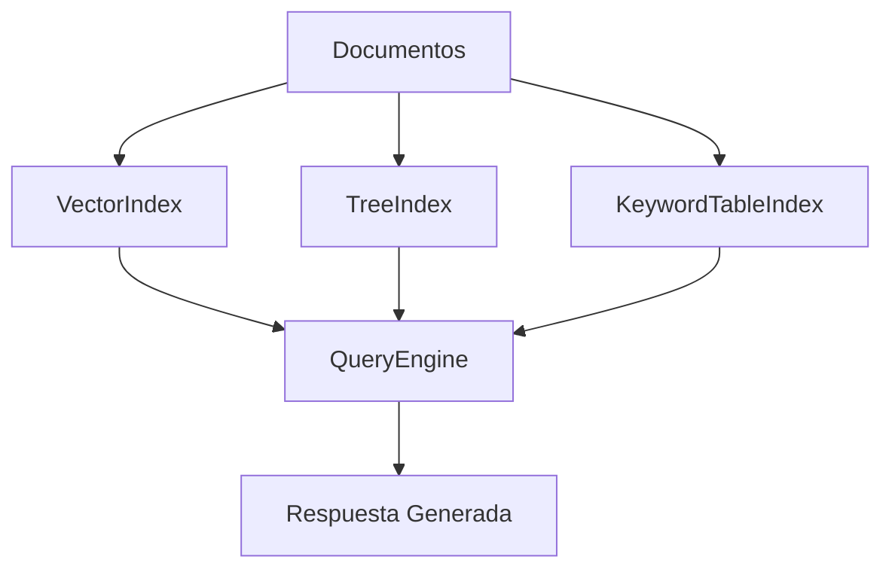
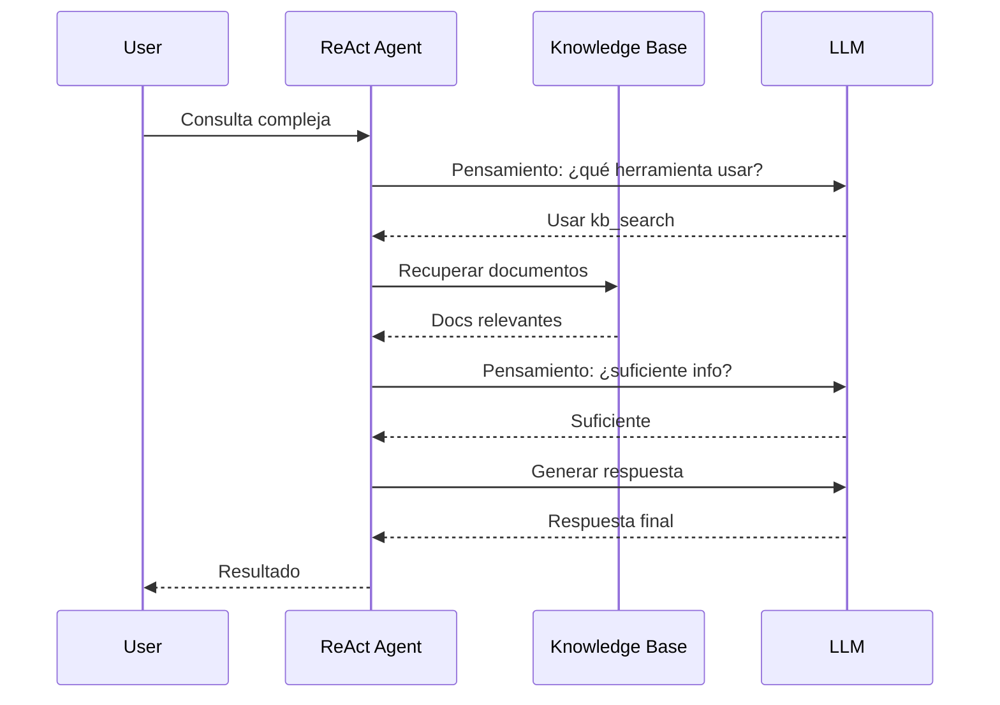

# 🦙 LlamaIndex y RAG Avanzado

LlamaIndex es el framework de referencia para construir sistemas de Retrieval Augmented Generation (RAG). A diferencia de LangChain, que es más generalista, LlamaIndex está diseñado específicamente para conectar LLMs con datos privados y estructurados, ofreciendo abstracciones de indexación y consulta de alto nivel.

---

## 1. Fundamentos de la Indexación

Un índice en LlamaIndex es una estructura de datos que organiza `Node` (fragmentos de documentos) para facilitar la recuperación eficiente. La elección del índice determina la latencia, precisión y capacidad de razonamiento del sistema.

### 1.1. Tipos de Índices

| Tipo de Índice | Estructura | Complejidad de Consulta | Ideal para |
|----------------|------------|-------------------------|------------|
| **VectorIndex** | Embeddings en vector store. | $O(k \cdot \log n)$ con HNSW. | Búsqueda semántica genérica. |
| **ListIndex** | Lista secuencial de nodos. | $O(n)$ | Documentos pequeños; summarization. |
| **TreeIndex** | Árbol jerárquico de resúmenes. | $O(\log n)$ a $O(n)$ | Navegación jerárquica; QA sobre libros. |
| **KeywordTableIndex** | Mapeo término $\rightarrow$ nodos. | $O(1)$ lookup. | Consultas con términos específicos conocidos. |
| **ComposableGraph** | Combinación de índices. | Variable | Arquitecturas híbridas complejas. |



---

## 2. Query Engines y Chat Engines

### 2.1. Query Engine

Es el componente que orquesta la recuperación y síntesis de respuestas. Su ciclo de vida es:

1. **Retrieval**: Obtener nodos relevantes.
2. **Synthesis**: Condensar la información recuperada en una respuesta coherente.

```python
from llama_index.core import VectorStoreIndex, SimpleDirectoryReader
from llama_index.embeddings.openai import OpenAIEmbedding

embed_model = OpenAIEmbedding(model="text-embedding-3-small")
documents = SimpleDirectoryReader("data").load_data()
index = VectorStoreIndex.from_documents(documents, embed_model=embed_model)

query_engine = index.as_query_engine(similarity_top_k=5)
response = query_engine.query("¿Cuáles son las políticas de reembolso?")
print(response)
```

### 2.2. Chat Engine

Extiende el Query Engine con memoria conversacional, permitiendo interacciones de múltiples turnos.

```python
chat_engine = index.as_chat_engine(chat_mode="condense_question", verbose=True)
response = chat_engine.chat("¿Qué es el RAG?")
response = chat_engine.chat("¿Cómo se compara con fine-tuning?")
```

| Modo de Chat | Descripción |
|--------------|-------------|
| `best` | Selecciona automáticamente el mejor modo según el contexto. |
| `condense_question` | Condensa la pregunta + historial en una sola consulta. |
| `context` | Inyecta el historial completo como contexto adicional. |
| `condense_plus_context` | Híbrido: condensa la pregunta y preserva contexto previo. |

---

## 3. Composability: Índices dentro de Índices

LlamaIndex permite construir **ComposableGraph**, donde un índice puede contener otros índices como nodos. Esto es útil para bases de conocimiento multimodal o multidominio.

```python
from llama_index.core import ComposableGraph

# Índices por departamento
index_tecnico = VectorStoreIndex(docs_tecnico)
index_ventas = VectorStoreIndex(docs_ventas)

# Índice raíz que apunta a los anteriores
graph = ComposableGraph.from_indices(
    ListIndex,
    [index_tecnico, index_ventas],
    index_summaries=["Documentación técnica", "Documentación de ventas"]
)

query_engine = graph.as_query_engine()
```

💡 **Tip**: Usa `index_summaries` descriptivos. El router del graph decide qué sub-índice consultar basándose en estos resúmenes.

---

## 4. Técnicas Avanzadas de Recuperación

### 4.1. Sub-Question Decomposition

Descompone una pregunta compleja en sub-preguntas, las resuelve independientemente y agrega las respuestas.

```python
from llama_index.core.tools import QueryEngineTool, ToolMetadata
from llama_index.core.query_engine import SubQuestionQueryEngine

tool_tecnico = QueryEngineTool(
    query_engine=index_tecnico.as_query_engine(),
    metadata=ToolMetadata(name="tecnico", description="Documentación técnica de productos")
)
tool_ventas = QueryEngineTool(
    query_engine=index_ventas.as_query_engine(),
    metadata=ToolMetadata(name="ventas", description="Políticas comerciales y precios")
)

engine = SubQuestionQueryEngine.from_defaults(
    query_engine_tools=[tool_tecnico, tool_ventas]
)
response = engine.query("¿Cuánto cuesta el plan enterprise y qué requisitos técnicos tiene?")
```

### 4.2. Recursive Retrieval

Recupera nodos de nivel superior (resúmenes) y, si son relevantes, explora sus nodos hijos.

```python
from llama_index.core.retrievers import RecursiveRetriever

retriever = RecursiveRetriever(
    "vector",
    retriever_dict={"vector": index.as_retriever()},
    node_dict=index.docstore.docs,
    verbose=True
)
```

### 4.3. Auto-Merging Retrieval

Los nodos se almacenan en niveles de granularidad. Si varios *child nodes* de un *parent* son recuperados, se fusionan en el documento original para proveer contexto más amplio.

```python
from llama_index.core.node_parser import HierarchicalNodeParser

parser = HierarchicalNodeParser.from_defaults(
    chunk_sizes=[2048, 512, 128]
)
nodes = parser.get_nodes_from_documents(documents)
index = VectorStoreIndex(nodes)
```

⚠️ **Advertencia**: Recursive retrieval aumenta la latencia de manera proporcional a la profundidad del árbol. Evalúa el trade-off entre precisión y tiempo de respuesta.

---

## 5. Metadata Filtering y Reranking

### 5.1. Metadata Filtering

Filtra documentos por campos estructurados (fecha, autor, categoría) antes o durante la búsqueda vectorial.

```python
from llama_index.core.vector_stores import MetadataFilters, ExactMatchFilter

filters = MetadataFilters(filters=[
    ExactMatchFilter(key="categoria", value="facturación")
])
retriever = index.as_retriever(filters=filters, similarity_top_k=5)
```

### 5.2. Reranking

El primer paso de recuperación (vectorial) es rápido pero puede ser ruidoso. Un **reranker** (como Cohere Rerank o BGE-Reranker) reordena los resultados por relevancia cruzada.

```python
from llama_index.postprocessor.cohere_rerank import CohereRerank

cohere_rerank = CohereRerank(api_key="...", top_n=3)
query_engine = index.as_query_engine(
    similarity_top_k=10,
    node_postprocessors=[cohere_rerank]
)
```

La probabilidad de relevancia de un reranker cruzado se puede modelar como:

$$P(r|q,d) = \sigma(f_{\theta}(q,d))$$

Donde $f_{\theta}$ es un modelo de scoring cruzado (query, documento) y $\sigma$ es la función sigmoide.

Caso real: **Pinecone** reporta que agregar un reranker mejora la precisión en RAG hasta un 30% en dominios técnicos especializados.

---

## 6. Response Synthesis

LlamaIndex ofrece múltiples estrategias para sintetizar la respuesta final a partir de los nodos recuperados.

| Modo | Descripción | Cuándo usarlo |
|------|-------------|---------------|
| `refine` | Itera nodos, refinando la respuesta paso a paso. | Muchos nodos; respuestas largas. |
| `compact` | Compacta los nodos antes de generar. | Contexto excede el límite del modelo. |
| `tree_summarize` | Construye un árbol de resúmenes de abajo hacia arriba. | Resúmenes de alta calidad; mayor latencia. |
| `simple_summarize` | Trunca y resume en un solo paso. | Respuestas rápidas; menor profundidad. |

```python
query_engine = index.as_query_engine(response_mode="tree_summarize")
```

💡 **Tip**: `compact` es generalmente el mejor punto de partida para equilibrar calidad y latencia.

---

## 7. Agentic RAG

En lugar de una sola consulta vectorial, un **agente** decide qué herramientas de recuperación usar, cuándo necesita más información y cómo estructurar la respuesta.

```python
from llama_index.core.agent import ReActAgent
from llama_index.core.tools import QueryEngineTool

tools = [
    QueryEngineTool.from_defaults(
        query_engine=index.as_query_engine(),
        name="kb_search",
        description="Busca en la base de conocimiento interna"
    )
]

agent = ReActAgent.from_tools(tools, llm=llm, verbose=True)
response = agent.chat("Resuelve la duda del usuario sobre reembolso de una compra del 2023")
```



---

## 8. Pipeline RAG Avanzado Completo

```python
from llama_index.core import Settings
from llama_index.embeddings.openai import OpenAIEmbedding
from llama_index.llms.openai import OpenAI
from llama_index.core.node_parser import SentenceSplitter
from llama_index.postprocessor.cohere_rerank import CohereRerank

# Configuración global
Settings.embed_model = OpenAIEmbedding(model="text-embedding-3-small")
Settings.llm = OpenAI(model="gpt-4o", temperature=0.1)
Settings.node_parser = SentenceSplitter(chunk_size=512, chunk_overlap=50)

# Ingesta
index = VectorStoreIndex.from_documents(documents)

# Recuperación avanzada
query_engine = index.as_query_engine(
    similarity_top_k=10,
    node_postprocessors=[CohereRerank(top_n=3)],
    response_mode="compact"
)

response = query_engine.query("Explica el proceso de devoluciones y plazos")
print(response)
```

⚠️ **Advertencia**: Configura `Settings` antes de cualquier operación de indexación. Cambiar el `embed_model` después requiere reindexar todo.

---

## 9. Comparativa de Estrategias de Recuperación

| Estrategia | Precisión | Latencia | Costo | Escalabilidad |
|------------|-----------|----------|-------|---------------|
| Búsqueda vectorial simple | Media | Baja | Bajo | Alta |
| + Metadata filtering | Alta | Baja | Bajo | Alta |
| + Reranking | Muy Alta | Media | Medio | Media |
| Recursive retrieval | Muy Alta | Alta | Medio | Media |
| Sub-question decomposition | Alta | Alta | Alto | Baja |
| Agentic RAG | Muy Alta | Muy Alta | Alto | Baja |

Caso real: **Databricks** utiliza LlamaIndex con `tree_summarize` y `recursive retrieval` para permitir a sus clientes hacer preguntas complejas sobre documentación técnica de miles de páginas.

---

## 📦 Código de Compresión

```python
# Configuración mínima viable para RAG avanzado con LlamaIndex
from llama_index.core import VectorStoreIndex, Settings
from llama_index.embeddings.openai import OpenAIEmbedding
from llama_index.llms.openai import OpenAI

Settings.embed_model = OpenAIEmbedding()
Settings.llm = OpenAI()

idx = VectorStoreIndex.from_documents(docs)
engine = idx.as_query_engine(similarity_top_k=8, response_mode="compact")
resp = engine.query("Tu pregunta aquí")
```

---

## 🎯 Proyecto Documentado

**Nombre**: Sistema de RAG Jurídico con Recuperación Jerárquica

**Descripción**:
- Indexa una colección de leyes y regulaciones.
- Usa `HierarchicalNodeParser` para granularidad múltiple.
- Implementa `RecursiveRetriever` para navegar del capítulo al artículo.
- Agrega `CohereRerank` para precisión final.
- Expone un endpoint REST con FastAPI.

**Métricas de éxito**:
- Recall@5 > 90% en conjunto de evaluación.
- Latencia p95 < 3 segundos.
- Precisión de respuesta validada por abogados > 80%.

---

*Avanza a [[03 - CrewAI y AutoGen]] para aprender orquestación multi-agente.*
