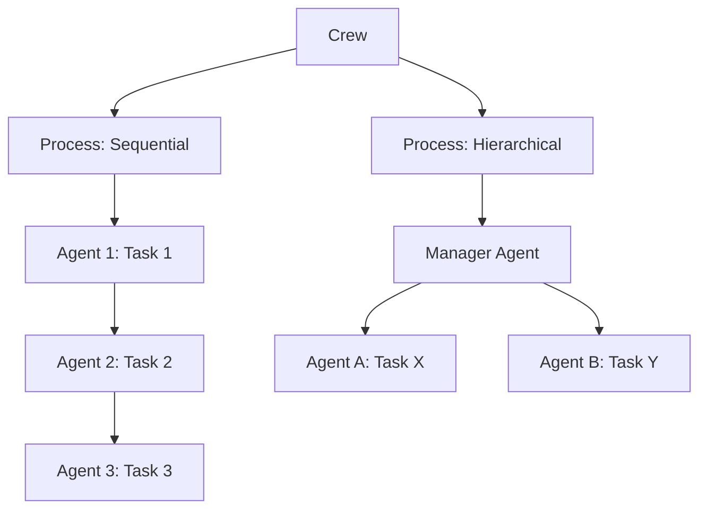
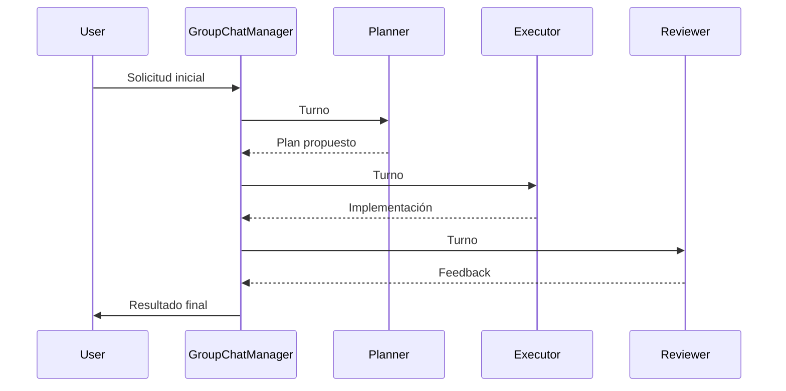

# 🤖 CrewAI y AutoGen

La orquestación multi-agente permite que múltiples agentes especializados colaboren para resolver tareas que un único agente no podría abordar eficientemente. CrewAI y AutoGen son los dos frameworks líderes en este espacio, cada uno con una filosofía de diseño distinta.

---

## 1. CrewAI: Agentes con Roles y Procesos

CrewAI modela la colaboración como un **equipo (crew)** de agentes, donde cada agente tiene un **rol**, una **meta** y un conjunto de **herramientas**. La orquestación se define a través de **tareas** y un **proceso** de ejecución.

### 1.1. Conceptos Fundamentales

| Concepto | Definición |
|----------|------------|
| **Agent** | Entidad autónoma con rol, objetivo y memoria. |
| **Task** | Trabajo específico asignado a un agente, con expected_output. |
| **Crew** | Grupo de agentes y tareas que se ejecutan bajo un proceso. |
| **Process** | Modo de ejecución: secuencial o jerárquico. |



### 1.2. Definición de Agentes y Tareas

```python
from crewai import Agent, Task, Crew, Process
from langchain.tools import DuckDuckGoSearchRun

search_tool = DuckDuckGoSearchRun()

researcher = Agent(
    role="Investigador Senior",
    goal="Recopilar información actualizada sobre {topic}",
    backstory="Eres un analista experto en investigación de mercado.",
    tools=[search_tool],
    verbose=True,
    allow_delegation=False
)

writer = Agent(
    role="Redactor de Contenidos",
    goal="Redactar un informe claro y estructurado basado en la investigación",
    backstory="Eres un redactor especializado en síntesis técnica.",
    verbose=True,
    allow_delegation=False
)

task_research = Task(
    description="Investiga los últimos avances en {topic}.",
    expected_output="Un resumen con 5 puntos clave y fuentes.",
    agent=researcher
)

task_write = Task(
    description="Escribe un informe ejecutivo usando la investigación.",
    expected_output="Un documento Markdown de 3 párrafos.",
    agent=writer,
    context=[task_research]  # Depende del output de la tarea anterior
)

crew = Crew(
    agents=[researcher, writer],
    tasks=[task_research, task_write],
    process=Process.sequential,
    verbose=True
)

result = crew.kickoff(inputs={"topic": "agentes autónomos en 2025"})
print(result)
```

### 1.3. Procesos de Ejecución

| Proceso | Mecanismo | Cuándo usarlo |
|---------|-----------|---------------|
| **Sequential** | Las tareas se ejecutan en orden. Las salidas fluyen a la siguiente. | Pipelines lineales bien definidos. |
| **Hierarchical** | Un *manager agent* asigna y revisa tareas dinámicamente. | Problemas abiertos que requieren planificación. |

En el proceso jerárquico, el manager utiliza un LLM para decidir:

$$\text{NextAction} = \underset{a \in \text{Agents}}{\arg\max} \; P(\text{éxito} \mid \text{task}, \text{agent}_a, \text{contexto})$$

⚠️ **Advertencia**: `allow_delegation=True` puede generar bucles infinitos si los agentes no tienen definidos límites claros de responsabilidad.

---

## 2. AutoGen: Conversaciones Multi-Agente

AutoGen, desarrollado por Microsoft Research, se centra en la **conversabilidad**: agentes que intercambian mensajes en un entorno compartido. Su fortaleza radica en la ejecución de código y la integración de retroalimentación humana.

### 2.1. Conversable Agents

Cada agente en AutoGen tiene:
- Un **LLM** para razonamiento y generación.
- Un **executor de código** (opcional) para tareas computacionales.
- Un **humano** en el bucle (opcional) para aprobaciones.

```python
from autogen import ConversableAgent

assistant = ConversableAgent(
    name="coder",
    system_message="Eres un programador Python experto. Escribe código limpio y comentado.",
    llm_config={"config_list": [{"model": "gpt-4o", "api_key": "..."}]}
)

user_proxy = ConversableAgent(
    name="user_proxy",
    llm_config=False,
    human_input_mode="NEVER",
    code_execution_config={"work_dir": "coding", "use_docker": False}
)

chat_result = user_proxy.initiate_chat(
    assistant,
    message="Genera un script que calcule la serie de Fibonacci hasta n=1000."
)
```

### 2.2. Group Chat

Un `GroupChat` permite que múmbiples agentes conversen en un canal compartido. Un `GroupChatManager` decide quién habla a continuación.

```python
from autogen import GroupChat, GroupChatManager

planner = ConversableAgent(name="planner", system_message="Planificador de proyectos.", llm_config=llm_config)
executor = ConversableAgent(name="executor", system_message="Ejecutor de tareas.", llm_config=llm_config)
reviewer = ConversableAgent(name="reviewer", system_message="Revisor de calidad.", llm_config=llm_config)

groupchat = GroupChat(
    agents=[planner, executor, reviewer, user_proxy],
    messages=[],
    max_round=10
)

manager = GroupChatManager(groupchat=groupchat, llm_config=llm_config)
user_proxy.initiate_chat(manager, message="Crea un plan para un sistema de recomendación de películas.")
```



### 2.3. Nested Chats

AutoGen permite **conversaciones anidadas**: un agente puede iniciar una sub-conversación con otros agentes para resolver una subtarea sin exponer todos los detalles al chat principal.

```python
def reflection_message(recipient, messages, sender, config):
    return f"Revisa el siguiente código y busca bugs:\n\n{messages[-1]['content']}"

nested_chat_queue = [
    {"recipient": reviewer, "message": reflection_message, "summary_method": "last_msg"}
]
assistant.register_nested_chats(nested_chat_queue, trigger=user_proxy)
```

### 2.4. Human-in-the-Loop

```python
user_proxy = ConversableAgent(
    name="user",
    human_input_mode="ALWAYS",  # Pide aprobación en cada paso
    code_execution_config={"use_docker": False}
)
```

| Modo | Comportamiento |
|------|----------------|
| `NEVER` | El agente actúa autónomamente. |
| `TERMINATE` | Pide input solo al finalizar. |
| `ALWAYS` | Pide input en cada mensaje. |

---

## 3. Ejecución de Código

AutoGen puede ejecutar código Python generado por el LLM de forma segura. Esto es crucial para tareas de análisis de datos o ML.

```python
code_executor = ConversableAgent(
    name="executor",
    code_execution_config={
        "work_dir": "workspace",
        "use_docker": True,  # Aislamiento de seguridad
        "timeout": 60
    }
)
```

⚠️ **Advertencia**: Nunca ejecutes código generado por LLMs sin aislamiento (Docker o sandbox). Existe riesgo de ejecución de código malicioso o accidental.

---

## 4. Comparativa: CrewAI vs AutoGen vs LangChain

| Característica | CrewAI | AutoGen | LangChain |
|----------------|--------|---------|-----------|
| **Paradigma** | Roles + Tareas + Procesos | Conversación multi-agente | Chains + Agents + Tools |
| **Curva de aprendizaje** | Media | Alta | Media |
| **Ejecución de código** | No nativa | Nativa y robusta | A través de tools |
| **Human-in-the-loop** | Limitada | Muy flexible | Mediante callbacks |
| **Delegación** | Entre agentes (role-based) | Manager / GroupChat | Agent Executor |
| **Ideal para** | Workflows estructurados | Programación, análisis, brainstorming | Pipelines RAG/LLM genéricos |
| **Observabilidad** | En desarrollo | Logs de conversación | LangSmith nativo |

Caso real: **Cognizant** usa CrewAI para orquestar equipos de agentes que realizan auditorías financieras secuenciales, mientras que **Microsoft Research** emplea AutoGen para generar y ejecutar código de machine learning de forma colaborativa.

---

## 5. Casos de Uso por Framework

### 5.1. CrewAI

- **Marketing**: Agente investigador $\rightarrow$ redactor $\rightarrow$ SEO optimizer.
- **Consultoría**: Analista de datos $\rightarrow$ estratega $\rightarrow$ presentador.
- **Soporte**: Clasificador $\rightarrow$ especialista técnico $\rightarrow$ escalador.

### 5.2. AutoGen

- **Data Science**: Generación automática de notebooks de análisis exploratorio.
- **Software**: Pair programming automatizado (programador + revisor + tester).
- **Educación**: Tutor + estudiante simulado para generar explicaciones adaptativas.

### 5.3. LangChain (para contexto)

- **RAG**: Pipelines de recuperación y generación.
- **Herramientas**: Agentes que consultan APIs, bases de datos y motores de búsqueda.
- **Workflows**: Procesamiento de documentos, extracción de entidades.

---

## 6. Patrón Híbrido: CrewAI + AutoGen

En arquitecturas avanzadas, puedes combinar ambos: CrewAI para la orquestación de alto nivel (procesos de negocio) y AutoGen para subtareas que requieren programación o discusión técnica.

```python
# Pseudo-arquitectura híbrida
# CrewAI: define el workflow empresarial
# AutoGen: grupo de chat para resolver un ticket técnico complejo
```

---

## 📦 Código de Compresión

```python
# CrewAI mínimo
from crewai import Agent, Task, Crew, Process
agent = Agent(role="Asistente", goal="Ayudar", backstory="IA útil.")
task = Task(description="Saluda al usuario.", expected_output="Un saludo.", agent=agent)
crew = Crew(agents=[agent], tasks=[task], process=Process.sequential)
print(crew.kickoff())

# AutoGen mínimo
from autogen import ConversableAgent
assistant = ConversableAgent(name="bot", llm_config={"config_list": [{"model": "gpt-4o", "api_key": "..."}]})
user = ConversableAgent(name="user", llm_config=False, human_input_mode="NEVER")
user.initiate_chat(assistant, message="Hola")
```

---

## 🎯 Proyecto Documentado

**Nombre**: Equipo de Agentes para Generación de Informes de Mercado

**Descripción**:
- **CrewAI**: Define un equipo con 3 agentes: investigador, analista financiero y redactor.
- Proceso secuencial para investigar un sector, analizar competidores y redactar un informe.
- **AutoGen** (opcional): Un sub-grupo de chat para validar las proyecciones numéricas mediante código Python.

**Entregables**:
- Script de CrewAI con tareas dependientes.
- Notebook de AutoGen con ejecución de análisis de datos.
- Informe generado automáticamente en formato Markdown.

---

*Continúa con [[04 - Despliegue y Observabilidad de Agentes]] para llevar tus agentes a producción.*
