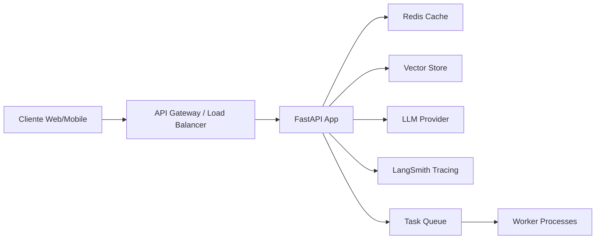
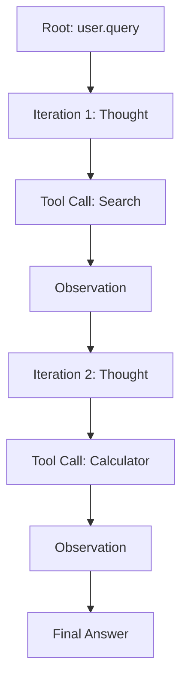
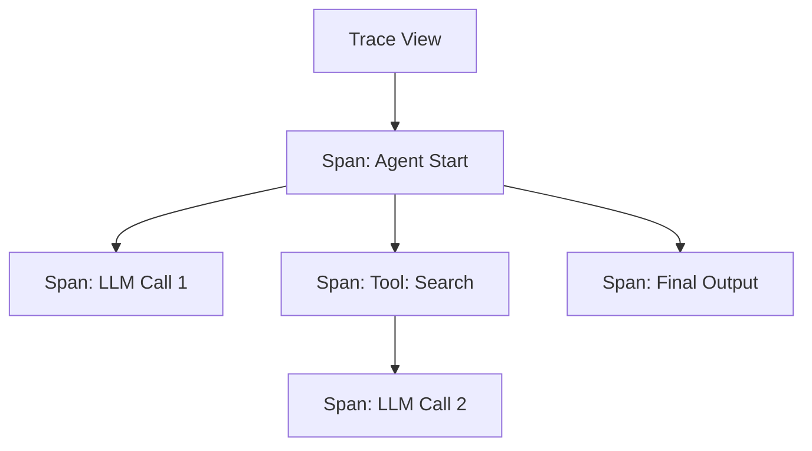

# 🚀 Despliegue y Observabilidad de Agentes

Desplegar agentes de IA en producción va mucho más allá de ejecutar un script local. Requiere arquitecturas resilientes, monitoreo continuo, evaluación sistemática y mecanismos de control de costos. Este módulo cubre el ciclo completo: del servidor HTTP al tracing distribuido.

---

## 1. Arquitectura de Despliegue

Un agente en producción típicamente se expone como un servicio REST o mediante streaming de eventos. La arquitectura mínima viable incluye:

1. **Servidor de aplicaciones** (FastAPI/Flask).
2. **Cola de tareas** (Redis, RabbitMQ) para procesamiento asíncrono.
3. **Vector Store** (Pinecone, Weaviate, Chroma) para RAG.
4. **Observability stack** (LangSmith, Langfuse, Phoenix).
5. **Cache** (Redis) para respuestas frecuentes.
6. **Rate limiter** para control de costos.



---

## 2. Despliegue con FastAPI y Streaming SSE

FastAPI es la opción estándar para servir agentes en Python gracias a su soporte nativo de async/await.

### 2.1. Endpoint Síncrono

```python
from fastapi import FastAPI
from langchain.chains import LLMChain
from langchain_openai import ChatOpenAI

app = FastAPI()
llm = ChatOpenAI(model="gpt-4o")

@app.post("/ask")
async def ask(question: str):
    response = await llm.ainvoke(question)
    return {"answer": response.content}
```

### 2.2. Streaming con Server-Sent Events (SSE)

El streaming mejora la percepción de latencia en interfaces conversacionales.

```python
from fastapi import FastAPI
from fastapi.responses import StreamingResponse
from langchain_openai import ChatOpenAI
from langchain_core.prompts import ChatPromptTemplate
import asyncio

app = FastAPI()
model = ChatOpenAI(model="gpt-4o", streaming=True)
prompt = ChatPromptTemplate.from_template("Responde: {question}")
chain = prompt | model

@app.post("/stream")
async def stream(question: str):
    async def event_generator():
        async for chunk in chain.astream({"question": question}):
            yield f"data: {chunk.content}\n\n"
        yield "data: [DONE]\n\n"

    return StreamingResponse(event_generator(), media_type="text/event-stream")
```

💡 **Tip**: Usa `StreamingResponse` con `text/event-stream` para compatibilidad nativa con navegadores y frameworks frontend como React/Vue.

---

## 3. Observabilidad: Tracing y Cost Tracking

La observabilidad de agentes se centra en tres pilares:

1. **Tracing**: Seguimiento del flujo de ejecución (cada llamada a LLM, tool o retriever).
2. **Metrics**: Latencia, throughput, tasa de éxito.
3. **Logging**: Eventos estructurados para debugging.

### 3.1. LangSmith

LangSmith es la plataforma oficial de LangChain. Se integra automáticamente configurando variables de entorno.

```python
import os
os.environ["LANGCHAIN_TRACING_V2"] = "true"
os.environ["LANGCHAIN_API_KEY"] = "ls-..."
os.environ["LANGCHAIN_PROJECT"] = "agentes-produccion"

# A partir de aquí, todas las invocaciones de LangChain se trazan automáticamente.
```

### 3.2. Langfuse

Langfuse es open-source y self-hosteable, ideal para entornos con restricciones de datos.

```python
from langfuse import Langfuse
from langfuse.callback import CallbackHandler

langfuse_handler = CallbackHandler(
    public_key="pk-...",
    secret_key="sk-...",
    host="https://cloud.langfuse.com"
)

result = chain.invoke({"question": "..."}, config={"callbacks": [langfuse_handler]})
```

### 3.3. Phoenix (Arize)

Phoenix se especializa en evaluación de RAG y drift de embeddings.

```python
import phoenix as px
from phoenix.trace.langchain import LangChainInstrumentor

session = px.launch_app()
LangChainInstrumentor().instrument()
```

| Plataforma | Tracing | Evaluación | Self-hosted | Costo |
|------------|---------|------------|-------------|-------|
| **LangSmith** | ✅ Excelente | ✅ Buena | ❌ No (pronto) | Freemium |
| **Langfuse** | ✅ Excelente | ✅ Buena | ✅ Sí | Open Source + Cloud |
| **Phoenix** | ✅ Buena | ✅ Excelente (RAG) | ✅ Sí | Open Source |

---

## 4. Tracing de Agent Loops

Un agente en ejecución genera un árbol de trazas:

- **Root span**: La invocación inicial del usuario.
- **Child spans**: Cada iteración del bucle del agente.
- **Leaf spans**: Llamadas a herramientas o LLMs.



La latencia total del agente es la suma de las latencias de cada paso:

$$T_{\text{total}} = \sum_{i=1}^{N} (T_{\text{LLM},i} + T_{\text{tool},i} + T_{\text{overhead},i})$$

⚠️ **Advertencia**: Agentes con muchas iteraciones pueden tener latencias de decenas de segundos. Considera timeouts agresivos y límites de iteración (`max_iterations`).

---

## 5. Cost Tracking y Latency Monitoring

### 5.1. Estimación de Costos

El costo de un pipeline depende de los tokens de entrada y salida:

$$\text{Costo} = \sum_{j} \left( \text{tokens}_{\text{in},j} \cdot p_{\text{in},j} + \text{tokens}_{\text{out},j} \cdot p_{\text{out},j} \right)$$

Donde $p$ es el precio por 1K tokens del modelo $j$.

```python
from langchain.callbacks import get_openai_callback

with get_openai_callback() as cb:
    result = agent.run("Consulta compleja")
    print(f"Total Tokens: {cb.total_tokens}")
    print(f"Prompt Tokens: {cb.prompt_tokens}")
    print(f"Completion Tokens: {cb.completion_tokens}")
    print(f"Total Cost (USD): ${cb.total_cost}")
```

### 5.2. Latency Monitoring

```python
import time
from functools import wraps

def measure_latency(func):
    @wraps(func)
    def wrapper(*args, **kwargs):
        start = time.perf_counter()
        result = func(*args, **kwargs)
        latency = time.perf_counter() - start
        print(f"Latency: {latency:.3f}s")
        return result
    return wrapper
```

---

## 6. Evaluación de Agentes

Evaluar un agente es más complejo que evaluar un clasificador. Necesitas métricas de trayectoria, precisión de herramientas y calidad de respuesta.

### 6.1. Trajectory Evaluation

Mide si el agente siguió la secuencia óptima de acciones para llegar a la respuesta.

```python
from langchain.evaluation import TrajectoryEvalChain

eval_chain = TrajectoryEvalChain.from_llm(
    llm=llm,
    agent_tools=tools,
    return_reasoning=True
)

result = eval_chain.evaluate(
    input="Consulta del usuario",
    prediction="Respuesta final",
    agent_trajectory=trajectory  # Lista de (acción, observación)
)
```

### 6.2. Tool Selection Accuracy

$$\text{Accuracy}_{\text{tool}} = \frac{\text{Herramientas correctas seleccionadas}}{\text{Total de decisiones de herramienta}}$$

### 6.3. Métricas de Calidad de Respuesta

| Métrica | Definición | Cómo medirla |
|---------|------------|--------------|
| **Relevancia** | La respuesta aborda la pregunta. | LLM-as-a-judge (0-5). |
| **Factualidad** | La respuesta no alucina. | Comparación con ground truth. |
| **Coherencia** | La respuesta es lógica y fluida. | Evaluación humana o LLM. |
| **Utilidad** | La respuesta permite al usuario actuar. | Feedback implícito (clicks, resolución). |

Caso real: **Klarna** evalúa sus agentes de soporte con un sistema de "LLM-as-a-judge" que compara las respuestas generadas contra las resoluciones reales de agentes humanos, alcanzando una correlación del 92% con evaluadores humanos.

---

## 7. Debugging y Visualización

### 7.1. Step-by-Step Visualization

LangSmith permite visualizar cada paso del agente:

1. Entra a tu proyecto en LangSmith.
2. Selecciona una traza (trace).
3. Expande cada span para ver el prompt completo, la respuesta y los tokens utilizados.



### 7.2. Debugging de Prompts

Los errores más comunes en producción son:

- **Prompt injection**: El usuario manipula el system prompt.
- **Formato de herramienta incorrecto**: El LLM genera JSON malformado.
- **Contexto excedido**: El prompt supera el context window.

💡 **Tip**: Usa `LangChainDebugger` o `set_debug(True)` en desarrollo para imprimir cada paso en consola.

```python
from langchain.globals import set_debug
set_debug(True)
```

---

## 8. Caching y Rate Limiting

### 8.1. Caching

Reducir llamadas redundantes a LLMs disminuye costos y latencia.

```python
from langchain.globals import set_llm_cache
from langchain_community.cache import SQLiteCache

set_llm_cache(SQLiteCache(database_path=".langchain.db"))
```

| Tipo de Cache | Persistencia | Ideal para |
|---------------|--------------|------------|
| `InMemoryCache` | Volátil | Desarrollo y testing. |
| `SQLiteCache` | Persistente | Servidores monolíticos. |
| `RedisCache` | Distribuida | Arquitecturas escalables. |

### 8.2. Rate Limiting

```python
from slowapi import Limiter, _rate_limit_exceeded_handler
from slowapi.util import get_remote_address
from fastapi import FastAPI

limiter = Limiter(key_func=get_remote_address)
app = FastAPI()
app.state.limiter = limiter

@app.post("/ask")
@limiter.limit("10/minute")
async def ask(request: Request, question: str):
    ...
```

⚠️ **Advertencia**: Implementa rate limiting tanto a nivel de API (usuario) como a nivel de proveedor LLM (cuenta). Un burst de tráfico puede generar costos inesperados.

---

## 9. Arquitectura de Producción Completa

```python
from fastapi import FastAPI, Request
from fastapi.responses import StreamingResponse
from langchain_openai import ChatOpenAI
from langchain.globals import set_llm_cache
from langchain_community.cache import RedisCache
import redis
import os

# Configuración
redis_client = redis.Redis(host='localhost', port=6379)
set_llm_cache(RedisCache(redis_client))
os.environ["LANGCHAIN_TRACING_V2"] = "true"
os.environ["LANGCHAIN_PROJECT"] = "agent-prod"

app = FastAPI()
model = ChatOpenAI(model="gpt-4o", streaming=True)

@app.post("/agent")
@limiter.limit("20/minute")
async def agent_endpoint(request: Request, query: str):
    async def stream():
        async for chunk in model.astream(query):
            yield f"data: {chunk.content}\n\n"
        yield "data: [DONE]\n\n"
    return StreamingResponse(stream(), media_type="text/event-stream")
```

---

## 📦 Código de Compresión

```python
# Pipeline de despliegue observable y cacheado
from langchain.globals import set_llm_cache
from langchain_community.cache import SQLiteCache
import os

os.environ["LANGCHAIN_TRACING_V2"] = "true"
set_llm_cache(SQLiteCache(".cache.db"))

# Ahora todas las invocaciones son trazadas y cacheadas automáticamente.
```

---

## 🎯 Proyecto Documentado

**Nombre**: API de Agente Financiero con Observabilidad Completa

**Descripción**:
- FastAPI con endpoints `/ask` (sync) y `/stream` (SSE).
- Agente con herramientas de búsqueda de precios y cálculo de intereses.
- Tracing con LangSmith y cost tracking por solicitud.
- Redis como cache para consultas frecuentes.
- Rate limiting por API key.
- Evaluación automática de trajectories contra un dataset de prueba.

**Métricas de éxito**:
- Disponibilidad > 99.9%.
- Latencia p95 < 1.5s para queries cacheadas, < 5s para no cacheadas.
- Reducción de costo por caching > 30%.
- Precisión de selección de herramienta > 90%.

---

*Avanza al proyecto final: [[05 - Caso Practico - Sistema de Soporte con Agentes]].*
