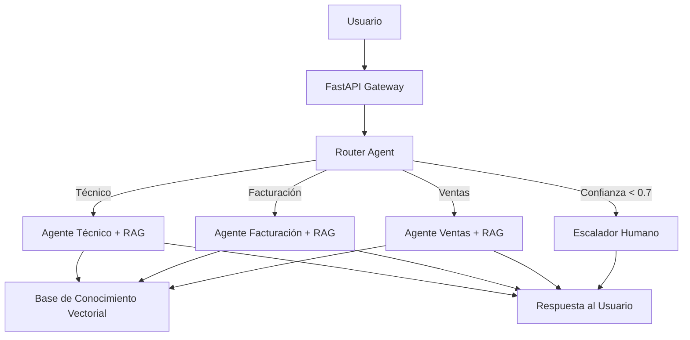
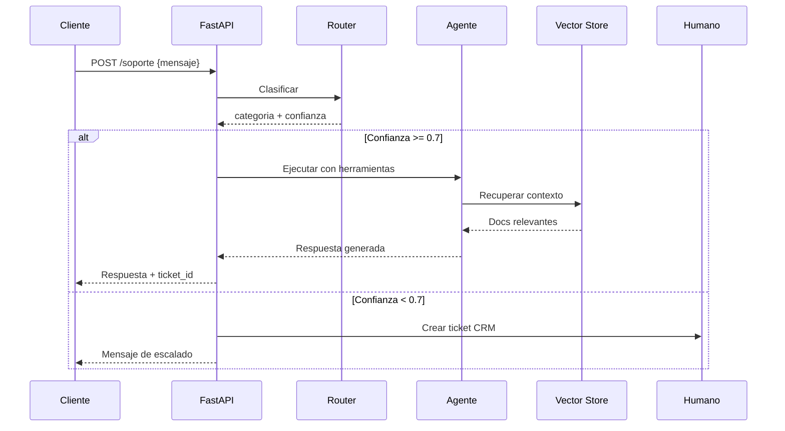

# 🎧 Caso Práctico: Sistema de Soporte con Agentes

Este proyecto integra todos los conceptos del módulo para construir un **sistema de soporte al cliente** basado en múltiples agentes especializados. El sistema clasifica tickets, recupera conocimiento contextual, responde de forma autónoma y escala a humanos cuando es necesario.

---

## 1. Arquitectura del Sistema

El sistema se compone de los siguientes agentes:

1. **Router Agent**: Clasifica el ticket en técnico, facturación o ventas.
2. **Agente Técnico**: Resuelve dudas de producto usando RAG sobre documentación.
3. **Agente Facturación**: Gestiona reembolsos, pagos y facturas.
4. **Agente Ventas**: Recomienda planes y responde preguntas comerciales.
5. **Escalador Humano**: Deriva al agente humano cuando la confianza es baja.




---

## 2. Router Agent: Clasificación Inteligente

El router utiliza un `PydanticOutputParser` para estructurar la decisión.

```python
from langchain_core.output_parsers import PydanticOutputParser
from pydantic import BaseModel, Field
from langchain_openai import ChatOpenAI
from langchain_core.prompts import ChatPromptTemplate

class RoutingDecision(BaseModel):
    categoria: str = Field(description="Una de: tecnico, facturacion, ventas, humano")
    confianza: float = Field(description="Confianza entre 0.0 y 1.0")
    razon: str = Field(description="Justificación de la clasificación")

parser = PydanticOutputParser(pydantic_object=RoutingDecision)
llm = ChatOpenAI(model="gpt-4o", temperature=0.1)

prompt = ChatPromptTemplate.from_template("""
Eres un clasificador de tickets de soporte. Analiza el mensaje del usuario y clasifícalo.
{format_instructions}

Mensaje: {mensaje}
""")

router_chain = prompt.partial(format_instructions=parser.get_format_instructions()) | llm | parser

# Ejecución
ruta = router_chain.invoke({"mensaje": "No me llegó la factura de marzo y ya pagué."})
print(ruta.categoria)  # facturacion
```

💡 **Tip**: Si la confianza es menor a 0.7, escala a humano directamente para evitar experiencias negativas.

---

## 3. Agentes Especializados con RAG

Cada agente especializado tiene su propio retriever sobre la base de conocimiento.

```python
from llama_index.core import VectorStoreIndex, Settings
from llama_index.embeddings.openai import OpenAIEmbedding
from llama_index.llms.openai import OpenAI
from llama_index.core.tools import QueryEngineTool

Settings.embed_model = OpenAIEmbedding(model="text-embedding-3-small")
Settings.llm = OpenAI(model="gpt-4o", temperature=0.2)

# Índices por departamento
index_tecnico = VectorStoreIndex.from_documents(docs_tecnico)
index_facturacion = VectorStoreIndex.from_documents(docs_facturacion)
index_ventas = VectorStoreIndex.from_documents(docs_ventas)

# Tools
tool_tecnico = QueryEngineTool.from_defaults(
    query_engine=index_tecnico.as_query_engine(similarity_top_k=5),
    name="kb_tecnico",
    description="Documentación técnica de productos y troubleshooting"
)

tool_facturacion = QueryEngineTool.from_defaults(
    query_engine=index_facturacion.as_query_engine(similarity_top_k=5),
    name="kb_facturacion",
    description="Políticas de facturación, reembolsos y pagos"
)

tool_ventas = QueryEngineTool.from_defaults(
    query_engine=index_ventas.as_query_engine(similarity_top_k=5),
    name="kb_ventas",
    description="Planes, precios y promociones comerciales"
)
```

---

## 4. Agente Ejecutor con Memoria

Cada agente mantiene memoria de la conversación usando `ConversationBufferWindowMemory`.

```python
from langchain.agents import initialize_agent, AgentType
from langchain.memory import ConversationBufferWindowMemory

memory = ConversationBufferWindowMemory(k=5, memory_key="chat_history", return_messages=True)

agent_tecnico = initialize_agent(
    tools=[tool_tecnico],
    llm=llm,
    agent=AgentType.OPENAI_FUNCTIONS,
    memory=memory,
    verbose=True,
    handle_parsing_errors=True
)
```

⚠️ **Advertencia**: La memoria compartida entre usuarios diferentes es un error crítico de seguridad. Asegúrate de instanciar un objeto `memory` por sesión de usuario.

---

## 5. Escalado a Humano

Si el router determina `categoria="humano"` o el agente especializado no encuentra respuesta tras 3 iteraciones, se crea un ticket en el CRM.

```python
from datetime import datetime

def escalar_a_humano(ticket_id: str, mensaje: str, razon: str):
    ticket = {
        "id": ticket_id,
        "timestamp": datetime.utcnow().isoformat(),
        "mensaje_original": mensaje,
        "razon_escalado": razon,
        "estado": "PENDIENTE_AGENTE"
    }
    # Guardar en CRM / Base de datos
    crm.create_ticket(ticket)
    return {"respuesta": "Tu consulta ha sido escalada a un agente humano. Te contactaremos pronto.", "ticket_id": ticket_id}
```

---

## 6. Métricas de Negocio y Técnicas

El éxito del sistema se mide con KPIs combinados de negocio e ingeniería.

### 6.1. Métricas Principales

| Métrica | Fórmula | Objetivo |
|---------|---------|----------|
| **FCR (First Contact Resolution)** | $\frac{\text{Tickets resueltos sin escalado}}{\text{Total de tickets}} \times 100$ | > 70% |
| **Tiempo Medio de Respuesta (TME)** | $\frac{\sum \text{tiempo de respuesta}}{\text{Total de tickets}}$ | < 30 segundos |
| **Satisfacción del Cliente (CSAT)** | Promedio de encuestas post-interacción (1-5) | > 4.2 |
| **Precisión de Clasificación** | $\frac{\text{Tickets clasificados correctamente}}{\text{Total}}$ | > 90% |
| **Costo por Ticket** | $\frac{\text{Costo total LLM}}{\text{Tickets resueltos}}$ | Reducir 40% vs humano |

### 6.2. Dashboard de Métricas

```python
# Pseudo-código para exponer métricas a Prometheus
from prometheus_client import Counter, Histogram, Gauge

fcr_gauge = Gauge('support_fcr_ratio', 'First Contact Resolution ratio')
latency_histogram = Histogram('support_response_seconds', 'Response latency')
ticket_counter = Counter('support_tickets_total', 'Total tickets', ['categoria', 'resolucion'])
```

Caso real: **Intercom** reportó que su sistema de resolución automatizada (Fin) alcanzó un FCR del 51% en su lanzamiento, con una mejora continua basada en retroalimentación humana.

---

## 7. Pipeline Completo del Sistema

```python
import uuid
from fastapi import FastAPI
from pydantic import BaseModel

app = FastAPI()

class TicketInput(BaseModel):
    user_id: str
    mensaje: str

@app.post("/soporte")
def resolver_ticket(ticket: TicketInput):
    ticket_id = str(uuid.uuid4())

    # 1. Clasificación
    decision = router_chain.invoke({"mensaje": ticket.mensaje})

    if decision.confianza < 0.7 or decision.categoria == "humano":
        return escalar_a_humano(ticket_id, ticket.mensaje, decision.razon)

    # 2. Enrutamiento
    if decision.categoria == "tecnico":
        respuesta = agent_tecnico.run(ticket.mensaje)
    elif decision.categoria == "facturacion":
        respuesta = agent_facturacion.run(ticket.mensaje)
    elif decision.categoria == "ventas":
        respuesta = agent_ventas.run(ticket.mensaje)
    else:
        return escalar_a_humano(ticket_id, ticket.mensaje, "Categoría desconocida")

    # 3. Logging y métricas
    ticket_counter.labels(categoria=decision.categoria, resolucion="auto").inc()

    return {
        "ticket_id": ticket_id,
        "categoria": decision.categoria,
        "confianza": decision.confianza,
        "respuesta": respuesta
    }
```



---

## 8. Evaluación y Mejora Continua

### 8.1. Evaluación de Trajectories

```python
from langchain.evaluation import TrajectoryEvalChain

eval_chain = TrajectoryEvalChain.from_llm(llm=llm, agent_tools=[tool_tecnico])

for ticket in dataset_test:
    trajectory = agent_tecnico.run(ticket["mensaje"])
    score = eval_chain.evaluate(
        input=ticket["mensaje"],
        prediction=trajectory["output"],
        agent_trajectory=trajectory["intermediate_steps"]
    )
    print(f"Ticket: {ticket['id']} | Score: {score['score']}")
```

### 8.2. Feedback Loop Humano

Cuando un agente humano resuelve un ticket escalado, su respuesta se indexa en la base de conocimiento para futuras recuperaciones.

```python
def indexar_resolucion_humana(ticket_id: str, respuesta_humana: str):
    doc = Document(page_content=respuesta_humana, metadata={"source": "humano", "ticket_id": ticket_id})
    index_tecnico.insert(doc)  # O el índice correspondiente
```

💡 **Tip**: Implementa un sistema de *thumbs up / thumbs down* en la interfaz del usuario para recolectar señales de calidad de forma continua.

---

## 9. Despliegue y Escalabilidad

- **Servidor**: FastAPI detrás de Uvicorn con múltiples workers.
- **Vector Store**: Chroma local para desarrollo; Pinecone/Weaviate para producción.
- **Cola de escalado**: Redis Streams o RabbitMQ para tickets que requieren procesamiento asíncrono.
- **Observabilidad**: LangSmith para tracing; Prometheus/Grafana para métricas de negocio.

⚠️ **Advertencia**: No desployes Chroma local en producción con múltiples workers simultáneos. Usa un servidor de vectores distribuido.

---

## 📦 Código de Compresión

```python
# Kernel del sistema de soporte en un bloque
from langchain.agents import initialize_agent, AgentType
from langchain.memory import ConversationBufferWindowMemory
from langchain_openai import ChatOpenAI
from llama_index.core.tools import QueryEngineTool

llm = ChatOpenAI(model="gpt-4o")
memory = ConversationBufferWindowMemory(k=3, return_messages=True)
agent = initialize_agent(tools=[tool_tecnico], llm=llm, agent=AgentType.OPENAI_FUNCTIONS, memory=memory)
# Router + Agent + Escalador = Sistema completo
```

---

## 🎯 Proyecto Documentado

**Nombre**: AI Support Desk - Sistema de Soporte Multi-Agente

**Descripción**:
Construirás de extremo a extremo un sistema de soporte con:

1. **Router de clasificación** con salida estructurada (Pydantic).
2. **Tres agentes especializados** con memoria conversacional y RAG (LlamaIndex).
3. **Escalador inteligente** a humanos basado en confianza.
4. **FastAPI** con endpoints `/soporte` y `/soporte/stream`.
5. **Observabilidad** con LangSmith y métricas Prometheus.
6. **Evaluación** de trajectories y fine-tuning continuo con feedback humano.

**Stack Tecnológico**:
- Python 3.11+
- LangChain + LlamaIndex
- FastAPI + Uvicorn
- Redis (cache + cola)
- Chroma/Pinecone (vector store)
- Prometheus + Grafana (métricas)

**Entregables Finales**:
- Repositorio Git con código modular (`agents/`, `api/`, `indexing/`, `eval/`).
- Dockerfile y `docker-compose.yml` para levantar todo el stack.
- Notebook de evaluación con dataset de 50 tickets de prueba.
- Documentación de API con OpenAPI/Swagger.

**Métricas de Éxito del Proyecto**:
| Métrica | Objetivo |
|---------|----------|
| FCR | > 65% |
| Precisión de Router | > 88% |
| Latencia p95 | < 4 segundos |
| CSAT promedio | > 4.0 / 5.0 |

---

*¡Felicidades! Has completado el módulo 12. Revisa el índice en [[00 - Bienvenida]] o avanza al módulo 13: Sistemas Multi-Agente.*
