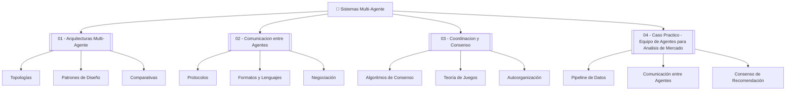

# 🤖 Sistemas Multi-Agente: Bienvenida

¡Bienvenido al curso **13 - Sistemas Multi-Agente**! En esta unidad exploraremos cómo múltiples agentes inteligentes colaboran, compiten y se coordinan para resolver problemas que exceden la capacidad de cualquier agente individual. Desde el diseño de arquitecturas distribuidas hasta la teoría de juegos aplicada a la coordinación, este curso te proporcionará las bases teóricas y prácticas para construir equipos de agentes robustos.

En el contexto actual de la ingeniería de ML e IA, los sistemas multi-agente (MAS) representan el siguiente escalón evolutivo después de los agentes individuales. Mientras que un solo agente puede ejecutar tareas complejas, un equipo de agentes especializados puede descomponer problemas de gran escala, paralelizar la computación, validar resultados cruzados y adaptarse dinámicamente a entornos cambiantes. Proyectos como AutoGen, CrewAI y MetaGPT demuestran que el futuro de la IA aplicada es inherentemente multi-agente.

---

## 1. Índice del Curso

A continuación se presenta el índice de las notas del curso con enlaces internos para navegación rápida:

1. [[01 - Arquitecturas Multi-Agente]] — Topologías, patrones de diseño y arquitecturas de referencia.
2. [[02 - Comunicacion entre Agentes]] — Protocolos, formatos, negociación y ontologías.
3. [[03 - Coordinacion y Consenso]] — Algoritmos de consenso, teoría de juegos y autoorganización.
4. [[04 - Caso Practico - Equipo de Agentes para Analisis de Mercado]] — Proyecto integrador de análisis financiero multi-agente.

---

## 2. Glosario de Términos Clave

A lo largo del curso utilizaremos una terminología específica del campo de los sistemas multi-agente. A continuación se define cada concepto fundamental:

| Término | Definición |
|---------|------------|
| **Multi-agent** | Sistema compuesto por dos o más agentes autónomos que interactúan en un entorno compartido para alcanzar objetivos individuales o colectivos. |
| **MAS** | *Multi-Agent System*. Sistema multi-agente formalizado que incluye arquitectura, protocolos de comunicación y mecanismos de coordinación. |
| **Swarm intelligence** | Inteligencia emergente resultante de la interacción descentralizada de múltiples agentes simples, inspirada en comportamientos biológicos como colonias de hormigas o bandadas de aves. |
| **Consensus** | Acuerdo alcanzado por un grupo de agentes sobre un valor o decisión común, incluso ante la presencia de fallos o información contradictoria. |
| **Negotiation** | Proceso de comunicación mediante el cual dos o más agentes llegan a un acuerdo mutuamente aceptable distribuyendo recursos o tareas. |
| **Auction** | Mecanismo de asignación de recursos donde los agentes pujan por bienes o tareas según reglas definidas (subasta inglesa, holandesa, Vickrey, etc.). |
| **Blackboard** | Patrón de diseño arquitectónico donde múltiples agentes especializados contribuyen a una memoria compartida (*blackboard*) para resolver problemas de forma cooperativa. |
| **Publish-subscribe** | Patrón de comunicación asíncrona donde los agentes publican mensajes en tópicos y se suscriben a aquellos de su interés, desacoplando emisores y receptores. |
| **Message passing** | Paradigma de comunicación entre agentes mediante el envío explícito de mensajes a través de canales, sockets o colas de mensajes. |
| **Agent topology** | Estructura geométrica o lógica que define las relaciones de comunicación y control entre los agentes de un sistema (centralizada, jerárquica, mesh, etc.). |

---

## 3. Objetivos de Aprendizaje

Al finalizar este curso, serás capaz de:

1. **Diseñar arquitecturas multi-agente** seleccionando la topología y los patrones de diseño adecuados para diferentes escenarios de aplicación.
2. **Implementar protocolos de comunicación** entre agentes utilizando formatos estructurados, ontologías compartidas y mecanismos de negociación.
3. **Aplicar algoritmos de coordinación y consenso** para resolver problemas de asignación de tareas, elección de líder y resolución de conflictos en entornos distribuidos.
4. **Modelar interacciones estratégicas** mediante teoría de juegos, identificando equilibrios de Nash y mecanismos de cooperación.
5. **Construir un sistema multi-agente funcional** que integre recolección de datos, análisis especializado, comunicación asíncrona y toma de decisiones consensuada.

---

## 4. Relevancia en el Ecosistema de IA

Los sistemas multi-agente no son una novedad académica aislada; constituyen el núcleo de las plataformas de agentes más avanzadas del mercado. En el desarrollo de software asistido por IA, los equipos de agentes pueden actuar como arquitectos, programadores, testers y documentadores simultáneamente. En la investigación científica, agentes especializados pueden hipotetizar, experimentar y validar resultados de forma autónoma. En los mercados financieros, los sistemas multi-agente permiten modelar dinámicas de oferta y demanda, detectar anomalías y ejecutar estrategias de trading complejas.


> 💡 **Tip:** Antes de sumergirte en las notas posteriores, asegúrate de comprender la diferencia entre un *agente reactivo* (responde a estímulos) y un *agente deliberativo* (planifica y razona). Los MAS modernos combinan ambos tipos.

⚠️ **Advertencia:** No confundas "múltiples agentes" con "múltiples llamadas a un mismo modelo". Un verdadero MAS implica autonomía, comunicación explícita y posiblemente heterogeneidad de capacidades entre agentes.

---

## 5. Mapa Conceptual del Curso



---

## 6. Recursos Adicionales

- **Caso real:** El proyecto *NASA ANTS* (Autonomous NanoTechnology Swarm) diseñó arquitecturas multi-agente para misiones espaciales donde miles de nanosatélites deben autoorganizarse sin control central directo.

- **Caso real:** *OpenAI's Multi-Agent Hide and Seek* demostró comportamientos emergentes complejos cuando múltiples agentes RL compitieron y cooperaron en un entorno de simulación física.

- **Caso real:** *Sycara's matchmaking systems* utilizaron agentes inteligentes para negociación automática en cadenas de suministro, reduciendo tiempos de acuerdo comercial en un 40%.


---

📦 **Código de compresión (summary del curso):**

```python
# Resumen ejecutable del flujo de un MAS
class CursoMAS:
    def __init__(self):
        self.modulos = [
            "Arquitecturas Multi-Agente",
            "Comunicacion entre Agentes",
            "Coordinacion y Consenso",
            "Caso Practico - Analisis de Mercado"
        ]
        self.conceptos_clave = [
            "MAS", "swarm intelligence", "consensus",
            "negotiation", "auction", "blackboard",
            "publish-subscribe", "message passing", "agent topology"
        ]

    def indice(self):
        for i, modulo in enumerate(self.modulos, 1):
            print(f"{i}. {modulo}")

    def objetivo(self):
        return "Diseñar, comunicar y coordinar equipos de agentes inteligentes."

curso = CursoMAS()
curso.indice()
print(f"Objetivo: {curso.objetivo()}")
```

---

🎯 **Proyecto del módulo:**

A lo largo de las siguientes cuatro notas, construirás progresivamente los componentes de un **Equipo de Agentes para Análisis de Mercado**. Cada nota aportará una pieza esencial:

- **Nota 01:** Diseñarás la arquitectura de red del equipo (topología jerárquica con agentes especializados).
- **Nota 02:** Implementarás el protocolo de comunicación basado en mensajes JSON con tópicos pub-sub.
- **Nota 03:** Desarrollarás el mecanismo de consenso ponderado para la recomendación final de inversión.
- **Nota 04:** Integrarás todo en un pipeline funcional con métricas de rendimiento (precisión y Sharpe ratio simulado).

¡Comencemos! → [[01 - Arquitecturas Multi-Agente]]
