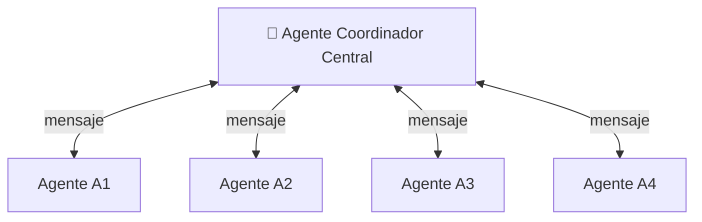
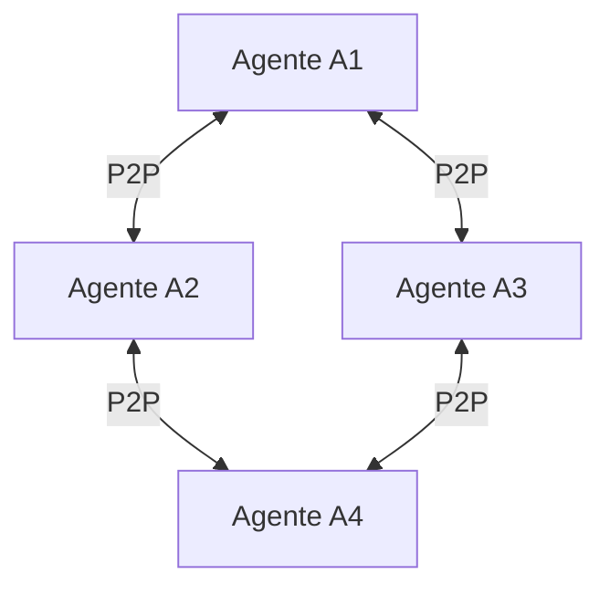
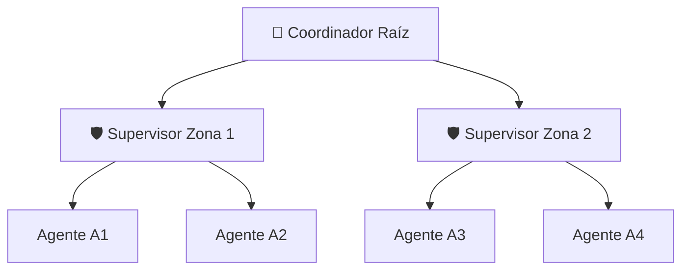
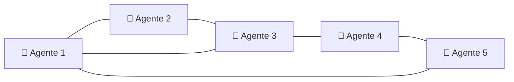
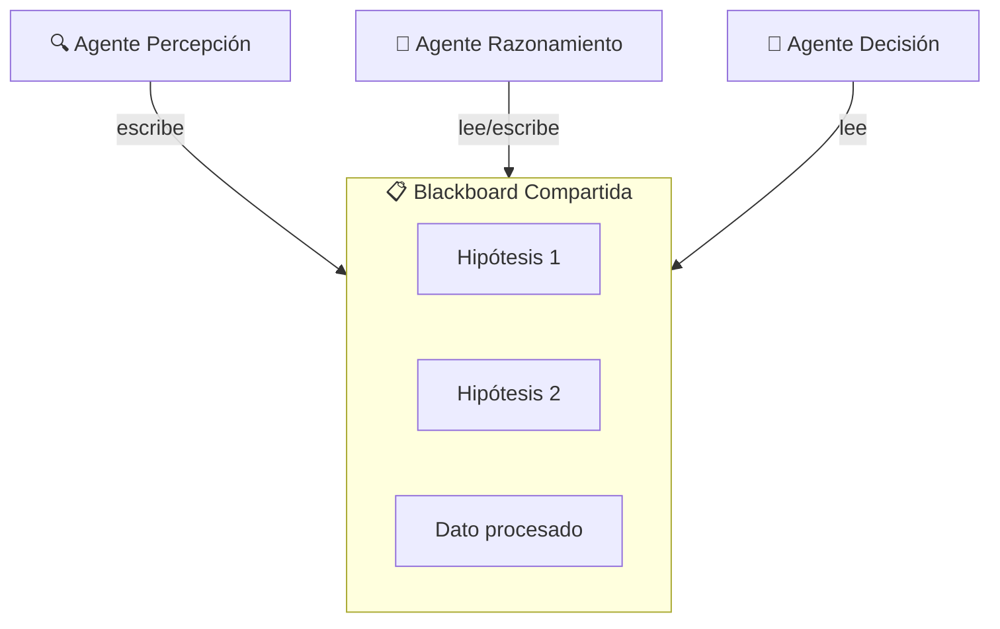
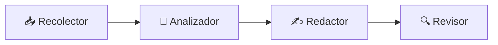
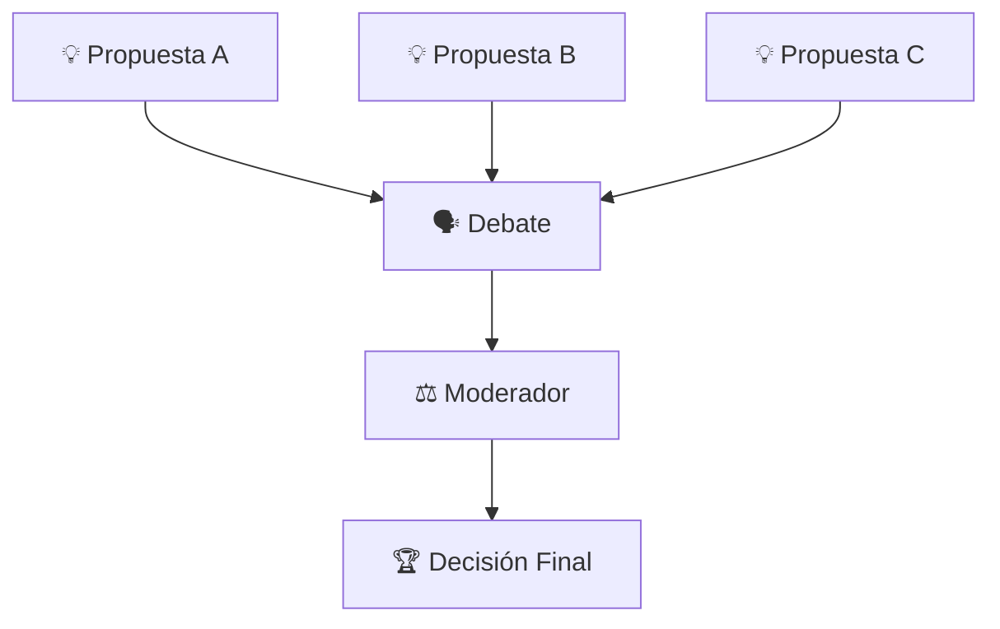
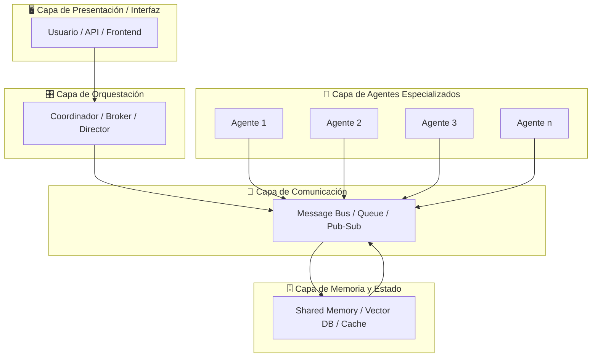
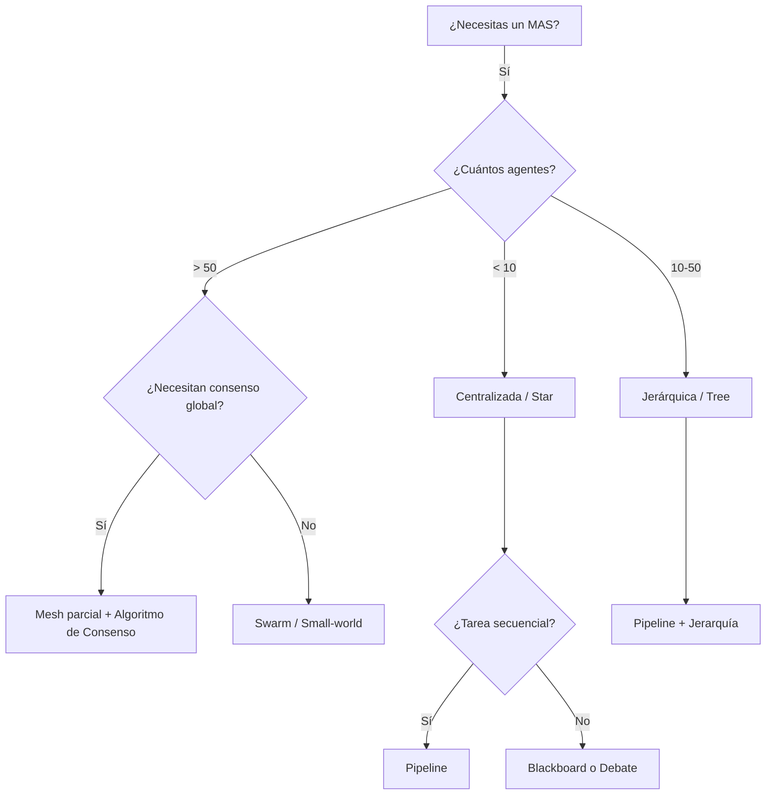

# 🕸️ Arquitecturas Multi-Agente

Los sistemas multi-agente (MAS) no son meramente conjuntos de agentes ejecutándose en paralelo; son ecosistemas complejos donde la **arquitectura** define quién se comunica con quién, quién toma decisiones y cómo se distribuye la información. En el contexto de la ingeniería de ML e IA, seleccionar la arquitectura correcta determina si tu sistema escalará a cientos de agentes o colapsará ante la primera congestión de mensajes. Esta nota profundiza en las topologías de red, los patrones de diseño y las arquitecturas de referencia que sustentan los MAS modernos.

---

## 1. Topologías de Red de Agentes

La topología define la estructura de comunicación y control. No existe una topología universalmente superior; cada una ofrece trade-offs inherentes entre latencia, escalabilidad y tolerancia a fallos.

### 1.1 Arquitectura Centralizada (Star)

En una topología centralizada, todos los agentes se comunican exclusivamente a través de un **agente coordinador central** (o *broker*). Este nodo central actúa como orquestador, enrutador y, frecuentemente, como árbitro de conflictos.



**Ventajas:**
- Visión global del estado del sistema en un único nodo.
- Fácil de implementar y depurar.
- Adecuada para equipos pequeños (< 10 agentes).

**Desventajas:**
- **Cuello de botella:** El nodo central limita el throughput.
- **Punto único de fallo (SPOF):** Si el coordinador falla, todo el sistema colapsa.
- No escala horizontalmente sin fragmentar el coordinador.

**Caso real:** Los早期 sistemas de gestión de flotas de taxis utilizaban un despachador central que asignaba viajes a conductores. Con el crecimiento, estas arquitecturas migraron a modelos descentralizados con zonas locales.

### 1.2 Arquitectura Descentralizada (Mesh / Peer-to-Peer)

Cada agente puede comunicarse directamente con cualquier otro agente. No hay autoridad central; la inteligencia emerge de las interacciones locales.



**Ventajas:**
- Alta tolerancia a fallos; no existe SPOF.
- Escalabilidad horizontal teóricamente ilimitada.
- Robustez ante desconexiones parciales.

**Desventajas:**
- Complejidad de descubrimiento de agentes (*service discovery*).
- Difícil garantizar consistencia global sin consenso explícito.
- Sobrecarga de mensajes en redes densas: $O(n^2)$ conexiones potenciales.

### 1.3 Arquitectura Jerárquica (Tree)

Los agentes se organizan en niveles. Los agentes de nivel inferior reportan a supervisores de nivel medio, quienes a su vez reportan a un coordinador de alto nivel.



**Ventajas:**
- Balance entre control centralizado y descentralización.
- Escalable mediante particionamiento por dominios o regiones.
- Tolerancia a fallos parcial (la caída de una rama no afecta a las demás).

**Desventajas:**
- Latencia acumulativa al subir/bajar la jerarquía.
- Complejidad en la reconfiguración dinámica del árbol.

**Caso real:** Los sistemas de defensa aérea militar utilizan arquitecturas jerárquicas donde sensores locales reportan a centros de comando regionales, que luego sintetizan información para un comando nacional.

### 1.4 Arquitectura Mesh / Swarm

Variante puramente descentralizada inspirada en la biología. Cada agente sigue reglas locales simples, pero el colectivo exhibe comportamiento inteligente emergente.



La inteligencia de enjambre (*swarm intelligence*) no requiere un plan maestro. Reglas como "sigue a tu vecino más cercano" o "evita obstáculos" generan patrones globales como exploración coordinada o formaciones geométricas.

---

## 2. Comparativa de Topologías

| Topología | Escalabilidad | Tolerancia a Fallos | Latencia (peor caso) | Complejidad de Implementación | Caso de Uso Ideal |
|-----------|---------------|---------------------|----------------------|-------------------------------|-------------------|
| Centralizada (Star) | Baja-Media | Baja | $O(2)$ saltos | Baja | Chatbots con orquestador, workflows simples |
| Descentralizada (Mesh) | Alta | Alta | $O(\log n)$ a $O(n)$ | Alta | Redes P2P, blockchain, sensores IoT |
| Jerárquica (Tree) | Media-Alta | Media | $O(2h)$, con $h$ = altura | Media | Organizaciones empresariales, defensa, logística |
| Swarm | Muy Alta | Muy Alta | Variable | Media-Alta | Robótica distribuida, optimización combinatoria |

> 💡 **Tip:** Si tu equipo de agentes tiene menos de 8 miembros y requiere una fuerte coherencia de estado, usa una arquitectura centralizada con replicación del coordinador. Si esperas crecer a decenas o cientos de agentes, diseña desde el inicio con una jerarquía o mesh parcialmente conectada.

⚠️ **Advertencia:** Una topología mesh completa no escala más allá de ~50 agentes debido a la explosión combinatoria de conexiones. En tales casos, utiliza *small-world networks* o *random graphs* con grado fijo por nodo.

---

## 3. Patrones de Diseño Multi-Agente

Más allá de la topología física, los patrones de diseño definen **cómo** los agentes colaboran para resolver un problema.

### 3.1 Blackboard (Pizarra Compartida)

Múltiples agentes especializados leen y escriben en una memoria compartida (*blackboard*). Ningún agente se comunica directamente con otro; la interacción es mediada por el estado compartido.



**Aplicaciones:** Diagnóstico médico, resolución de problemas de satisfacción de restricciones (CSP), sistemas expertos cooperativos.

**Caso real:** El sistema HEARSAY-II para reconocimiento de voz utilizó una blackboard donde agentes acústicos, léxicos y sintácticos contribuían hipótesis sobre la señal de audio.

### 3.2 Pipeline (Línea de Ensamblaje)

Los agentes se organizan en etapas secuenciales. La salida del agente $i$ es la entrada del agente $i+1$.



**Ventajas:** Claro flujo de datos, fácil de paralelizar por lotes (*batch processing*).
**Desventajas:** Rigidez; difícil de retroalimentar sin mecanismos adicionales.

### 3.3 Map-Reduce

Adaptación del patrón de procesamiento distribuido. Los agentes *map* procesan subconjuntos de datos en paralelo; los agentes *reduce* agregan los resultados parciales.

$$\text{Resultado} = \text{Reduce}\left( \bigcup_{i=1}^{n} \text{Map}(D_i) \right)$$

**Caso real:** Los sistemas de indexación web distribuida utilizan map-reduce para que múltiples agentes crawlers procesen dominios diferentes y un agente agregador construya el índice invertido.

### 3.4 Debate (Sociedad de Agentes)

Múltiples agentes proponen soluciones contradictorias y argumentan a favor o en contra. Un agente moderador o el propio colectivo converge hacia la mejor propuesta.



**Caso real:** *Multi-Agent Debate* de Wang et al. (2023) mostró que hacer que múltiples instancias de LLMs debatan respuestas mejora significativamente la precisión en tareas de razonamiento matemático y lógico.

### 3.5 Judge-Evaluator (Juez-Evaluador)

Un agente generador propone soluciones, y uno o más agentes evaluadores puntuan la calidad. El ciclo se repite hasta alcanzar un umbral de calidad.

$$\text{score}_i = f_{\text{eval}}(x_i), \quad x_{\text{best}} = \arg\max_{x_i} \text{score}_i$$

---

## 4. Arquitectura de Referencia MAS

Una arquitectura de referencia completa para sistemas multi-agente en IA moderna incluye las siguientes capas:



| Capa | Responsabilidad | Tecnologías Representativas |
|------|-----------------|------------------------------|
| Presentación | Interfaz con el usuario o sistemas externos | REST API, WebSocket, CLI |
| Orquestación | Enrutamiento de tareas, gestión de flujos | LangGraph, CrewAI, AutoGen |
| Agentes | Ejecución de tareas especializadas | LLM wrappers, herramientas, RAG |
| Comunicación | Transporte de mensajes entre agentes | Redis Pub/Sub, RabbitMQ, ZeroMQ |
| Memoria | Persistencia de estado compartido y contexto | PostgreSQL, Pinecone, Redis |

---

## 5. Casos de Uso por Dominio

### 5.1 Coding (Generación de Software)

En sistemas como **MetaGPT** o **ChatDev**, los agentes asumen roles de product manager, arquitecto, ingeniero, tester y documentador. La arquitectura suele ser un **pipeline con retroalimentación**: el tester devuelve bugs al ingeniero, y el PM revisa requisitos.

**Caso real:** El framework *ChatDev* logró generar aplicaciones software funcionales con un costo promedio de $0.20 en tokens de LLM, utilizando una arquitectura de pipeline con 7 roles especializados.

### 5.2 Research (Investigación Científica)

Agentes especializados en búsqueda de literatura, diseño experimental, análisis estadístico y redacción. La arquitectura preferida es **blackboard o debate**, donde los hallazgos de un agente refinan las hipótesis de otro.

**Caso real:** *Agent Laboratory* (2024) demostró que equipos de agentes LLM pueden recorrer el ciclo completo de investigación científica, desde la revisión bibliográfica hasta la generación de código de experimentos, con resultados comparables a estudiantes de postgrado en ciertos benchmarks.

### 5.3 Debate y Verificación (Red Teaming)

Un agente propone respuestas y otro actúa como *red team* buscando fallas lógicas, sesgos o inseguridades. Es una arquitectura **judge-evaluator iterativa**.

**Caso real:** *Constitutional AI* de Anthropic utiliza un proceso de crítica y revisión entre múltiples instancias del modelo para alinear respuestas con principios éticos sin intervención humana directa en cada paso.

---

## 6. Diagrama de Decisión de Arquitectura



---

📦 **Código de compresión:**

```python
import random
from typing import List, Dict

class Agent:
    def __init__(self, agent_id: str, role: str):
        self.agent_id = agent_id
        self.role = role
        self.neighbors: List['Agent'] = []
        self.state: Dict = {}

    def send(self, target: 'Agent', message: dict):
        target.receive(message)

    def receive(self, message: dict):
        self.state[message.get('topic')] = message.get('payload')

class Topology:
    @staticmethod
    def star(agents: List[Agent], coordinator: Agent):
        for a in agents:
            if a != coordinator:
                a.neighbors = [coordinator]
                coordinator.neighbors.append(a)

    @staticmethod
    def mesh(agents: List[Agent]):
        for a in agents:
            a.neighbors = [x for x in agents if x != a]

    @staticmethod
    def random_graph(agents: List[Agent], avg_degree: int = 3):
        n = len(agents)
        for i, a in enumerate(agents):
            targets = random.sample(
                [x for x in agents if x != a],
                min(avg_degree, n - 1)
            )
            a.neighbors = targets

# Ejemplo de uso
agents = [Agent(f"A{i}", "worker") for i in range(5)]
coordinator = Agent("C0", "coordinator")
all_agents = agents + [coordinator]

Topology.star(agents, coordinator)
print(f"{coordinator.agent_id} tiene {len(coordinator.neighbors)} vecinos")
```

---

🎯 **Proyecto documentado — Paso 1: Arquitectura del Equipo de Análisis de Mercado**

Para el caso práctico de la Nota 04, definimos la siguiente arquitectura jerárquica:

- **Nodo raíz:** `CoordinatorAgent` — sintetiza recomendaciones finales.
- **Supervisores (implícitos en la jerarquía):** No se requieren por la naturaleza del dominio (5 agentes), por lo que la raíz se comunica directamente con los especialistas.
- **Hojas especializadas:**
  - `DataCollectorAgent` — topología: conecta a APIs externas y publica datos crudos.
  - `TechnicalAnalystAgent` — consume datos, produce señales técnicas.
  - `FundamentalAnalystAgent` — consume datos, produce métricas fundamentales.
  - `SentimentAgent` — consume noticias, produce score de sentimiento.

La comunicación se realizará a través de un bus de mensajes central (arquitectura estrella lógica) implementado con Redis Pub/Sub, permitiendo que cualquier agente eventualmente escuche los tópicos de su interés.

→ Continúa en [[02 - Comunicacion entre Agentes]] para implementar los protocolos de esta arquitectura.
