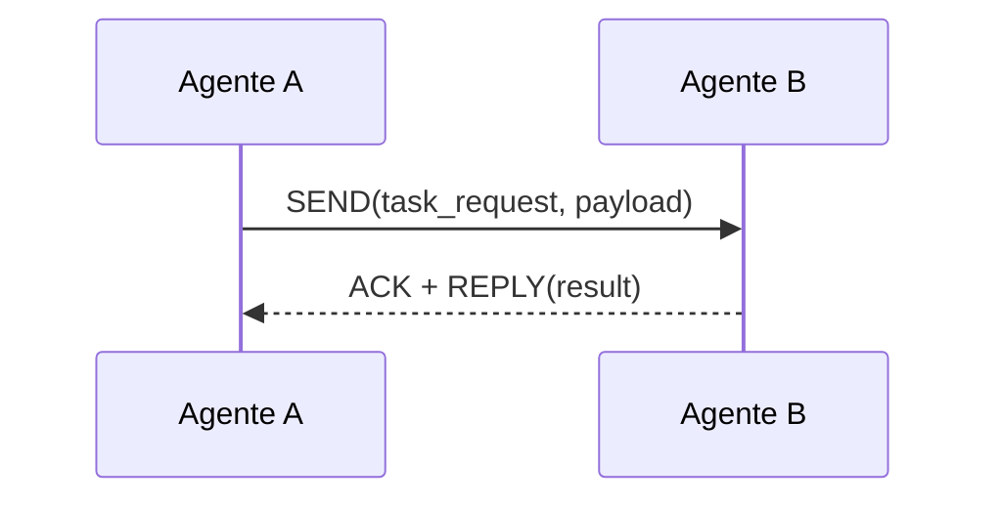
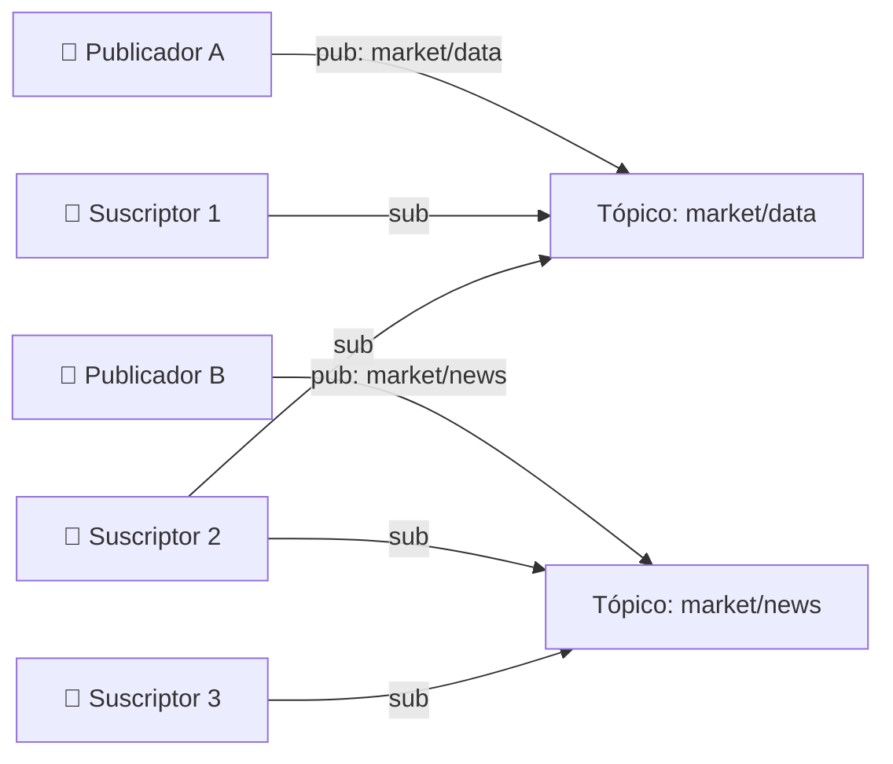
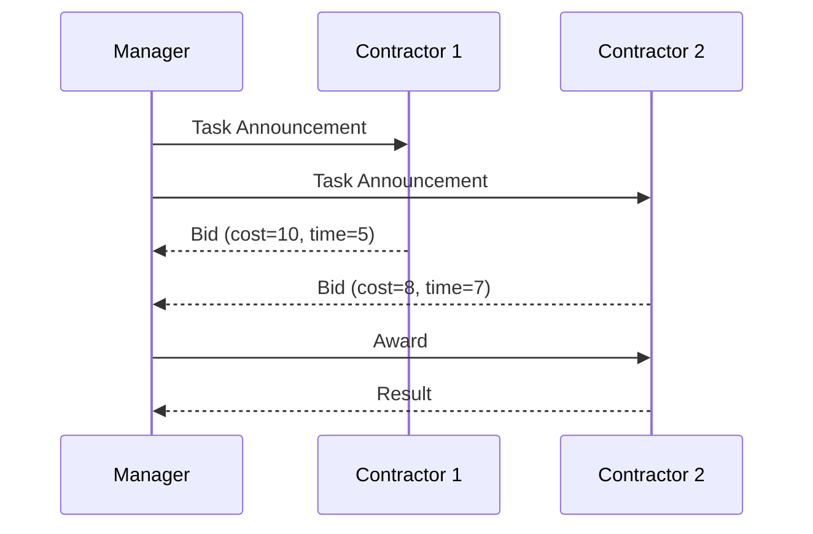
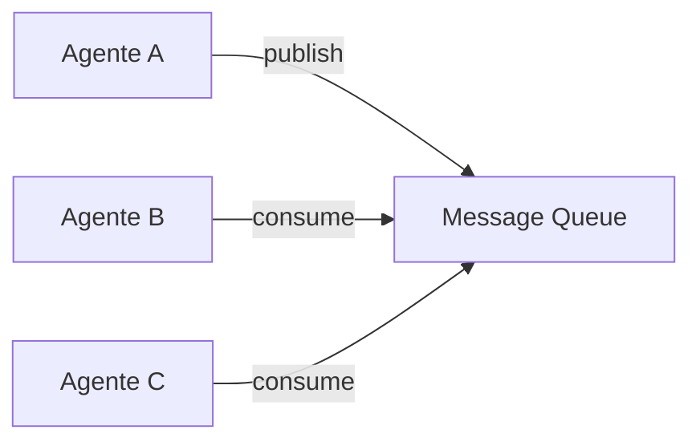

# 📡 Comunicación entre Agentes

La comunicación es el tejido conectivo de cualquier sistema multi-agente (MAS). Sin un protocolo de intercambio de información bien definido, incluso la arquitectura más elegante colapsa en un conjunto de agentes aislados. En el contexto de ML e IA, donde los agentes pueden estar respaldados por modelos de lenguaje de diferentes proveedores, la comunicación eficiente y semánticamente rica se vuelve crítica. Esta nota aborda desde los protocolos de transporte hasta los lenguajes de alto nivel y las estrategias de negociación.

---

## 1. Protocolos de Comunicación

El protocolo define **cómo** se transfiere la información: quién puede hablar, en qué orden y por qué medio.

### 1.1 Mensajes Directos (Point-to-Point)

El emisor conoce explícitamente la dirección del receptor y envía un mensaje dirigido. Es el modelo más simple y determinista.



**Ventajas:** Privacidad, trazabilidad, baja latencia para pares específicos.
**Desventajas:** Acoplamiento fuerte; el emisor debe conocer la identidad del receptor.

### 1.2 Broadcast

Un agente envía un mensaje a **todos** los demás agentes del sistema. Útil para alertas, descubrimiento de servicios o señales de emergencia.

$$\text{Costo de mensajes} = n - 1 \quad \text{para un emisor en una red de } n \text{ agentes}$$

⚠️ **Advertencia:** El broadcast incontrolado genera **inundación de red** (*broadcast storm*). En MAS grandes, debe limitarse mediante TTL (*time-to-live*) o zonas de broadcast.

### 1.3 Publish-Subscribe (Pub-Sub)

Patrón desacoplado donde los agentes publican mensajes en **tópicos** y se suscriben a los tópicos de interés. Ni el publicador ni el suscriptor necesitan conocerse mutuamente.



**Ventajas:** Desacoplamiento total, escalabilidad, flexibilidad para añadir nuevos agentes.
**Desventajas:** Requiere infraestructura de broker (Redis, RabbitMQ, Kafka); latencia adicional por intermediación.

> 💡 **Tip:** En implementaciones con Python, `redis-py` con canales pub/sub ofrece latencias sub-milisegundo para equipos de agentes en una misma red local.

---

## 2. Formatos de Mensaje

El formato determina la estructura sintáctica del payload. Para que un MAS sea interoperable, los mensajes deben ser parseables por cualquier agente.

### 2.1 JSON (JavaScript Object Notation)

Formato estándar de facto en sistemas modernos. Ligero, legible y con soporte universal.

```json
{
  "header": {
    "message_id": "msg-001",
    "sender": "DataCollectorAgent",
    "timestamp": "2024-05-04T10:00:00Z",
    "topic": "market/data/raw"
  },
  "payload": {
    "symbol": "AAPL",
    "price": 173.50,
    "volume": 45000000
  }
}
```

### 2.2 Structured Text (YAML, TOML, XML)

Útiles cuando la legibilidad humana es prioritaria o cuando se requiere validación de esquema estricta (XML con XSD).

### 2.3 Binary Formats (Protobuf, MessagePack, Avro)

Ofrecen menor tamaño de mensaje y mayor velocidad de serialización. Recomendados para MAS con alto throughput o comunicación interproceso frecuente.

| Formato | Legibilidad | Tamaño | Velocidad | Esquema | Caso de Uso |
|---------|-------------|--------|-----------|---------|-------------|
| JSON | Alta | Medio | Media | Flexible | APIs REST, logs |
| XML | Media | Grande | Baja | Rígido | Sistemas legacy, SOAP |
| Protobuf | Baja | Pequeño | Alta | Estricto | Microservicios, gaming |
| MessagePack | Baja | Pequeño | Alta | Flexible | Comunicación interna MAS |

---

## 3. Lenguajes de Agentes

Más allá del formato sintáctico, existen lenguajes semánticos diseñados específicamente para la comunicación entre agentes inteligentes.

### 3.1 ACL (Agent Communication Language)

Estandarizado por FIPA (Foundation for Intelligent Physical Agents), ACL define la estructura de mensajes con performativas (*performatives*) que indican la intención del hablante: `INFORM`, `REQUEST`, `QUERY-IF`, `PROPOSE`, `ACCEPT`, `REJECT`, etc.

```
(REQUEST
  :sender AgenteA
  :receiver AgenteB
  :content "(comprar accion AAPL 100)"
  :language SL
  :ontology mercado-financiero
)
```

**Caso real:** Aunque FIPA-ACL tuvo mayor tracción en la década de 2000, sus principios informan los protocolos de negociación en plataformas modernas como JADE (Java Agent DEvelopment Framework).

### 3.2 KQML (Knowledge Query and Manipulation Language)

Predecesor semántico de ACL. KQML separa claramente el **protocolo de comunicación** del **contenido del mensaje**. Sus performativas incluyen `ASK`, `TELL`, `DENY`, `INSERT`, `DELETE`.

$$\text{Mensaje KQML} = \langle \text{performativa}, \text{contenido}, \text{ontología} \rangle$$

⚠️ **Advertencia:** Tanto ACL como KQML son verbosos y han sido parcialmente reemplazados por REST/JSON + OpenAPI en la industria. No obstante, sus conceptos de *performativa* y *ontología* siguen vigentes en la ingeniería de prompts para LLM multi-agente.

---

## 4. Negociación entre Agentes

Cuando los intereses de los agentes entran en conflicto —por recursos limitados, prioridades divergentes o objetivos opuestos— se requiere un mecanismo de negociación formal.

### 4.1 Contract Net Protocol (CNP)

Un agente *manager* anuncia una tarea (*task announcement*). Los agentes *contractors* evalúan su capacidad de cumplirla y envían ofertas (*bid*). El manager adjudica el contrato al mejor postor.



**Fórmula de utilidad del manager:**

$$U_{\text{manager}} = \sum_{i} \left( V_i - C_i \right)$$

Donde $V_i$ es el valor percibido de la tarea $i$ y $C_i$ es el costo del contrato adjudicado.

**Caso real:** Los sistemas de fabricación flexible (FMS) utilizan CNP para asignar trabajos a máquinas CNC. Cada máquina calcula su propio costo operativo y tiempo de entrega para pujar por un lote de producción.

### 4.2 Subastas (Auctions)

Mecanismo económico para asignar bienes indivisibles.

| Tipo de Subasta | Regla | Estrategia Dominante |
|-----------------|-------|----------------------|
| Inglesa (ascendente) | Puja creciente públicamente | Salir cuando precio > valoración |
| Holandesa (descendente) | Precio baja hasta que alguien acepta | Aceptar cuando precio = valoración |
| Vickrey (sobre cerrada) | Mejor puja gana, paga segunda mejor puja | Pujar valoración verdadera |
| Double Auction | Compradores y vendedores pujan simultáneamente | Equilibrio de mercado |

> 💡 **Tip:** La subasta Vickrey es estratégicamente dominante porque incentiva la revelación honesta de valoraciones, eliminando la necesidad de modelar el comportamiento estratégico de los oponentes.

---

## 5. Ontologías Compartidas

Para que la comunicación sea efectiva, los agentes deben compartir el **mismo significado** para los términos utilizados. Una ontología define formalmente los conceptos, relaciones y axiomas de un dominio.

$$\mathcal{O} = \langle \mathcal{C}, \mathcal{R}, \mathcal{A} \rangle$$

Donde $\mathcal{C}$ es el conjunto de conceptos, $\mathcal{R}$ las relaciones y $\mathcal{A}$ los axiomas.

**Ejemplo simplificado para análisis de mercado:**

```python
# Fragmento de ontología compartida (Python dict como representación)
ontology = {
    "concepts": ["Asset", "Price", "Volume", "Sentiment", "Recommendation"],
    "relations": {
        "Asset.hasPrice": "Price",
        "Asset.hasVolume": "Volume",
        "Sentiment.targetsAsset": "Asset",
        "Recommendation.basedOn": ["Price", "Volume", "Sentiment"]
    },
    "axioms": [
        "Price > 0",
        "Volume >= 0",
        "Sentiment in [-1.0, 1.0]"
    ]
}
```

⚠️ **Advertencia:** La falta de ontologías compartidas es una de las principales causas de fallo en MAS heterogéneos. Un agente puede interpretar "bajo rendimiento" como "beta < 1" mientras otro lo interpreta como "retorno negativo", generando decisiones inconsistentes.

---

## 6. Manejo de Ambigüedad y Comunicación Asincrónica

En MAS reales, los mensajes pueden perderse, duplicarse, llegar fuera de orden o contener información ambigua.

### 6.1 Comunicación Asincrónica con Message Queues

Las colas de mensajes desacoplan temporalmente a emisor y receptor. El receptor procesa los mensajes cuando tiene capacidad, no necesariamente cuando fueron enviados.



**Garantías de entrega:**
- **At-most-once:** Puede perderse, pero no duplicarse.
- **At-least-once:** Nunca se pierde, pero puede duplicarse.
- **Exactly-once:** Ideal, pero con mayor overhead de coordinación.

### 6.2 Manejo de Ambigüedad

- **Clarificación activa:** El receptor puede enviar un mensaje de `QUERY-IF` o `REQUEST` para disambiguar.
- **Ontología de confianza:** Asociar niveles de confianza a las interpretaciones.
- **Contexto histórico:** Utilizar el estado previo de la conversación para resolver ambigüedades pragmáticas.

> 💡 **Tip:** En MAS basados en LLM, el manejo de ambigüedad puede delegarse al propio modelo solicitando reformulaciones estructuradas (por ejemplo, JSON Schema con campos obligatorios).

---

## 7. Código de Comunicación entre Agentes

El siguiente ejemplo implementa un bus de mensajes pub-sub en memoria con suscriptores tipados por tópico:

```python
import json
import uuid
from typing import Dict, List, Callable
from datetime import datetime

class Message:
    def __init__(self, sender: str, topic: str, payload: dict):
        self.message_id = str(uuid.uuid4())
        self.sender = sender
        self.topic = topic
        self.payload = payload
        self.timestamp = datetime.utcnow().isoformat()

    def to_json(self) -> str:
        return json.dumps({
            "message_id": self.message_id,
            "sender": self.sender,
            "topic": self.topic,
            "payload": self.payload,
            "timestamp": self.timestamp
        }, indent=2)

class MessageBus:
    def __init__(self):
        self._subscriptions: Dict[str, List[Callable]] = {}

    def subscribe(self, topic: str, callback: Callable):
        if topic not in self._subscriptions:
            self._subscriptions[topic] = []
        self._subscriptions[topic].append(callback)

    def publish(self, message: Message):
        subscribers = self._subscriptions.get(message.topic, [])
        for callback in subscribers:
            callback(message)

class CommunicatingAgent:
    def __init__(self, agent_id: str, bus: MessageBus):
        self.agent_id = agent_id
        self.bus = bus
        self.inbox: List[Message] = []
        bus.subscribe(f"agent/{agent_id}", self._on_direct_message)

    def _on_direct_message(self, msg: Message):
        self.inbox.append(msg)

    def send(self, topic: str, payload: dict):
        msg = Message(sender=self.agent_id, topic=topic, payload=payload)
        self.bus.publish(msg)

    def log_inbox(self):
        for msg in self.inbox:
            print(f"[{self.agent_id}] recibió de {msg.sender}: {msg.payload}")

# Simulación de comunicación
bus = MessageBus()
agent_a = CommunicatingAgent("Analyst-Tech", bus)
agent_b = CommunicatingAgent("Coordinator", bus)

# Suscripción a tópico compartido
bus.subscribe("market/signals", lambda m: print(f"📡 {m.sender} -> {m.topic}: {m.payload}"))

agent_a.send("market/signals", {"symbol": "AAPL", "rsi": 72.5, "signal": "overbought"})
agent_a.send("agent/Coordinator", {"type": "request", "task": "synthesize"})

agent_b.log_inbox()
```

---

📦 **Código de compresión:**

```python
# Patrón Singleton Bus + Factory de Agentes
class AgentBus:
    _instance = None
    def __new__(cls):
        if cls._instance is None:
            cls._instance = super().__new__(cls)
            cls._instance._subs = {}
        return cls._instance

    def pub(self, topic, msg): 
        [cb(msg) for cb in self._subs.get(topic, [])]
    
    def sub(self, topic, cb): 
        self._subs.setdefault(topic, []).append(cb)

def make_agent(aid, bus):
    agent = type('A', (), {'id': aid, 'send': lambda t, m: bus.pub(t, m)})
    return agent()

bus = AgentBus()
a1, a2 = make_agent("A1", bus), make_agent("A2", bus)
bus.sub("chat", lambda m: print(m))
a1.send("chat", "Hola desde A1")
```

---

🎯 **Proyecto documentado — Paso 2: Protocolo de Comunicación del Equipo de Análisis de Mercado**

Definimos el protocolo de mensajes para nuestro sistema multi-agente financiero:

| Tópico | Publicador | Suscriptores | Payload Esperado |
|--------|------------|--------------|------------------|
| `market/data/raw` | `DataCollectorAgent` | Todos los analistas | `{symbol, price, volume, timestamp}` |
| `market/signals/technical` | `TechnicalAnalystAgent` | `Coordinator` | `{symbol, rsi, macd, signal, confidence}` |
| `market/signals/fundamental` | `FundamentalAnalystAgent` | `Coordinator` | `{symbol, pe_ratio, eps_growth, signal}` |
| `market/signals/sentiment` | `SentimentAgent` | `Coordinator` | `{symbol, sentiment_score, source_count}` |
| `market/consensus/request` | `Coordinator` | Todos | `{symbol, deadline}` |
| `market/consensus/vote` | Cada analista | `Coordinator` | `{symbol, vote, weight, reasoning}` |

El formato de mensaje será JSON con cabecera estándar FIPA-inspired (`message_id`, `sender`, `timestamp`, `topic`). La negociación de recursos (acceso a APIs con rate limits) se gestionará mediante un mini-Contract Net donde el `Coordinator` asigna cuotas de llamadas a APIs según la carga de cada agente.

→ Continúa en [[03 - Coordinacion y Consenso]] para definir los mecanismos de votación y acuerdo.
